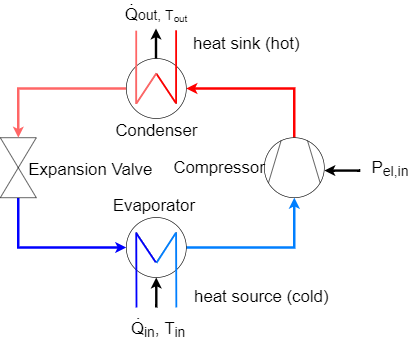
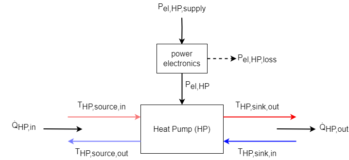
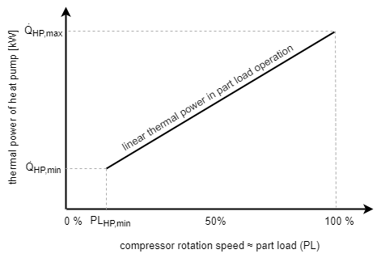
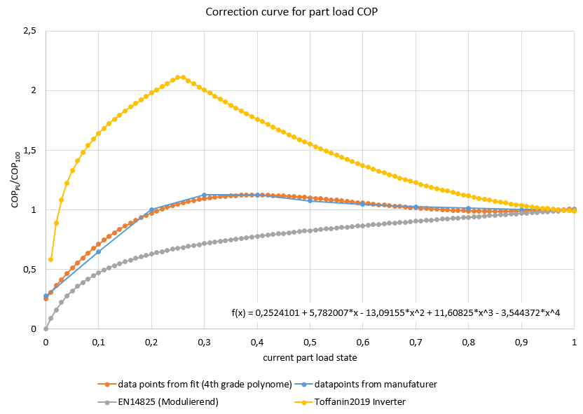
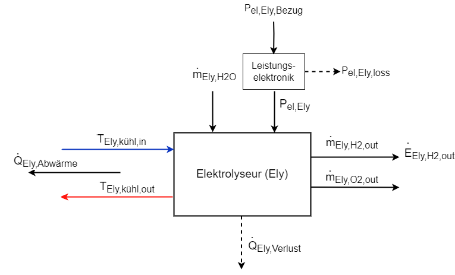
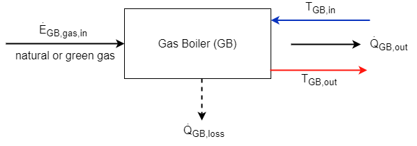

# Technical description of main components

## Heat pump (HP)
As heat pumps, electrically driven variable-speed compressor heat pumps can be integrated into the simulation model. Their general system diagram is shown in figure 1. 

Fig. 1: General system chart of a heat pump

The energy balance at the heat pump is built up from the incoming electricity, the incoming heat at a low temperature level and the outgoing heat flow at a higher temperature level. The efficiency of the heat pump is defined by the coefficient of performance (COP) as a function of the condenser outlet temperature and the evaporator inlet temperature (see Figure 2).

Fig. 2: Energy balance of the heat pump model

 
The coefficient of performance (COP) determines the electrical power required \(P_{el,HP}\) to raise the temperature of a mass flow from the lower temperature level \(T_{HP,source,in}\) to \(T_{HP,sink,out}\): 

$$COP_{HP} = \frac{\dot{Q}_{HP,ab}}{P_{el,HP}} \quad  \leq \quad COP_{Carnot} = \frac{T_{HP,sink,out}}{T_{HP,sink,out}-T_{HP,source,in} } $$

$$ COP_{HP} = \eta_{Carnot} \  COP_{Carnot} \quad \text{with} \quad 0 \leq \eta_{Carnot} \leq 1 $$

The coefficient of performance is always smaller than the maximum possible Carnot coefficient of performance (\(COP_{Carnot}\)), which is calculated from the condenser outlet and evaporator inlet temperature. In Quasi, a COP chart is given for various representative heat pumps, on which the further calculations are based. For example, the following figure shows a map of a high-temperature heat pump as a set of curves, depending on the evaporator inlet and condenser outlet temperature.

Fig. 3: COP chart of a high-temperature heat pump, given as a series of curves

In part load operation, the COP of a heat pump is variing. 

The energy balance (or power balance) of the heat pump can be determined according to Figure 2, as well as a relationship between supplied and dissipated heat output as a function of the coefficient of performance: 

$$\dot{Q}_{HP,out} = \frac{COP_{HP}}{COP_{HP} -1} \ \dot{Q}_{HP,in} \mathrm{\quad mit \quad} \dot{Q}_{HP,out} = \dot{Q}_{HP,in} + P_{HP,el} $$

The power of the heat pump's electric supply, including the losses of the power electronics, is given as: 

$$P_{el,HP,Bezug} = \frac{P_{el,HP}}{\eta_{HP,LE}}$$

**Assumption:** Thermal losses of the HP are already included in the coefficient of performance. 

**Assumption:** The heat output of the heat pump behaves linearly in part load operation between \(\dot{Q}_{HP,min}\) at \(PL_{HP,min}\) and \(\dot{Q}_{HP,max}\) at 100% compressor speed:

Fig. 4: Linear behaviour of thermal output power in part load operation

The COP of the modeled heat pump, on the other hand, is not linear in partial load operation. It follows from the definition of the COP that the correlation between the electrical power consumption and the heat output of the heat pump is therefore not linear. The coefficient of performance in partial load operation is approximated using the following correction function. Example --> Generalize?! TODO:

Image from: https://enrgi.de/wp-content/uploads/2022/08/Datenblatt_ecoGEO_B-C_1-9kW.pdf

Exemplary correction curve for the COP at partial load and a 4\(^{th}\) grade fitting polynome:

Since the temperatures of the heat flows entering and leaving the heat pump, which have not been considered so far, are also relevant, the heat outputs can be calculated on the basis of the respective mass flow \(\dot{m}\) and the physical properties of the heat transfer medium (specific heat capacity \(c_{p}\) and, if applicable, the density \(\rho\)) by rearranging the following equation:

$$\dot{Q} = \dot{m} \ c_{p} \ (T_{max} - T_{min})$$

**Inputs und Outputs of the Heat Pump:**

Symbol | Description | Unit
-------- | -------- | --------
\(\dot{Q}_{HP,in}\) | heat flow supplied to the HP (heat source) | [MW]
\(\dot{Q}_{HP,out}\) | heat flow leaving the HP (heat sink) | [MW]
\(P_{el,HP}\) | electric power demand of the HP | [MW]
\(P_{el,HP,supply}\) | electric power demand of the HP incl. losses of the power electronics | [MW]
\(T_{HP,sink,in}\) | condenser inlet temperature | [°C]
\(T_{HP,sink,out}\) | condenser outlet temperature | [°C]
\(T_{HP,source,in}\) | evaporator inlet temperature | [°C]
\(T_{HP,source,out}\) | evaporator outlet temperature | [°C]

**Parameter of the Heat Pump:**

Symbol | Description | Unit
-------- | -------- | --------
\(\dot{Q}_{HP,max}\) | maximum thermal power of the heat pump | [MW]
\(\dot{Q}_{HP,min}\) | minimum thermal power of the heat pump at \(PL_{HP,min}\) | [MW]
\(PL_{HP,min}\) | minimum possible part load of the heat pump [%]
\(COP_{HP}(T_{HP,sink,out}, T_{HP,source,in}, x_{HP})\) | coefficient of performance (COP) of the heat pump incl. thermal losses depending on \(T_{HP,sink,out}\) and \(T_{HP,source,in}\) and on current state \(x_{HP}\) | [-]
\(\eta_{HP,PE}\) | efficiency of power electronics of heat pump | [-]
\(\eta_{Carnot}\) | efficiency factor of heat pump, reduces the Carnot-COP | [-]
\(MOT_{HP}\) | minimum operating time of heat pump | [min]
\(SUP_{HP}\) | start-up time of the HP until full heat supply (linear curve) | [min]

**State Variables of Heat Pump:**

Symbol | Description | Unit
-------- | -------- | --------
\(x_{HP}\)  | current operating state (on, off, part load)   | [%]

**TODO**: Teillastverhalten? getaktet oder Drehzahlgeregelt (Inverter)?
Anpassung des COPs über lineare oder quadratische Funktion? Oder konstander Wirkungsgrad in Teillast?

Beispiel für quadratische Teillastverhalten des COPs: 

Quelle [Wemhöner2020]: https://www.uibk.ac.at/bauphysik/aktuell/news/doc/2020/HP_cw.pdf

**TODO:** COP über Kennfeld und Fit auf Polynom oder über COP mit Gütegrad?

## Electrolyser
The electrolyzer uses electrical energy to split water into its components hydrogen (\(H_2\)) and oxygen (\(O_2\)) as shown in the following reaction equation: 

$$ 2 \ H_2O \rightarrow 2 \ H_2 + O_2 $$

If the electrical energy is provided by renewable energies, the resulting hydrogen is labeled as "green hydrogen" and can be used to decarbonize the mobility or industrial sector or fed into the natural gas grid. The waste heat generated in the process can be used directly by feeding it into a heat network or via an intermediate heat pump. For flexible operation, it is possible to discharge the waste heat to the environment using a chiller. The use of waste heat is an important factor for the overall efficiency of the electrolyzer. 

The general energy and mass flow in the electrolyser as well as the losses considered in the model can be seen in the following figure.

Fig. 5: Energy and mass flows in the electrolyser

The relationship between supplied hydrogen of the electrolysis (energy (\(\dot{E}_{Ely,H_2}\)) or mass flow (\(\dot{m}_{Ely,H_2}\))) and the consumption of electrical energy (\( P_{el,Ely} \)) is given in the following equation, where \(e_{H_2}\) can be either the net or the gross calorific value of the hydrogen:
$$
\begin{align}
\dot{E}_{Ely,H_2}=  P_{el,Ely} \enspace \eta_{Ely,H_2}
\end{align}
$$

$$ 
\begin{equation}
\dot{m}_{Ely,H_2} =  \frac{\dot{E}_{Ely,H_2}}{e_{H_2}} 
\end{equation}
$$

Due to the purification losses of the hydrogen caused by the reduction of oxygen molecules contained in the hydrogen gas in the catalyst, depending on the electrolysis technology, the actually obtained hydrogen energy or mass flow is reduced by the proportion of the hydrogen losses \(\eta_{H_2 \ purification}\) to the energy or mass flows, supplemented with index \(out\):
$$ \dot{E}_{Ely,H_2,out}=  (1-\eta_{H_2 \ purification}) \ \dot{E}_{Ely,H_2} $$

$$ \dot{m}_{Ely,H_2,out} = (1-\eta_{H_2 \ purification}) \ \dot{m}_{Ely,H_2} $$

Conversely, by rearranging and substituting the previous equations from a required hydrogen mass flow, the electrical power consumption can be calculated as follows:
$$ P_{el,Ely} =  \frac{\dot{m}_{Ely,H_2,out} \ e_{H_2}}{\eta_{Ely,H_2} \ (1 - \eta_{H_2 \ purification})}  $$

The usable waste heat from the electrolysis process \(\dot{Q}_{Ely,waste heat}\) is determined, depending on the available information, as
$$\dot{Q}_{Ely,waste heat} = \eta_{Ely,heat} \enspace (1-\eta_{Ely,H_2}) \enspace P_{el,Ely} = \frac{(1 - \eta_{Ely,H_2}) \ \eta_{Ely,heat} } { (1 - \eta_{H_2 \ purification}) \ \eta_{Ely,H_2} } \ \dot{E}_{Ely,H_2,out} $$ 

With a known mass flow \(\dot{m}_{HP,cool}\) and the specific heat capacity of the heat transfer medium of the heat recovery \(c_{p,cool}\) as well as a known inlet temperature \(T_{Ely,cool,in}\), the outlet temperature of the heat transfer medium from the cooling circuit \(T_{Ely,cool,out}\) can be determined by rearranging the following equation:
$$\dot{Q}_{Ely,waste heat} = \dot{m}_{HP,cool} \enspace c_{p,cool} \enspace (T_{Ely,hot,out} - T_{Ely,cool,in})$$

The heat loss \(\dot{Q}_{Ely,loss}\), which cannot be used and is dissipated to the environment via heat transport mechanisms, is calculated as follows

$$  \dot{Q}_{Ely,loss} = P_{el,Ely} - \dot{Q}_{Ely,waste heat} - \dot{E}_{Ely,H_2} \\ =  P_{el,Ely} \ (1 - \eta_{Ely,heat} + \eta_{Ely,heat} \ \eta_{Ely,H_2} - \eta_{Ely,H_2}) $$

The actual needed power supply of the electrolyzer \(P_{el,Ely,supply}\) increases by losses in the power electronics and results from the electrical reference power \(P_{el,Ely}\) and the losses in the power electronics \(\eta_{Ely,PE}\) to
$$ P_{el,Ely,supply} = \frac{P_{el,Ely}}{\eta_{Ely,PE}} $$

Since the oxygen produced during the electrolysis process can also be utilized economically under certain circumstances, the resulting oxygen mass flow \(\dot{m}_{Ely,O_2,out}\) is determined from the stoichiometric ratio of the reaction equation of the water splitting described at the beginning:

$$  \dot{m}_{Ely,O_2,out} =  v_{O_2,H_2} \enspace  \dot{m}_{Ely,H_2} $$
$$ \text{with} \quad v_{O_2,H_2} = \frac{atomic \ mass \ O_2}{atomic \ mass \ 2 \ H_2} = \frac{2 * 15,9990 \ u}{2*2*1,0008 \ u} = 7,9386 $$

The required mass flow of water \(\dot{m}_{Ely,H_2O,in}\) can be determined from the supplied masses of hydrogen and oxygen and the purification losses in the water treatment unit, characterized by the fraction of purification losses \(\eta_{H_2O \ treatment}\).
$$ \dot{m}_{Ely,H_2O,in} = \frac{\dot{m}_{Ely,H_2}  + \dot{m}_{Ely,O_2,out}}{1- \eta_{H_2O \ treatment}} $$

**Assumption:** The electrolyzer is only operated between minimum 0 % and maximum 100 % load. A specification of power above nominal power, which frequently occurs in practice, is not supported. 

**TODO:** Efficiency decrease (el.) due to degradation?

**Inputs and Outputs of the Electrolyser:**

Symbol | Description | Unit
-------- | -------- | --------
\(P_{el,Ely}\)   | electrical power requirement of the electrolyser   | [MW]
\(P_{el,Ely,supply}\)   | electrical power requirement of the electrolyser incl. losses of power electronics   | [MW]
\(\dot{m}_{Ely,H_2O,in}\)  | water mass flow fed to the electrolyser  | [kg/h]
\(\dot{m}_{Ely,O_2,out}\)  | oxygen mass flow delivered by the electrolyser  | [kg/h]
\(\dot{m}_{Ely,H_2}\)  | hydrogen mass flow produced by the electrolyser (before \(H_2\)-cleaning losses)  | [kg/h]
\(\dot{m}_{Ely,H_2,out}\)  | hydrogen mass flow provided by the electrolyser (after \(H_2\)-cleaning losses)  | [kg/h]
\(\dot{E}_{Ely,H_2}\)  | hydrogen energy flow discharged from the electrolyser (before \(H_2\)-cleaning losses) | [MW]
\(\dot{E}_{Ely,H_2,out}\)  | hydrogen energy flow provided by the electrolyser \(after (H_2\)-cleaning losses) | [MW]
\(T_{Ely,cooling,in}\)   | cooling fluid inlet temperature of electrolyser   | [°C]
\(T_{Ely,cooling,out}\)   | cooling fluid outlet temperature of electrolyser   | [°C]
\(\dot{Q}_{Ely,waste heat}\)  | waste heat provided by the electrolyser  | [MW]
\(\dot{Q}_{Ely,loss}\)  | thermal losses in elektrolyser (unused waste heat))  | [MW]

**Parameter of the Electrolyser:**

Symbol | Description | Unit
-------- | -------- | --------
\(P_{el,Ely,rated}\) | electric power consumption of the electrolyser under full load (operating state 100 %) | [MW]
\(\eta_{Ely,H_2}(x_{Ely},P_{el,Ely,rated})\) | efficiency of hydrogen production of the electrolyser (\(\dot{E}_{Ely,H_2,out}\) related to \(P_{el,Ely}\) as a function of operating state, plant size and plant type) | [-]
\(\eta_{Ely,heat}\) | efficiency of the usable heat extraction of the electrolyzer (related to \(1-\eta_{Ely,H_2}\))   | [-]
\(\eta_{Ely,LE}\) | efficiency of the power electronics of the electrolyser | [-]
\(PL_{Ely,min}\) | minimum allowed partial load of the electrolyzer | [-]
\(MOT_{Ely}\) | minimum operating time of the electrolyser | [min]
\(SUP_{Ely}\) | start-up time of the electrolyser until full heat supply (linear curve) | [min]
\(e_{H_2} \) | mass-related energy of hydrogen (net calorific value or gross calorific value)
\(v_{O_2,H_2} \) | stoichiometric mass-based ratio of oxygen and hydrogen supply during electrolysis | [kg \(O_2\) / kg \(H_2\)]
\(\eta_{H_2 \ purification} \) | percentage of purification losses in hydrogen purification | [%]
\(\eta_{H_2O \ treatment} \) | percentage of purification losses in water treatment | [%]
\(p_{H_2,Ely} \) | pressure of hydrogen supply | [bar]
\(p_{O_2,Ely} \) | pressure of oxygen supply | [bar]
\(T_{Ely,cooling,in,max}\) | max. allowed temperature of cooling medium input | [°C]

**State variables of the Electrolyser:**

Symbol | Description | Unit
-------- | -------- | --------
\(x_{Ely}\)  | current 	operating state (on, off, part load)   | [%]

## Reduction of usable heat during start-up
Linear warm-up during start-up:
$$
 \dot{Q}_{out,reduced} = 
\begin{cases}
\dot{Q}_{out} \ \frac{\text{actual operating time}}{\text{minimum operating time}} & \text{actual operating time} < \text{minimum operating time} \\
\dot{Q}_{out} & \text{actual operating time} \geq  \text{minimum operating time}
\end{cases} 
$$

## Combined heat and power plant (CHP)

Definiton of power-to-heat ratio of CHP:
$$ r_{CHP,PTH} = \frac{\eta_{CHP,el}}{\eta_{CHP,thermal}} = \frac{P_{el,CHP,rated}}{\dot{Q}_{CHP,rated}}  $$

Energy balance on CHP:
$$  \dot{E}_{CHP,gas,in} = P_{el,CHP,out} + \dot{Q}_{CHP,out} + \dot{Q}_{CHP,loss} $$ 

Calculation of electric power output:
$$  P_{el,CHP,out} = \eta_{CHP,el} \ \dot{E}_{CHP,gas,in}   $$ 

Calculation of thermal power output:
$$  \dot{Q}_{CHP,out} = \eta_{CHP,thermal} \ \dot{E}_{CHP,gas,in}   $$ 

Calculation of thermal losses in CHP:
$$ \dot{Q}_{CHP,loss} = (1-\eta_{CHP,thermal}+\eta_{CHP,el}) \ \dot{E}_{CHP,gas,in} $$

Relation of electric and thermal power output:
$$ P_{el,CHP,out} = \frac{\eta_{CHP,el}}{\eta_{CHP,thermal}} \ \dot{Q}_{CHP,out} =  r_{CHP,PTH}  \ \dot{Q}_{CHP,out}  $$

**TODO:** Part load efficiency reduction?

**Inputs and Outputs of the CHP:**

Symbol | Description | Unit
-------- | -------- | --------
\(P_{el,CHP,out}\) | electric power output of the CHP | [MW]
\(P_{el,CHP}\) | electric power provided by the CHP | [MW]
\(\dot{Q}_{CHP,out}\) | thermal power output of the CHP | [MW]
\(\dot{E}_{CHP,gas,in}\) | energy demand of the CHP, natural or green gas (NCV/GCV? TODO)  | [MW]
\(\dot{Q}_{CHP,loss}\) | thermal energy losses of the CHP | [MW]

**Parameter of the CHP:**

Symbol | Description | Unit
-------- | -------- | --------
\(P_{el,CHP,rated}\) | rated electric power output of the CHP under full load (operating state 100 %) | [MW]
\(\dot{Q}_{CHP,rated}\) | rated thermal power output of the CHP under full load (operating state 100 %) | [MW]
\(\eta_{CHP,thermal}\) | thermal efficiency of CHP | [-]
\(\eta_{CHP,el}\) | electrical efficiency of CHP, including selfe-use of electrical energy | [-]
\(r_{CHP,PTH}\) | power-to-heat ratio of CHP | [-]
\(PL_{CHP,min}\) | minimum allowed partial load of the CHP | [-]
\(MOT_{CHP}\) | minimum operating time of the CHP | [min]
\(SUP_{CHP}\) | start-up time of the CHP until full heat supply (linear curve) | [min]

**State variables of the CHP:**

Symbol | Description | Unit
-------- | -------- | --------
\(x_{CHP}\)  | current operating state of the CHP (on, off, part load)   | [%]

## Gas boiler (GB)

## Woodchip boiler (WB)
consider?

## Heat sources 
### Soil
- geothermal probes
- geothermal collector 

### Water
- groundwater well
- surface waters
- waste heat from industrial processes
- wastewater
- solar thermal collector

### Air 
- ambient air
- exhaust air
- hot air absorber

(Vergleich FutureHeatPump II Projekt)

## Chiller (CH)
### Simple model for electrolyser

### General model for cooling purposes
or just one general model?

## Short-term thermal energy storage (STTES)

with or without losses to ambient?

## Seasonal thermal energy storage (STES)

### Tank thermal energy storage (TTES)

### Pit thermal energy storage (PTES)

### Borehole thermal energy storage (BTES)

### Aquifer thermal energy storage (ATES)

## Ice storage (IS)

## Hydrogen fuel cell (FC)

## Photovoltaik (PV)
pvlib

## Wind power (WP)
windpowerlib 

Achtung: Winddaten von EPW nicht geeignet!

## Battery (BA)

## Hydrogen compressor (HC)

