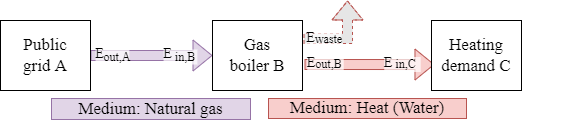
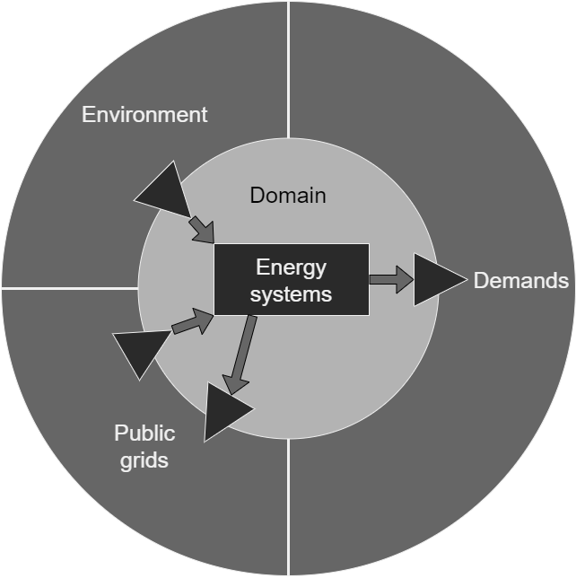
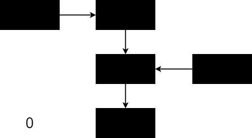
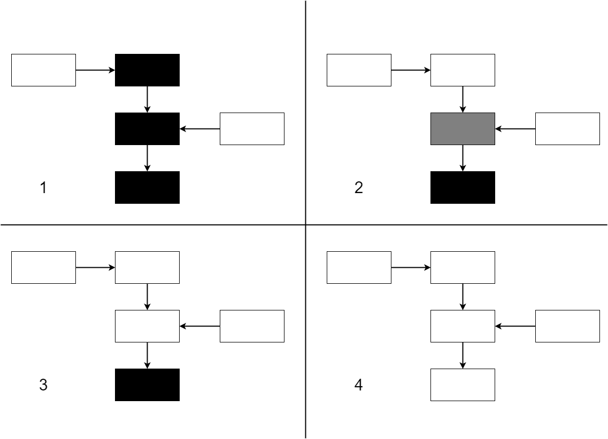

# Fundamentals

The simulation engine works on the concept of energy balances on the level of technical equipment units. While conservation of energy is expected to be observed in any simulation of physical processes, the simulation engine specifically does not consider other concepts often appearing in energy simulations such as full thermodynamics, static/dynamic fluid simulation or electric power flow. These limitations are shared by a number of simulation engines similar to Bran, as research and use of these tools has shown that these are necessary limitations to cut the scope of the simulation down to something that finishes calculations in a reasonable time scale.

The geometry of buildings also does not play a role in the simulation and the full network of technical systems connected in a building (and across buildings) is reduced to a network of energy system units that each produce, transform, transport or consume energy. Given the typical task of finding a suitable selection of units to satisfy a demand of energy in a building, it is therefore the engine's task to work backwards to find solutions for dispatchable[^1] sources of energy, ensuring the energy balances are held for each unit along the way.

[^1]: Dispatchable here refers to being flexible in regards to how much energy a unit produces or consumes, as opposed to units that represent a demand of energy that must be met or units that produce energy regardless of demand.

To illustrate, let's look at a simple example. A heating demand, in the medium of hot water, must be met by a unit in the form of a gas boiler, which in turn requires an input of natural gas from a public grid.



A practical way to operate the gas boiler in this example would be a demand-driven strategy. As such the task to be performed is to meet the demand by operating the gas boiler such that the overall energy balance is conserved.

This can be done by first calculating the hot water demand `E_hot_water` to be met, which is trivial from the perspective of the simulation as it is an input to the simulation. Then the gas boiler can meet this demand by burning gas, which in turn imposes a demand of natural gas `E_gas` on the grid connection. Finally the grid connection can fulfill this gas demand by drawing from outside the network boundary.

#### Losses
While the conservation of energy is upheld, this does not mean that losses cannot be modeled. Energy losses invariably end up as ambient heat, which can contribute to the energy balance of a building, however the technical equipment of a building rarely can be found in a thermal zone that should be kept to comfort levels. Equipment with large power draw might even impose a cooling demand on the thermal zone in which they reside.

Due to the difficulty of generalizing the impact of these losses, they are not generally included in the energy flow model. Instead, the implementation of energy systems that typically incur significant losses take this into account with imperfect conversion of energy. These losses are considered outside the network boundary and ignored. It is possible to track these for further analysis outside the simulation, e.g. as internal heating load for a thermal simulation of technical equipment and the surrounding room.

## Domain and boundaries

Due to the generalized nature of the energy network used by Bran, there is no explicit scale inherent to the model. However in practicality there is a large number of parameters and nominal values involved in running an accurate simulation. The implementation of energy systems in Bran is done while keeping a scale of buildings and districts in mind, meaning that performing a simulation of a large electric power network would yield inaccurate results. In particular transport losses are not modeled and (electric) power is represented as a simplified model.

The domain of the simulation can therefore be considered as the technical equipment providing energy to a number of connected buildings up to a scale where transport losses cannot be ignored anymore. Outside the domain are three major other domains to and from which the energy network connect:



The first of these is the environment, which plays a role for systems that directly draw energy from the environment such as solar collectors or heat pumps fed by ambient heat from the atmosphere or the ground. The second are public grids, usually for electricity, heat and natural gas, however grids of any kind of energy-carrying medium can be modeled. An important difference to the environment is that energy can be both drawn from the grids and fed back into them if there is a surplus.

The third domain are demands, which encompass any kind of system or process that requires energy and that must be met exactly. While demand simulation is an important part of the overall building energy simulation process, Bran is not concerned with calculating the demands and requires the values as an input. Demands can also be abstracted to impose the use of energy upon an energy network. For example if there is a power plant nearby, which produces a large amount of waste heat, this can be implemented as a cooling demand. This allows the waste heat to be used for providing energy for other heating demands while moving any excess into the environment. In that case the cooling demand provides energy to the energy network and this differs from an environmental input in the sense that the demand must be used up (it is not dispatchable).

## Energy systems

As mentioned earlier, an energy system is any kind technical equipment that deals with producing, transforming, transporting or consuming energy. In the implementation the equipment is abstracted to a single unit even if in reality the equipment is spread out in space and consists of numerous individual parts. For some energy systems this matches nicely with commonly used terminology. For example a "gas boiler" includes all pipes, valves and other parts required to make it work.

For other equipment this is not the case. For example an electrolyser requires several components before and after the electrolysis step, such as water purification and hydrogen postprocessing. However given that these components are not used for anything else, they are included in the energy system under the label of "electrolyser".

### System function

Energy systems can be classified into seven categories, which are:

* `Dispatchable sink`: A unit consuming a dispatchable amount of energy. For example can consume waste heat produced by other units.
* `Dispatchable source`: A unit producing a dispatchable amount of energy, drawing it from outside the network boundary. For example drawing in heat from the ambient environment.
* `Fixed sink`: A unit consuming an amount of energy fixed within a time step. For example a demand of hot water for heating.
* `Fixed source`: A unit producing an amount of energy fixed within a time step. For example a photovoltaic power plant.
* `Transformer`: A unit transforming energy in at least one medium to energy in at least one medium. For example a heat pump using lower temperature heat and electricity to produce higher temperature heat.
* `Storage`: A unit storing energy in a given medium. For example a buffer tank storing hot water.
* `Bus`: A special type of unit used to facilitate the transport of energy from and to other units. Has only one implementation.

This classification is used by the simulation engine to reason about the order in which calculations must happen. This is described in more detail in the section on the order of execution of simulation steps. The implementation of the various types of energy systems is described in its own chapter.

## Simulation sequence
The simulation follows a fairly basic structure:

```pseudocode
units = load_energy_systems()
order = step_order(units)
for time = t_start to t_end {
    ...
}
```

First the energy system units are loaded and initialized from the input project file. Then an order of execution of steps for each unit is determined. The units and the order are given to a loop over each time step, which performs calculations and writes the output. The output is written in each time step, as opposed to only being collected and written later on, so that aborting a simulation results in partial output.

### Main loop over time
```pseudocode
for time = t_start to t_end {
    perform_steps(units, order)
    check_balances(units)
    write_output(units)
    advance_simulation()
}
```

Inside the loop over time, first the simulation steps are performed for each unit. Then each unit is checked to ensure the energy balances are preserved, meaning that all energy consumed has also been produced and vice versa. This is necessary in particular as a safeguard against bugs in the implementation and operational strategies that produce unexpected results.

After the balance check, output is written according to the output specification in the project file. The simulation engine specifically does not write all output as this can produce excessive amounts of data. Finally, the simulation is advanced to the next time step.

The simulation steps for each unit are:

* `Reset`: Reset values for the next time step.
* `Control`: Calculate control behaviour to check if a unit should run or not.
* `Produce`: Produce / transform / consume energy depending on the type of the unit and if the control behaviour dictates the unit should run.
* `Load`: For storage systems, load any excess of energy produced by connected units.
* `Distribute`: For bus systems, distribute the energy balances on each connected interface and check the overall balance on the bus.

### Determining order of execution

Determination of the order of execution of the simulation steps described above follows an algorithm consisting of several heuristics. Each heuristic imposes some order over some or all of the units and is overwritten by the heuristics following after that.

**Note: As of now, it is an open question if this algorithm produces correct results for all relevant system topologies.**

1. Set up a base order of steps determined by the system function of the units:
    1. `All`: `Reset`
    1. `Fixed source`: `Control`, `Produce`
    1. `Fixed sink`: `Control`, `Produce`
    1. `Bus`: `Control`, `Produce`
    1. `Transformer`: `Control`, `Produce`
    1. `Storage`: `Control`, `Produce`, `Load`
    1. `Dispatchable source`: `Control`, `Produce`
    1. `Dispatchable sink`: `Control`, `Produce`
    1. `Bus`: `Distribute`
1. Reorder `Control` and `Produce` of each unit connected to a bus so that it matches the bus' input priorities.
1. Reorder `Control` and `Produce` of a unit's control references so that these appear first. This is ignored if the referenced unit is a storage system.

If the simulation parameter `dump_info` is used, the generated order of steps is written to the info file. This can be very useful to check for errors produced by an incorrect order.

#### Outside-in approach

The general approach for determining the order is best described as an outside-in order, where "outside" refers to the network boundaries and "inner" refers to energy systems whose operation depends on information from systems on the outside. The information travels from the outer
to the inner systems, in each step providing depending systems with the required details for calculating dispatch. Lets us consider an energy net with five systems, as illustrated in the following simplified diagram:



Here arrows do *not* denote the energy flow, but the information flow. How this information flow can be derived in the general case is not known, as it depends on the operational strategies involved. This is one of the reasons why this algorithm is useful in theory, but not implemented in the simulation engine.

From this initial state of all unknowns, the algorithm can work outside-in step by step:



1. Systems with no dependencies can be calculated directly.
2. One system now has all of its dependencies fulfilled and can also be calculated. Another system is still missing one of its dependencies.
3. The system that was incomplete in the previous step can now be completed.
4. The last incomplete system is calculated and completes the entire network.

#### Cycles and feedback loops

Cycles in the both the energy net and the information flow graph lead to issues with finding solutions to the order of execution. However these cycles are not a problem in actualized energy nets, as not all parts of a cycle are active at the same time. For example an electrolyser might feed into a hydrogen storage, which feeds into an fuel cell, which feeds back into the electrical net. It would make little sense however to have both systems run at the same time, as this would ultimately waste electricity. So while this topology causes cycles in the network, in operation these cycles do not cause issues.
