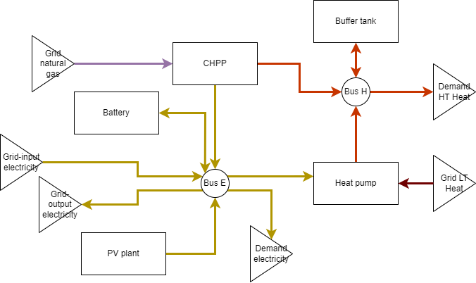

# System topology

## Energy media

### Electricity
* `m_e_ac_230v`: Household electricity at 230V AC and 50/60Hz.

### Chemicals - Gasses
* `m_c_g_natgas`: A natural gas mix available through the public gas grid.
* `m_c_g_h2`: Pure hydrogen gas.
* `m_c_g_o2`: Pure oxygen gas.

### Heat - Low temperature water
* `m_h_w_lt1`
* `m_h_w_lt2`
* `m_h_w_lt3`
* `m_h_w_lt4`
* `m_h_w_lt5`

### Heat - High temperature water
* `m_h_w_ht1`
* `m_h_w_ht2`
* `m_h_w_ht3`
* `m_h_w_ht4`
* `m_h_w_ht5`

## Interfaces
