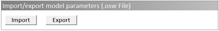

# Standard building typology

To enable quick and easy simulation of standard building types like residential buildings, offices and others, we developed and tested standard parameter sets including all required default parameters. The parameter sets are based on common guidelines and standards. However, the definition of the following parameters are not part of the typology and must always be defined individually:

- location (using a weather data set)
- building geometry
- building standard (construction data of walls, windows, roof…)

If necessary, other parameters can be adapted: This could typically be the mechanical ventilation system, the shading system or the temperature setpoints for heating and cooling. We recommend to not adapt parameters of the set other than these.

The following standard building types are available in the GitHub repository of GenSim:

- Multi-family house (Germany)
- Single-family house (Germany)
- Office (Germany)
- Hotel (Germany)
- Retail (Germany)
- Restaurant (Germany)
- School (Germany)
- Sports hall (Germany)
- Kindergarten (Germany)

## Importing a type

To import one of the parameter sets into the software, there is an import button on the "homepage" of the GUI:

Select one of the parameter sets inside the subfolder "building_typologies" located in the GenSim root directory. After the successful import, all type-specific parameters are automatically set in the GUI. In the next step, adapt the non type-specific parameters as listed above and start the simulation.

## Description of the types

Here are some details about the building types that are available. One of the most important parameter group for defining a specific building type is "internal loads" for electrical devices, lighting and human occupancy.  Air temperature setpoints and the ventilation system are also crucial. Therfore, these are briefly described below. For more details about the selected parameters within each type, please import the parameter set into the software and have a look!

### Multi-family house (Germany)

This is a parameter set for a typical German multi-family house using internal load schedules from the "DOE Prototype Building: Midrise Apartment" to define lighting and occupancy as well as the German "SLP BDEW H0" schedule to define electrical devices. The power and occupancy densities represent typical values for Germany. The air temperature setpoint for heating uses a schedule with 20 °C in daytime and a drop to 18 °C in nighttime. The air temperature setpoint for cooling is set constant to 26 °C. The ventilation system is an exhaust air system commonly used in German multi-family houses.

### Single-family house (Germany)

This is a parameter set for a typical German single-family house using internal load schedules from the "DOE Prototype Building: Midrise Apartment" to define lighting and occupancy as well as the German "SLP BDEW H0" schedule to define electrical devices. The power and occupancy densities represent typical values for Germany. The air temperature setpoint for heating uses a schedule with 20 °C in daytime and a drop to 18 °C in nighttime. The air temperature setpoint for cooling is set constant to 26 °C. The ventilation system is an exhaust air system commonly used in German single-family houses. Comparing to the multi-family house, the internal loads, geometrical parameters and others are adjusted.

### Office (Germany)

This is a parameter set for a typical German office building using internal load schedules oriented to the German standard DIN V 18599 to define lighting and occupancy rates. Furthermore, it is based on the German "SLP BDEW G1" schedule to define electrical devices. The power and occupancy densities represent typical values for Germany. The air temperature setpoints for heating and cooling use a customized schedule based on empirical data. The ventilation system is set to a central ventilation system commonly used in German office buildings (an exhaust air system could be possible as well, so this may be changed after the import of the parameter set).

### Hotel (Germany)

This is a parameter set for a typical German hotel using internal load schedules from the "DOE Prototype Building: Large Hotel" to define electrical devices, lighting and occupancy. The power and occupancy densities represent typical values for Germany. The air temperature setpoint for heating is set to 20 °C (constant). The air temperature setpoint for cooling is set 25 °C (constant). The parameter set is based on a central ventilation system (an exhaust air system could be possible as well, so this may be changed after the import of the parameter set).

### Retail (Germany)

This is a parameter set for a typical German retail using internal load schedules from the "DOE Prototype Building: Retail" to define electrical devices, lighting and occupancy. The power and occupancy densities represent typical values for Germany. The air temperature setpoints for heating and cooling use a customized schedule based on empirical data. The parameter set is based on a central ventilation system commonly used in German retail.

### Restaurant (Germany)

This is a parameter set for a typical German restaurant using internal load schedules from the "DOE Prototype Building: Full Service Restaurant" to define electrical devices, lighting and occupancy. The power and occupancy densities represent typical values for Germany. The air temperature setpoints for heating and cooling use a customized schedule based on empirical data. The parameter set is based on a central ventilation system commonly used in German restaurants (an exhaust air system could be possible as well, so this may be changed after the import of the parameter set).

### School (Germany)

This is a parameter set for a typical German school using customized internal load schedules based on empirical data to define electrical devices, lighting and occupancy. The power and occupancy densities represent typical values for Germany. The air temperature setpoint for heating uses a customized schedule based on empirical data. The air temperature setpoint for cooling is set constant to 26 °C. The parameter set is based on a central ventilation system commonly used in German schools (an exhaust air system could be possible as well, so this may be changed after the import of the parameter set).

### Sports hall (Germany)

This is a parameter set for a typical German sports hall using customized internal load schedules based on empirical data to define electrical devices, lighting and occupancy. The power and occupancy densities represent typical values for Germany. The air temperature setpoint for heating uses a customized schedule based on empirical data. The air temperature setpoint for cooling is set constant to 26 °C. The parameter set is based on a central ventilation system commonly used in German sports halls (an exhaust air system could be possible as well, so this may be changed after the import of the parameter set).

### Kindergarten (Germany)

This is a parameter set for a typical German kindergarten using customized internal load schedules based on empirical data to define electrical devices, lighting and occupancy. The power and occupancy densities represent typical values for Germany. The air temperature setpoint for heating uses a customized schedule based on empirical data. The air temperature setpoint for cooling is set constant to 26 °C. The parameter set is based on a central ventilation system commonly used in German kindergartens (an exhaust air system could be possible as well, so this may be changed after the import of the parameter set).
