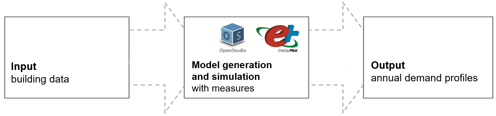
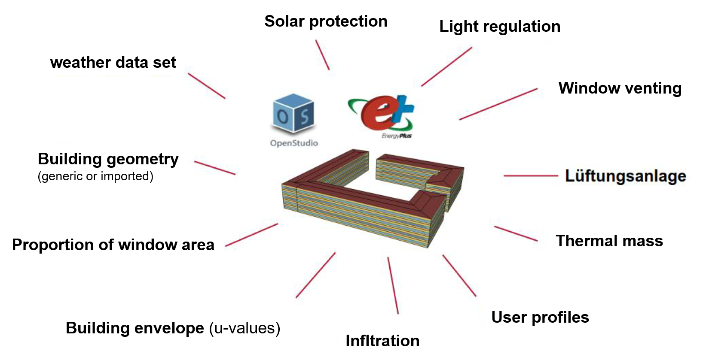
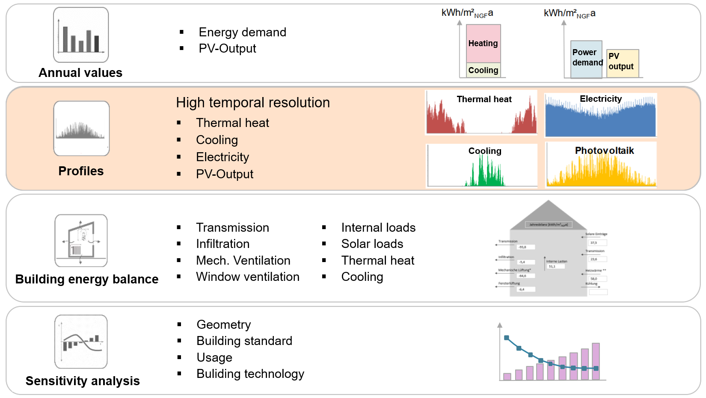

# What is GenSim?

GenSim - for "generic building simulation" - is a building simulation software using the *EnergyPlus®* simulation engine to generate high-resolution heating and cooling demand profiles as well as electricity demand profiles for buildings with various types of use. "Generic" in this context refers to a "generally valid" building model. This means that the software is versatile enough to simulate any type of building in a very flexible and simplified way, enabling users to efficiently adapt the software for any building design.

GenSim was specifically developed for the use during project pre-planning where detailed simulations of buildings are challenging due to typically constrained time budgets and limited availability of information. Traditional simulation tools like *DesignBuilder®*, *IDA ICE®* or *TRNSYS®* require extensive input data, making the process time-consuming. GenSim addresses this by providing a streamlined approach for quick, simple, yet accurate building simulations. This is particularly valuable in early planning stages when only rough data about the planned buildings is available. GenSim strikes an optimal balance between the model's detail level and the precision of input parameters, ensuring efficiency without compromising on accuracy. If more detailed information (wall structure, geometry, specific use, ...) is available about the building to be examined, this can be used for more precise results.

The user interface for input and output data is realised in *Microsoft Excel®*. The simulation engine, based on *OpenStudio®*[^1] and *EnergyPlus®*, is connected to the user interface via *Visual Basic for Applications®* code. The overall workflow is shown in the figure below.

[^1]: OpenStudio® provides a development environment for customised use of EnergyPlus® in software applications. 

The baseline model is a standardised (generic) building model that offers the essential levels of freedom and includes the basic functions in order to be able to represent any type of building. These basic functions (see figure below) can be adjusted by a few simple parameters. Details of the individual basic functions and their parameters are given in [chapter 2 of the manual](gensim_user_manual.md#2-model-functions-and-parameters).

The baseline includes generic, cubic building geometries that can be roughly adjusted to meet the investigated building. If more complex geometries should be simulatated, they can be created as a user-defined geometry model using the *OpenStudio SketchUp Plugin* and imported into GenSim. 

The main output of GenSim are high-resolution profiles in units of  \(Wh/m²_{NFA}\), refered to the net floor area (NFA) of the building. Within the building simulation, no distribution or transfer losses of the energy flows are represented. Therefore, all results must be evaluated as net energies and possible distribution losses must be included afterwards, for example in the form of an offset. 

In addition to the output profiles, GenSim provides various annual values, key performance indicators, an overview of the building energy balance and the ability to perform sensitivity analyses (see  figure below). 

## Important note on the purpose of GenSim

We envision GenSim as a valuable tool to perform building energy simulations in the early planning stage of projects, when the lack of detailed information plays well into the strengths of GenSim as it does not require great detail to calculate reasonable approximations of the expected energy use. In this context some inaccuracies are expected and mostly caused by uncertainty in the values of important parameters.

**Please keep this in mind and note that we do not endorse GenSim for any specific use, especially not to perform simulations according to standards, to certify a building project's energy system, to predict precise energy costs or to size any energy system component to match exact demands.**

## Recent Publication

We recently published a scientific paper in the journal "Energies" with a detailed description of the software architecture and capabilities of GenSim. To validate GenSim, we also performed a comparison of simulation results from GenSim, DesignBuilder and measurement data of two years, which is documented in the article. The paper is published with open access at:

**[Maile, T.; Steinacker, H.; Stickel, M.W.; Ott, E.; Kley, C.: Automated Generation of Energy Profiles for Urban Simulations. Energies 2023, 16, 6115](https://doi.org/10.3390/en16176115)**
