# GenSim user manual
## **1  What is GenSim?**

GenSim - for "generic building simulation" - is a building simulation software using the *EnergyPlus®* simulation engine to generate high-resolution heating and cooling demand profiles as well as electricity demand profiles for buildings with various types of use. "Generic" in this context refers to a "generally valid" building model. This means that the software is versatile enough to simulate any type of building in a very flexible and simplified way, enabling users to efficiently adapt the software for any building design.

GenSim was specifically developed for the use during project pre-planning where detailed simulations of buildings are challenging due to typically constrained time budgets and limited availability of information. Traditional simulation tools like *DesignBuilder®*, *IDA ICE®* or *TRNSYS®* require extensive input data, making the process time-consuming. GenSim addresses this by providing a streamlined approach for quick, simple, yet accurate building simulations. This is particularly valuable in early planning stages when only rough data about the planned buildings is available. GenSim strikes an optimal balance between the model's detail level and the precision of input parameters, ensuring efficiency without compromising on accuracy. If more detailed information (wall structure, geometry, specific use, ...) is available about the building to be examined, this can be used for more precise results.

The user interface for input and output data is realised in *Microsoft Excel®*. The simulation engine, based on *OpenStudio®*[^1] and *EnergyPlus®*, is connected to the user interface via *Visual Basic for Applications®* code. The overall workflow is shown in the figure below.

[^1]: OpenStudio® provides a development environment for customised use of EnergyPlus® in software applications. 

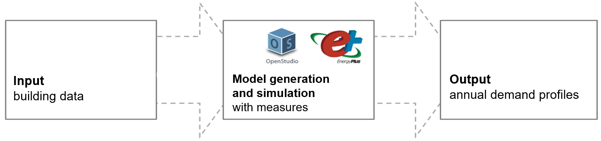

The baseline model is a standardised (generic) building model that offers the essential levels of freedom and includes the basic functions in order to be able to represent any type of building. These basic functions (see figure below) can be adjusted by a few simple parameters. Details of the individual basic functions and their parameters are given in chapter 3. 

The baseline includes generic, cubic building geometries that can be roughly adjusted to meet the investigated building. If more complex geometries should be simulatated, they can be created as a user-defined geometry model using the *OpenStudio SketchUp Plugin* and imported into GenSim. 

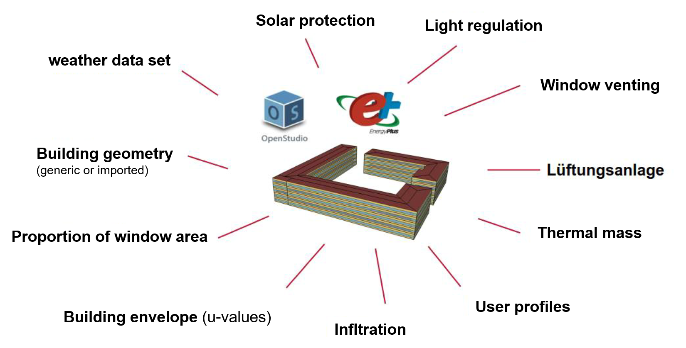

The main output of GenSim are high-resolution profiles in units of  \(Wh/m²_{NFA}\), refered to the net floor area (NFA) of the building. Within the building simulation, no distribution or transfer losses of the energy flows are represented. Therefore, all results must be evaluated as net energies and possible distribution losses must be included afterwards, for example in the form of an offset. 

In addition to the output profiles, GenSim provides various annual values, key performance indicators, an overview of the building energy balance and the ability to perform sensitivity analyses (see  figure below). 

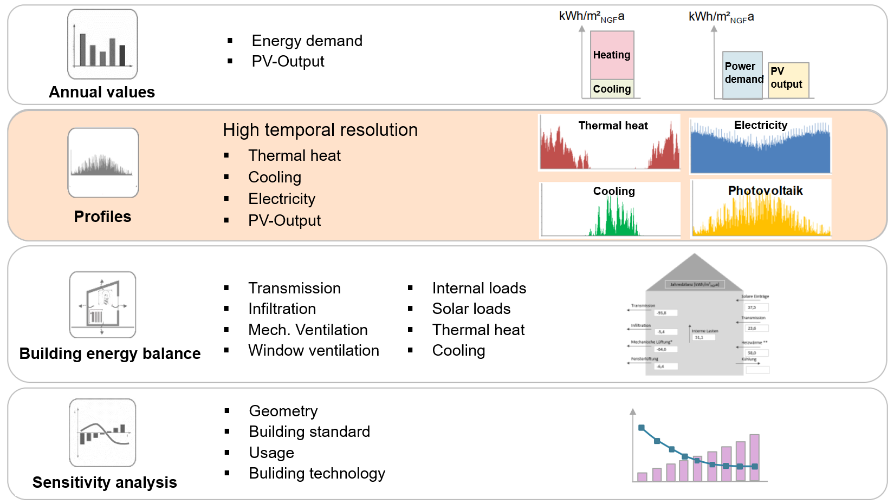

### Important note on the purpose of GenSim

We envision GenSim as a valuable tool to perform building energy simulations in the early planning stage of projects, when the lack of detailed information plays well into the strengths of GenSim as it does not require great detail to calculate reasonable approximations of the expected energy use. In this context some inaccuracies are expected and mostly caused by uncertainty in the values of important parameters.

**Please keep this in mind and note that we do not endorse GenSim for any specific use, especially not to perform simulations according to standards, to certify a building project's energy system, to predict precise energy costs or to size any energy system component to match exact demands.**

### Recent Publication

We recently published a scientific paper in the journal "Energies" with a detailed description of the software architecture and capabilities of GenSim. To validate GenSim, we also performed a comparison of simulation results from GenSim, DesignBuilder and measurement data of two years, which is documented in the article. The paper is published with open access at:

**[Maile, T.; Steinacker, H.; Stickel, M.W.; Ott, E.; Kley, C.: Automated Generation of Energy Profiles for Urban Simulations. Energies 2023, 16, 6115](https://doi.org/10.3390/en16176115)**

## **2  Installation**

GenSim relies on several external software tools to deliver its functionality and conduct simulations. Below, we detail these software requirements and guide you through their installation process. It's important to pay special attention to the recommended versions of these tools. Since the development of GenSim often trails behind these other software applications, using newer versions than those recommended can lead to compatibility issues. Sticking to the suggested versions ensures smooth integration and optimal performance of GenSim in your simulations.

### Download GenSim & Quickstart

The latest stable GenSim release can be downloaded from the GitHub repository [here](https://github.com/QuaSi-Software/GenSim/releases).

Quickstart:

- Download the zip-file and save it **locally** to your computer (don't use remote disks for better performance). **Note:** Strictly avoid umlaute in the file path as this can cause a crash of Excel-VBA!
- Unpack the zip-file
- Install the required dependencies, at least *Microsoft Excel®* and OpenStudio (see below for details!)
- Allow file `GenSim.xlsm` to be accessed in the file property settings
- Start GenSim by opening file `GenSim.xlsm` and check the correct file paths in the *INSTALLATION* tab
- Enable macros and access to the VBA Object Model in the *Microsoft Excel®* Trust Center
  
See chapter 3 & 4 for detailed description on how to use GenSim. 

### *Microsoft Excel®* (and possible alternatives)
The graphical user interface (GUI) of GenSim is based on *Microsoft Excel®*, which is required for easy-access to the functionalities of GenSim. GenSim could also be used without the provided GUI. This will not be described further here, but you can find more information on how to do so in the `CONTRIBUTING.md` in the GitHub repository of GenSim.

GenSim has been tested with the following versions of *Microsoft Excel®*:

* Office 2016 (16.0.5422.1000)
* Office 365 (as of Nov 1st 2023)

**Note:** *Microsoft Excel®* may require you to enable macros before you can use the software and to enable access to the VBA Object Model. This can be done in the *Trust Center* in the options of *Microsoft Excel®* as shown in the following figure. The shown settings allow access to the VBA Object Model and allow macros to be run after prompting the user.

There is also the option to always allow macros to be run, **however please note that these settings may increase the risk of malware if left on "allow all" permanently.** If you regularly open *Microsoft Excel®* files from untrusted sources, allowing all macros to be run may lead to malware infecting your computer. To prevent this, please be mindful about when to enable and disable the use of macros.

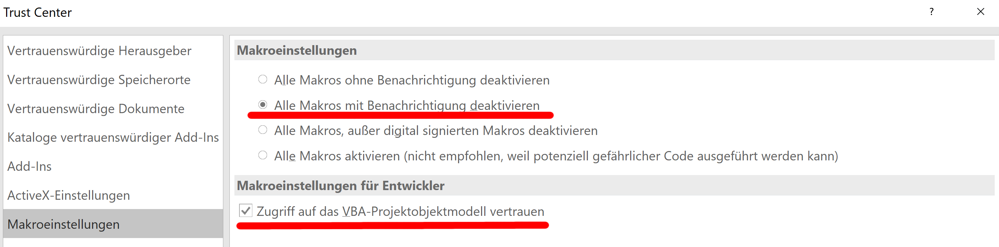

### SketchUp (optional)
SketchUp is a software for modelling buildings (among other things) and can be used to design a custom building model instead of using the generic approach (compare chapter 3.2). You can skip this step if you do not wish to use custom models in GenSim, however it may necessitate reinstalling OpenStudio later if you then wish to use the functionality after all. Make sure to install SketchUp before installing OpenStudio such that the OpenStudio-SketchUp-plugin will be installed automatically.

We recommend using SketchUp 2017, however this version is no longer publicly available. We still need to test the use of newer versions of SketchUp for the use with GenSim. Until then it may not be possible to acquire a version that works with GenSim. Sorry!

### OpenStudio
As GenSim is based on OpenStudio, it must be installed in order to run simulations. The currently supported version is 2.7.0, which you can find on the [official GitHub page for releases of OpenStudio](https://github.com/NREL/OpenStudio/releases/tag/v2.7.0). The installer should guide you through the installation of OpenStudio. Please take note of the following while doing so:

* The default installation folder should be `C:\openstudio-2.7.0`. You can use a different folder, in which case you should note the installation path to specify it later in the `GenSim.xlsm` GUI. We recommend a folder on the same disk as GenSim.
* On the installer page where you can select which components of OpenStudio to install, please select all components.

### Configuring GenSim
After the previous steps have been performed, you need to mark the file `GenSim.xlsm` to be allowed to be run and modified. Open the file property settings by right-clicking the file in a file explorer and select settings. In the settings there is an option to allow access to the file as shown in the following figure. The setting is only shown if the operating system recognises the file as an external file. If it is not there, you can skip this step.

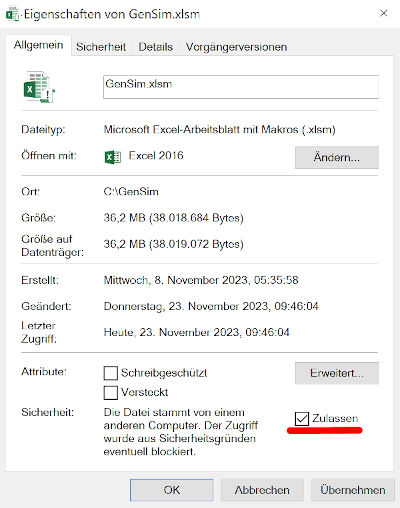

As the last step before using GenSim, you should make sure GenSim has correctly identified the installation path of itself and that of OpenStudio. Open the GenSim user interface (by opening file `GenSim.xlsm`) and navigate to the first tab *INSTALLATION*. Here you can configure where OpenStudio has been installed, as shown in the following figure:

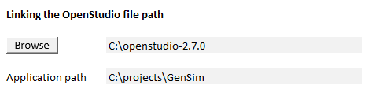

Make sure it matches the installation folder of OpenStudio and change it if not. The `Application path` field is designed to automatically detect and display the directory where the `GenSim.xlsm` file is located. This path should be set automatically when you open the file. If for any reason the path isn't set automatically, you need to manually enter the folder path.

## **3  Model functions and parameters**
###3.1 Location

The modelling process starts on the *HOMEPAGE* of the GenSim Excel® GUI with the selection of the building location and the weather file.

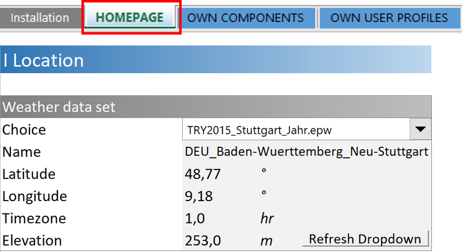

Corresponding *EnergyPlus®* weather datasets[^2] have been generated for the 25 largest German cities using the current DWD test reference years (TRY 2015/2045). Both the current TRY2015[^3] and the future scenario TRY2045[^4] have been stored in order to be able to consider the climatic requirements for heating, air conditioning and ventilation systems over a longer period of operation. The required weather data set can be selected from a dropdown list. 

[^2]: File format "epw" - EnergyPlus weather data
[^3]: Reference period 1995 to 2012
[^4]: Forecast period 2031 to 2060

**Custom weather data sets**

In general, any *EnergyPlus®* weather data set can be used for the simulation in GenSim. A complete weather data set always consists of an EPW-file and a DDY-file which must be saved with the same file name in the subfolder "weather" in the GenSim file path. The refresh button can be used to update the selection of weather files in the dropdown list within the GUI.

Ready-to-use weather data sets (epw + ddy) for worldwide locations can be downloaded free of charge from the following websites: 

[https://energyplus.net/weather](https://energyplus.net/weather)    
[http://climate.onebuilding.org/](http://climate.onebuilding.org/) 

Furthermore, the TRY data provided by the DWD can be used to generate location-specific weather data sets for the whole of Germany which can then be converted into valid EnergyPlus weather data sets using the [EnergyPlus Weather Converter](https://bigladdersoftware.com/epx/docs/8-3/auxiliary-programs/using-the-weather-converter.html). A tool facilitating this workflow is currently under development and will be released soon.

###3.2 Building geometry

The building geometry can be defined in two ways. Either a generic cubic geometry model can be parameterised directly in the GUI of GenSim, or the geometry can be individually created using SketchUp and imported to GenSim. The choice between these two options is made using a drop down menu (see the following figure). Both options are described below. 

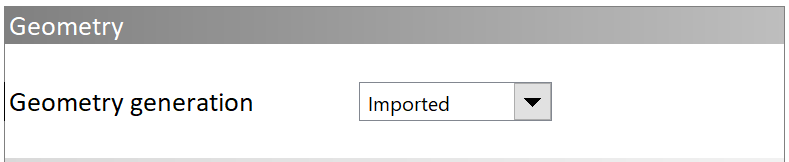

Basically, in *EnergyPlus®*, the geometrical model of a building is represented by its external dimensions without any component thicknesses or volumes (e.g. wall or ceiling thicknesses). As a result, the entire gross floor area (GFA) or gross room volume (GRV) is simulated as the volume to be conditioned. The inaccuracy resulting from this simplification is negligible given the low level of model detail. The user-defined net floor area (NFA) (or rather the ratio GFA/NFA, see below) is later used to convert the simulation results to area-specific quantities related to the NFA. This means that the absolute results of the simulation are related to a typical NFA corresponding to the simulated GFA.

####3.2.1 Generic building model

The generic geometry model is a cubic building (see figure) defined by the parameters "length", "width", " floor height", "number of floors" and "window area percentage"[^5] (see figure). An idealised floor plan is used which divides each floor into 4 external and one internal zone (see figure below). 

After the simulation, it is possible to view the generic geometry model in *SketchUp®* using the *OpenStudio®* SketchUp plug-ins. The geometrical model file is located in the directory "/Output/run" under the name "in.osm".
[^5]: Ratio of transparent to opaque outer surface 

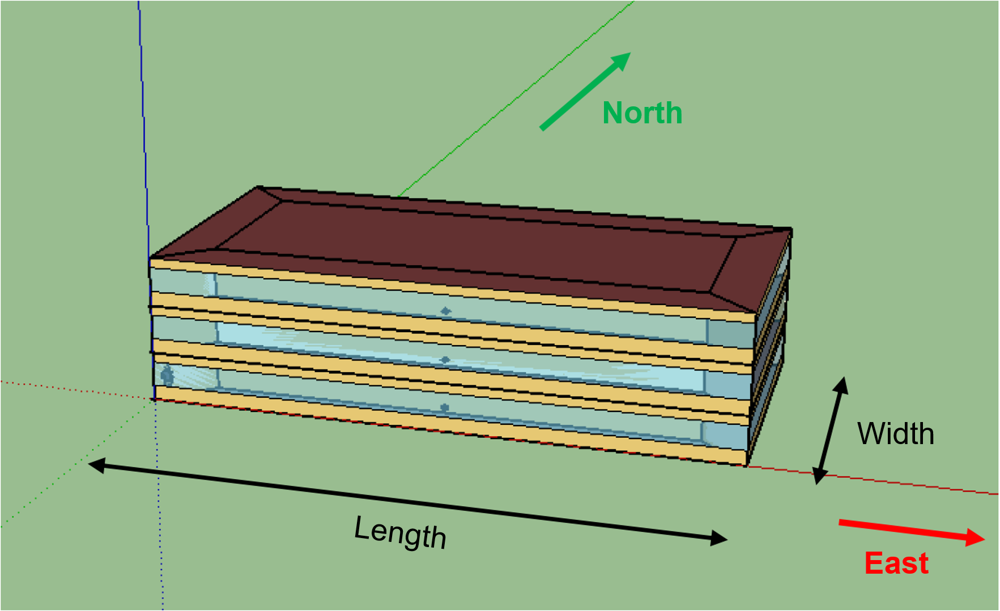

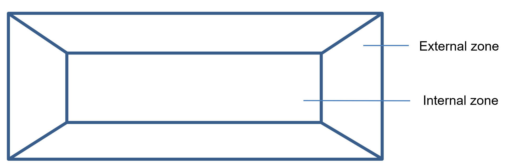

**Measurements**

The "length" and "width" of the building are indicated as external dimensions. The length is defined as the the north-south facing facade and the width as the east-west facing facade (see figure above). The "floor height" is specified as the gross floor height. The multiplication of "floor height" and "number of floors" results in the total height of the building. The parameter "depth outer zones" additionally defines the depth of the outer zones[^6] according to the figure above. All input parameters for the generic geometry model are shown in the figure below and will be described in the following.
[^6]: An outer zone with a depth of 0m results in a one-zone model

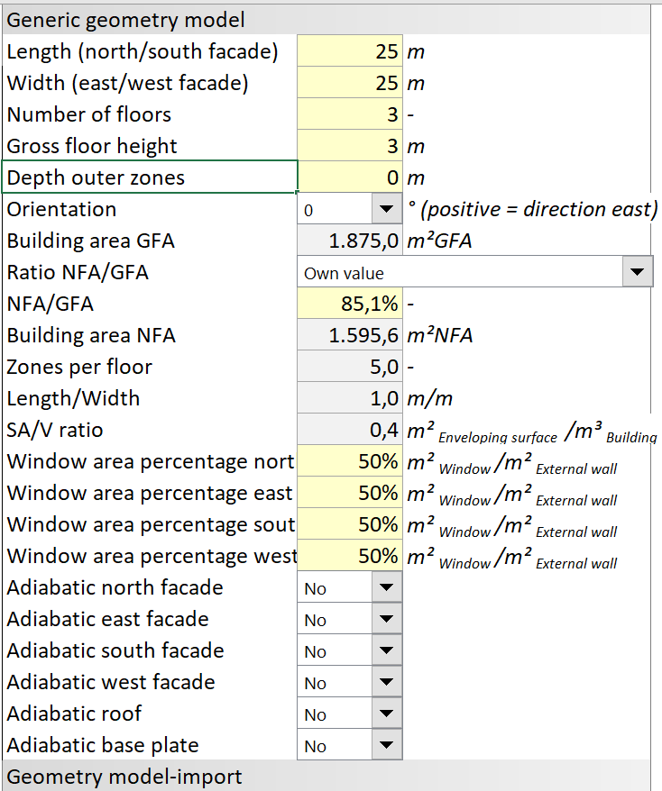

**Orientation**

The orientation of the building can also be changed using a drop down menu (see following figure) if the building is not orientated in the axes of the main cardinal points. A positive rotation of the building corresponds to a clockwise rotation[^7].
[^7]: See EnergyPlus® parameter "north axis": [https://bigladdersoftware.com](https://bigladdersoftware.com/epx/docs/8-0/input-output-reference/page-006.html#field-north-axis)    

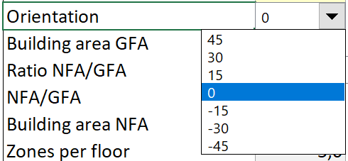

**Ratio NFA/GFA**

As already mentioned, only gross areas or volumes are represented in the EnergyPlus® model. In order to convert the absolute results of the simulation into area specific results with the unit \(Wh/m²_{NFA}\), the user needs to specify the ratio of GFA/NFA. This can either be entered as an individual value (if known) or it can be determined from various predefined building typologies included as presets in the GUI.

**Window areas**

Besides the actual geometry, window areas of the building also need to be defined. Therefore, a corresponding "window band"[^8] is modelled by specifying a percentage of window area per facade (m² of window area / m² of facade area [%] - see following figure).
[^8]: Ratio of transparent to opaque outer surface (window without frame) 

**Adiabatic external components**

Optionally, individual facade components or the roof and floor plate of the building can be defined as adiabatic. Adiabatic means that the component does not allow heat transfer. This allows the simulation of e.g. coupled terraced houses or other sub-volumes of a whole building by defining component boundaries facing to heated zones as adiabatic. The procedure for the imported geometry model is explained in more detail in Section 3.2.4 Adiabatic External Components below. 

####3.2.2 Imported geometry model

As mentioned above, an individual geometrical model can optionally be created with the OpenStudio® SketchUp® plugin if the building geometry is known in more detail and/or significantly differs from a cubic shape. The osm-model file created this way can be imported into GenSim by the *Import* button (see following figure). A short tutorial on how to create your own geometry model can be found in chapter 6. Currently, the GFA of the imported OpenStudio® model is not read in automatically by GenSim, so the user must enter it manually. It can be determined by perfomring a test-run of GenSim. The actual GFA of the imported model ("Total Building Area") can then be found in the file "eplustbl.htm" in the "/Output/run" folder and entered into the GUI for the actual simulation. The (gross) floor height of the imported geometry model must also be entered.

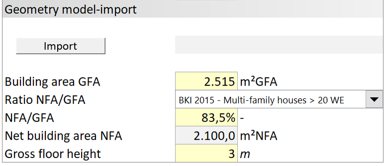

###3.3 Building usage

By using electrical devices, users of a building directly influence the electricity demand of a building. In addition, the usage of the building also has a significant impact on the heating and cooling demand in the form of internal heat loads from electrical devices and lighting as well as heat emitted by the present people and their activity. The internal heat loads of these three groups (electrical devices, lighting, presence of people) are defined by normalised load profiles and by power and occupancy densities for the scaling of these profiles. The load profiles are specified as individual typical days for working days, Saturdays and Sundays (see following figure). In addition, it is possible to define individual time periods for public holidays/vacation and corresponding load profiles of typical days for these time periods. Depending on the parameter "first day of the year", annual load profiles are generated on the basis of the individual normalised typical day profiles, the scaling factors and the arrangement of working days, weekends and user-defined holidays within the year. In the GUI, presents for the typical days are specified and can be accessed by dropdowns (more details below).

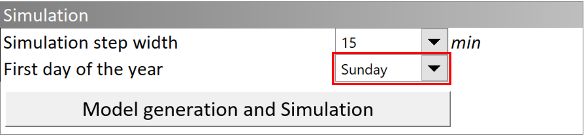

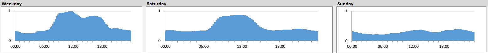

Up to 5 periods can be defined for public holidays/vacation days (see following figure). These can be holiday periods e.g. for the simulation of a school or university building.

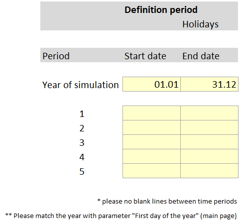

**Electrical devices and lighting**

The typical days for electrical devices and lighting are available in the form of normalised profiles. The range of values is therefore between 0 ... 1. Multiplying the corresponding power density in \(W/m²_{NFA}\) with the normalised dimensionless typical day profile results in a profile in \(W/m²_{NFA}\). See the following figure: "Electrical devices" and "Lighting" drop-down menus as well as the "Electrical device power density" and "Lighting power density" parameters.

**Person occupancy and activity**

Two separate typical day profiles are defined to represent the occupancy of persons and their activity: A normalised profile describing the presence of persons (0...1) and additionally a profile describing the activity of the present persons with the unit *power per person* (\(W/pers\)). By multiplying these two profiles with the person occupancy (defined in \(m²NFA/person\)), the result is - like for electrical devices and lighting - a profile in \(W/m²_{NFA}\) (\(W/person\) * \(person/m²_{NFA}\)). 

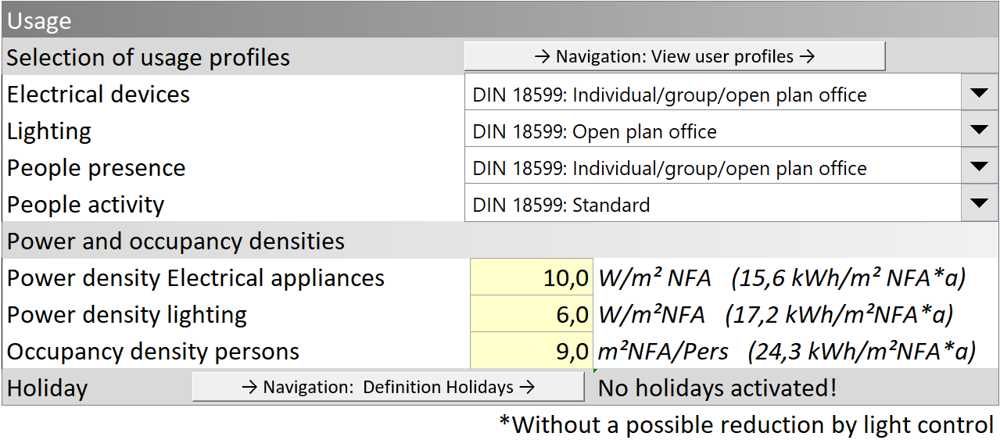

Default values for these four categories are available, which were created using the characteristic values described in various sources:

* **SLP BDEW:** Standard load profiles from the German Association for Energy and Water Management
* **DOE Prototype Buildings:** Commercial Prototype Building Models from the US Department of Energy
* **DIN V 18599-10:** DIN standard *Energy performance of buildings* part 10
* **VDI 2078: 1996-07:** VDI standard *Assessment of cooling load of air-conditioned rooms*

It is also possible to define all profiles yourself. Custom profiles can be entered in the tab *OWN USER PROFILES* of the GUI and then selected in the respective drop-down menu:

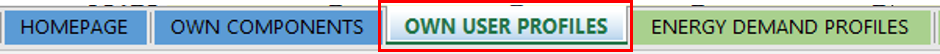

###3.4 Building standard
####3.4.1 External components

A number of pre-defined component structures for the external components of the building (walls, roof, base plate, ceiling, windows) are included in the GUI. These can be selected from the drop-down menu, as shown in the figure below. Additionally, it is also possible to define own component structures, using the menu *OWN COMPONENTS* shown below. Here, all the required physical values for the external walls, roof, floor plate, intermediate ceiling and window component groups can be entered for custom structures. Note: The heat transmission coefficient of opaque components is calculated from the layer thicknesses and specific thermal conductivities of the materials and the heat transfer resistances. When creating new layers, all physical properties must be fully described. 

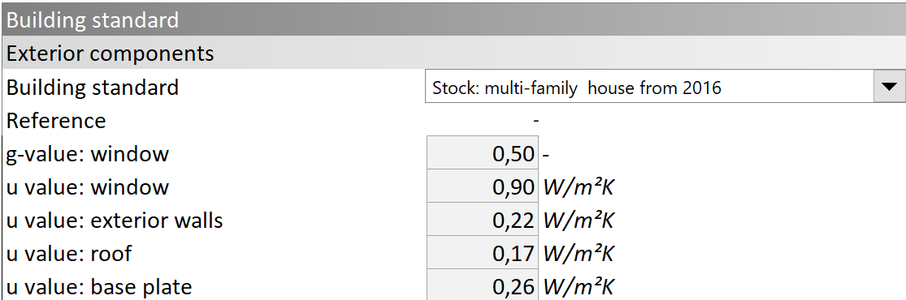

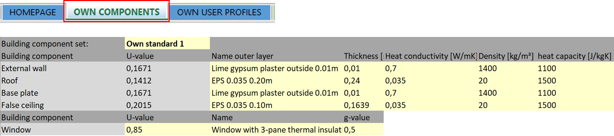

####3.4.2 Internal components

Internal components, defined as false ceilings (see last subchapter) and internal walls, affects the simulation results significantly as they act as internal storage masses for thermal energy. The building standard of the internal walls can be selected by a drop-down list as "light", "medium" or "heavy". The GUI provides corresponding typical structures, shown when changing the value in the drop-down menu.

###3.5 Air temperature setpoint

The air temperature setpoint for heating and cooling are set in the same way as the usage profiles (see chapter 3.3) by two drop-down menus (see figure below). They can be taken either from predefined standard profiles or from user-defined custom ones. 

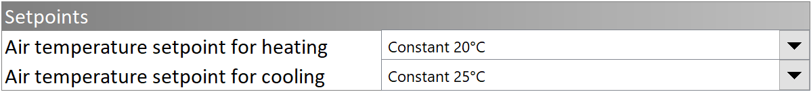

###3.6 Ventilation system

To represent the ventilation system, the system type and the heat recovery (HR) option must be selected in two drop-down menus (see figure below). If the HR is activated, a return heat or return humidity value must also be specified. The operating times of the ventilation system are defined in the same way as the usage profiles (see chapter 3.3) using a drop-down list either from predefined profiles or by selecting a user-defined profile. The actual air flow rate of the ventilation system is determined by specifying the "air change rate" parameter and a "conditioned room height". 

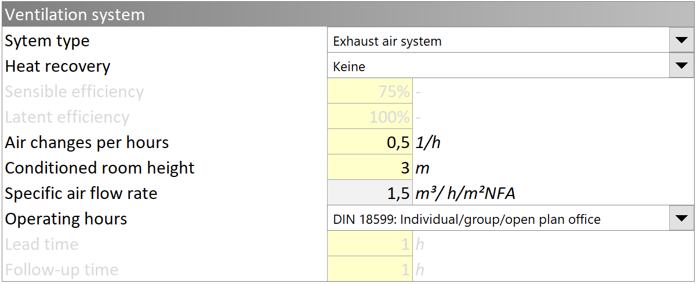

The electrical power demand of the ventilation system and therefore the resulting heat input into the ventilation system considered in the simulation is based on the standard SFP (specific fan power) factors of DIN EN 16798-3. The specific fan power is set to 750 \(W/(m³/s)\) for supply and extract air corresponding to SFP 2. 

###3.7 Further more

There are a number of optional model features that can be activated which are explained below.

**Window ventialtion in case of overheating (cooling)**

In order to simplify window ventilation (for cooling) in case of overheating of the rooms, the function "window ventilation in case of overheating" can be activated (see following figure). This requires the specification of "air changes per hour" (typically 1...2/h) and a threshold for the room temperature at which occupants may open the windows. Actual window ventilation of the overheated rooms will only occur if, as a further condition, the temperature difference between the indoor air and the outdoor air meets a minimum value. If a value of 1 Kelvin is set for this parameter, then the temperature of the outdoor air must be at least 1 K below the temperature of the indoor air for the window ventilation to actually become active during the simulation. This parameter can be set to 0 Kelvin as the default setting.

**Infiltration**

By defining the air changes per hour (see following figure) a constant air exchange rate is applied to all conditioned zones of the building during the simulation to reproduce the building's leakage. Reference values can be found in the GenSim reference library. 

**Daylight-dependent lighting control**

Daylight-dependent lighting control can be activated to realistically simulate user behaviour in terms of artificial lighting operation depending on the daylight available in individual rooms. When a certain level of daylight is reached (see parameter "daylight threshold" in the figure above) the lighting in individual rooms is deactivated, overwriting the state set by the "lighting usage profile". This leads to the typical seasonal character of the lighting profile as shown in the following figure:

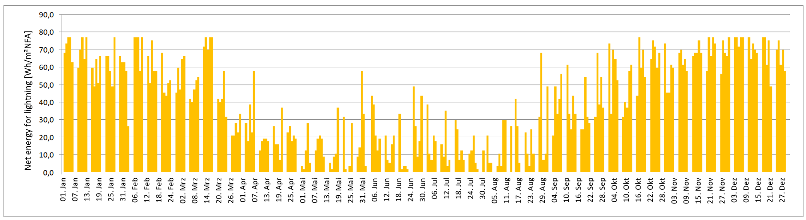

## **4 Simulation**

Once all the parameters have been entered, the simulation is started using the "Model generation and Simulation" button (see following figure). During the following completely automatised process, the *EnergyPlus®* model is generated in the first step. This turns the generic model into a customised *EnergyPlus®* building model. In the second step, the generated building model is simulated with the specified time step width (according to the parameter in the following figure). 

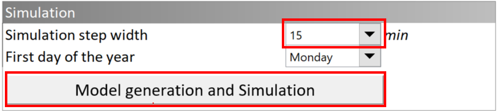

The user is continuously informed about the progress of the model generation and simulation, as exemplary shown in the figure below. At the end of the simulation process, the results of the *EnergyPlus®* simulation are imported into the *Excel®* user interface.

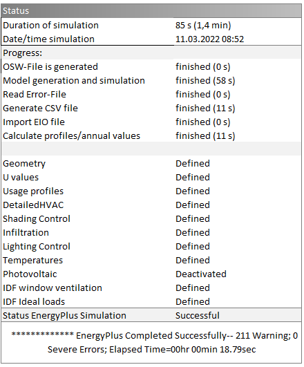

## **5 Results**

The results of the simulation are given as annual values and profiles. Annual values can be found on the *HOMEPAGE* and under the menu item *BUILDING BALANCE*. The main profiles are displayed under *ENERGY DEMAND*. More profiles can be found at *e+ Outputs*. A graphical representation of the main profiles can be found under the menu item *PROFILES VIEW*. The output of the results is assumed to be intuitive so no further explanation is provided here. 

## **6 Short tutorial: Creating a geometry model with the OpenStudio® Sketchup®-plug-in**

**Create a new empty model**    
In order to correctly create a custom, non-generic geometry model for a thermal building simlation in GenSim, the model has to be created from scratch without any predefinitions, as shown in the following figure.

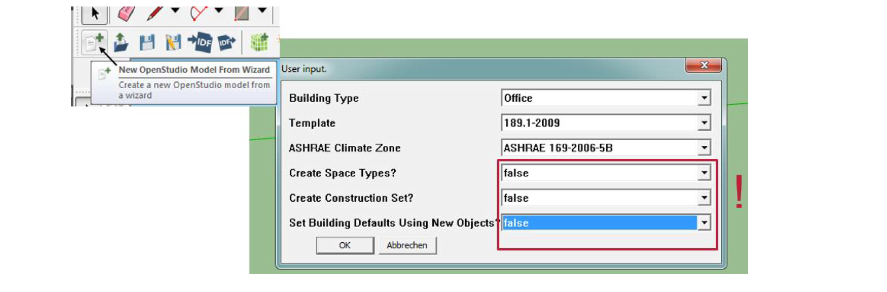

**Draw a floor plan**

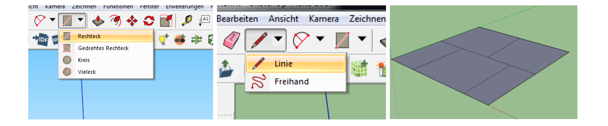

Dimensions must be used for a correctly scaled model. This option may need to be activated in SketchUp itself as it is not always activated by default during installation in order for the dimensions to be displayed in the lower section. To do so, click on "View" in the menu bar and then on "Toolbars" in the pull-down menu. In the "Toolbars" tab the "Dimensions" option must be activated. The dimensions will then appear in the bottom left corner of the program and can be easily entered (without clicking on the field). The entry of a dimension is completed and confirmed by pressing the Enter key.     
It is important to not only draw the outline of the building but also the individual rooms in the floor plan so that the effects of different heating and cooling loads in individual rooms (depending on the solar input, etc.) are adequately represented. It is recommended to import the floor plan (if available) into SketchUp as an image file to make it easier to trace the individual rooms. Therefore it is necessary to know a length in the image. Preferably the length of the entire exterior wall of the building so that you can scale the image in SketchUp. Scaling works as described above. 

**Set zero:**

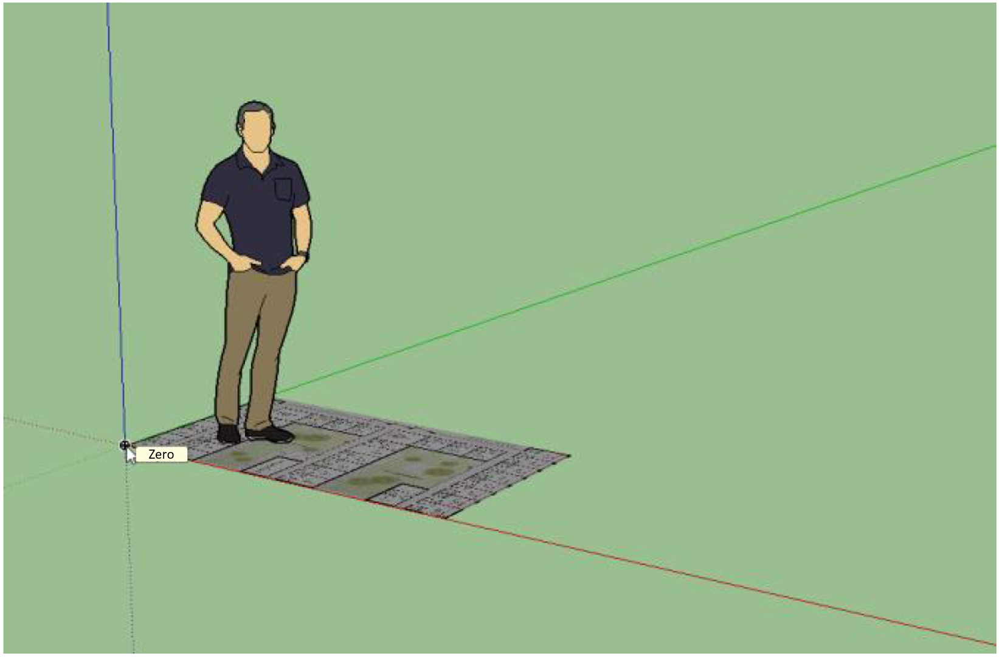

**Scale by entering the length of the image:** 

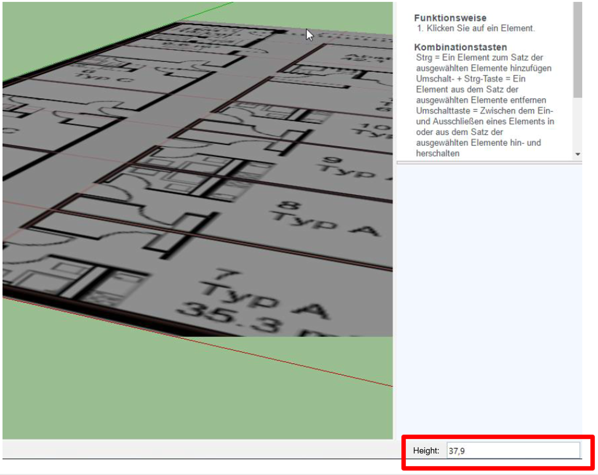

**Trace the building outline:**

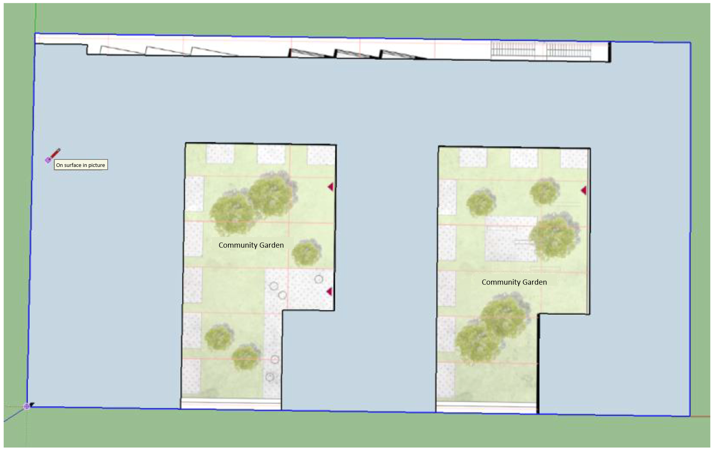

**Switch on X-Ray mode:**

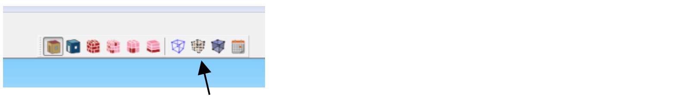

**Trace individual rooms:**   

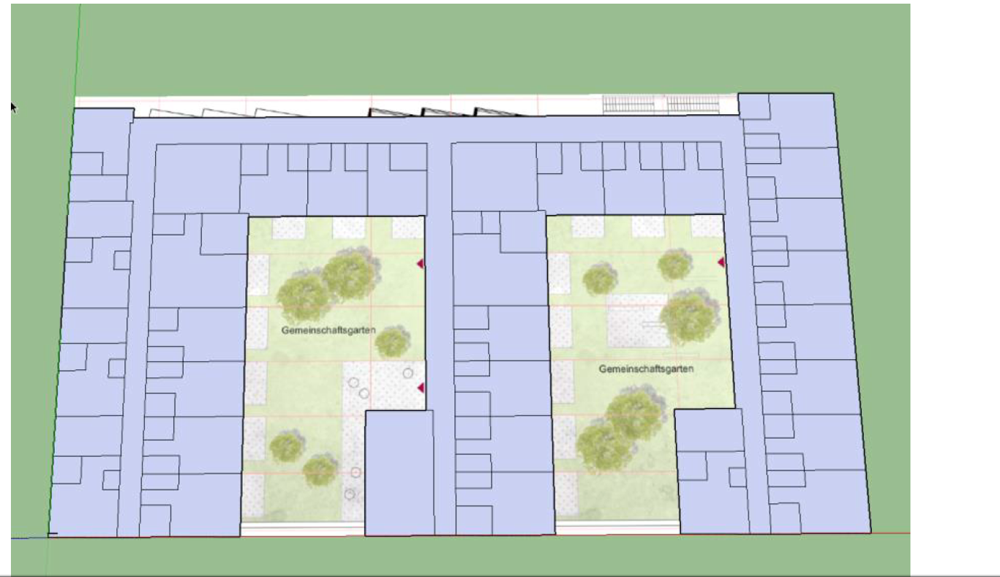

After drawing the floor plan of the building, it is recommended to first save the file temporarily as a SketchUp file (.skp file type) so that it can be accessed later and corrected if necessary.[^9]
[^9]: This is because once a building model is created from the floor plan it disappears in SketchUp. 

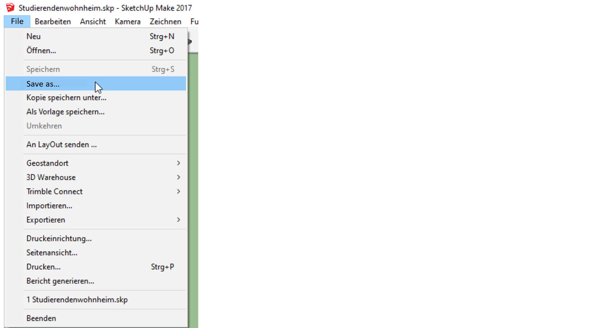

**Select floor plan and create floors** 

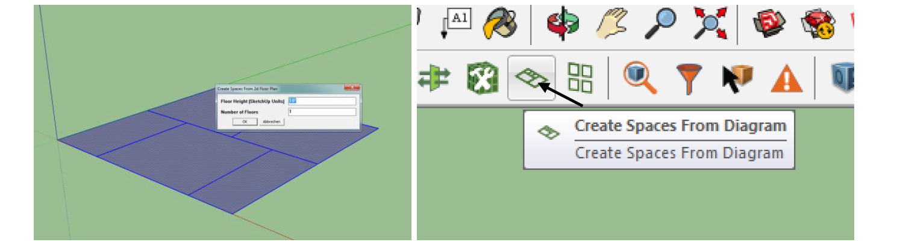

**Surface Matching**    

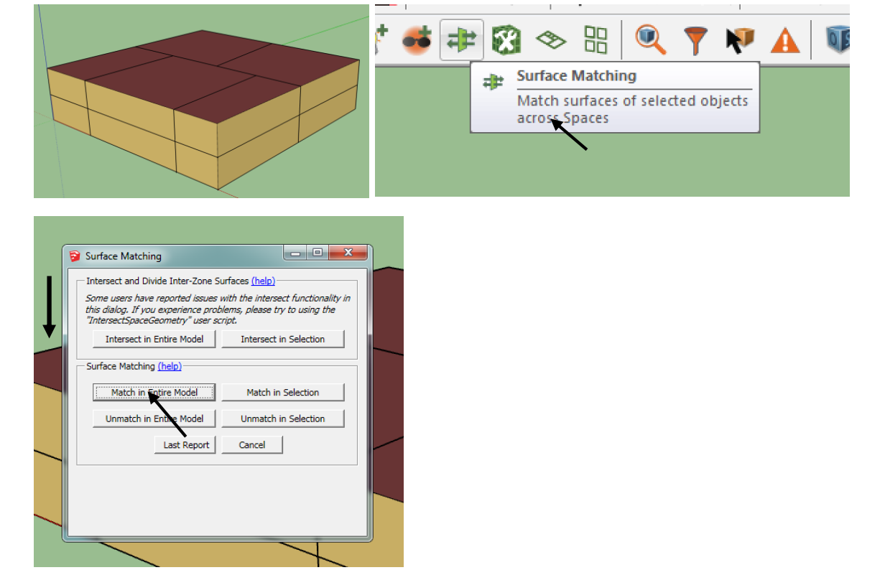

Once the final steps have been completed the file can be saved as an OpenStudio file (.osm). This file is then linked in GenSim (Excel interface) - see chapter 3.2.2.  

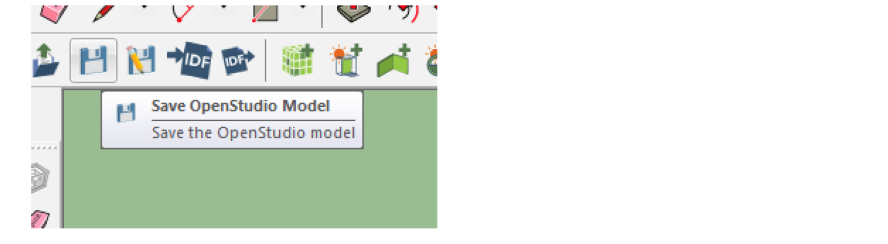

**Create window bands**

Select the model or rooms of interest. If not all rooms have a constant proportion of window area but should have different sizes according to different external facades, the individual facade elements can be selected by double-clicking. Once the rooms or facades have been marked, the window bands are inserted as shown in the following figure. The "window to wall ratio" is the ratio of window area to facade area. 

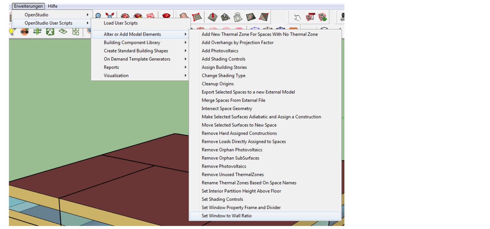

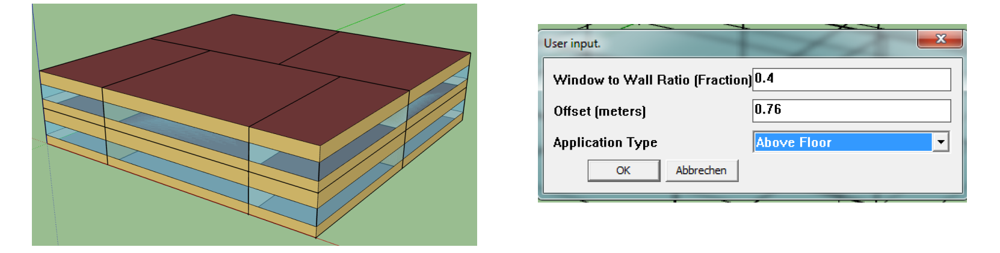

**Save final model as an OpenStudion model (.osm)**

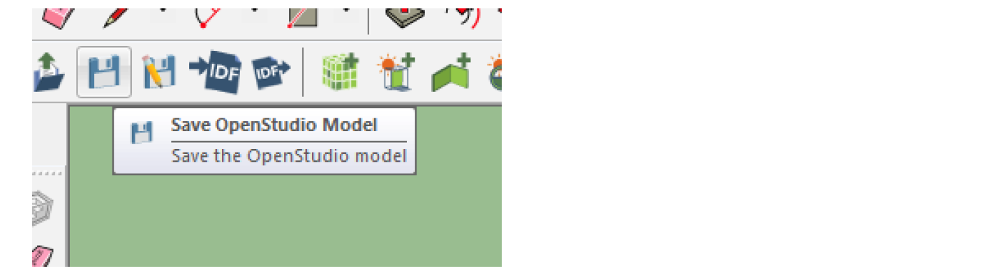

**Useful Links**

Roof geometry: [https://www.youtube.com/watch?v=7YRnquHx1AE](https://www.youtube.com/watch?v=7YRnquHx1AE)   

**Optional: Draw windows by hand**

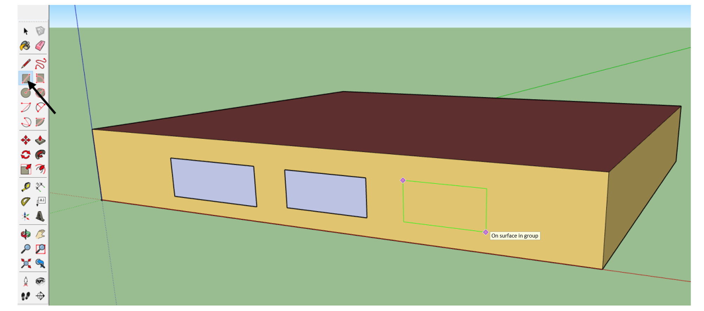

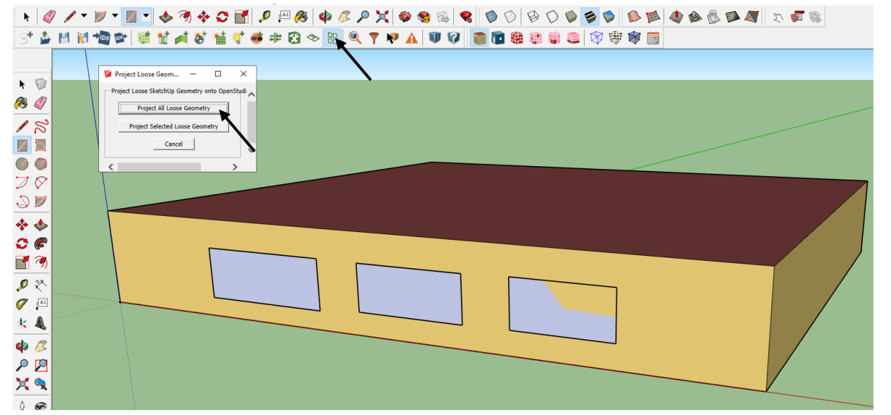

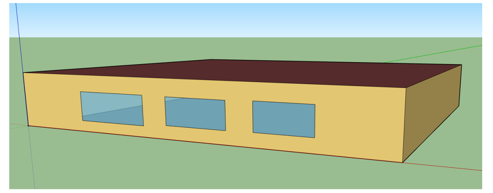

**Optional: Adiabatic external components**

Optionally, individual facade components as well as the roof and floor plate of the building can be defined as adiabatic. Adiabatic means that the external component does not allow heat conduction. This can be used e.g. to simulate coupled row houses or any other partial volume of a whole building by defining component boundaries to heated zones (simplified) as adiabatic. 

* Change the display to "Render By Boundary Conditions"     
* If it is not displayed: Extension > Open Studio > Rendering > Render By Boundary  

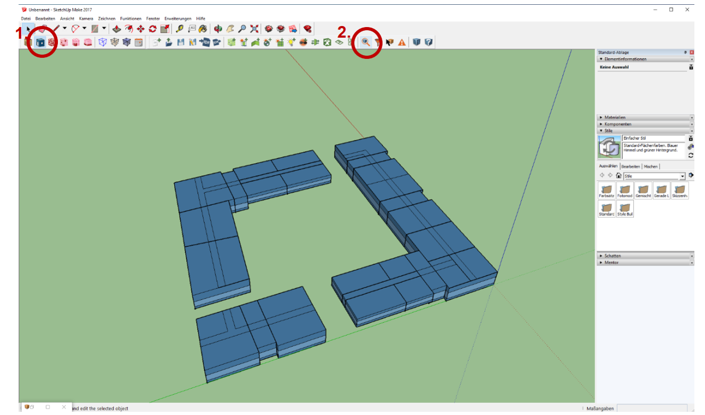

* Open the "Inspector" and change the item "Outside Boundary Condition" to "Adiabatic"

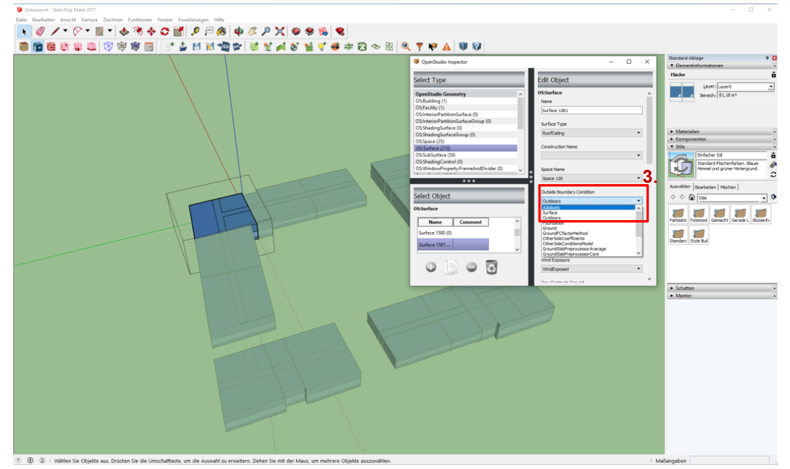

* If the floor (e.g.) is to be set as adiabatic, the floor must be selected by double clicking on it. If this does not work, double click again.
* The colour of the previously selected area should now change to pink. Tip: If the colour does not change, it usually helps to restart the program and open the .osm file again. This is simply a display error in the plugin. The colours of the areas will change to the correct colours after the restart. 

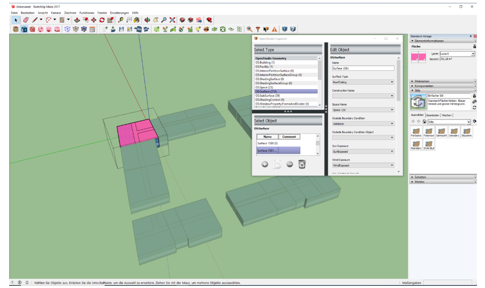

## **7 Standard building typologies**
###  **Overview and Import of typologies**

To enable quick and easy simulation of standard building types like residential buildings, offices and others, we developed and tested standard parameter-sets including all required default parameters. The parameter-sets are based on common guidelines and standards. Although, the definition of the following parameters are not part of the typologies and must always be defined individually:

- location (using a weather data set)
- building geometry
- building standard (construction data of walls, windows, roof…)

If necessary, other parameters can be adapted: This could typically be the mechanical ventilation system, the shading system or the temperature setpoints for heating and cooling. We recommend to not adapt other than these parameters of the typology’s parameters set. 

The following standard building typologies are available in the GitHub repository of GenSim:

- Multi-family house (Germany)
- Single-family house (Germany)
- Office (Germany)
- Hotel (Germany)
- Retail (Germany)
- Restaurant (Germany)
- School (Germany)
- Sports hall (Germany)
- Kindergarten (Germany)

To import one of the parameter-sets into the software, there is an import-button on the “homepage” of the GUI:

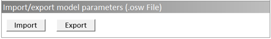

Select one of the parameter-sets inside the subfolder “building_typologies” located in the GenSim root directory. After the successful import, all typology-specific parameters are automatically set in the GUI. In the next step, adapt the non typology-specific parameters as listed above and start the simulation (see chapter 4 Simulation).

### **Description of the typologies:**

Here are some details about the building typologies that are available. One of the most important parameter group for defining a specific building type is “internal loads” for electrical devices, lighting and human occupancy.  Air temperature setpoints and the ventilation system are also crucial. Therfore, these are briefly described below. For more details about the selected parameters within each typology, please import the parameter-set into the software and have a look!

**Multi-family house (Germany)**

This is a parameter-set for a typical German multi-family house using internal load schedules from the “DOE Prototype Building: Midrise Apartment” to define lighting and occupancy as well as the German “SLP BDEW H0” schedule to define electrical devices. The power and occupancy densities represent typical values for Germany. The air temperature setpoint for heating uses a schedule with 20°C in daytime and a drop to 18°C in nighttime. The air temperature setpoint for cooling is set constant to 26°C. The ventilation system is an exhaust air system commonly used in German multi-family houses.

**Single-family house (Germany)**

This is a parameter-set for a typical German single-family house using internal load schedules from the “DOE Prototype Building: Midrise Apartment” to define lighting and occupancy as well as the German “SLP BDEW H0” schedule to define electrical devices. The power and occupancy densities represent typical values for Germany. The air temperature setpoint for heating uses a schedule with 20°C in daytime and a drop to 18°C in nighttime. The air temperature setpoint for cooling is set constant to 26°C. The ventilation system is an exhaust air system commonly used in German single-family houses. Comparing to the multi-family house, the internal loads, geometrical parameters and others are adjusted.

**Office (Germany)**

This is a parameter-set for a typical German office building using internal load schedules oriented to the German standard DIN V 18599 to define lighting and occupancy rates. Furthermore, it is based on the German “SLP BDEW G1” schedule to define electrical devices. The power and occupancy densities represent typical values for Germany. The air temperature setpoints for heating and cooling use a customized schedule based on empirical data. The ventilation system is set to a central ventilation system commonly used in German office buildings (an exhaust air system could be possible as well, so this may be changed after the import of the parameter-set).

**Hotel (Germany)**

This is a parameter-set for a typical German hotel using internal load schedules from the “DOE Prototype Building: Large Hotel” to define electrical devices, lighting and occupancy. The power and occupancy densities represent typical values for Germany. The air temperature setpoint for heating is set to 20°C (constant). The air temperature setpoint for cooling is set 25°C (constant). The parameter-set is based on a central ventilation system (an exhaust air system could be possible as well, so this may be changed after the import of the parameter-set).

**Retail (Germany)**

This is a parameter-set for a typical German retail using internal load schedules from the “DOE Prototype Building: Retail” to define electrical devices, lighting and occupancy. The power and occupancy densities represent typical values for Germany. The air temperature setpoints for heating and cooling use a customized schedule based on empirical data. The parameter-set is based on a central ventilation system commonly used in German retail.

**Restaurant (Germany)**

This is a parameter-set for a typical German restaurant using internal load schedules from the “DOE Prototype Building: Full Service Restaurant” to define electrical devices, lighting and occupancy. The power and occupancy densities represent typical values for Germany. The air temperature setpoints for heating and cooling use a customized schedule based on empirical data. The parameter-set is based on a central ventilation system commonly used in German restaurants (an exhaust air system could be possible as well, so this may be changed after the import of the parameter-set).

**School (Germany)**

This is a parameter-set for a typical German school using customized internal load schedules based on empirical data to define electrical devices, lighting and occupancy. The power and occupancy densities represent typical values for Germany. The air temperature setpoint for heating uses a customized schedule based on empirical data. The air temperature setpoint for cooling is set constant to 26°C. The parameter-set is based on a central ventilation system commonly used in German schools (an exhaust air system could be possible as well, so this may be changed after the import of the parameter-set).

**Sports hall (Germany)**

This is a parameter-set for a typical German sports hall using customized internal load schedules based on empirical data to define electrical devices, lighting and occupancy. The power and occupancy densities represent typical values for Germany. The air temperature setpoint for heating uses a customized schedule based on empirical data. The air temperature setpoint for cooling is set constant to 26°C. The parameter-set is based on a central ventilation system commonly used in German sports halls (an exhaust air system could be possible as well, so this may be changed after the import of the parameter-set).

**Kindergarten (Germany)**

This is a parameter-set for a typical German kindergarten using customized internal load schedules based on empirical data to define electrical devices, lighting and occupancy. The power and occupancy densities represent typical values for Germany. The air temperature setpoint for heating uses a customized schedule based on empirical data. The air temperature setpoint for cooling is set constant to 26°C. The parameter-set is based on a central ventilation system commonly used in German kindergartens (an exhaust air system could be possible as well, so this may be changed after the import of the parameter-set).

