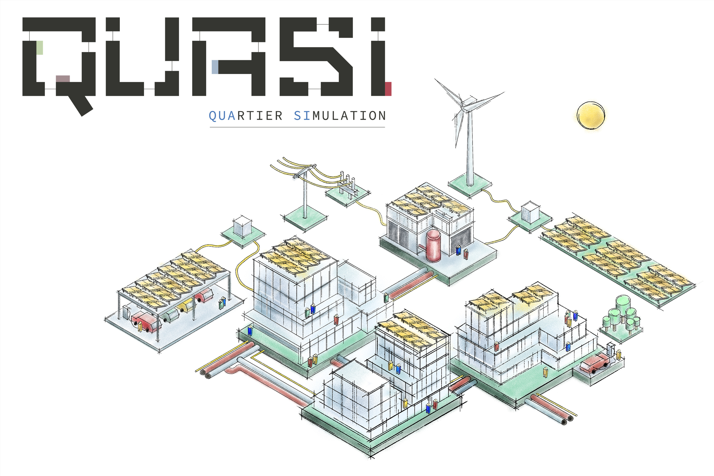
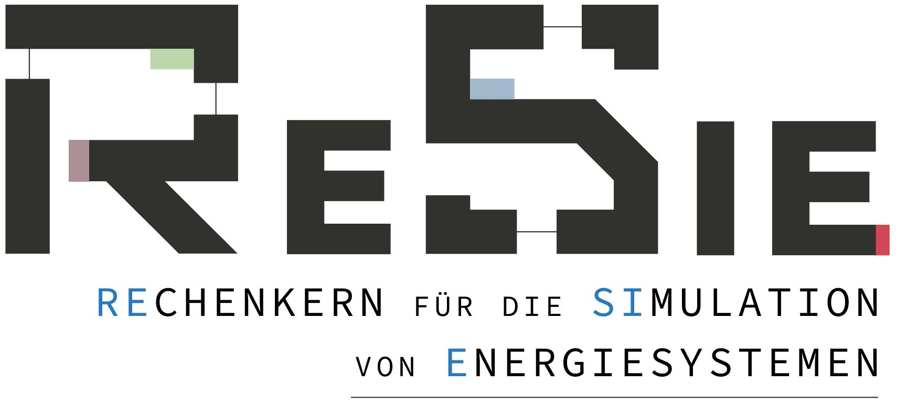
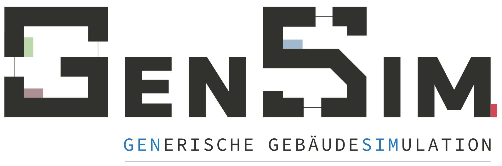
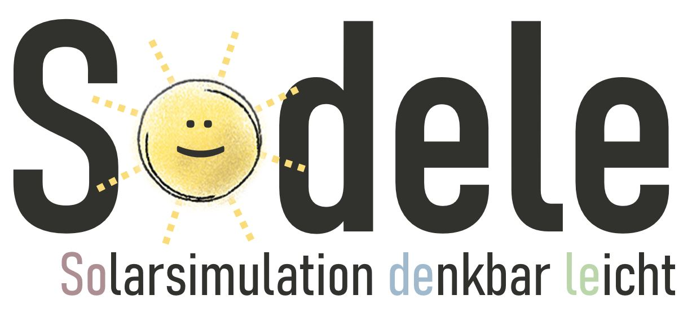
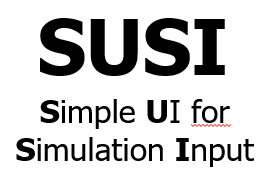
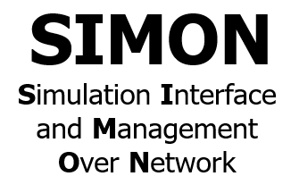
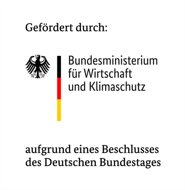
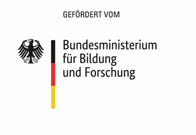

# QuaSi - Overview

The QuaSi simulation software bundle focuses on the energy supply and demand of buildings on the scale of city districts during an early planning stage. The project contains several software components: The energy system simulation engine ReSiE, the thermal building simulation tool GenSim, as well as additional tools surrounding the use of ReSiE (see below for details). The documents presented here describe the technical background, usage instructions and developer guidelines for these components.

In particular, this documentation is on the open source project QuaSi. As part of the research projects in which the tools were developed, more software was created, which will not be described here. You can check out our [project homepage](http://www.quasi-software.org) for more information and updates as we continue to work on QuaSi.

**DISCLAIMER:** The current version of the documentation is a work in progress as we move towards the first full release of our various tools and software components. Please be aware that some parts of the documentation do not reflect the current state of what they are documenting.

## What's with the name?
The first version of QuaSi was developed as part of a research project in Esslingen - Germany. As the tool grew useful, it needed a catchy name, which is the source of "QuaSi" as an abbreviation of "Quartier" (German for city quarter / district) and "Simulation". Although additional components were added over time and the project is now developed with an international audience in mind, the name stuck around. 

## Tools of the QuaSi project
This is a quick overview of the tools of the QuaSi project. You can find more details in the other chapters of the documentation.

- **ReSiE** (acronym for "computational engine for the simulation of energy systems", in German "Rechenkern für die Simulation von Energiesystemen"), a simulation tool for the simulation and optimization of different energy supply systems with a focus on operational strategies that can be used in early planning stages ([GitHub Repository](https://github.com/QuaSi-Software/resie))
  
    <figure markdown>
        { width="300" }
    </figure>

- **GenSim** (acronym for "generic building simulation", in German "Generische Gebäudesimulation") that can perform a thermal building simulation based on EnergyPlus™ to get energy demands (heating, cooling, electricity and lighting) for a variety of buildings and usage ([GitHub Repository](https://github.com/QuaSi-Software/GenSim))

    <figure markdown>
        { width="300" }
    </figure>

- **SoDeLe** (acronym for "Solar simulation as easy as can be", in German "Solarsimulation denkbar leicht"), an easy-to-use tool to calculate energy profiles from photovoltaic systems with different orientations and different PV modules, based on python-pvlib ([GitHub Repository](https://github.com/QuaSi-Software/SoDeLe))

    <figure markdown>
        { width="300" }
    </figure>

- **SUSI** (acronym for "Simple UI for Simulation Input"), a web-based GUI for creating the required (complex) input file for ReSiE ([GitHub Repository](https://github.com/QuaSi-Software/susi-streamlit))

    <figure markdown>
        { width="250" }
    </figure>

- **SIMON** (acronym for "Simulation Interface and Management Over Network"), a web-based GUI for running ReSiE simulation on a server environment with synchronisation of input and result files to a NextCloud instance ([GitHub Repository](https://github.com/QuaSi-Software/simon))

    <figure markdown>
        { width="250" }
    </figure>

## Funding
This project is funded in majority by a research initiative of the German government through the German Federal Ministry for Economic Affairs and Energy (BMWE), formerly known as German Federal Ministry for Economic Affairs and Climate Action (BMWK), in research grant **03EN3053**.

Previous work has also been funded within the same research initiative through the German Federal Ministry for Education and Research (BMBF) in research grant **03SBE115**.

