# Technical description of main components

## Convention

Symbols:

- Scalars are shown in italic letters (normal math: \(T \ t\))
- Vectors or time series in bold and italic letters (boldsymbol: \(\boldsymbol{T \ t}\))
- Matrices are bold and non-italic (textbf: \(\textbf{T t}\)) 
 
Energy systems:

- Energy flows into an energy system are positive, energy flows out of an energy system are negative
- Energy systems are single units like a heat pump, a buffer tank, a battery or a photovoltaik-plant while energy networks are interconnected energy systems

## Heat pump (HP)
### General description of HP
As heat pumps, electrically driven variable-speed and on-off compressor heat pumps can be integrated into the simulation model of Quasi. Their general system chart with the denotation of the in- and outputs is shown in the figure below. In general, a gaseous refrigerant is compressed by the compressor uwing electrical energy, resulting in a high temperature of the refrigerant. The refrigerant is then condensed in the condenser and it releases the energy to the condenser liquid at a high temperature level. After that, the refrigerant is expanded and completely liquefied in the expansion valve. In the following evaporator, the refrigerant is then evaporated at a low temperature level with the help of a low-temperature heat source, after which it is fed back into the compressor.

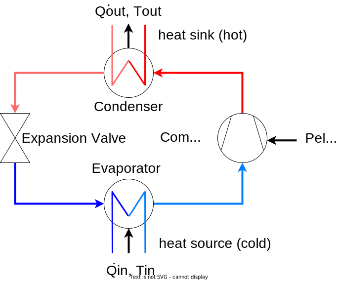

The energy balance at the heat pump is built up from the incoming electricity \(P_{el,HP}\), the incoming heat at a low temperature level \(T_{HP,source,in}\) and the outgoing heat flow at a higher temperature level \(T_{HP,sink,out}\). 

The energy balance of the heat pump model is shown in the following figure:

 
Using the electrical power \(P_{el,HP, supply}\), reduced by the losses of the power electronics \(P_{el,HP, loss}\), an energy flow \(\dot{Q}_{HP,in}\) with temperature \(T_{HP,source,in}\) is transformed to the energy flow \(\dot{Q}_{HP,out}\) with temperature \(T_{HP,sink,out}\). The efficiency of the heat pump is defined by the coefficient of performance (COP). The COP determines the electrical power \(P_{el,HP}\) required to raise the temperature of a mass flow from the lower temperature level \(T_{HP,source,in}\) to \(T_{HP,sink,out}\): 

$$ COP_{HP} = \frac{\dot{Q}_{HP,out}}{P_{el,HP}} \quad  \leq \quad COP_{Carnot} = \frac{T_{HP,sink,out}[K]}{T_{HP,sink,out}-T_{HP,source,in} } $$

$$ COP_{HP} = \eta_{Carnot} \  COP_{Carnot} \quad \text{with} \quad 0 \leq \eta_{Carnot} \leq 1 $$

The COP is always smaller than the maximum possible Carnot coefficient of performance (\(COP_{Carnot}\)), which is calculated from the condenser outlet and evaporator inlet temperature. The maximum possible COP calculated by Carnot is reduced by the carnot effiency factor \(\eta_{Carnot}\), which is according to [Arpagaus2018][^Arpagaus2018] around 45 % for high temperature heat pumps and around 40 % for conventional heat pumps.

The energy balance (or power balance) of the heat pump can be drawn up on the basis of the latter figure and on the ratio between supplied and dissipated heat power, expressed as the COP:

$$\dot{Q}_{HP,out} = \frac{COP_{HP}}{COP_{HP} -1} \ \dot{Q}_{HP,in} \mathrm{\quad with \quad} \dot{Q}_{HP,out} = \dot{Q}_{HP,in} + P_{HP,el} $$

The power of the heat pump's electric supply, including the losses of the power electronics, is given as: 

$$P_{el,HP,Bezug} = \frac{P_{el,HP}}{\eta_{HP,LE}}$$

Since the temperatures of the heat flows entering and leaving the heat pump, which have not been considered so far, may also be relevant for connected energy systems, the heat outputs can be calculated on the basis of the respective mass flow \(\dot{m}\) and the physical properties of the heat transfer medium (specific heat capacity \(c_{p}\) and, if applicable, the density \(\rho\)) by rearranging the following equation:

$$ \dot{Q} = \dot{m} \ c_{p} \ (T_{max} - T_{min}) $$

As a chiller follows the same prinicple as a heat pump, the same energy system can be used to simulate both energy systems. The difference is the definition of the efficiency, as for a chiller the useful energy is not \(\dot{Q}_{HP,out}\) but \(\dot{Q}_{HP,in}\). This leads to the definition of the energy efficiency ration (EER) for chillers as
 
$$ EER = \frac{\dot{Q}_{HP,in}}{P_{el,HP}} = \frac{\dot{Q}_{HP,out} - P_{el,HP}}{P_{el,HP}} = COP - 1   $$

As shown, the COP can be transferred to the EER. In the following, the description is made for heat pumps. The only adaption that has to be done for chillers is the change of the useful energy. Also, the efficiency function needs to be changed to EER(\(T_{HP,source,in}\), \(T_{HP,sink,out}\)) (if used) and for nonlinear part load efficiency the useful energy \(\dot{Q}_{HP,in}\) is assumed to be the linear reference energy instead of \(\dot{Q}_{HP,out}\) as for heating mode.

### Modelling approaches for HP: Overview
According to [Blervaque2015][^Blervaque2015], four different categories are described in the literature when it comes to the simulation of heat pumps:

- **quasi-static empirical models**: equation-fit models based on discretised manufacturer or certification data fitted to polynomes, used for example in EnergyPlus or TRNSYS
- **dynamic empirical models**: equasion-fit models extended by continious transient effects 
- **detailed physical models**: thermodynamic approach based on dynamic and refrigerant flow modelling, many parameters required
- **simplified physical models** or parameter-estimation models: based on physical model, but with less input parameter needed due to internal assumptions

[^Blervaque2015]:Blervaque, H et al. (2015): Variable-speed air-to-air heat pump modelling approaches for building energy simulation and comparison with experimental data. *Journal of Building Performance Simulation 9 (2)*, S. 210–225. doi: [10.1080/19401493.2015.1030862](https://doi.org/10.1080/19401493.2015.1030862). 

[^Arpagaus2018]: Arpagaus C. et al. (2018): High temperature heat pumps: Market overview, state of the art, research status, refrigerants, and application potentials, *Energy*, doi: [10.1016/j.energy.2018.03.166](https://doi.org/10.1016/j.energy.2018.03.166)

For the simulation of energy systems in an early design phase, for which Quasi is intended, only quasi-static or dynamic empirical models can be considered due to the lack of detailed information about the technical components used and the computational effort required for physical models. Therefore, an empirical model based on manufacturer data or certification process data is implemented in Quasi.

There are several aspects to be considered when simulating a heat pump based on equation-fitting, which will be briefly described in the following:

The COP of a heat pump, representing the efficiency in a current time step, depends highly on the temperature of the source and the requested temperature of the heat demand. Generally speaking, the efficiency and thus the COP decreases with larger temperature differences between source and sink.

Additionaly, the maximum thermal power of the heat pump is not constant for different operation temperatures. The available thermal power is decreasing with lower source temperature, an effect that mainly occurs in heat pumps with air as the source medium. The rated power given for a specific heat pump is only valid for a specified combination of sink and source temperature. The specification for the declaration of the rated power is described in DIN EN 14511[^DINEN14511].

[^DINEN14511]: DIN EN 14511:2018 (2018): Air conditioner, liquid chiling packages and heat pumps for space heating and cooling and process chillers, with electrically driven compressors. DIN e.V., Beuth-Verlag, Berlin.

Furthermore, the efficiency and therefor the COP is changing in part load operation. In the past, mostly on-off heat pump where used, regulating the total power output in a given time span by alternating the current state beween on and off. This causes efficency losses mostly due to thermal capacity effects and initial compression power needed at each start, or rather the compression losses at each shutdown. [Socal2021][^Socal2021]
In the last years, modulating heat pumps are more common, using a frequency inverter at the electrical power input to adjust the speed of the compression motor and therefor affecting the thermal power output. Interestingly, this method leads to an efficiency increase in part load operation with a peak in efficiency at around 30 to 60 % of the nominal power output. In the literature, many research groups have investigated this effect, compare for excample to Bettanini2003[^Bettanini2003], Toffanin2019[^Toffanin2019], Torregrosa-Jaime2008[^Torregrosa-Jaime2008], Fuentes2019[^Fuentes2019], Blervaque2015[^Blervaque2015] or Fahlen2012[^Fahlen2012].

When heat pumps with air as source medium are used, the losses due to icing effects need to be considered as well.

[^Bettanini2003]: Bettanini, E.; Gastaldello, A.; Schibuola, L. (2003): Simplified Models to Simulate Part Load Performance of Air Conditioning Equipments. *Eighth International IBPSA Conference, Eindhoven*, Netherlands, S. 107–114.

[^Toffanin2019]: Toffanin, R. et al. (2019): Development and Implementation of a Reversible Variable Speed Heat Pump Model for Model Predictive Control Strategies. *Proceedings of the 16th IBPSA Conference*, S. 1866–1873.

[^Torregrosa-Jaime2008]: Torregrosa-Jaime, B. et al. (2019): Modelling of a Variable Refrigerant Flow System in EnergyPlus for Building Energy Simulation in an Open Building Information Modelling Environment. *Energies 12 (1)*, S. 22. doi: [10.3390/en12010022](https://doi.org/10.3390/en12010022).

[^Fuentes2019]: Fuentes, E. et al. (2016): Improved characterization of water-to-water heat pumps part load performance. *REHVA Journal*, August 2016.

[^Blervaque2015]: Blervaque, H et al. (2015): Variable-speed air-to-air heat pump modelling approaches for building energy simulation and comparison with experimental data. *Journal of Building Performance Simulation 9 (2)*, S. 210–225. doi: [10.1080/19401493.2015.1030862](https://doi.org/10.1080/19401493.2015.1030862). 

[^Fahlen2012]: Fahlén, Per (2012): Capacity control of heat pumps. *REHVA Journal Oktober 2012*, S. 28–31.

For a most realistic representation, all four discussed effects need to be considered - temperature-dependent COP, temperature-dependent power, part-load-dependent COP and icing losses. The calulation of these dependencies will be described below.

### Modelling approaches for HP: Detail
#### Temperature-dependent COP

The temperature-dependend COP can be calculated from different methods:

- using the \(COP_{Carnot}\) with the carnot effiency factor \(\eta_{Carnot}\) as explained above (easy, simple and fast, but unreal high efficiency with small temperature differences of source and sink)
- looking up the COP in a look-up table in dependence of the condenser outlet and the evaporator inlet temperature (for computational efficienc, lookup-tables are fitted to polynomes in pre-processing)
- COP calculated as fraction of temperature-dependend electrical and thermal power, gained from generally developed polynomes. Here, the temperature-depended variation of the maximal power output of the heat pump can be directly taken into account.

As example for a lookup-table COP (second bulletpoint above), the following figure from Steinacker2022[^Steinacker2022] shows a map of a high-temperature heat pump as a set of curves, depending on the evaporator inlet and condenser outlet temperature. In three dimensions, this figure would result in a surface that can be parameterized with a three-dimensional spline interpolation algorithm.

#### Maximum thermal and electrical power

In order to adress a change in maximum power output or input of the heat pump at different operating temperatures, two different approaches can be used.

The more complex but also more accurate approache is the use of polynomial fits of temperature-dependend thermal and electrical power. These polynomes depend on the condenser outlet and the evaporator inlet temperature and they need to be calculated from manufacturer data or from measurements. 

In order to adress the early planning stage, general, market-averaged polynomes need to be created, representing an average heat pump. Aditionally, one specific heat pump model can be used if the the required data is available. 

**ToDo**: Add method of calculating market-averaged polynomes!

Biquadratic polynomes according to TRNSYS Type 401
$$ \dot{Q}_{HP,max} = c_{q1} + c_{q2} \ \bar{T}_{HP,source,in} + c_{q3} \ \bar{T}_{HP,sink,out}  + c_{q4} \ \bar{T}_{HP,source,in} \ \bar{T}_{HP,sink,out} + \cdot  \cdot  \cdot \\
  \ c_{q5} \ \bar{T}_{HP,source,in}^2  + c_{q6} \ \bar{T}_{HP,sink,out}^2  $$

$$ P_{el,HP,max} = c_{p1} + c_{p2} \ \bar{T}_{HP,source,in} + c_{p3} \ \bar{T}_{HP,sink,out}  + c_{p4} \ \bar{T}_{HP,source,in} \ \bar{T}_{HP,sink,out} + \cdot  \cdot  \cdot \\
  \ c_{p5} \ \bar{T}_{HP,source,in}^2  + c_{p6} \ \bar{T}_{HP,sink,out}^2  $$
where all temeratures have to be normed according to
$$ \bar{T} = \frac{T \ [°C]}{273.15} + 1 $$

If both the thermal output and electrical input power are given as a temperature-dependent polynome, the temperature-dependend COP (see previous section) can be direclty calculated from these polynomes.

The second method to adjust the electrical and thermal energy would be a linear gradient that adjust the rated power in dependency of one temperature. Checking the available data of many different heat pumps from Stiebel-Eltron[^Stiebel-EltronTool], a simplified correlation can be observed:

- the thermal power is dependend on the source temperature, but independent on the sink temperature (the lower the source temperature the lower is the heating power)
- the electrical power is dependend on the sink temperature, but independent on the source temperature (the higher the sink temperature the higher is the electrical power consumption)

This gives the possibility to linearly adjust the available thermal power with the change of the source temperature and the electrical power demand with the change of the temperature of the sink. Which power needs to be adjusted depends on the choice of the control strategy - thermally or electrically controlled.
The gradients of the power de- or increase with a change of the temperature, \(f_{HP,\dot{Q} reduction}\) and \(f_{HP,P_{el} reduction}\), needs to be specified. Both factors can have a value of, for example, 0.02, which means a change of 2 % of the rated power per Kelvin of temperature shift with respect to the rated temperatures. The two factors are defined as follows:

$$
\dot{Q}_{HP,out,temp. \ dependent}  = \dot{Q}_{HP,out,rated} (1 + f_{HP,\dot{Q} reduction} \ (T_{HP,source,in,current} - T_{HP,source,in,rated}))
$$
$$
P_{el,HP,temp. \ dependent}  = P_{el,HP,rated} (1 + f_{HP,P_{el} reduction} \ (T_{HP,sink,out,current} - T_{HP,sink,out,rated}))
$$

With this method, the actual temperature-dependend relation of thermal and electrical power need to be determined using the temperature-dependend COP described earlier.

[^Stiebel-EltronTool]: Stiebel-Eltron Heat Pump Toolbox: [https://www.stiebel-eltron.com/toolbox/waermepumpe/](https://www.stiebel-eltron.com/toolbox/waermepumpe/)

#### Part load efficiency

The COP of the modeled heat pump depends not only on the temperatures of the sink and the source but also on the current part load ratio (PLR). The COP can be corrected using a part load factor (PLF) that is dependend of the PLR. The definition of the PLR and the PLF is given below:

PLR (part load ratio) \(= \frac{\text{power (el. or th.) of demand or availability in current time step}}{\text{maximum power (el. or th.) of heat pump at current temperatures}} \)

PLF (part load facor = adjustment factor for COP):  \(COP_{part-load} = COP_{full-load} * PLF(PLR) \)

The literature provides different examples for the correlation of the COP to the PLR (see section "Overview" for literature examples). This relation is non-linear as shown for example in the following figure given the part-load-dependend COP of an inverter-driven ENRGI-Heatpump at different temperature levels (Source: Enrgi[^2]).

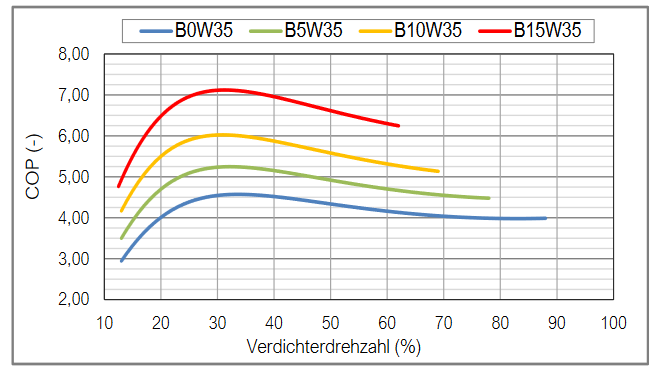

[^2]: [https://enrgi.de/wp-content/uploads/2022/08/Datenblatt_ecoGEO_B-C_1-9kW.pdf](https://enrgi.de/wp-content/uploads/2022/08/Datenblatt_ecoGEO_B-C_1-9kW.pdf)

The part-load behaviour depends also on the type of the heat pump (on-off or inverter heat pump), as shown for example in Bettanini2003[^Bettanini2003] or in Socal2021[^Socal2021]. For illustration, the following figure is taken from the latter reference to demonstrate the different part load factors of the COP (y-axis) at different part load ratios for different heat pump technologies:

Taking the correction factor curve from the figure above for inverter heat pumps, the maximum part load factor is reached at 50 % part load with an increas of the COP by about 10%. Contrary, in Toffanin2019[^Toffanin2019], the part load factor is assumed to be much higher, reaching its maximum at 25 % part load ratio with a part load factor of 2.1 (efficiency increase of 110 %). These discrepancies illustrate the wide range of literature data and the difficulty in finding a general part load curve. In Lachance2011[Lachance2021^], several part load curces are compared.

The figure above shows also the difference of the part load factor comparing on-off and inverter heat pumps as well as the defined on-off losses in DIN EN 14825 for the calculation of the seasonal coefficient of performance (SCOP).

As described in the section "General description of HP", the COP is defined as the ratio of the heat output \(\dot{Q}_{HP,out}\) and the electrical input power \(P_{el,HP}\). The shown curves for the part load factor affecs only the ratio of heat output to electrical input power and there is no information available on the acutal change of the two dimensions. Therefore, the heat output of the heat pump itself is assumed to be linear in part load operation between \(\dot{Q}_{HP,out,min}\) at \(PLF_{HP,min}\) and \(\dot{Q}_{HP,out,max}\) at PLR = 1.0 as shown in the figure below. This leads to a non-linear relation of the power input to the part load ratio that was found more relalistic as for inverter heat pumps, the observed efficiency change is mostly due to an efficiency change of the frequency converter and motor of the compressor. (QUELLE ToDo)

It is also important to note, that the typical PLF-curve for inverter-driven heat pumps is not invertible and can therefore not be used directly to calculate the PLR from PLF. Although, this needed for an operation strategy that uses limited availability or demand of the electrical or thermal power. To handle this problem, the PLF-curve is not used directly:

During preprocessing, the given curve of the PLF in dependece of the PLR (see orange curve in figure below as excample) is discretised. Then, the electrical input power (yellow curve) is calculated at each discretization using the assumption of a linear thermal power output (grey curve) in part load operation. As the relation of the power input to the thermal power output is defined by the COP that is changing in every timestept, any COP can be chosen for this initial calculation during the preprocessing. For this example, a COP of 4 is chosen. This process results in two value tables for the electrical input power and the thermal output power. The latter one is, according to the assumption made above, a straight line as shown in the figure.
 
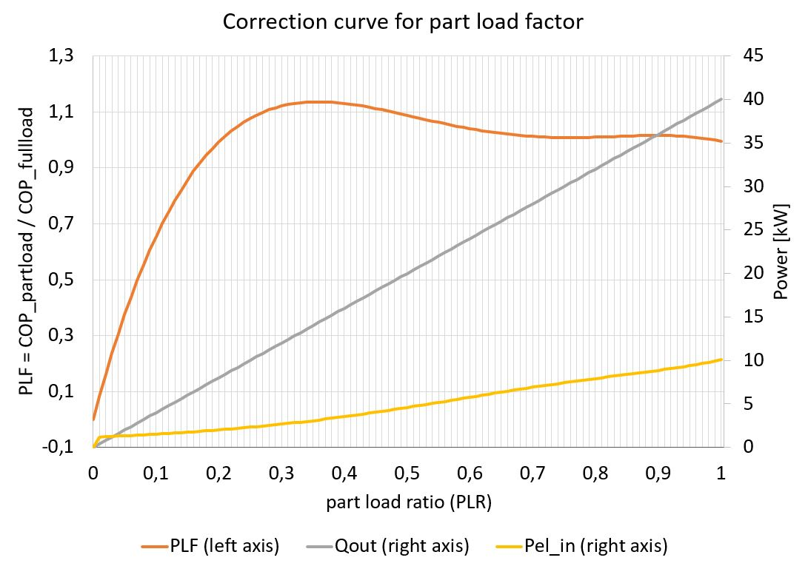

 Both value tables are then normalized to their maximum value as shown in the next figure. The thermal power input although can not be precalculated as it depends on the absolute difference of thermal output and electrical input power.  

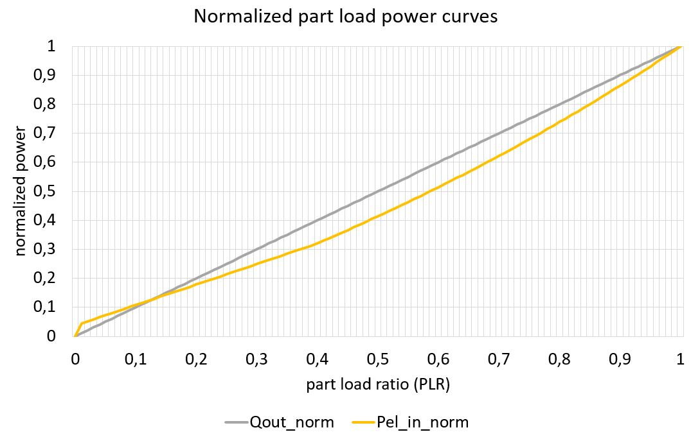

In every timestep, the two precomputed and normalized value tables of the thermal output and electrical input power are scaled up to the current maximum power, limited by the heat pump current full-load operation state. There, the actual COP at the current time step is represented in the ration of both values. The two scaled value tables can then be used to determine the actual PLF that is nececarry to cover the current demand or to limit the operation state due to the limited available eletrical power (interpolation on value table with known power, or interpolation in preprocessing). For the thermal output power, this is trivial as the ratio of the maximum thermal power output to the thermal power demand is equal to the PLF. To calculate the PLF for the thermal input power, if this is a limited source according to the operational strategy, the two scaled value tables need to be substracted from each other to get a third table: 

$$
\dot{Q}_{HP,in}(PLF) = \dot{Q}_{HP,out}(PLF) - P_{el,HP,in}(PLF)
$$

This third value table, generated in each timestep, can then be used to determine the maximum possible PLF according to the available thermal input power from a limited thermal power source. 

All three PLF (from thermal input and ouput as well as electrical input power) are then compared and the smallest one is chosen as operating state in the current timestep. If this value is smaller than the minimal allowed PLF of the heat pump \(PLF_{HP,min}\), the heat pump will not be in operation in the current timestep. 

This method avoids the need to invert polynomial functions at each timestep and is computationally more efficient.

The definition of the part load factor curve is user-defined and differentiated into inverter and on-off heat pumps.
The part load factor curve for inverter-driven heat pumps is based on Blervaque2015[^Blervaque2015] and Filliard2009[^Filliard2009]. There, the curve is defined in two separate sections. The section below the point of maximum efficiency is a function according to the part load factor calculation in DIN EN 14825 for water-based on-off heatpumps, differing from the cited paper but according to Fuentes2019[^Fuentes2019]. The section above the point of the maximum efficiency is approximated as straight curve. The definition of these curve can be done entering the cc-coefficient and the coordinates of the two points highlighed in the figure below. Here, cc is chosen as 0.95 and \(a\) is used to stretch the curve to meet the intersection point with the straight line.

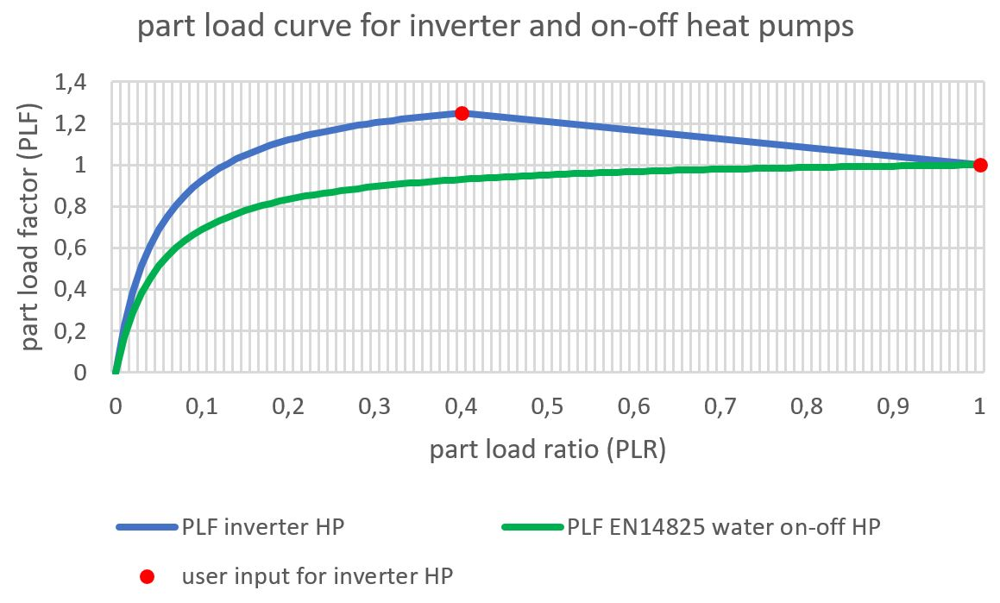

This results in the following equation to calculate the part load factor for inverter-driven heat pumps, defined by the coefficients cc and a according to DIN EN 14825, the point of maximum efficiency at (\(PLR_{max}\)/\(PLF_{max}\)) and the PLR_1 at PLF = 1:

$$
PLF(PLR) = 
\begin{cases}
a \ \frac{PLR}{cc \ PLR + (1 - cc)}  & \text{ for } PLR < PLR_{max} \\
\frac{PLF_1 - PLF_{max}}{1-PLR_{max}} \ ( PLR  -  PLR_{max} ) + PLF_{max}   & \text{ for } PLR >= PLR_{max} 
\end{cases} \\
\text{ with } a = \frac{PLF_{max}}{PLR_{max}} \left ( cc \ (PLR_{max}-1)+1  \right ) 
$$
 
For on-off heat pumps, \(a\) is set to 1 and the domain of the first equation above is set to the whole range of the PLR.

[^Socal2021]: Socal, Laurent (2021): Heat pumps: lost in standards, *REHVA Journal August 2021*.
[^Filliard2009]: Filliard, Bruno; Guiavarch, Alain; Peuportier, Bruno (2009): Performance evaluation of an air-to-air heat pump coupled with temperate air-sources integrated into a dwelling. *Eleventh International Building Simulation Conference 2009*, S. 2266–73, Glasgow.
[^Lachance2021]:Lachance, Alex; Tamasauskas, Justin; Breton, Stéphanie; Prud’homme, Solange (2021): Simulation based assessment on representativeness of a new performance rating procedure for cold climate air source heat pumps. *E3S Web Conf. 246, S. 6004.* doi: [10.1051/e3sconf/202124606004](https://doi.org/10.1051/e3sconf/202124606004).

#### Icing-losses of heat pumps with air as source medium

To account for icing losses of heat pumps with air as source medium, the approach presented in TRNSYS Type 401 is used[^Wetter1996]. When considering icing-losses, make sure that icing losses are not already included in the polynomes for thermal and electrical power!

For the calculation of icing losses, five coefficients are needed: \(c_{HP,ice,A}\), \(c_{HP,ice,B}\), \(c_{HP,ice,C}\), \(c_{HP,ice,D}\) and \(c_{HP,ice,E}\). According to the Type 401, icing losses are calculated using a superpositon of a gaussian curve with its maximum between 0 °C and 5 °C representing the maximum liklyhood of frost within the heat pump (high absolute humidity) and a linear curve, representing the higher sensible energy effort to heat-up the components of the heat pump for defrosting. Examplary curves are shown in the following figure (linear, gauss and superposition):

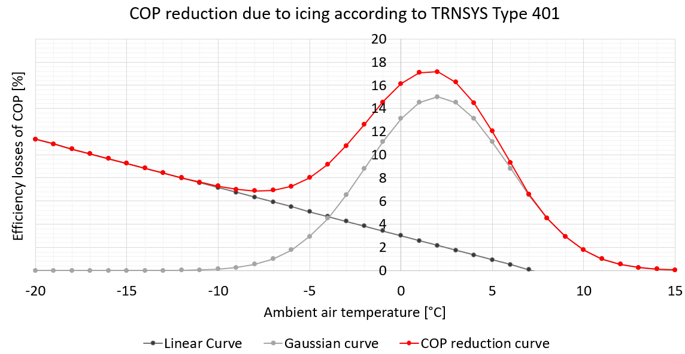

The examplary coeffients for the curves in the figure above are \(c_{HP,ice,A} = 3\), \(c_{HP,ice,B} = -0.42\), \(c_{HP,ice,C}=15\), \(c_{HP,ice,D}=2\), \(c_{HP,ice,E}=30\).

The resulting superposition, which represents the percentage loss of the COP due to icing as a function of ambient temperature, is expressed by the following formula, where the coefficients are reduced to the last letter for better readability:
$$
 \Delta COP_{ice,loss} = \begin{cases}
		A + B \ T_{HP,source,in} + C \ exp^{-\frac{(T_{HP,source,in}-D)^2}{E}} &\text{for } A + B \ T_{HP,source,in} > 0\ \\[5pt]
	    C \ exp^{-\frac{(T_{HP,source,in}-D)^2}{E}} &\text{for } A + B \ T_{HP,source,in} \leq 0\ \\	
	\end{cases} \\
$$

\(\Delta COP_{ice,loss}\) can then be used to reduce the COP for icing losses:

$$ COP_{ice,corrected} =  COP \ (1-\Delta COP_{ice,loss}) $$

Accoring to the results found in Wei2021[^Wei2021], it is assumed that the decrease of the COP due to icing losses will only increase the power input of the heat pump. It will not affect the thermal power output.

[^Wei2021]: Wei, Wenzhe et al. (2021): Investigation on the regulating methods of air source heat pump system used for district heating: Considering the energy loss caused by frosting and on–off. In: *Energy and Buildings 235*, S. 110731. doi: [10.1016/j.enbuild.2021.110731]((https://doi.org/10.1016/j.enbuild.2021.110731).

### Steps to perform in the simulation model of the heat pump
The calculation is based on TRNSYS Type 401[^Wetter1996] that is almost similar to Type 204[^Alfjei1996] (Type 204 provides an english documentation). The cycling losses of the heat pump in both TRNSYS models are calculated using an exponential function to describe the thermal capacity effecs during heat-up and cool-down. Here, these cycling losses will only be used during start and stop of the heat pump - actual cycling losses from on-off heatpumps will be considered separately in the process to allow the consideration of modulating heat pumps as well.

There are two different possibilities in calculating the full load power of the heat pump in dependence of \(T_{HP,sink,out}\) and \(T_{HP,source,in}\). An overview of the simulation steps and the required inputs are given in the following figure. A detailed description of the process shown in the figure is given below. Each of the main steps is described in more detail in the previous chapter.

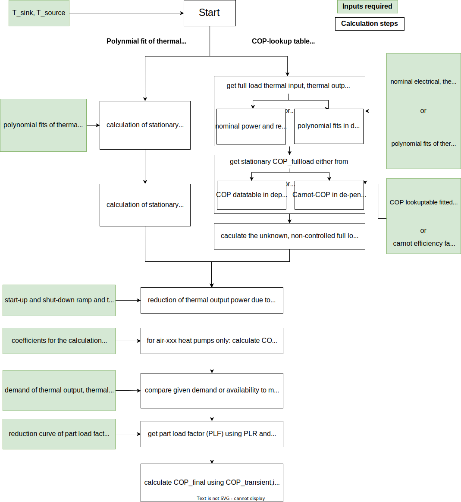

Steps to calculate the electrical and thermal energy in- and outputs of HP using a polynomial fit of the thermal and electrical power (compare to left side of figure above):

- using polynomial fits to calculate stationary thermal in- and output and electrical full-load power at given temperatures of \(T_{HP,sink,out}\) and \(T_{HP,source,in}\) for given nominal thermal power
    - differing source and sink medium: 
        - air-water
        - water-water
        - sole-water
    - differing temperature range: 
        - normale heat pump
        - high-temperature heat pump
    - polynomial fits have to be normalized to rated power at specified temperatures! Rated power has to be related always to the same temperature lift according to DIN EN 14511 --> different fits for normal (B10/W35, W10/W35, A10/W35) and high temperture (B35/W85, W35/W85) heat pumps  
- reduce thermal power output due to transient capacity effects during start-up as average over current time step and calculate COP\(_{transient}\) at full load with calculated thermal and electrical power
- may adjust COP\(_{transient}\) by icing losses for air-water and air-air heat pumps; calculate COP\(_{transient,ice}\), recalculate electrical input power
- get demand/availability of thermal or electrical energy (mind \(\eta_{HP,PE}\)!), differing if thermal and/or electric energy related operation strategy is chosen
- calculate smallest non-linear part-load ratio (PLR) with current demand and temperature-dependend, transient full-load power and precalculated value tables from PLF-curve, in dependency of heat pump type (inverter, on-off)
- calculate part-load thermal and electrical energy, recalculate COP\(_{transient,ice,partload}\)

If universal data table or the Carnot-COP reduced by an efficiency factor should be used instead of the more accurate model described above, a different calculation approach is needed (compare right side in the figure above):

- Get power at current temperatures
    - using nominal power without a temperature-dependency or
    - using polynomial fits to calculate stationary thermal **or** electrical full-load power at given temperatures of \(T_{HP,sink,out}\) and \(T_{HP,source,in}\), depending on control strategy (see above)
- get stationary full-load COP at given temperatures of \(T_{HP,sink,out}\) and \(T_{HP,source,in}\) either from
    - COP data table (fitted to polynome in pre-calculation) or
    - Carnot-COP reduced by an efficiency factor
- determine the unknown, non-controlled full load power (electrial or thermal) with known, controlled power and COP
- continue with transient capacity effects as described above

Contraty to the TRNSYS Type 401, the mass flow here is variable and not constant within two timesteps, therefore the \(T_{HP,sink,out}\) and \(\dot{Q}_{HP,sink,out}\) can be calculated directly without the need of iteration as implemented in Type 401. Here, the \(T_{HP,sink,out}\) is a fixed, user-specified value in the presented simplified model. 

The polynomes describing the temperature-depended thermal and electrical power of the heat pump need to be normalized to the power consumption at the rated operation point in order to be able to auto-scale the size in parameter variation studies. Therefore, the following steps are necessary:

- fit data to polynome for thermal and electrical energy
- calculate power at specified nominal temperatures with generated fitted polynome
- normalize polynome to calculated rated power at specific temperature using a fraction_factor

[^Wetter1996]: Wetter M., Afjei T.: TRNSYS Type 401 - Kompressionswärmepumpe inklusive Frost- und Taktverluste. Modellbeschreibung und Implementation in TRNSYS (1996). Zentralschweizerisches Technikum Luzern, Ingenieurschule HTL. URL: [https://trnsys.de/static/05dea6f31c3fc32b8db8db01927509ce/ts_type_401_de.pdf](https://trnsys.de/static/05dea6f31c3fc32b8db8db01927509ce/ts_type_401_de.pdf)

[^Alfjei1996]: Afjei T., Wetter M., Glass A. (1997): TRNSYS Type 204 - Dual-stage compressor heat pump including frost and cycl losses. Model description and implementation in TRNSYS, Versin 2. Zentralschweizerisches Technikum Luzern, Ingenieurschule HTL. URL: [https://simulationresearch.lbl.gov/wetter/download/type204_hp.pdf](https://simulationresearch.lbl.gov/wetter/download/type204_hp.pdf)

**Inputs und Outputs of the Heat Pump:**

Symbol | Description | Unit
-------- | -------- | --------
\(\dot{Q}_{HP,in}\) | heat flow supplied to the HP (heat source) | [W]
\(\dot{Q}_{HP,out}\) | heat flow leaving the HP (heat sink) | [W]
\(P_{el,HP}\) | electric power demand of the HP | [W]
\(P_{el,HP,supply}\) | electric power demand of the HP incl. losses of the power electronics | [W]
\(T_{HP,sink,in}\) | condenser inlet temperature - not used | [°C]
\(T_{HP,sink,out}\) | condenser outlet temperature | [°C]
\(T_{HP,source,in}\) | evaporator inlet temperature | [°C]
\(T_{HP,source,out}\) | evaporator outlet temperature - not used | [°C]

**Parameter of the Heat Pump:** 

Symbol | Description | Unit
-------- | -------- | --------
\(\dot{Q}_{HP,rated}\) | rated thermal energy output of heat pump at specified conditions |  [W]
\(\dot{Q}_{HP,max}(T_{HP,sink,out}, T_{HP,source,in})\) | (normalized) polynome of maximum full load thermal heat output at given temperatures | [W]
\(P_{el,HP,max}(T_{HP,sink,out}, T_{HP,source,in})\) | (normalized) polynome of maximum full load electrical power output at given temperatures | [W]
or ||
\(f_{HP,\dot{Q} reduction}\) | linear reduction factor for nominal full load thermal output power with respect to \(T_{HP,source,in}\) | [%/°C]
\(f_{HP,P_{el} reduction}\) | linear reduction factor for nominal full load electical input power with respect to \(T_{HP,sink,out}\) | [%/°C]
\(COP_{HP}(T_{HP,sink,out}, T_{HP,source,in})\) | coefficient of performance (COP) of the heat pump depending on \(T_{HP,sink,out}\) and \(T_{HP,source,in}\) | [-]
\(\eta_{Carnot}\) | efficiency factor of heat pump, reduces the Carnot-COP | [-]
and | |
\(PL_{HP,min}\) | minimum possible part load of the heat pump |  [%]
\(PLR_{HP,max}\) | part load ratio at point of maximum efficiency (inverter only) |  [-]
\(PLF_{HP,max}\) | part load factor at point of maximum efficiency (inverter only) |  [-]
\(PLF_{HP,PLR=1}\) | part load factor at part load ratio = 1 (inverter only) | [-]
\(cc_{HP}\) | coefficient for part load curve according to DIN EN 14825 | [-]
\(c_{HP,ice,A} \ : \ c_{HP,ice,E}\) | five coefficients for curve with icing losses according to TRNSYS Type 401 (air heat pump only) | [-]
\(\eta_{HP,PE}\) | efficiency of power electronics of heat pump | [-]
\(MOT_{HP}\) | minimum operating time of heat pump | [min]
\(SUT_{HP}\) | start-up time of the HP until full heat supply (linear curve) | [min]
\(CDT_{HP}\) | cool-down time of the HP from full heat supply to ambient (linear curve) | [min]

**State Variables of Heat Pump:**

Symbol | Description | Unit
-------- | -------- | --------
\(x_{HP}\)  | current operating state (on, off, part load)   | [%]

## Electrolyser
The electrolyzer uses electrical energy to split water into its components hydrogen (\(H_2\)) and oxygen (\(O_2\)) as shown in the following reaction equation: 

$$ 2 \ H_2O \rightarrow 2 \ H_2 + O_2 $$

If the electrical energy is provided by renewable energies, the resulting hydrogen is labeled as "green hydrogen" and can be used to decarbonize the mobility or industrial sector or fed into the natural gas grid. The waste heat generated in the process can be used directly by feeding it into a heat network or via an intermediate heat pump. For flexible operation, it is possible to discharge the waste heat to the environment using a chiller. The use of waste heat is an important factor for the overall efficiency of the electrolyzer. 

The general energy and mass flow in the electrolyser as well as the losses considered in the model can be seen in the following figure.

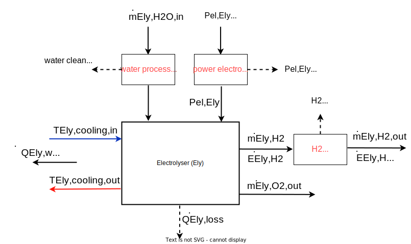

The relationship between supplied hydrogen of the electrolysis (energy (\(\dot{E}_{Ely,H_2}\)) or mass flow (\(\dot{m}_{Ely,H_2}\))) and the consumption of electrical energy (\( P_{el,Ely} \)) is given in the following equation, where \(e_{H_2}\) can be either the net or the gross calorific value of the hydrogen:
$$
\begin{align}
\dot{E}_{Ely,H_2}=  P_{el,Ely} \enspace \eta_{Ely,H_2}
\end{align}
$$

$$ 
\begin{equation}
\dot{m}_{Ely,H_2} =  \frac{\dot{E}_{Ely,H_2}}{e_{H_2}} 
\end{equation}
$$

Due to the purification losses of the hydrogen caused by the reduction of oxygen molecules contained in the hydrogen gas in the catalyst, depending on the electrolysis technology, the actually obtained hydrogen energy or mass flow is reduced by the proportion of the hydrogen losses \(\eta_{H_2 \ purification}\) to the energy or mass flows, supplemented with index \(out\):
$$ \dot{E}_{Ely,H_2,out}=  (1-\eta_{H_2 \ purification}) \ \dot{E}_{Ely,H_2} $$

$$ \dot{m}_{Ely,H_2,out} = (1-\eta_{H_2 \ purification}) \ \dot{m}_{Ely,H_2} $$

Conversely, by rearranging and substituting the previous equations from a required hydrogen mass flow, the electrical power consumption can be calculated as follows:
$$ P_{el,Ely} =  \frac{\dot{m}_{Ely,H_2,out} \ e_{H_2}}{\eta_{Ely,H_2} \ (1 - \eta_{H_2 \ purification})}  $$

The usable waste heat from the electrolysis process \(\dot{Q}_{Ely,waste heat}\) is determined, depending on the available information, as
$$\dot{Q}_{Ely,waste heat} = \eta_{Ely,heat} \enspace (1-\eta_{Ely,H_2}) \enspace P_{el,Ely} = \frac{(1 - \eta_{Ely,H_2}) \ \eta_{Ely,heat} } { (1 - \eta_{H_2 \ purification}) \ \eta_{Ely,H_2} } \ \dot{E}_{Ely,H_2,out} $$ 

With an increase of operation time, the efficiency in hydrogen production of the stacks of electrolysers is decreasing while the efficiency of heat production is increased. This is due to degradation effects in the stacks. This effect of aging of the stack cells can be expressed by an correction factor for each the hydrogen (\(\delta_{Ely,H_2} < 0\)) and the heat (\(\delta_{Ely,heat}\) > 0) related efficiency. These correction factors are given in the change of percentage points per tenthousand full load hours (FLH), where the full load hours are determined by dividing the total hydrogen produced by the nominal hydrogen output of the electrolyer. The efficiencies of hydrogen and heat production are therefore corrected in every timestep using the nominal efficiency at the point of the beginning of life of the electrolyser, the correction factors and the passed FLH.

$$ \eta_{Ely,H_2} = \eta_{Ely,H_2,start} + \left ( \frac{\delta_{Ely,H_2}}{100} \ {\frac{FLH}{10.000}} \right )$$
$$ \eta_{Ely,heat} = \eta_{Ely,heat,start} + \left ( \frac{\delta_{Ely,heat}}{100} \ {\frac{FLH}{1.000}} \right ) $$
$$ \text{with } FLH = \frac{\text{total hydrogen produced since start [kg]}}{\text{nominal hydrogen production [kg]}} $$

Keep in mind: Test if sum of efficiencies will reach values > 1 or if one efficiency falls below zero for the given maximum changing intervall of the stacks (ToDo)

With a known mass flow \(\dot{m}_{HP,cool}\) and the specific heat capacity of the heat transfer medium of the heat recovery \(c_{p,cool}\) as well as a known inlet temperature \(T_{Ely,cool,in}\), the outlet temperature of the heat transfer medium from the cooling circuit \(T_{Ely,cool,out}\) can be determined by rearranging the following equation:
$$\dot{Q}_{Ely,waste heat} = \dot{m}_{HP,cool} \enspace c_{p,cool} \enspace (T_{Ely,hot,out} - T_{Ely,cool,in})$$

The heat loss \(\dot{Q}_{Ely,loss}\), which cannot be used and is dissipated to the environment via heat transport mechanisms, is calculated as follows

$$  \dot{Q}_{Ely,loss} = P_{el,Ely} - \dot{Q}_{Ely,waste heat} - \dot{E}_{Ely,H_2} \\ =  P_{el,Ely} \ (1 - \eta_{Ely,heat} + \eta_{Ely,heat} \ \eta_{Ely,H_2} - \eta_{Ely,H_2}) $$

The actual needed power supply of the electrolyzer \(P_{el,Ely,supply}\) increases by losses in the power electronics and results from the electrical reference power \(P_{el,Ely}\) and the losses in the power electronics \(\eta_{Ely,PE}\) to
$$ P_{el,Ely,supply} = \frac{P_{el,Ely}}{\eta_{Ely,PE}} $$

Since the oxygen produced during the electrolysis process can also be utilized economically under certain circumstances, the resulting oxygen mass flow \(\dot{m}_{Ely,O_2,out}\) is determined from the stoichiometric ratio of the reaction equation of the water splitting described at the beginning:

$$  \dot{m}_{Ely,O_2,out} =  v_{O_2,H_2} \enspace  \dot{m}_{Ely,H_2} $$
$$ \text{with} \quad v_{O_2,H_2} = \frac{atomic \ mass \ O_2}{atomic \ mass \ 2 \ H_2} = \frac{2 * 15,9990 \ u}{2*2*1,0008 \ u} = 7,9386 $$

The required mass flow of water \(\dot{m}_{Ely,H_2O,in}\) can be determined from the supplied masses of hydrogen and oxygen and the purification losses in the water treatment unit, characterized by the fraction of purification losses \(\eta_{H_2O \ treatment}\).
$$ \dot{m}_{Ely,H_2O,in} = \frac{\dot{m}_{Ely,H_2}  + \dot{m}_{Ely,O_2,out}}{1- \eta_{H_2O \ treatment}} $$

**Assumption:** The electrolyzer is only operated between minimum 0 % and maximum 100 % load. A specification of power above nominal power, which frequently occurs in practice, is not supported. 

**Inputs and Outputs of the Electrolyser:**

Symbol | Description | Unit
-------- | -------- | --------
\(P_{el,Ely}\)   | electrical power requirement of the electrolyser   | [W]
\(P_{el,Ely,supply}\)   | electrical power requirement of the electrolyser incl. losses of power electronics   | [W]
\(\dot{m}_{Ely,H_2O,in}\)  | water mass flow fed to the electrolyser  | [kg/h]
\(\dot{m}_{Ely,O_2,out}\)  | oxygen mass flow delivered by the electrolyser  | [kg/h]
\(\dot{m}_{Ely,H_2}\)  | hydrogen mass flow produced by the electrolyser (before \(H_2\)-cleaning losses)  | [kg/h]
\(\dot{m}_{Ely,H_2,out}\)  | hydrogen mass flow provided by the electrolyser (after \(H_2\)-cleaning losses)  | [kg/h]
\(\dot{E}_{Ely,H_2}\)  | hydrogen energy flow discharged from the electrolyser (before \(H_2\)-cleaning losses) | [W]
\(\dot{E}_{Ely,H_2,out}\)  | hydrogen energy flow provided by the electrolyser \(after (H_2\)-cleaning losses) | [W]
\(T_{Ely,cooling,in}\)   | cooling fluid inlet temperature of electrolyser   | [°C]
\(T_{Ely,cooling,out}\)   | cooling fluid outlet temperature of electrolyser   | [°C]
\(\dot{Q}_{Ely,waste heat}\)  | waste heat provided by the electrolyser  | [W]
\(\dot{Q}_{Ely,loss}\)  | thermal losses in elektrolyser (unused waste heat))  | [W]

**Parameter of the Electrolyser:**

Symbol | Description | Unit
-------- | -------- | --------
\(P_{el,Ely,rated}\) | electric power consumption of the electrolyser under full load (operating state 100 %) | [W]
\(\eta_{Ely,H_2,start}(x_{Ely},P_{el,Ely,rated})\) | efficiency of hydrogen production of the electrolyser (\(\dot{E}_{Ely,H_2,out}\) related to \(P_{el,Ely}\) as a function of operating state, plant size and plant type at the beginning of live) | [-]
\(\eta_{Ely,heat,start}\) | efficiency of the usable heat extraction of the electrolyzer (related to \(1-\eta_{Ely,H_2}\) at the beginning of live)   | [-]
\(\delta_{Ely,H_2}\) | linear decrease of efficiency of hydrogen production due to degradation per 10.000 full load hours, typically < 0  | \(\left [ \frac{\%-points}{\text{10.000 full load hours}}\right ]\) 
\(\delta_{Ely,heat}\) | linear increase of efficiency of heat production due to degradation per 10.000 full load hours, typically > 0  | \(\left [ \frac{\%-points}{\text{10.000 full load hours}}\right ]\)
\(\eta_{Ely,LE}\) | efficiency of the power electronics of the electrolyser | [-]
\(PL_{Ely,min}\) | minimum allowed partial load of the electrolyzer | [-]
\(MOT_{Ely}\) | minimum operating time of the electrolyser | [min]
\(SUT_{Ely}\) | start-up time of the electrolyser until full heat supply (linear curve) | [min]
\(CDT_{Ely}\) | cool-down time of the electrolyser from full heat supply to ambient (linear curve) | [min]
\(e_{H_2} \) | mass-dependent energy of hydrogen (net calorific value or gross calorific value)
\(v_{O_2,H_2} \) | stoichiometric mass-based ratio of oxygen and hydrogen supply during electrolysis | [kg \(O_2\) / kg \(H_2\)]
\(\eta_{H_2 \ purification} \) | percentage of purification losses in hydrogen purification | [%]
\(\eta_{H_2O \ treatment} \) | percentage of purification losses in water treatment | [%]
\(p_{H_2,Ely} \) | pressure of hydrogen supply | [bar]
\(p_{O_2,Ely} \) | pressure of oxygen supply | [bar]
\(T_{Ely,cooling,in,max}\) | max. allowed temperature of cooling medium input | [°C]

**State variables of the Electrolyser:**

Symbol | Description | Unit
-------- | -------- | --------
\(x_{Ely}\)  | current 	operating state (on, off, part load)   | [%]

## Combined heat and power plant (CHP)
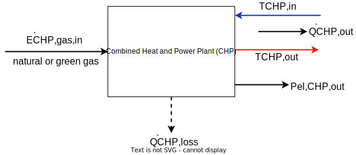

<!---
Definiton of power-to-heat ratio of CHP:
$$ r_{CHP,PTH} = \frac{\eta_{CHP,el}}{\eta_{CHP,thermal}} = \frac{P_{el,CHP,rated}}{\dot{Q}_{CHP,rated}}  $$
-->
Energy balance on CHP:
$$  \dot{E}_{CHP,gas,in} = P_{el,CHP,out} + \dot{Q}_{CHP,out} + \dot{Q}_{CHP,loss} $$ 

Calculation of electric power output:
$$  P_{el,CHP,out} = \eta_{CHP,el} \ \dot{E}_{CHP,gas,in}   $$ 

Calculation of thermal power output:
$$  \dot{Q}_{CHP,out} = \eta_{CHP,thermal} \ \dot{E}_{CHP,gas,in}   $$ 

Calculation of thermal losses in CHP:
$$ \dot{Q}_{CHP,loss} = (1-\eta_{CHP,thermal}+\eta_{CHP,el}) \ \dot{E}_{CHP,gas,in} $$

Relation of electric and thermal power output:
$$ P_{el,CHP,out} = \frac{\eta_{CHP,el}}{\eta_{CHP,thermal}} \ \dot{Q}_{CHP,out} =  r_{CHP,PTH}  \ \dot{Q}_{CHP,out}  $$

The part-load dependend efficiency as described in the chapter "general transient effects" can be considered as well.

**ToDo:** part-load dependend efficiency definition with heat and electricity --> two efficiency curves? One efficiency curve and the second one related to the first one?
Part load curve e.g in Urbanucci2019[^Urbanucci2019]

[^Urbanucci2019]: Urbanucci, Luca; Testi, Daniele; Bruno, Joan Carles (2019): Integration of Reversible Heat Pumps in Trigeneration Systems for Low-Temperature Renewable District Heating and Cooling Microgrids. *Applied Sciences 9 (15), S. 3194.*, doi: [10.3390/app9153194](https://doi.org/10.3390/app9153194).

**Inputs and Outputs of the CHP:**

Symbol | Description | Unit
-------- | -------- | --------
\(P_{el,CHP,out}\) | electric power output of the CHP | [W]
\(P_{el,CHP}\) | electric power provided by the CHP | [W]
\(\dot{Q}_{CHP,out}\) | thermal power output of the CHP | [W]
\(\dot{E}_{CHP,gas,in}\) | energy demand of the CHP, natural or green gas (NCV or GCV)  | [W]
\(\dot{Q}_{CHP,loss}\) | thermal energy losses of the CHP | [W]

**Parameter of the CHP:**

Symbol | Description | Unit
-------- | -------- | --------
\(P_{el,CHP,rated}\) | rated electric power output of the CHP under full load (operating state 100 %) | [W]
\(\dot{Q}_{CHP,rated}\) | rated thermal power output of the CHP under full load (operating state 100 %) | [W]
\(\eta_{CHP,thermal}(PLR)\) | thermal efficiency of CHP, function of PLR (regading NCV or GCV, needs to correspond to \(\dot{E}_{CHP,gas,in}\)) | [-]
\(\eta_{CHP,el}(PLR)\) | electrical efficiency of CHP, including self-use of electrical energy, function of PLR (regading NCV or GCV, needs to correspond to \(\dot{E}_{CHP,gas,in}\)) | [-]
\(PL_{CHP,min}\) | minimum allowed partial load of the CHP | [-]
\(MOT_{CHP}\) | minimum operating time of the CHP | [min]
\(SUT_{CHP}\) | start-up time of the CHP until full heat supply (linear curve) | [min]
\(CDT_{CHP}\) | cool-down time of the CHP from full heat supply to ambient (linear curve) | [min]

**State variables of the CHP:**

Symbol | Description | Unit
-------- | -------- | --------
\(x_{CHP}\)  | current operating state of the CHP (on, off, part load)   | [%]

## Gas boiler (GB)
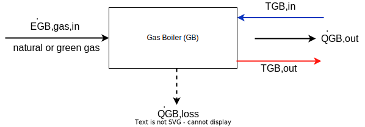

Energy balance of gas boiler:
$$  \dot{Q}_{GB,out} = \dot{E}_{GB,gas,in} - \dot{Q}_{GB,loss} = \eta_{GB}(PLR) \ \dot{E}_{GB,gas,in}   $$

**Inputs and Outputs of the GB:**

Symbol | Description | Unit
-------- | -------- | --------
\(\dot{Q}_{GB,out}\) | thermal power output of the GB | [W]
\(\dot{E}_{GB,gas,in}\) | energy demand of the GB, natural or green gas (NCV or GCV)  | [W]
\(\dot{Q}_{GB,loss}\) | thermal losses of the GB | [W]

**Parameter of the GB:**

Symbol | Description | Unit
-------- | -------- | --------
\(Q_{GB,rated}\) | rated thermal power output of the GB under full load (operating state 100 %) | [W]
\( \eta_{GB}(PLR)\) | thermal efficiency of gas boiler (regading NCV or GCV) with respect to the PLR | [-]
\(PL_{GB,min}\) | minimum allowed partial load of the GB | [-]
\(MOT_{GB}\) | minimum operating time of the GB | [min]
\(SUT_{GB}\) | start-up time of the GB until full heat supply (linear curve) | [min]
\(CDT_{GB}\) | cool-down time of the GB from full heat supply to ambient (linear curve) | [min]

**State variables of the GB:**

Symbol | Description | Unit
-------- | -------- | --------
\(x_{GB}\)  | current operating state of the GB (on, off, part load)   | [%]

## Oil heating (OH)

Energy balance of oil heater:
$$  \dot{Q}_{OH,out} = \dot{E}_{OH,oil,in} - \dot{Q}_{OH,loss} = \eta_{OH}(PLR) \ \dot{E}_{OH,oil,in}   $$

**Inputs and Outputs of the OH:**

Symbol | Description | Unit
-------- | -------- | --------
\(\dot{Q}_{OH,out}\) | thermal power output of the OH | [W]
\(\dot{E}_{OH,oil,in}\) | energy demand of the OH, fuel oil (NCV or GCV)  | [W]
\(\dot{Q}_{OH,loss}\) | thermal losses of the OH | [W]

**Parameter of the OH:**

Symbol | Description | Unit
-------- | -------- | --------
\(Q_{OH,rated}\) | rated thermal power output of the OH under full load (operating state 100 %) | [W]
\( \eta_{OH}(PLR)\) | thermal efficiency of oil heater (regading NCV or GCV) with respect to the PLR | [-]
\(PL_{OH,min}\) | minimum allowed partial load of the OH | [-]
\(MOT_{OH}\) | minimum operating time of the OH | [min]
\(SUT_{OH}\) | start-up time of the OH until full heat supply (linear curve) | [min]
\(CDT_{OH}\) | cool-down time of the OH from full heat supply to ambient (linear curve) | [min]

**State variables of the OH:**

Symbol | Description | Unit
-------- | -------- | --------
\(x_{OH}\)  | current operating state of the OH (on, off, part load)   | [%]

## Elecric heating rod (ER)
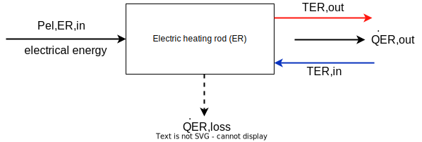

Energy balance of electric heating rod:
$$  \dot{Q}_{ER,out} = \dot{P}_{ER,el,in} - \dot{Q}_{ER,loss} = \eta_{ER}(PLR) \ \dot{P}_{ER,el,in}   $$

**Inputs and Outputs of the ER:**

Symbol | Description | Unit
-------- | -------- | --------
\(\dot{Q}_{ER,out}\) | thermal power output of the ER | [W]
\(\dot{P}_{ER,el,in}\) | electrical energy demand of the ER  | [W]
\(\dot{Q}_{ER,loss}\) | thermal losses of the ER | [W]

**Parameter of the ER:**

Symbol | Description | Unit
-------- | -------- | --------
\(Q_{ER,rated}\) | rated thermal power output of the ER under full load (operating state 100 %) | [W]
\( \eta_{ER}(PLR)\) | thermal efficiency of electric heating rod with respect to the PLR | [-]
\(PL_{ER,min}\) | minimum allowed partial load of the ER | [-]
\(MOT_{ER}\) | minimum operating time of the ER | [min]
\(SUT_{ER}\) | start-up time of the ER until full heat supply (linear curve) | [min]
\(CDT_{ER}\) | cool-down time of the ER from full heat supply to ambient (linear curve) | [min]

**State variables of the ER:**

Symbol | Description | Unit
-------- | -------- | --------
\(x_{ER}\)  | current operating state of the ER (on, off, part load)   | [%]

## Biomass boiler (BB)
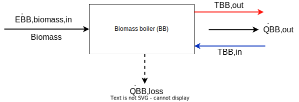

Energy balance of biomass boiler:
$$  \dot{Q}_{BB,out} = \dot{E}_{BB,biomass,in} - \dot{Q}_{BB,loss} = \eta_{BB}(PLR) \ \dot{E}_{BB,biomass,in}   $$

**Inputs and Outputs of the BB:**

Symbol | Description | Unit
-------- | -------- | --------
\(\dot{Q}_{BB,out}\) | thermal power output of the BB | [W]
\(\dot{E}_{BB,biomass,in}\) | energy demand of the BB, biomass (NCV or GCV)  | [W]
\(\dot{Q}_{BB,loss}\) | thermal losses of the BB | [W]

**Parameter of the BB:**

Symbol | Description | Unit
-------- | -------- | --------
\(Q_{BB,rated}\) | rated thermal power output of the BB under full load (operating state 100 %) | [W]
\( \eta_{BB}(PLR)\) | thermal efficiency of biomass boiler (regading NCV or GCV, specific fuel and  moisture content) with respect to the PLR | [-]
\(PL_{BB,min}\) | minimum allowed partial load of the BB | [-]
\(MOT_{BB}\) | minimum operating time of the BB | [min]
\(SUT_{BB}\) | start-up time of the BB until full heat supply (linear curve) | [min]
\(CDT_{BB}\) | cool-down time of the BB from full heat supply to ambient (linear curve) | [min]

**State variables of the BB:**

Symbol | Description | Unit
-------- | -------- | --------
\(x_{BB}\)  | current operating state of the BB (on, off, part load)   | [%]

## Heat sources 
### Soil
- geothermal probes
- geothermal collector 
- geothermal basket collector
- geothermal trensh collector
- geothermal spiral collector
- (sheet pile wall)

Regernation von Wärmequellen --> Erdwärmesonden sind eher Speicher als Wärmequellen

### Water
- groundwater well
- surface waters: Temperature regression from measurement data: Harvey2011
- waste heat from industrial processes
- wastewater
- solar thermal collector

### Air 
- ambient air
- exhaust air
- hot air absorber

### External source
- district heating network

(Vergleich FutureHeatPump II Projekt)

## Chiller
### Simple model of compression  chiller (SCC)
A simple model of an air cooled compression chiller is implementent to account for rather irrelevant cooling demands without significant changes in temperatures of the energy to be cooled. This model is a rough approximation, but offers a fast and easy calculation. It is based on a constant seasonal energy efficiency ratio (SEER) as yearly average of the energy efficiency ratio (EER) without part-load dependend or temperature dependend efficiency. The energy flow chart is given below. The displayed temperature are only for illustration and will not be considered in this simple model.

The SEER is defined as

\( SEER =  \text{yearly average of} \ \frac{\text{cooling power} \ \dot{Q}_{SCC,in}}{\text{electricity demand} \ P_{el,SCC,supply}}  \)

Comparing the definition of the EER to the COP given in the chaper of heat pumps, the following relation of the two efficiencies for heat pumps and compression chillers can be obtained

\(EER = COP - 1 \)

In this simple model, a constant SEER is given and set equivalent to the EER in every timestep to calculate the electrical power \(P_{el,SCC,supply}\) needed to cool down a given amount of thermal energy \(Q_{SCC,in}\) in every timestep:

\(P_{el,SCC,supply} = \frac{\dot{Q}_{SCC,in}}{EER}  \)

The thermal output power, calculated from the energy balance of the chiller

\(\dot{Q}_{SCC,out} = P_{el,SCC,supply} + \dot{Q}_{SCC,in} = \dot{Q}_{SCC,loss}\),

is transferred to the environment by an air cooler and labeled as losses.

**Inputs and Outputs of the SCC:**

Symbol | Description | Unit
-------- | -------- | --------
\(\dot{Q}_{SCC,out}\) | thermal power output of the SCC to the ambient air (= \(\dot{Q}_{SCC,losses}\)) | [W]
\(\dot{Q}_{SCC,in}\) | thermal power input into the SSC, equals the thermal cooling power | [W]
\(P_{el,SCC,in}\) | electrical energy power input in the SCC | [W]

**Parameter of the SCC:**

Symbol | Description | Unit
-------- | -------- | --------
\(SEER_{SSC}\) | Seasonal energy efficiency ratio (SEER) of the compresson chiller (= constant for all temperatures and part-load)| [-]
\(Q_{SCC,in,rated}\) | rated thermal power input of the SCC under full load | [W]
\(PL_{SSC,min}\) | minimum allowed partial load of the SCC with respect to \(\dot{Q}_{SCC,in}\) | [-]

**State variables of the SSC:**

Symbol | Description | Unit
-------- | -------- | --------
\(x_{SSC}\)  | current operating state of the SSC (on, off, part load)   | [%]

### General model for compression chiller (CC)
The general model of a compression chiller, including a part-load dependent and temperature dependent efficiency, is modeled in the same way as the heat pump described in the chapter "Heat pump". Instead of defining the thermal energy output as useful energy, the thermal energy input is defined as useful energy. Accordingly, the efficiency is described differently, as EER for the compression chiller instead of COP for heat pumps (see also the section above on the definition of EER).

### General model for absorption/adsorption chiller (AAC)

Absorption/adsorption chiller are not implemented yet (ToDo).

## Short-term thermal energy storage (STTES)
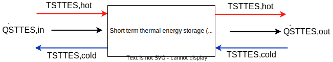

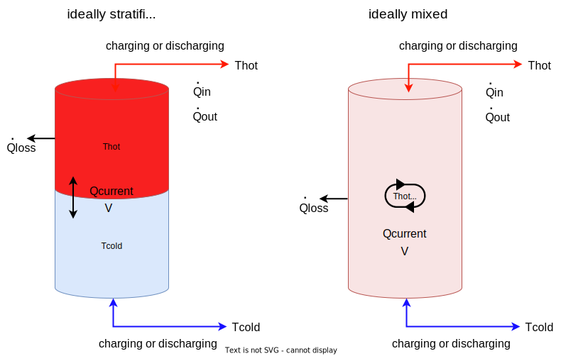

The short-term energy storage is a simplified model without thermal losses to the ambient. It consists of two adiabatically separated temperature layers, represented as an ideally stratified storage without any interaction between the two layers. This model was chosen to keep the computational effort as small as possible. If a more complex model is needed, the seasonal thermal energy storage can be used that is including energy and exergetic losses.

The rated thermal energy content \(Q_{STTES,rated}\) of the STTES can be calculated using the volume \(V_{STTES}\), the density \(\rho_{STTES}\), the specific thermal capacity of the medium in the storage \(cp_{STTES}\) and the temperature span within the STTES:
$$ Q_{STTES,rated} = V_{STTES} \ \rho_{STTES} \ cp_{STTES} \ (T_{STTES,hot} - T_{STTES,cold}) $$

The amount of the total input (\(Q_{STTES,in,t}\)) and output energy (\(Q_{STTES,out,t}\)) in every timestep is defined as
$$  Q_{STTES,in,t} = \dot{Q}_{STTES,in,t} \ \Delta t = \dot{m}_{STTES,in} \ cp_{STTES} \ (T_{STTES,hot} - T_{STTES,cold}) \ \Delta t $$
and
$$  Q_{STTES,out,t} = \dot{Q}_{STTES,out,t} \ \Delta t = \dot{m}_{STTES,out} \ cp_{STTES} \ (T_{STTES,hot} - T_{STTES,cold}) \ \Delta t. $$

The current charging state \(x_{STTES,t+1}\) can be calculated using the following equation and the charging state of the previous timestep (\(x_{STTES,t}\)) as well as the input and output energy
$$ x_{STTES,t+1} = x_{STTES,t} + \frac{Q_{STTES,in,t} - Q_{STTES,out,t}}{Q_{STTES,rated}}   $$

leading to the total energy content in every timestep as
$$ Q_{STTES,t} = Q_{STTES,rated} \ x_{STTES,t}. $$

The limits of the thermal power in- and output (\(\dot{Q}_{STTES,in}\) and \(\dot{Q}_{STTES,out}\)) due to the current energy content and maximum c-rate of the STTES are given as
$$ \frac{Q_{STTES,rated} - {Q}_{STTES}}{\Delta \ t}  \stackrel{!}{\geq}   \dot{Q}_{STTES,in} \stackrel{!}{\leq}  c_{STTES,max,load} \ Q_{STTES,rated}  $$
$$ \frac{{Q}_{STTES}}{\Delta \ t}  \stackrel{!}{\geq}   \dot{Q}_{STTES,out} \stackrel{!}{\leq}  c_{STTES,max,unload} \ Q_{STTES,rated}  $$

**Inputs and Outputs of the STTES:**

Symbol | Description | Unit
-------- | -------- | --------
\(\dot{Q}_{STTES,in}\) | thermal power input in the STTES | [W]
\(\dot{Q}_{STTES,out}\) | thermal power output of the STTES | [W]
\(\dot{m}_{STTES,in}\)  | current mass flow rate into the STTES | [kg/h]
\(\dot{m}_{STTES,out}\)  | current mass flow rate out of the STTES | [kg/h]

**Parameter of the STTES:**

Symbol | Description | Unit
-------- | -------- | --------
\(c_{STTES,max,load}\) | maximum charging rate (C-rate) of STTES | [1/h]
\(c_{STTES,max,unload}\) | maximum discharging rate (C-rate) of STTES | [1/h]
\(Q_{STTES,rated}\)  | rated thermal energy capacity of the STTES | [MWh]
\(x_{STTES,start}\)  | thermal energy contend of the STTES at the beginning of the simulation in relation to \(Q_{STTES,rated}\)  | [%]
\(V_{STTES}\)  | volume of the STTES | [m\(^3\)]
\(\rho_{STTES}\)  | densitiy of the heat carrier medium in the STTES | [kg/m\(^3\)]
\(cp_{STTES}\)  | specifiy heat capacity of the heat carrier medium in the STTES | [kJ/(kg K)]
\(T_{STTES,hot}\)  | rated upper temperature of the STTES | [°C]
\(T_{STTES,cold}\)  | rated lower temperature of the STTES | [°C]

**State variables of the STTES:**

Symbol | Description | Unit
-------- | -------- | --------
\({Q}_{STTES}\)  | current amount of thermal energy stored in the STTES | [MWh]
\(x_{STTES}\)  | current charging state of the STTES   | [%]

## Seasonal thermal energy storage (STES)
Seasonal thermal energy storages can be used to shift thermal energy from the summer to the heating period in the winter. Due to the long storage period, energy losses to the environment and exergy losses within the storage must be taken into account. Therefore, a stratified thermal storage model is implemented that is described below.

### Tank (TTES) and Pit (PTES) thermal energy storage 

Neglected: Thermal capacity of the surrounding soil, gravel-water storages

#### Generalized geometry for TTES and PTES
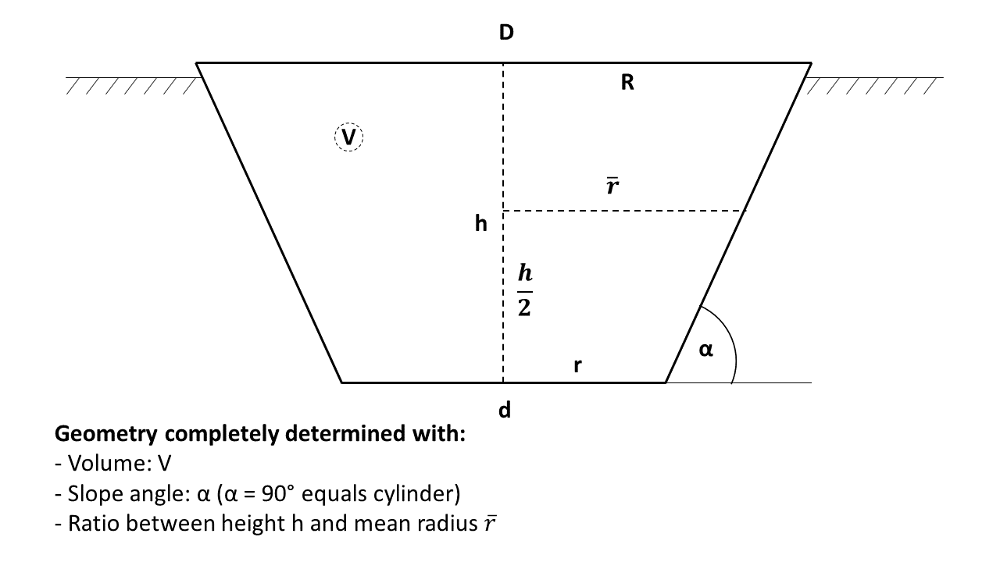
Figure and method of generalized geometry definition based on [Steinacker2022][^Steinacker2022].

Ratio between height and mean radius of the STES:
$$ hr_{STES} = \frac{h_{STES}}{\bar{r}_{STES}}  = \frac{h_{STES}}{\frac{R_{STES}+r_{STES}}{2}} $$ 

Upper radius of the STES in dependence of the Volume and \(hr_{STES}\):
$$
R_{STES} = \sqrt[3]{ \frac{3 \ V_{STES}}{\pi \ \tan(\alpha_{STES})  \ \left( 1 - \beta^3 \right) } }   \quad \mathrm{with} \quad  \beta = \frac{2 \ \tan(\alpha_{STES}) - hr_{STES}}{2 \ \tan(\alpha_{STES})+hr_{STES}}
$$
Lower radius of the STES in dependence of the upper radius \(R_{STES}\):
$$ r_{STES} = R_{STES}  \ \beta $$

Slope angle has to be in the range of
$$    180° - \arctan{\left(\frac{hr_{STES}}{2} \right)}	\geq \alpha_{STES} \geq \arctan{\left(\frac{hr_{STES}}{2} \right)} $$
to ensure the shape of a zylinder, a cone or a truncated cone. Analogously, the ratio beween the height and the mean radius of the STES \(hr_{LZWSP}\) has to be smaller as
$$	hr_{LZWSP} \leq 2 \ \tan(\alpha_{LZWSP}) \mathrm{\quad with \quad}   0 ° < \alpha_{LZWSP} < 90 ° $$

The heigt of the STES can be calculated as
$$ h_{STES} = hr_{STES} \ \frac{R_{STES}+r_{STES}}{2}   $$
resulting with the number of layers \(n_l\) into the thickness of each layer
$$ \Delta z_{l} = \frac{h_{STES}}{n_l} = \text{constant for all layers} $$

Lateral surface of each layer with heigt \(h_l\), upper radius \(R_l\) and lower radius \(r_l\) of each layer:
$$ M_{STES,l} = (R_l + r_l) \ \pi \ \sqrt{(R_l - r_l)^2 + h_l^2}  $$

Volume of each layer:
$$ V_{STES,l} = \frac{h_l}{3} \pi \ (R_l^2 + R_l \ r_l \ + r_l^2)  $$

#### Thermal model for stratisfied storage

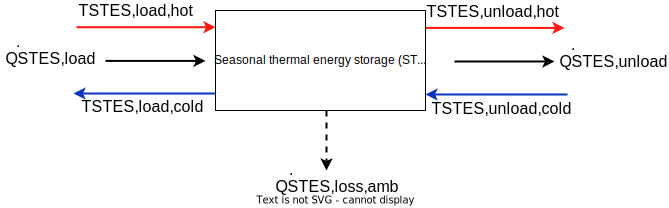

General energy balance in every timestep \(t\):
$$ 	
Q_{STES,t} = Q_{STES,t-1} + (\dot{Q}_{STES,load} - \dot{Q}_{STES,unload} - \dot{Q}_{STES,loss,amb}) \ \Delta t
$$

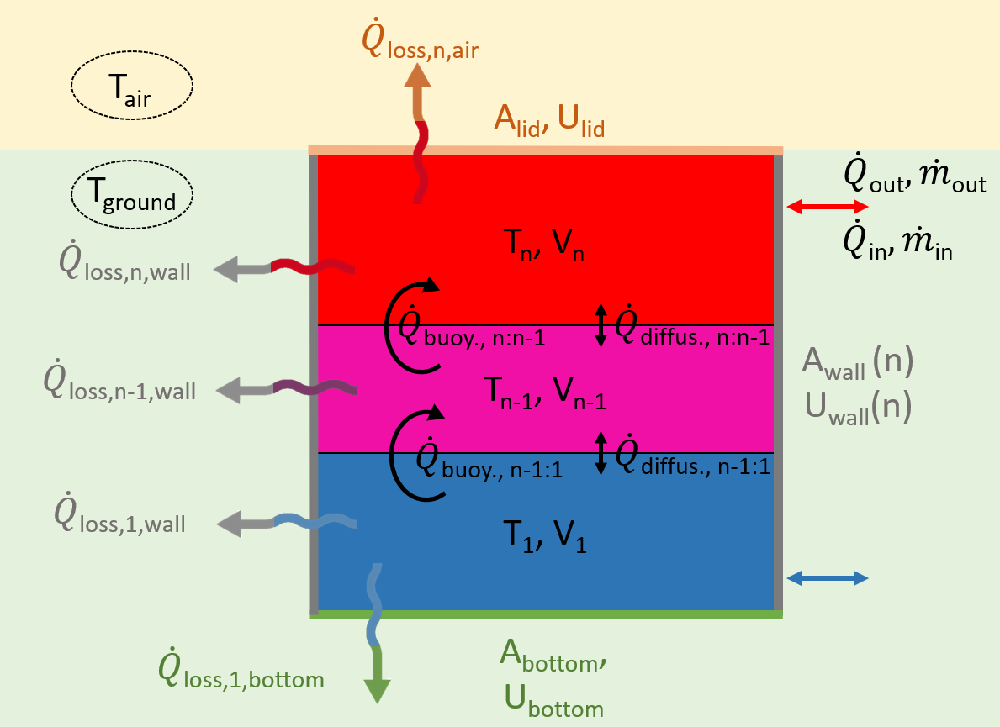
Figure adapted from [Steinacker2022][^Steinacker2022].

Stratisfied storage model based on [Lago2019][^Lago2019] and modified to account for cones according to [Steinacker2022][^Steinacker2022] and for half-burried storages.

[^Lago2019]: Lago, J. et al. (2019): A 1-dimensional continuous and smooth model for thermally stratified storage tanks including mixing and buoyancy, *Applied Energy* 248, S. 640–
655: doi: [10.1016/j.apenergy.2019.04.139](https://doi.org/10.1016/j.apenergy.2019.04.139).

[^Steinacker2022]: Steinacker, H (2022): Entwicklung eines dynamischen Simulationsmodells zur Optimierung von wärmegekoppelten Wasserstoffkonzepten für die klimaneutrale Quartiersversorgung, unpublished master thesis, University of Stuttgart.

Three different energy or exergy loss mechanisms are taken into account as shown in the figure above:

- Energy losses to the environment through the outer walls (bottom, walls and lid) of each storage layer (\(\dot{Q}_{STES,loss}\)), characterized by the heat transfer coefficient of the outer surfaces \(U_{STES,bottom/wall/lid}\)
- Exergy losses due to diffusion processes between the storage layers \(\dot{Q}_{STES,diffus.}\), specified by the diffusion coefficient \(\xi_{STES}\)
- Exergy losses due to convection (buoyancy) between the storage layers \(\dot{Q}_{STES,buoy.}\).

The temperature \(T_l\) in layer \(l\) with height \(\Delta z_l\) is given by the partial differential equation 
$$
\frac{\delta T_{STES,l} }{\delta t} = \underbrace{\xi_{STES} \frac{\delta^2 T_{STES,l}}{\delta z^2}}_{\text{diffusion}} + \underbrace{\frac{M_{STES,l} \ U_{STES,l}}{\rho_{STES} \ c_{p,STES} \ V_{STES,l}} \left(T_{STES,amb,l} - T_{STES,l}\right)}_{\text{energy losses to ambient}}  + \  \cdot  \cdot  \cdot \\ 
\ \\
\ \underbrace{\frac{\dot m_{STES} (T_{STES,l,in}-T_{STES,l})}{\rho_{STES} \ V_{STES,l}}}_{\text{direct (un-)loading}}
$$

The ambient temperature of each layer \(T_{amb,l}\) can be either the ambient air temperature \(T_{amb,air}\) in the specific time step or the ground temperature \(T_{ground}\) depending on the considered layer \(l\) and the number of layer burried under the ground surface.

Using the explicite Euler method for integration, the previous equation leads to the temperature in every timestep \(t\) and layer \(l\) with respect to the temperatures in the timestep bevore and the layers around (without the index \(_{STES}\) for better overview)
$$
\begin{aligned} 
	&T_{t+1,l}  = T_{t,l} + \left( \xi_{STES} \frac{T_{t,l+1} + T_{t,l-1} - 2 T_{t,l}}{\Delta z^2_{l,vol}} +  \sigma_l (T_{amb,l} - T_{t,l}) 	+ \phi_l \dot{m}_{t,l} \left(T_{t,l,in} - T_{t,l}   \right)  \right) \Delta t \\
%    
	& \text{with the volume-related layer height} \\
    &\Delta z_{l,vol} = \Delta z_l \ \sqrt{\frac{n_l \ V_{STES,l}}{V_{STES}} }  \ \ \text{(because \(\Delta z_l = const.\), but \(V_{STES,l} \neq const.\)),}  \\[5pt]
%    
    & \text{the coefficient of heat losses to the environment} \\
	&\sigma_l = \begin{cases}
		\frac{A_{STES,lid} \ U_{STES,lid} + M_{STES,l} \ U_{STES,l}}{c_{p,STES} \ \rho_{STES} \ V_{LZSWP,l}} &\text{for l = lid layer} \\[5pt]
		\frac{A_{STES,bottom} \ U_{STES,bottom} + M_{STES,l} \ U_{STES,l}}{c_{p,STES} \ \rho_{STES} \ V_{LZSWP,l}} &\text{for l = bottom layer} \\[5pt]
		\frac{M_{STES,l} \ U_{STES,l}}{c_{p,STES} \ \rho_{STES} \ V_{LZSWP,l}} &\text{for l = sandwich layers}		
	\end{cases} \\
%    
    &\text{and the coefficient for direct loading and unloading} \\ 
	&\phi_l =  \frac{1 }{\rho_{STES} \ V_{STES,l}} \ 
%	
\end{aligned}
$$

As the coefficients mentioned above are constant within the simulation time, they can be precomputed for cumputational efficiency.

To illustrate the principle of the implemented model, the following figure shows the mass flow into and out of the STES as well as examplary for one transition between two layers the mass flow between the layers within the model. The corresponding temperatures are the temperatures of the source (input flow or layer temperature of the previous layer). As a convention, the lowermost layer is labeled with the number 1. The inflow and outflow is always in the top and bottom layers. For correct results, the inegrated mass flow within one timestep has to be smaller than the volume of the smallest layer element of the storage (ToDo: Maybe fix this issue in Quasi II?)

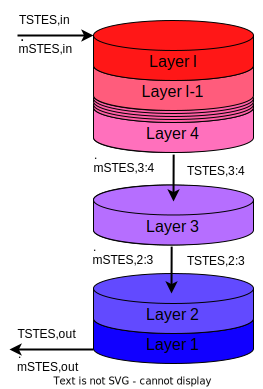

To account for buoyancy effects, a check is made in each time step to determine whether the temperature gradient in the reservoir corresponds to the physically logical state, meaning that the temperatures in the upper layers are higher than in the lower storage layers. If, however, an inverse temperature gradient is present, a mixing process is performed in each time step for all layers, beginning with \(l=2\):
$$
T_l = T_l + \theta_l \ \text{max} (0, T_{l-1} - T_l) \text{ for } l > 1 \text{ and }\\
T_{l-1} = T_{l-1} - (1-\theta_l) \ \text{max} (0, T_{l-1} - T_l) \text{ for } l > 1
$$
using the volume-ratio of each layer \(\theta_l\) with respect to the surrounding layers, inspired by [Lago2019][^Lago2019]:
$$  \theta_{l}  = \frac{V_{STES,l-1}}{V_{STES,l} + V_{STES,l-1}} \in [0,1] \text{ for } l > 1. $$

This method was extensively tested in [Steinacker2022][^Steinacker2022] and compared to calculations performed with TRNSYS Type 142 with high agreement. Is was shown that an optimal number of layers for this model is 25, considering computational efficiency and quality of the results. 

**Inputs and Outputs of the STES:**

Symbol | Description | Unit
-------- | -------- | --------
\(\dot{Q}_{STES,load}\) | thermal power input in the STES | [W]
\(\dot{Q}_{STES,unload}\) | thermal power output of the STES | [W]
\(\dot{m}_{STES,load}\)  | current mass flow rate into the STES | [kg/h]
\(\dot{m}_{STES,unload}\)  | current mass flow rate out of the STES | [kg/h]
\(T_{STES,load,hot}\)  |  temperature of input mass flow while loading the STES | [°C]
\(T_{STES,load,cold}\)  | temperature of output mass flow while loading the STES | [°C]
\(T_{STES,unload,hot}\)  |  temperature of input mass flow while unloading the STES | [°C]
\(T_{STES,unload,cold}\)  | temperature of output mass flow while unloading the STES | [°C]

**Parameter of the STES:**

Symbol | Description | Unit
-------- | -------- | --------
\(Q_{STES,rated}\)  | rated thermal energy capacity of the STES | [MWh]
\(x_{STES,start}\)  | thermal energy contend of the STES at the beginning of the simulation in relation to \(Q_{STES,rated}\)  | [%]
\(T_{STES,hot}\)  | rated upper temperature of the STES | [°C]
\(T_{STES,cold}\)  | rated lower temperature of the STES | [°C]
\(c_{STES,max,load}\) | maximum charging rate (C-rate) of STES | [1/h]
\(c_{STES,max,unload}\) | maximum discharging rate (C-rate) of STES | [1/h]
\(V_{STES}\)  | volume of the STES | [m\(^3\)]
\(\alpha_{STES,slope}\)  | slope angle of the wall of the STES with respect to the horizon | [°]
\(hr_{STES}\)  | ratio between height and mean radius of the STES | [-]
\(\rho_{STES}\)  | densitiy of the heat carrier medium in the STES | [kg/m\(^3\)]
\(cp_{STES}\)  | specific heat capacity of the heat carrier medium in the STES | [kJ/(kg K)]
\(\xi_{STES}\)  | coefficient of diffusion of the heat carrier medium in the STES into itself | [m\(^2\)/s]
\(U_{STES,lid}\)  | heat transfer coefficient of the STES' lid | [W/m\(^2\) K]
\(U_{STES,wall}\)  | heat transfer coefficient of the STES' wall | [W/m\(^2\) K]
\(U_{STES,bottom}\)  | heat transfer coefficient of the STES' bottom | [W/m\(^2\) K]
\(n_{STES,layers,total}\)  | number of thermal layer in the STES for the simulation | [pcs.]
\(n_{STES,layers,above \ ground}\)  | number of thermal layer of the STES above the ground surface | [pcs.]
\(\boldsymbol{T}_{STES,ground}\)  | timeseries or constant of ground temperature | [°C]
\(\boldsymbol{T}_{STES,amb}\)  | timeseries of ambient temperature | [°C]

**State variables of the STES:**

Symbol | Description | Unit
-------- | -------- | --------
\({Q}_{STES}\)  | current amount of thermal energy stored in the STES | [MWh]
\(x_{STES}\)  | current charging state of the STES   | [%]
\(\boldsymbol{T}_{STES}\)  | vector of current temperatures in every layer of the STES   | [°C]

### Borehole thermal energy storage (BTES)

Borehole thermal energy storages are not implemented yet (ToDo).

### Aquifer thermal energy storage (ATES)

Aquifer thermal energy storages are not implemented yet (ToDo).

## Ice storage (IS)

Ice storages are not implemented yet.

## Hydrogen fuel cell (FC)
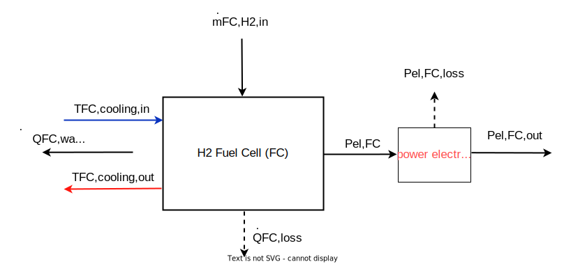

Hydrogen fuel cells are not implemented yet (ToDo).

## Photovoltaik (PV)
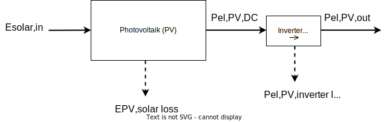

For the calculation of the electrical power output of photovoltaic systems, a separate simulation tool was developed and integrated into QuaSi. It is based on the Python extension pvlib[^pvlib] and uses the model chain approach described in the pvlib documentation. Technical data of specific PV modules and DC-AC interverts are taken from the SAM model[^SAM-Model] and integrated into pvlib.

Inputs can include orientation, tilt, ambient albedo, type of installation (e.g. roof-added, free-standing), as well as module interconnection and specific PV modules and inverters chosen from the library. Additional losses, such as ohmic losses in cables or losses due to soiling, can be taken into account. A weather input dataset is required that includes direct normal, global horizontal and diffuse horizontal irradiance as well as ambient (dry bulb) temperature, humidity and wind speed.   

[^SAM-Model]: System Advisor Model Version 2020.11.29 (SAM 2020.11.29). National Renewable Energy Laboratory. Golden, CO. URL: [https://sam.nrel.gov](https://sam.nrel.gov)

[^pvlib]: Holmgren W. F., Hansen C. W. and Mikofski M. A. (2018): Pvlib Python: A python package for modeling solar energy systems, *Journal of Open Source Software 3(29), 884*, doi: [https://doi.org/10.21105/joss.00884](https://doi.org/10.21105/joss.00884)

## Wind power (WP)

windpowerlib (ToDo)

Achtung: Winddaten von EPW nicht geeignet!

## Battery (BA)

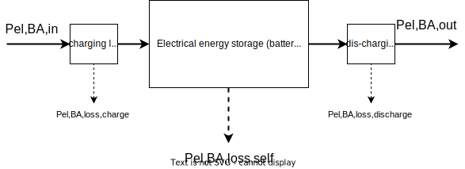

Energy balance of battery in every timestep:
$$  E_{GB,t+1} = E_{GB,t} + \Delta t \ ( \eta_{BA,charge} \ P_{el,BA,in} - \ \frac{P_{el,BA,out}}{\eta_{BA,discharge}} - P_{el,BA,loss,self}) $$

Self-Discharge losses of battery:
$$ P_{el,BA,loss,self} = r_{BA,self \ discharge} \ \frac{1 \ h}{\Delta t} \ E_{GB,t} $$

Charging losses of battery:
$$ P_{el,BA,loss,charge} = (1 - \eta_{BA,charge}) \ P_{el,BA,in} $$

Discharging losses of battery:
$$ P_{el,BA,loss,discharge} = \frac{1 - \eta_{BA,discharge}}{\eta_{BA,discharge}} \ P_{el,BA,out} $$

Current maximum capacity of the battery:
$$ E_{GB,max,current} = E_{GB,rated} \ (1-r_{GB,CapReduction}) ^{ n_{cycles \ performed}} $$
$$ \text{with} \ n_{cycles \ performed} = \frac{\int_{start}^{current} P_{el,BA,in} dt}{E_{GB,rated}} $$

Limits of electrical power in- and output (limit to current energy content and maximum c-rate of battery):
$$ \frac{E_{GB,max,current} - E_{GB}}{\Delta t \ \ \eta_{BA,charge} } \stackrel{!}{\geq}  P_{el,BA,in} \stackrel{!}{\leq}  c_{BA,max,charge} \ E_{GB,max,current}  $$
$$ \eta_{BA,discharge} \ \frac{E_{GB}}{\Delta t} \stackrel{!}{\geq}  P_{el,BA,out} \stackrel{!}{\leq}  c_{BA,max,discharge} \ E_{GB,max,current} $$

Relation beween current charging state in percent and in energy content:
$$ E_{GB} = E_{GB,max,current} \ x_{GB} $$

**Inputs and Outputs of the BA:**

Symbol | Description | Unit
-------- | -------- | --------
\(P_{el,BA,in}\) | electrical power input in the BA | [W]
\(P_{el,BA,out}\) | electrical power output of the BA | [W]
\(P_{el,BA,loss,self}\) | electrical power losses of the BA due to self-discharging | [W]
\(P_{el,BA,loss,charge}\) | electrical power losses of the BA while charging| [W]
\(P_{el,BA,loss,discharge}\) | electrical power losses of the BA while discharging| [W]

**Parameter of the BA:**

Symbol | Description | Unit
-------- | -------- | --------
\(\eta_{BA,charge}\) | charging efficiency of battery | [-]
\(\eta_{BA,discharge}\) | discharging efficiency of battery | [-]
\(r_{BA,self \ discharge}\) | self-discharge rate of battery (% losses per hour regarding current energy content) | [1/h]
\(c_{BA,max,charge}\) | maximum charging rate (C-rate) of battery | [1/h]
\(c_{BA,max,discharge}\) | maximum discharging rate (C-rate) of battery | [1/h]
\({E}_{GB,rated}\)  | rated electrical energy capacity of the battery | [MWh]
\(r_{GB,CapReduction}\)  | percentage of the reduction of the current battery capacity due to one full charge cycle | [%/cycle]
\({E}_{GB,start}\)  | electrical energy contend of the battery at the beginning of the simulation   | [MWh]

**State variables of the BA:**

Symbol | Description | Unit
-------- | -------- | --------
\({E}_{GB}\)  | current amount of energy stored in the battery   | [MWh]
\({E}_{GB,max,current}\)  | current maximum capacity of the battery depending on the number of charging cycles already performed  | [MWh]
\(x_{GB}\)  | current charging state of the battery   | [%]

## Hydrogen compressor (HC)

## ToDo
- In Tabelle Parameter nur Parameter, die auch eingegeben werden, alle anderen im Text einführen
- check for consistency: energy system, part-load, timestep, start-up, shut-down
  
## References
///Footnotes Go Here///