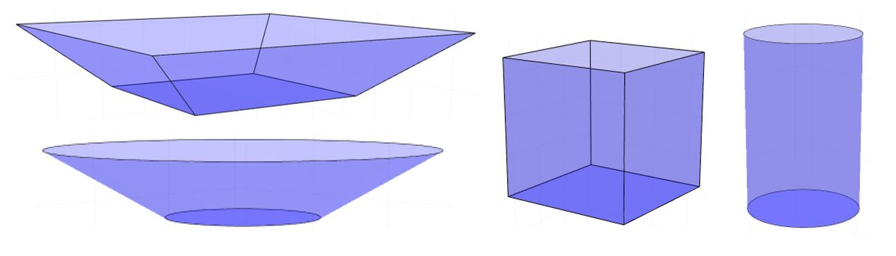

# Types of energy system components
This chapter provides details on the parameters of energy system components, which can be used in the [project input file](resie_input_file_format.md). For a detailed description of the mathematical models, see the [chapter on the component models](resie_energy_system_components.md).

The description of each component type includes a block with a number of attributes that describe the type and how it connects to other components by its input and output interfaces. An example of such a block:

| | |
| --- | --- |
| **Type name** | `BoundedSink`|
| **File** | `energy_systems/general/bounded_sink.jl` |
| **System function** | `bounded_sink` |
| **Medium** | `medium`/`None` |
| **Input media** | `None`/`auto` |
| **Output media** | |
| **Tracked values** | `IN`, `Max_Energy`, `LossesGains` |
| **Auxiliary Plots** | None  |

Of particular note are the descriptions of the medium (if it applies) of the component type and its input and output interfaces. The `Medium` is used for components that could handle any type of medium and need to be configured to work with a specific medium. The attributes `Input media` and `Output media` describes which input and output interfaces the type provides and how the media of those can be configured. The syntax `name`/`value` lists the name of the parameter in the input data that defines the medium first, followed by a forward slash and the default value of the medium, if any. A value of `None` implies that no default is set and therefore it must be given in the input data. A value of `auto` implies that the value is determined with no required input, usually from the `Medium`.

The `Tracked values` attribute lists which values of the component can be tracked with the output specification in the input file (see [this section](resie_input_file_format.md#output-specification-csv-file) for details). Note that a value of `IN` or `OUT` refers to all input or output interfaces of the component. Which these are can be infered from the input and output media attributes and the chosen medium names if they differ from the default values. To track the energy losses or gains of a component to or from the ambient, the `LossesGains` attribute can be requested. Losses are returned as negative values, while gains are defined as positive values. This attribute name applies to most components, although some components may never have gains, e.g. a gas boiler.

The `Auxiliary Plots` list plots the component can create before or after the simulation if `auxiliary_plots` is set to `true` in the `io_settings`. Only given if the component provides any auxiliary plots.

The description further lists which arguments the implementation takes. Let's take a look at an example:

| Name | Type | R/D |  Example | Unit | Description |
| ----------- | ------- | --- | ------------------------ | ------ | ------------------------ |
| `max_power_profile_file_path` | `String` | Y/N | `profiles/district/max_power.prf` | [-] | Path to the max power profile. |
| `efficiency` | `Float` | Y/Y | 0.8 | [-] | Ratio of output over input energies. |
| `constant_temperature` | `Temperature` | N/N | 65.0 | [°C] | If given, sets the temperature of the heat output to a constant value. |

The name of the entries should match the keys in the input file, which is carried verbatim as entries to the dictionary argument of the component's constructor. The column `R/D` lists if the argument is required (`R`) and if it has a default value (`D`). If the argument has a default value the example value given in the next column also lists what that default value is. Otherwise the example column shows what a value might look like.

The type refers to the type it is expected to have after being parsed by the JSON library. The type `Temperature` is an internal structure and simply refers to either `Float` or `Nothing`, the null-type in Julia. In general, a temperature of `Nothing` implies that any temperature is accepted and only the amount of energy is revelant. More restrictive number types are automatically cast to their superset, but *not* the other way around, e.g: \(UInt \rightarrow Int \rightarrow Float \rightarrow Temperature\). Dictionaries given in the `{"key":value}` notation in JSON are parsed as `Dict{String,Any}`.

### Storage un-/loading
All components can be set to be dis-/allowed to un-/load storages to which they output or from which they draw energy. This only makes sense if an intermediary bus exists because direct connections to/from storages must always be allowed to transfer energy. Here are exemplary parameters for a `BoundedSupply`:

```json
{
    "uac": "TST_SRC_01",
    "type": "BoundedSupply",
    "medium": "m_h_w_lt1",
    ...
    "control_parameters": {
        "load_storages m_h_w_lt1": false
    }
}
```

This would result in the output of the source not being used to fill storages. The name of the `load_storages medium` parameter must match the name of the medium of the input/output in question. The medium name `m_h_w_lt1` is, in this case, derived from the parameter `medium`. The medium name might also be set directly, for example with `m_heat_in` for a `HeatPump`.

Similarly, components can be configured to be dis-/allowed to draw energy from storages with the corresponding `unload_storages medium` parameter. Any input/output not specified in this way is assumed to be allowed to un-/load storages.

### Function definitions
Various components, particularly transformers, require an input of functions to determine efficiency, available power and other variables. The definition of a function in the project file is a string and should look like `function_prototype:values` with `function_prototype` refering to one of the implemented function prototypes (see specific sub-sections below) and `values` being data required to parameterise the prototype. Various function prototypes are implemented for different purposes.

In general `:` is used as seperator between prototype and values and `,` as seperator for numbers with `.` as decimal point and no thousands seperator.

#### Efficiency functions
Used to determine an efficiency factor of how much energy is produced from a given input and vice-versa. This is described in more detail in [the chapter on general effects and traits](resie_transient_effects.md#part-load-ratio-dependent-efficiency). In the simplest case this can be a constant factor, such as a 1:1 ratio, however in the mathematical models of the components this can be almost any continuous function mapping \(\kappa \in [0,1]\) to an efficiency factor.

Because the efficiency must always be defined in relation on input or output of the component, the functionality supports this interface being defined as linear. This means that the amount of energy on this interface is strictly linear to the PLR multiplied with the design power. The other interfaces of the component are then calculated with efficiencies relative to this linear interface. Example: A fuel boiler defined with linear heat output would have a constant efficiency of 1.0 on the heat output and a different efficiency on the fuel input. If the conversion from fuel to heat is 90% efficient, this results in an efficiency factor of 1.1 on the fuel input.

For the configuration of components a selected number of different cases are implemented. If a function is known, but cannot be precisely modelled using one of these parameterised functions, it is possible to use a piece-wise linear approximation, which is also useful to model data-driven functions.

**Implemented function prototypes**

* `const`: Takes one number and uses it as a constant efficiency factor. E.g. `const:0.9`.
* `poly`: Takes a list of numbers and uses them as the coefficients of a polynomial with order n-1 where n is the length of coefficients. The list starts with coefficients of the highest order. E.g. `poly:0.5,2.0,0.1` means \(e(x) = 0.5x^2 + 2x + 0.1\)
* `pwlin`: A piece-wise linear interpolation. Takes a list of numbers and uses them as support values for an even distribution of linear sections on the interval [0,1]. The PLR-values (on the x axis) are implicit with a step size equal to the inverse of the length of support values minus 1. The first and last support values are used as the values for a PLR of 0.0 and 1.0 respectively. E.g. `pwlin:0.6,0.8,0.9` means two sections of step size 0.5 with a value of `e(0.0)==0.6`, `e(0.5)==0.8`, `e(1.0)=0.9` and linear interpolation inbetween.
* `offset_lin`: Takes one number and uses as the slope of a linear function with an offset of its complement (in regards to 1.0). E.g. `offset_lin:0.5` means \(e(x)=1.0-0.5*(1.0-x)\)
* `logarithmic`: Takes two numbers and uses them as the coefficients of a quasi-logarithmic function. E.g. `logarithmic:0.5,0.3` means \(e(x)=\frac{0.5x}{0.3x+(1-0.3)}\)
* `inv_poly`: Takes a list of numbers and uses them as the coefficients of a polynomial with order n-1 where n is the length of coefficients. The list starts with coefficients of the highest order. The inverse of the polynomial, multiplied with the PLR, is used as the efficiency function. E.g. `inv_poly:0.5,2.0,0.1` means \(e(x)=\frac{x}{0.5x²+2x+0.1}\)
* `exp`: Takes three numbers and uses them as the coefficients of an exponential function. E.g. `exp:0.1,0.2,0.3` means \(e(x)=0.1+0.2*exp(0.3x)\)
* `unified_plf`: Takes four numbers and uses them as the coefficients of a composite function of a logarithmic and linear function as described in the documentation on the [unified formulation for PLR-dependent efficiencies of heat pumps](resie_energy_system_components.md#part-load-efficiency). The first two numbers are the optimal PLR and the PLF at that PLR. The third number is a scaling factor for the logarithmic part and the fourth number is the PLF at PLR=1.0.

**Discretization**

Because not all functions are (easily) invertible a numerical approximation of the inverse function is precalculated during initialisation. The size of the discretization step can be controlled with the parameter `nr_discretization_steps`, which has a default value of 30 steps. It should not often be necessary to use a different value, but this can be beneficial to balance accuracy vs. performance. In particular if a piece-wise linear interpolation is used it makes sense to use the same number of discretization steps so that the support values overlap for both the efficiency function and its inverse.

**PLF functions**

The calculation of some components, such as heat pumps, makes use of the part load factor (PLF), which is multiplied after an efficiency factor has been calculated from some other formulation and which represents the behaviour dependent on \(\kappa\). For parsing, these work the same as the efficiency functions, however they may not make use of the numerical approximation of the inverse function.

#### COP functions
Used by heat pumps and similar components to calculate the COP depending on input/output temperatures. The implemented function prototypes are two-dimensional functions that return the COP without considering additional modifications such as a PLF function or icing losses. The temperatures are assumed to be given in °C.

**Implemented function prototypes**

* `const`: Takes one number and uses it as a constant COP. E.g. `const:3.1`. The constant COP is used for all temperatures, also in bypass mode!
* `carnot`: Calculates the COP as fraction of the Carnot-COP with a given reduction factor, which is between `0.4` and `0.45` for typical heat pumps. E.g. `carnot:0.4` means \(COP = 0.4 \cdot \frac{273.15 + T_{out}}{T_{out} - T_{in}}\).
* `poly-2`: A 2D-polynomial of order three. Takes a list of ten values for the constants in \(f(x,y) = c_1 + c_2 \ x + c_3 \ y + c_4 \ x^2 + c_5 \ x \ y + c_6 \ y^2 + c_7 \ x^3 + c_8 \ x^2 \ y + c_9 \ x \ y^2 + c_{10} \ y^3\). E.g. `poly-2:0.3,0.4,0.1,0.2,0.0,0.0,0.0,0.0,0.0,0.0`.
* `field`: Two-dimensional field values with bi-linear interpolation between the support values. See explanation below for how the definition should be given. The minimal and maximal values are interpreted as the inclusive boundaries of the field. Values outside of the boundaries lead to errors and are not extrapolated. The support values should be equally spaced along the dimensions for numerical stability, although the interpolation algorithm does not check and works with varying spacing too.

An example of a field definition with additional line breaks and spaces added for clarity:
```
"field:
 0, 0,10,20,30;
 0,15, 9, 6, 4;
10,15,15,10, 7;
20,15,15,15,11"
```
The first row are the grid points along the \(T_{sink,out}\) dimension, with the first value being ignored. The points cover a range from 0 °C to 30 °C with a spacing of 10 K. The first column are the grid points along the \(T_{source,in}\) dimension, with the first value being ignored. The points cover a range from 0 °C to 20 °C with a spacing of 10 K. The support values are the COP (at maximum PLR \(\kappa = 1\)), for example a value of 10 for \(T_{source,in} = 10, \ T_{sink,out} = 20\).

#### Power functions
Used by heat pumps and similar components to calculate the minimum and maximum power available, depending on temperature values, as fraction of the nominal power. Return values should therefore be in \([0,1]\).

**Implemented function prototypes**

* `const`: Takes one number and uses it as a constant fraction. E.g. `const:1.0`.
* `poly-2`: A 2D-polynomial of order three. Takes a list of ten values for the constants in \(f(x,y) = c_1 + c_2 \ x + c_3 \ y + c_4 \ x^2 + c_5 \ x \ y + c_6 \ y^2 + c_7 \ x^3 + c_8 \ x^2 \ y + c_9 \ x \ y^2 + c_{10} \ y^3\). E.g. `poly-2:0.3,0.4,0.1,0.2,0.0,0.0,0.0,0.0,0.0,0.0`.


### Control modules
For a general overview of what control modules do and how they work, see [this chapter](resie_operation_control.md). In the following the currently implemented control modules and their required parameters are listed.

Some parameters specify behaviour of multiple modules on the same component as well as other control behaviour of the component. As the `control_modules` subconfig is a list and cannot hold parameters, these are specified in the `control_parameters` subconfig. In addition to [the storage un-/loading flags](resie_component_parameters.md) these general control parameters are:

| | |
| --- | --- |
| **aggregation_plr_limit** | Defines how the callback `upper_plr_limit` is aggregated. Should be either `max` (take the maximum) or `min` (take the minimum). Defaults to `max`. |
| **aggregation_charge** | Defines how the callback `charge_is_allowed` is aggregated. Should be either `all` (all must be `true`) or `any` (any one must be `true`). Defaults to `all`. |
| **aggregation_discharge** | Defines how the callback `discharge_is_allowed` is aggregated. Should be either `all` (all must be `true`) or `any` (any one must be `true`). Defaults to `all`. |
| **aggregation_check_src_to_snk** | Defines how the callback `check_src_to_snk` is aggregated. Should be either `all` (all must be `true`) or `any` (any one must be `true`). Defaults to `all`. |

The aggregation defined in `aggregation_plr_limit` applies to the control modules `storage_driven` and `profile_limited` as they both use the PLR limit callback `upper_plr_limit`.

A definition of a control module with its control parameter can be done for example like this:

```JSON
"TST_TH_HP_01": {
    ...
    "control_parameters": {
        "aggregation_plr_limit": "max"
    },
    "control_modules": [
        {
            "name": "storage_driven",
            "high_threshold": 0.95,
            "low_threshold": 0.3,
            "storage_uac": "TST_TH_BFT_01"
        },
         {
            "name": "storage_driven",
            "high_threshold": 0.99,
            "low_threshold": 0.5,
            "storage_uac": "TST_TH_BFT_02"
        }
    ],
    ...
}
```

#### Economical discharge
Handles the discharging of a battery to only be allowed if sufficient charge is available and a linked PV plant has available power below a given threshold. Mostly used for examplatory purposes.

**Note:** At the moment there is no mechanism to prevent the battery to be fully discharged in a single timestep. This will be changed in a future update.

This module is implemented for the following component types: `Battery`

| | |
| --- | --- |
| **name** | Name of the module. Fixed value of `economical_discharge` |
| **pv_threshold** | Treshold of the PV plant below which discharge is allowed. Absolute value in Wh. |
| **min_charge** | The minimum charge level required for discharge to be allowed. Defaults to `0.2`. |
| **discharge_limit** | The charge level to which the battery is discharged, below which discharge is stopped. Defaults to `0.05` |
| **pv_plant_uac** | The UAC of the PV plant that is linked to the module. |
| **battery_uac** | The UAC of the battery to which the module is attached. |

#### Profile limited
Sets the maximum PLR of a component to values from a profile. Used to set the operation of a component to a fixed schedule while allowing circumstances to override the schedule in favour of a lower PLR.

This module is implemented for the following component types: `CHPP`, `Electrolyser`, `FuelBoiler`, `HeatPump`

| | |
| --- | --- |
| **name** | Name of the module. Fixed value of `profile_limited` |
| **profile_path** | File path to the profile with the limit values. Must be a `.prf` file. |

#### Storage-driven
Controls a component to only operate when the charge of a linked storage component falls below a certain threshold and keep operating until a certain higher threshold is reached and minimum operation time has passed. This is often used to avoid components switching on and off rapidly to keep a storage topped up, as realised systems often operate with this kind of hysteresis behaviour.

This module is implemented for the following component types: `CHPP`, `Electrolyser`, `FuelBoiler`, `HeatPump`

| | |
| --- | --- |
| **name** | Name of the module. Fixed value of `storage_driven` |
| **low_threshold** | The storage charge threshold below which operation is turned on. Defaults to `0.2`.
| **high_treshold** | The storage charge threshold above which operation is turned off. Defaults to `0.95`.
| **min_run_time** | Minimum run time for the "on" state. Absolute value in seconds. Defaults to `1800`.
| **storage_uac** | The UAC of the storage component linked to the module.

#### Temperature sorting
Controls a component so that the availabe energies of the inputs/outputs during calculation of the `potential` and `process` steps are sorted by the temperatures they provide/request. This is useful for components where the temperature differences matter for the calculation. For example a heat pump can use the heat source with the highest temperature first for improved efficiency.

**Note:** This will overwrite the order defined in the bus!

This module is implemented for the following component types: `HeatPump`

| | |
| --- | --- |
| **name** | Name of the module. Fixed value of `temperature_sorting` |
| **input_temps** | Sets if the inputs are sorted by minimum or maximum temperature. Should be `max` (default) or `min`.
| **input_order** | Sets the direction in which the inputs are sorted. Should be `asc`, `none` or `desc` (default). A value of `none` means no reordering is performed.
| **output_temps** | Sets if the outputs are sorted by minimum or maximum temperature. Should be `max` or `min` (default).
| **output_order** | Sets the direction in which the outputs are sorted. Should be `asc` (default), `none` or `desc`. A value of `none` means no reordering is performed.

#### Negotiate temperature
This control module offers several methods for negotiating the temperature for the energy transfer between two components. It can be understood as control logic for the pump that transfers the carrier medium of thermal energy from a source component to a target component.
It is used for components where the possible amount of energy that can be drawn or delivered in the current time step depends on the temperature at which the energy is supplied or requested. Currently, these are:  `GeothermalProbes`, `SolarthermalCollector` and `SeasonalThermalStorage`.

Several methods are available:

* `constant_temperature`: This sets the energy transfer between target and source to a constant temperature. Here, `constant_output_temperature` has to be given as well as parameter of the control module. 
* `upper`: This sets the temperature to the highest possible value, taking into account the temperature limits of both components in the current time step.
* `lower`: This sets the temperature to the lowest possible value, taking into account the temperature limits of both components in the current time step.
*  `mean`: This sets the temperature to the mean between the lower and upper temperature limit of the intersecting temperature range of source and target component.
*  `optimize`: Optimize uses two functions provided by the source and the target component to find the intersecting temperature that maximizes the energy transfer in the current time step. Note that this requires a lot of computing power. The tolerances for the solving algorithm can be adjusted (see table below).

Normally, `mean` is a good compromise between computational effort and accuracy. But, `optimize` will result in higher energy transfer, assuming an optimal pump control algorithm. 

With setting the parameter `limit_max_output_energy_to_avoid_pulsing` to `true`, another algorithm can be activated that helps preventing the components to pulse, meaning turning energy flow on and off every time step. If activated, the source limits its energy output to ensure that in the following timestep, the same temperature can be reached as in the current time step. In the `GeothermalProbes`, this can lead to unexpected results, e.g. energy will never start if in the probe the initial borehole wall temperature and the undisturbed ground temperature are set close to each other while at the same time the maximum energy output limit is set to a high value. In `SolarthermalCollector`, the parameter is not considered.

Additionally, the source can be controlled by a hysteresis on the maximum output temperature of the source in the current time step. Use the flag `use_hysteresis` to activate this feature and provide both the turn-on-temperature `hysteresis_temp_on` and the turn-off-temperature `hysteresis_temp_off`. Typically, the turn-off-temperature is lower than the turn-on-temperature. This feature acts as an additional turn-of switch for all values of `temperature_mode`.

This module is implemented for the following component types:

- Sources: `GeothermalProbes`, `SolarthermalCollector`
- Targets: `SeasonalThermalStorage`

| | |
| --- | --- |
| **name** | Name of the module. Fixed value of `negotiate_temperature` |
| **target_uac** | The UAC of the linked target component (SeasonalThermalStorage). Required. |
| **temperature_mode** | Can be one of `constant_temperature`, `optimize`, `mean`, `upper`, `lower`. Defaults to `mean`. |
| **limit_max_output_energy_to_avoid_pulsing** |  Bool to indicate if pulsing should be avoided (not for `temperature_mode` = `optimize` and not for `SolarthermalCollector`). Defaults to `false`. See additional notes above. |
| **use_hysteresis** | Bool to indicate if an additional hysteresis on the output temperature of the source should be activated. If true, also provide `hysteresis_temp_on` and `hysteresis_temp_off`. Defaults to `false`. |
| **hysteresis_temp_on** | Turn-on Temperature for source, only if `use_hysteresis` =  `true`. Defaults to `nothing`. |
| **hysteresis_temp_off** | Turn-off Temperature for source, only if `use_hysteresis` =  `true`. Defaults to `nothing`. |
| **constant_output_temperature** | Temperature for `temperature_mode` =  `constant_temperature`. Defaults to `nothing`. |
| **optim_temperature_rel_tol** |  Relative tolerance to find the temperature for maximum energy, only for for `temperature_mode` = `optimize`. Defaults to `1e-5`.  Looser relative tolerance could be `1e-3`|
| **optim_temperature_abs_tol** | Absolute tolerance to find the temperature for maximum energy, only for for `temperature_mode` = `optimize` . Defaults to `0.001`. Looser absolute tolerance could be `0.1` |

Below is a template for the input file that can be included in the supporting source components:

``` JSON
"control_modules": [
    {
        "name": "negotiate_temperature",
        "target_uac": "FILL_IN",
        "temperature_mode": "mean",
        "limit_max_output_energy_to_avoid_pulsing": true,
        "use_hysteresis": true,
        "hysteresis_temp_on": 13,
        "hysteresis_temp_off": 5,
        "_FOR_TEMPERATURE_MODE_CONSTANT_TEMPERATURE": "",
        "constant_output_temperature": 13.0,
    }
]
```

#### Limit cooling input temperature
This control module is specially implemented for the combination of an electrolyser with a seasonal thermal energy storage. Here, the electrolyser can use the storage to cool down its high temperature excessive heat. But, at some point, the lowest layer of the storage (equals the return flow into the electrolyser) will reach a temperature that is too high to allow the electrolyser to cool down as required. To handle this, a limit temperature in this control module can be specified, which will disable the energy flow from electrolyser to the seasonal thermal energy storage when the lowest layer of the storage has reached the provided `temperature_limit`.

This module is implemented for the following component types:

- Sources: `Electrolyser`
- Targets: `SeasonalThermalStorage`

| | |
| --- | --- |
| **name** | Name of the module. Fixed value of `limit_cooling_input_temperature`  |
| **target_uac** |  The UAC of the linked target component (SeasonalThermalStorage). Required. |
| **temperature_limit** |  The temperature limit for the return flow (input in the output interface of source) that will disable energy transfer between source and target if exceeded. Required. |


#### Forbid source to sink
Forbids that a defined source is used to supply a defined sink. As this uses the callback `check_src_to_snk`, this is specifically used for components with a layered approach to energy flow calculation, e.g. a heat pump. A bus has this functionality built-in and does not need a control module.

This module is implemented for the following component types: `HeatPump`

| | |
| --- | --- |
| **name** | Name of the module. Fixed value of `forbid_src_to_snk` |
| **src_uac** |  The UAC of the source component. Required. |
| **snk_uac** |  The UAC of the sink component. Required. |


## Boundary and connection components

### General bounded sink
| | |
| --- | --- |
| **Type name** | `BoundedSink`|
| **File** | `energy_systems/general/bounded_sink.jl` |
| **System function** | `bounded_sink` |
| **Medium** | `medium`/`None` |
| **Input media** | `None`/`auto` |
| **Output media** | |
| **Tracked values** | `IN`, `Max_Energy`, `Temperature` |

Generalised implementation of a bounded sink.

Can be given a profile for the maximum power it can take in, which is scaled by the given scale factor. If the medium supports it, a temperature can be given, either as profile from a .prf file or from the ambient temperature of the project-wide weather file or a constant temperature can be set.

| Name | Type | R/D |  Example | Unit | Description |
| ----------- | ------- | --- | ------------------------ | ------ | ------------------------ |
| `max_power_profile_file_path` | `String` | N/N | `profiles/district/max_power.prf` | [W] or [Wh] | Path to the max power profile. Define unit in profile header. |
| `constant_power` | `Float` | N/N | 4000.0 | [W] | If given, sets the max power of the input to a constant value. |
| `scale` | `Float` | N/Y | 1.0 | [-] | Factor by which the max power values are multiplied. Only applies to profiles. |
| `temperature_profile_file_path` | `String` | N/N | `profiles/district/temperature.prf` | [°C] | Path to the profile for the input temperature. |
| OR: `constant_temperature` | `Temperature` | N/N | 65.0 | [°C] | If given, sets the temperature of the input to a constant value. |
| OR: `temperature_from_global_file` | `String` | N/N | ` temp_ambient_air` | [-] | If given, sets the temperature of the input to the ambient air temperature of the global weather file. |

Note that either `temperature_profile_file_path`, `constant_temperature` **or** `temperature_from_global_file` (or none of them) should be given!

### General bounded supply
| | |
| --- | --- |
| **Type name** | `BoundedSupply`|
| **File** | `energy_systems/general/bounded_supply.jl` |
| **System function** | `bounded_source` |
| **Medium** | `medium`/`None` |
| **Input media** | |
| **Output media** | `None`/`auto` |
| **Tracked values** | `OUT`, `Max_Energy`, `Temperature` |

Generalised implementation of a bounded source.

Can be given a profile for the maximum power it can provide, which is scaled by the given scale factor. If the medium supports it, a temperature can be given, either as profile from a .prf file or from the ambient temperature of the project-wide weather file or a constant temperature can be set.

| Name | Type | R/D |  Example | Unit | Description |
| ----------- | ------- | --- | ------------------------ | ------ | ------------------------ |
| `max_power_profile_file_path` | `String` | N/N | `profiles/district/max_power.prf` | [W]  or [Wh]| Path to the max power profile. Define unit in profile header.  |
| `constant_power` | `Float` | N/N | 4000.0 | [W] | If given, sets the max power of the output to a constant value. |
| `scale` | `Float` | N/Y | 1.0 | [-] | Factor by which the max power values are multiplied. Only applies to profiles. |
| `temperature_profile_file_path` | `String` | N/N | `profiles/district/temperature.prf` | [°C] | Path to the profile for the output temperature. |
| OR: `constant_temperature` | `Temperature` | N/N | 65.0 | [°C] | If given, sets the temperature of the output to a constant value. |
| OR: `temperature_from_global_file` | `String` | N/N | ` temp_ambient_air` | [-] | If given, sets the temperature of the input to the ambient air temperature of the global weather file. |

Note that either `temperature_profile_file_path`, `constant_temperature` **or** `temperature_from_global_file` (or none of them) should be given!

### Bus
| | |
| --- | --- |
| **Type name** | `Bus`|
| **File** | `energy_systems/connections/bus.jl` |
| **System function** | `bus` |
| **Medium** | `medium`/`None` |
| **Input media** | `None`/`auto` |
| **Output media** | `None`/`auto` |
| **Tracked values** | `Balance`, `Transfer->UAC` |

The only implementation of special component `Bus`, used to connect multiple components with a shared medium.

Note that the tracked value `Transfer->UAC` refers to an output value that corresponds to how much energy the bus has transfered to the bus with the given UAC.

| Name | Type | R/D |  Example | Unit | Description |
| ----------- | ------- | --- | ------------------------ | ------ | ------------------------ |
| `connections` | `Dict{String,Any}` | N/N |  | [-] | Connection config for the bus. See [chapter on the input file format](resie_input_file_format.md) for details. |

### General fixed sink
| | |
| --- | --- |
| **Type name** | `FixedSink`|
| **File** | `energy_systems/general/fixed_sink.jl` |
| **System function** | `fixed_sink` |
| **Medium** | `medium`/`None` |
| **Input media** | `None`/`auto` |
| **Output media** | |
| **Tracked values** | `IN`, `Demand`, `Temperature` |

Generalised implementation of a fixed sink.

Can be given a profile for the energy it requests, which is scaled by the given scale factor. Alternatively a static load can be given. If the medium supports it, a temperature can be given, either as profile from a .prf file or from the ambient temperature of the project-wide weather file or a constant temperature can be set.

| Name | Type | R/D |  Example | Unit | Description |
| ----------- | ------- | --- | ------------------------ | ------ | ------------------------ |
| `energy_profile_file_path` | `String` | N/N | `profiles/district/demand.prf` | [W] or [Wh] | Path to the input energy profile. Define unit in profile header. |
| `constant_demand` | `Float` | N/N | 4000.0 | [W] | [power, not work!] If given, ignores the energy profile and sets the input demand to this constant power. |
| `scale` | `Float` | N/Y | 1.0 | [-] | Factor by which the energy profile values are multiplied. Only applies to profiles. |
| `temperature_profile_file_path` | `String` | N/N | `profiles/district/temperature.prf` | [°C] | Path to the profile for the input temperature. |
| OR: `constant_temperature` | `Temperature` | N/N | 65.0 | [°C] | If given, sets the temperature of the input to a constant value. |
| OR: `temperature_from_global_file` | `String` | N/N | ` temp_ambient_air` | [-] | If given, sets the temperature of the input to the ambient air temperature of the global weather file. |

Note that either `temperature_profile_file_path`, `constant_temperature` **or** `temperature_from_global_file` (or none of them) should be given!

### General demand
| | |
| --- | --- |
| **Type name** | `Demand`|
| **File** | `energy_systems/general/fixed_sink.jl` |
Alias to `FixedSink`.

### General fixed supply
| | |
| --- | --- |
| **Type name** | `FixedSupply`|
| **File** | `energy_systems/general/fixed_supply.jl` |
| **System function** | `fixed_source` |
| **Medium** | `medium`/`None` |
| **Input media** |  |
| **Output media** | `None`/`auto` |
| **Tracked values** | `OUT`, `Supply`, `Temperature` |

Generalised implementation of a fixed source.

Can be given a profile for the energy it can provide, which is scaled by the given scale factor. If the medium supports it, a temperature can be given, either as profile from a .prf file or from the ambient temperature of the project-wide weather file or a constant temperature can be set.

| Name | Type | R/D |  Example | Unit | Description |
| ----------- | ------- | --- | ------------------------ | ------ | ------------------------ |
| `energy_profile_file_path` | `String` | N/N | `profiles/district/energy_source.prf` | [W] or [Wh] | Path to the output energy profile. Define unit in profile header. |
| `constant_supply` | `Float` | N/N | 4000.0 | [W] | [power, not work!] If given, ignores the energy profile and sets the output supply to this constant power. |
| `scale` | `Float` | N/Y | 1.0 | [-] | Factor by which the energy profile values are multiplied. Only applies to profiles. |
| `temperature_profile_file_path` | `String` | N/N | `profiles/district/temperature.prf` | [°c] | Path to the profile for the output temperature. |
| OR: `constant_temperature` | `Temperature` | N/N | 65.0 | [°c] | If given, sets the temperature of the output to a constant value. |
| OR: `temperature_from_global_file` | `String` | N/N | ` temp_ambient_air` | [-] | If given, sets the temperature of the input to the ambient air temperature of the global weather file. |

Note that either `temperature_profile_file_path`, `constant_temperature` **or** `temperature_from_global_file` (or none of them) should be given!

### Grid connection
| | |
| --- | --- |
| **Type name** | `GridConnection`|
| **File** | `energy_systems/connections/grid_connection.jl` |
| **System function** | `bounded_source`, `bounded_sink` |
| **Medium** | `medium`/`None` |
| **Input media** | `None`/`auto` |
| **Output media** | `None`/`auto` |
| **Tracked values** | `IN`, `OUT`, `Input_sum`, `Output_sum`, `Temperature` |

Used as a source or sink with no limit, which receives or gives off energy from/to outside the system boundary. Optionally, temperatures can be taken into account (constant, from profile or from weather file).

If parameter `is_source` is true, acts as a `bounded_source` with only one output connection. Otherwise a `bounded_sink` with only one input connection. In both cases the amount of energy supplied/taken in is tracked as a cumulative value.

| Name | Type | R/D |  Example | Unit | Description |
| ----------- | ------- | --- | ------------------------ | ------ | ------------------------ |
| `is_source` | `Boolean` | Y/Y | `True` |  [-] | If true, the grid connection acts as a source. |
| `temperature_profile_file_path` | `String` | N/N | `profiles/district/temperature.prf` | [°C] | Path to the profile for the input temperature. |
| OR: `constant_temperature` | `Temperature` | N/N | 12.0 | [°C] | If given, sets the temperature of the input (or output) to a constant value. |
| OR: `temperature_from_global_file` | `String` | N/N | `temp_ambient_air` | [°C] | If given, sets the temperature of the input (or output) to the ambient air temperature of the global weather file. |

Note that either `temperature_profile_file_path`, `constant_temperature` **or** `temperature_from_global_file` (or none of them) should be given!

## Other sources and sinks

### Photovoltaic plant
| | |
| --- | --- |
| **Type name** | `PVPlant`|
| **File** | `energy_systems/electric_producers/pv_plant.jl` |
| **System function** | `fixed_source` |
| **Medium** | |
| **Input media** | |
| **Output media** | `m_el_out`/`m_e_ac_230v` |
| **Tracked values** | `OUT`, `Supply` |

A photovoltaic (PV) power plant producing electricity.

The energy it produces in each time step must be given as a profile, but can be scaled by a fixed value.

| Name | Type | R/D |  Example | Unit | Description |
| ----------- | ------- | --- | ------------------------ | ------ | ------------------------ |
| `energy_profile_file_path` | `String` | Y/N | `profiles/district/pv_output.prf` | [W] or [Wh] | Path to the output energy profile. Define unit in profile header. |
| `scale` | `Float` | Y/N | 4000.0 | [-] | Factor by which the profile values are multiplied. |

## Transformers

### Combined Heat and Power plant
| | |
| --- | --- |
| **Type name** | `CHPP`|
| **File** | `energy_systems/electric_producers/chpp.jl` |
| **System function** | `transformer` |
| **Medium** | |
| **Input media** | `m_gas_in`/`m_c_g_natgas` |
| **Output media** | `m_heat_out`/`m_h_w_ht1`, `m_el_out`/`m_e_ac_230v` |
| **Tracked values** | `IN`, `OUT`, `LossesGains` |

A Combined Heat and Power Plant (CHPP) that transforms fuel into heat and electricity.

| Name | Type | R/D |  Example | Unit | Description |
| ----------- | ------- | --- | ------------------------ | ------ | ------------------------ |
| `power_el` | `Float` | Y/N | 4000.0 | [W] | The design power of electrical output. |
| `min_power_fraction` | `Float` | Y/Y | 0.2 | [-] | The minimum fraction of the design power that is required for the plant to run. |
| `output_temperature` | `Temperature` | N/N | 90.0 | [°C] | The temperature of the heat output. |
| `efficiency_fuel_in` | `String` | Y/Y | `const:1.0` | [-] | See [description of efficiency functions](#efficiency-functions). |
| `efficiency_el_out` | `String` | Y/Y | `pwlin:0.01,0.17,0.25,0.31,0.35,0.37,0.38,0.38,0.38` | [-] | See [description of efficiency functions](#efficiency-functions). |
| `efficiency_heat_out` | `String` | Y/Y | `pwlin:0.8,0.69,0.63,0.58,0.55,0.52,0.5,0.49,0.49` | [-] | See [description of efficiency functions](#efficiency-functions). |
| `linear_interface` | `String` | Y/Y | `fuel_in` | [-] | See [description of efficiency functions](#efficiency-functions). |
| `nr_discretization_steps` | `UInt` | Y/Y | `8` | [-] | See [description of efficiency functions](#efficiency-functions). |

### Electrolyser
| | |
| --- | --- |
| **Type name** | `Electrolyser`|
| **File** | `energy_systems/others/electrolyser.jl` |
| **System function** | `transformer` |
| **Medium** | |
| **Input media** | `m_el_in`/`m_e_ac_230v` |
| **Output media** | `m_heat_ht_out`/`m_h_w_ht1`, `m_heat_lt_out`/`m_h_w_lt1`, `m_h2_out`/`m_c_g_h2`, `m_o2_out`/`m_c_g_o2` |
| **Tracked values** | `IN`, `OUT`, `LossesGains`, `Losses_heat`, `Losses_hydrogen` |

Implementation of an electrolyser splitting pute water into hydrogen and oxygen while providing the waste heat as output.

If parameter `heat_lt_is_usable` is false, the output interface `m_heat_lt_out` is not set and does not require to be connected to another component or bus. The energy that is calculated to be put out on this interface is then added to `Losses_heat` instead.

**Dispatch strategies:**

* `all_equal`: This spreads the load evenly across all units. This is a simplified model that ignores `min_power_fraction`.
* `equal_with_mpf`: Same as an equal distribution, however if the total PLR is lower than `min_power_fraction`, then a number of units are activated at a calculated PLR to ensure the minimum restriction is observed and the demand is met.
* `try_optimal`: Attempts to activate a number of units close to their optimal PLR to meet the demand. If no optimal solution exists, typically at very low PLR or close to the nominal power, falls back to activating only one or all units.

| Name | Type | R/D |  Example | Unit | Description |
| ----------- | ------- | --- | ------------------------ | ------ | ------------------------ |
| `power_el` | `Float` | Y/N | 4000.0 | [W] | The maximum electrical design power input. |
| `nr_switchable_units` | `UInt` | Y/Y | 1 | [-] | The number of units that can be switched on/off to meet demand. |
| `dispatch_strategy` | `String` | Y/Y | `equal_with_mpf` | [-] | The dispatch strategy to be used to switch on/off units. |
| `min_power_fraction` | `Float` | Y/Y | 0.4 | [-] | The minimum PLR that is required for one unit of the electrolyser to run. |
| `min_power_fraction_total` | `Float` | Y/Y | 0.2 | [-] | The minimum PLR that is required for the whole plant to run. |
| `optimal_unit_plr` | `Float` | Y/Y | 0.65 | [-] | The optimal PLR for each unit at which hydrogen production is most efficient. Only required if dispatch strategy `try_optimal` is used. |
| `heat_lt_is_usable` | `Bool` | Y/Y | false | [-] | Toggle if the low temperature heat output is usable. |
| `output_temperature_ht` | `Temperature` | Y/Y | 55.0 | [°C] | The temperature of the high temperature heat output. |
| `output_temperature_lt` | `Temperature` | Y/Y | 25.0 | [°C] | The temperature of the low temperature heat output. |
| `linear_interface` | `String` | Y/Y | `el_in` | [-] | See [description of efficiency functions](#efficiency-functions). |
| `efficiency_el_in` | `String` | Y/Y | `const:1.0` | [-] | See [description of efficiency functions](#efficiency-functions). |
| `efficiency_heat_ht_out` | `String` | Y/Y | `const:0.15` | [-] | See [description of efficiency functions](#efficiency-functions). |
| `efficiency_heat_lt_out` | `String` | Y/Y | `const:0.07` | [-] | See [description of efficiency functions](#efficiency-functions). |
| `efficiency_h2_out` | `String` | Y/Y | `const:0.57` | [-] | See [description of efficiency functions](#efficiency-functions). |
| `efficiency_h2_out_lossless` | `String` | Y/Y | `const:0.6` | [-] | See [description of efficiency functions](#efficiency-functions). |
| `efficiency_o2_out` | `String` | Y/Y | `const:0.6` | [-] | See [description of efficiency functions](#efficiency-functions). |
| `nr_discretization_steps` | `UInt` | Y/Y | `1` |  [-] | See [description of efficiency functions](#efficiency-functions). |

### Fuel boiler
| | |
| --- | --- |
| **Type name** | `FuelBoiler`|
| **File** | `energy_systems/heat_producers/fuel_boiler.jl` |
| **System function** | `transformer` |
| **Medium** | |
| **Input media** | `m_fuel_in` |
| **Output media** | `m_heat_out`/`m_h_w_ht1` |
| **Tracked values** | `IN`, `OUT`, `LossesGains` |

A boiler that transforms chemical fuel into heat.

This needs to be parameterized with the medium of the fuel intake as the implementation is agnostic towards the kind of fuel under the assumption that the fuel does not influence the behaviour or require/produce by-products such as pure oxygen or ash (more to the point, the by-products do not need to be modelled for an energy simulation.)

| Name | Type | R/D |  Example | Unit | Description |
| ----------- | ------- | --- | ------------------------ | ------ | ------------------------ |
| `m_fuel_in` | `String` | Y/N | `m_c_g_natgas` | [-] | The medium of the fuel intake. |
| `power_th` | `Float` | Y/N | 4000.0 | [W] | The maximum thermal design power output. |
| `min_power_fraction` | `Float` | Y/Y | 0.1 | [-] | The minimum fraction of the design power_th that is required for the plant to run. |
| `output_temperature` | `Temperature` | N/N | 90.0 | [°C] | The temperature of the heat output. |
| `efficiency_fuel_in` | `String` | Y/Y | `const:1.1` | [-] | See [description of efficiency functions](#efficiency-functions). |
| `efficiency_heat_out` | `String` | Y/Y | `const:1.0` | [-] | See [description of efficiency functions](#efficiency-functions). |
| `linear_interface` | `String` | Y/Y | `heat_out` | [-] | See [description of efficiency functions](#efficiency-functions). |
| `nr_discretization_steps` | `UInt` | Y/Y | `30` | [-] | See [description of efficiency functions](#efficiency-functions). |

### Heat pump
| | |
| --- | --- |
| **Type name** | `HeatPump`|
| **File** | `energy_systems/heat_producers/heat_pump.jl` |
| **System function** | `transformer` |
| **Medium** | |
| **Input media** | `m_el_in`/`m_e_ac_230v`, `m_heat_in`/`m_h_w_lt1` |
| **Output media** | `m_heat_out`/`m_h_w_ht1` |
| **Tracked values** | `IN`, `OUT`, `COP`, `Effective_COP`, `Avg_PLR`, `Time_active`, `MixingTemperature_Input`, `MixingTemperature_Output`, `Losses_power`, `Losses_heat`, `LossesGains` |

Elevates supplied low temperature heat to a higher temperature with input electricity.

| Name | Type | R/D | Example | Unit | Description |
| ----------- | ------- | --- | --- | ------------------------ | ------------------------ |
| `model_type` | `String` | Y/Y | `simplified` | [-] | The model type of the heat pump. Must be one of: `simplified`, `inverter`, `on-off` |
| `power_th` | `Float` | Y/N | 4000.0 | [W] | The thermal design power at the heating output. This must be maximal value considering the max power function, as that is normalised to 1.0. |
| `cop_function` | `String` | Y/Y | `carnot:0.4` | [-] |  See [description of function definitions](#cop-functions). The function for the the dynamic COP depending on input and output temperatures.
| `bypass_cop` | `Float` | Y/Y | 15.0 | [-] | A constant COP value used for bypass operation. Note: If a constant COP is given, the bypass_cop is ignored! |
| `max_power_function` | `String` | Y/Y | `const:1.0` | [-] | See [description of function definitions](#power-functions). The function for the maximum power as fraction of nominal power. |
| `min_power_function` | `String` | Y/Y | `const:0.2` | [-] | See [description of function definitions](#power-functions). The function for the minimum power as fraction of nominal power. |
| `plf_function` | `String` | Y/Y | `const:1.0` | [-] | See [description of function definitions](#power-functions). The function for the part load factor, modifying the COP based on the part load ratio. For model type `simplified` this must be a constant value and for model types `inverter` and `on-off` this must not be a constant value. |
| `min_usage_fraction` | `Float` | N/Y | 0.0 | [-] | If a non-zero value is set and the actual usage fraction falls below it, the heat pump won't run. The usage fraction is based on how much energy the pump could produce during each slice (given the temperatures in this slice), not on its design power. These slice values are then combined into a total usage fraction that is compared to the given `min_usage_fraction`. |
| `consider_icing` | `Bool` | N/Y | false | [-] | If true, enables the calculation of icing losses. |
| `icing_coefficients` | `String` | N/Y | `3,-0.42,15,2,30` | [-] | Parameters for the icing losses model. For details, see [this section](resie_energy_system_components.md#icing-losses-of-heat-pumps-with-air-as-source-medium)|
| `input_temperature` | `Temperature` | N/N | 20.0 | [°C] | If given, the supplied temperatures at the heat pump input are ignored and the provided constant one is used. |
| `output_temperature` | `Temperature` | N/N | 65.0 | [°C] | If given, the output temperatures at the heat pump output are ignored and the provided constant one is used. |
| `power_losses_factor` | `Float` | N/Y | 0.97 | [-] | A factor used to calculate losses on the side of the power electronics. If no losses should be considered, set this to `1.0`. |
| `heat_losses_factor` | `Float` | N/Y | 0.97 | [-] | A factor used to calculate heat losses that do not result in additional heat output, i.e. radiative heat losses. If no losses should be considered, set this to `1.0`. |
| `constant_loss_power` | `float` | N/N | 200 | [W] | A constant power draw of electricity even when the heat pump is not running. |

For model types `inverter` and `on-off` an optimisation is performed, which can be configured with the following parameters if default values are unsatisfactory. Be aware that changing these can impact both correctness and performance.

| Name | Type | R/D | Example | Unit | Description |
| ----------- | ------- | --- | --- | ------------------------ | ------------------------ |
| `nr_optimisation_passes` | `UInt` | N/Y | 20 | [-] | The number of iterations the optimisation algorithm performs before stopping and using the best result as optimum. |
| `fudge_factor` | `float` | N/Y | 1.001 | [-] | A factor used in the slicing algorithm to slightly overestimate the available power of the heat pump. Using a value slightly larger than 1.0 helps with meeting demands exactly when optimisation is used as the PLR is chosen based on the result of the optimisation but can only approximate the exact value. This introduces a small error when operation is limited by inputs and unlimited by outputs. |
| `eval_factor_heat` | `float` | N/Y | 5.0 | [-] | Factor used in the evaluate function. Setting a larger value gives more weight to meeting heat demands. |
| `eval_factor_time` | `float` | N/Y | 1.0 | [-] | Factor used in the evaluate function. Setting a larger value gives more weight to using the whole time step. Only for model type `on-off`. |
| `eval_factor_elec` | `float` | N/Y | 1.0 | [-] | Factor used in the evaluate function. Setting a larger value gives more weight to reducing electricity input. Only for model type `inverter`. |
| `x_abstol` | `float` | N/Y | 0.01 | [-] | Absolute tolerance of PLR values during optimisation. |
| `f_abstol` | `float` | N/Y | 0.001 | [-] | Absolute tolerance of `evaluate()` return values during optimisation. |

**Bypass:**

If the heat pump is operated in bypass mode (input temperature is higher than the requested output temperature), the output temperature is limited to the requested temperature, in other words, the input temperature is cooled down to the requested output temperature or the specified `output_temperature` of the heat pump. The energy required during bypass operation can be specified with the `bypass_cop` parameter, that is used in bypass mode (not for a constant COP, here always the constant COP is used!). If a cool-down is not wanted, the heat pump has to be connected in parallel and not in series, meaning that the energy system provides an actual bypass around the heat pump. Note that this may lead to an incorrect determination of the order of operation and may require manual adjustment (see:  [Order of operation](resie_input_file_format.md#order-of-operation))!

**Temperatures:**

The heat pump model implemented can serve different temperature layers in the input and output during one timestep. If a heat pump is connected to multiple sources and multiple sinks, each source serves a sink until one of them is satisfied, then the next one is used. So several different COPs are used *within one timestep* and aggregated to one total COP in the timestep. See [this Chapter](resie_energy_system_components.md#steps-to-perform-in-the-simulation-model-of-the-heat-pump) for details.

#### Exemplary input file definition for HeatPump
**Simple heat pump with constant COP, fixed output temperature and no losses**
```json
"TST_TH_HP_01": {
    "type": "HeatPump",
    "output_refs": ["TST_TH_BUS_01"],
    "model_type": "simplified",
    "power_th": 12000,
    "cop_function": "const:3.0",
    "output_temperature": 70.0,
    "power_losses_factor": 1.0,
    "heat_losses_factor": 1.0
}
```

**Air-sourced heat pump with dynamic COP and variable power from data sheets**
```json
"TST_TH_HP_01": {
    "type": "HeatPump",
    "output_refs": ["TST_TH_BUS_01"],
    "model_type": "on-off",
    "power_th": 20000,
    "cop_function": "field:0,45,55,65,75,85,95,105;0,3.79,3.26,2.87,2.57,2.34,2.15,1.99;10,4.59,3.79,3.26,2.87,2.57,2.34,2.15;20,5.93,4.59,3.79,3.26,2.87,2.57,2.34;30,8.74,5.93,4.59,3.79,3.26,2.87,2.57;40,20.15,8.74,5.93,4.59,3.79,3.26,2.87;50,20.15,20.15,8.74,5.93,4.59,3.79,3.26;60,20.15,20.15,20.15,8.74,5.93,4.59,3.79;70,20.15,20.15,20.15,20.15,8.74,5.93,4.59;80,20.15,20.15,20.15,20.15,20.15,8.74,5.93;90,20.15,20.15,20.15,20.15,20.15,20.15,8.74;100,20.15,20.15,20.15,20.15,20.15,20.15,20.15",
    "max_power_function": "poly-2:0.6625,0.0008929,-0.001,0.0,0.0,0.0,0.0,0.0,0.0,0.0",
    "min_power_function": "poly-2:0.5125,0.0001786,-0.001,0.0,0.0,0.0,0.0,0.0,0.0,0.0",
    "plf_function": "poly:0.4,0.6",
    "bypass_cop": 20.15,
    "consider_icing": true,
    "constant_loss_power": 200
}
```

### Unified eletric transformer, inverter and rectifier (UTIR)
| | |
| --- | --- |
| **Type name** | `UTIR`|
| **File** | `energy_systems/electric_producers/utir.jl` |
| **System function** | `transformer` |
| **Medium** | |
| **Input media** | `m_el_in` |
| **Output media** | `m_el_out` |
| **Tracked values** | `IN`, `OUT`, `LossesGains` |

A unified model for electric transformers, inverters and rectifiers.

This can be used to model eletric components that transform from one type of electricity, at one voltage level, to another type or voltage level.

| Name | Type | R/D |  Example | Unit | Description |
| ----------- | ------- | --- | ------------------------ | ------ | ------------------------ |
| `m_el_in` | `String` | Y/N | `m_e_dc_12v` | [-] | The medium of the input electricity. |
| `m_el_out` | `String` | Y/N | `m_e_ac_230v` | [-] | The medium of the output electricity. |
| `power` | `Float` | Y/N | 4000.0 | [W] | The maximum electric power output. |
| `min_power_fraction` | `Float` | Y/Y | 0.0 | [-] | The minimum fraction of the design power that is required for the component to run. |
| `efficiency_el_in` | `String` | Y/Y | `const:1.0` | [-] | See [description of efficiency functions](#efficiency-functions). |
| `efficiency_el_out` | `String` | Y/Y | `const:1.0` | [-] | See [description of efficiency functions](#efficiency-functions). |
| `linear_interface` | `String` | Y/Y | `el_in` | [-] | See [description of efficiency functions](#efficiency-functions). |
| `nr_discretization_steps` | `UInt` | Y/Y | `30` | [-] | See [description of efficiency functions](#efficiency-functions). |

#### Exemplary input file definition for UTIR

**Inverter converting PV output to household AC**
```json
"TST_INV_01": {
    "type": "UTIR",
    "output_refs": ["TST_BUS_AC"],
    "m_el_in": "m_e_dc_pv",
    "m_el_out": "m_e_ac_230v",
    "power": 10000,
    "efficiency_el_in": "const:1.0",
    "efficiency_el_out": "const:0.92",
    "linear_interface": "el_in",
    "min_power_fraction": 0.0
}
```

**Transformer converting from a high to a medium voltage grid with load-dependent efficiency and minimum part load**
```json
"TST_TRF_01": {
    "type": "UTIR",
    "output_refs": ["TST_BUS_AC_5kV"],
    "m_el_in": "m_e_ac_100kv",
    "m_el_out": "m_e_ac_5kv",
    "power": 10000000,
    "efficiency_el_in": "const:1.0",
    "efficiency_el_out": "logarithmic:1.0,0.9",
    "linear_interface": "el_in",
    "min_power_fraction": 0.1
}
```


## Storage

### General storage
| | |
| --- | --- |
| **Type name** | `Storage`|
| **File** | `energy_systems/general/storage.jl` |
| **System function** | `storage` |
| **Medium** | `medium`/`None` |
| **Input media** | `None`/`auto` |
| **Output media** | `None`/`auto` |
| **Tracked values** | `IN`, `OUT`, `Load`, `Load%`, `Capacity`, `LossesGains` |

A generic implementation for energy storage technologies.

| Name | Type | R/D |  Example | Unit | Description |
| ----------- | ------- | --- | ------------------------ | ------ | ------------------------ |
| `capacity` | `Float` | Y/N | 12000.0 | [Wh] |The overall capacity of the storage. |
| `load` | `Float` | Y/N | 6000.0 | [Wh] | The initial load state of the storage. |

### Battery
| | |
| --- | --- |
| **Type name** | `Battery`|
| **File** | `energy_systems/storage/battery.jl` |
| **System function** | `storage` |
| **Medium** |  |
| **Input media** | `m_el_in`/`m_e_ac_230v` |
| **Output media** | `m_el_out`/`m_e_ac_230v`, `m_heat_lt_out`/`m_h_w_lt1` |
| **Tracked values** | `IN`, `OUT`, `Load`, `Load%`, `Capacity`, `LossesGains`, `charge_efficiency`, `discharge_efficiency`, `CellVoltage`, `SOC`, `ExtractedCharge`, `Cycles`, `Temperature` |

A storage for electricity.

Multiple model types are available. The model `simplified` is a very basic energy storage with no chemistry processes being modelled and a fixed charge and discharge efficiency must be given. The model `detailed`  models the chemical process with a parametrised voltage-capacity curve for a battery cell. The battery cycle and temperature dependency are also modelled.
To simplify the use of this model multiple battery chemistries are provided with default parameters. To choose the lithium iron phosphate battery use the model type `Li-LFP`. Other battery chemistry presets will follow with future updates.
See chapter [here](./resie_energy_system_components.md#short-term-thermal-energy-storage-sttes-buffertank) for more details how the parameters are defined and more details to the `detailed` model.

**General parameter:**

| Name        | Type    | R/D | Example | Unit | Description |
| ----------- | ------- | --- | ------- | ---- | ----------- |
| `model_type` | `String` | Y/Y | "simplified" | [-] | type of the battery model: `simplified`, `detailed`, `Li-LFP` |
| `capacity` | `Float` | Y/N | 12000.0 | [Wh] | The overall capacity of the battery. |
| `load` | `Float` | Y/Y | 0.0 | [Wh] | The initial load state of the battery. |
| `charge_efficiency` | `Float` | Y/N | 0.97 |  [-] | efficiency while charging the battery; only needed for model type `simplified` |
| `discharge_efficiency` | `Float` | Y/N | 0.97 |  [-] |efficiency while discharging the battery; only needed for model type `simplified` |
| `self_discharge_rate` | `Float` | Y/Y | 0.0 | [%/month] | rate of self-discharge, that is only applied if no charge or discharge is happening; month = 30 days |
| `max_charge_C_rate` | `Float` | Y/Y | 1.0 | [1/h] |  the maximum charging C-Rate of the battery related to the capacity if model_type = `simplified` otherwise related to cell capacity |
| `max_discharge_C_rate` | `Float` | Y/Y | 1.0 | [1/h] |  the maximum discharging C-Rate of the battery related to the capacity if model_type = `simplified` otherwise related to cell capacity |
| `SOC_min` | `Float` | Y/Y | 0.0 |  [%] |The minimum SOC until which will be discharged. For the model_type `detailed` this is not a strict value since the capacity depends on discharge current. With self-discharge the SOC can fall until 0 even if `SOC_min` is set higher than that. |
| `SOC_max` | `Float` | Y/Y | 100.0 |  [%] |The maximum SOC until which will be charged. |

**Parameter for the "detailed" model:**

| `V_n_bat` | `Float` | Y/N | 153.6 |  [V] | The total nominal battery voltage. |
| `cell_cutoff_current` | `Float` | Y/Y | 0.3 % of `capacity_cell_Ah` |  [A] | If the charge current falls below this value the battery is defined as full in Constant Voltage charging. |
| `cycles` | `Float` | Y/Y | 1 |  [-] | The number of full battery cycles at the start of the simulation. Minimum is 1 |
| `Temp` | `Float` | Y/Y | 25 |  [°C] | The battery temperature. Is set to constant since adequate temperature control is assumed. |

**Parameter for the "detailed" model if not specific chemistry is chosen:**

| Name        | Type    | R/D | Example | Unit | Description |
| ----------- | ------- | --- | ------- | ---- | ----------- |
| `V_n` | `Float` | Y/Y | 3.2 |  [V] | The nominal cell voltage |
| `r_i` | `Float` | Y/Y | 0.00016 |  [\(\varOmega\)] | The internal cell resistance |
| `V_0` | `Float` | Y/Y | 3.36964 |  [V] | Parameter for battery constant voltage |
| `K` | `Float` | Y/Y | 0.03546 |  [V] | Parameter for polarisation voltage |
| `A` | `Float` | Y/Y | 0.08165 |  [V] | Parameter for exponential zone amplitude |
| `B` | `Float` | Y/Y | 0.1003 |  [1/(Ah)] | Parameter for exponential zone time constant inverse |
| `capacity_cell_Ah` | `Float` | Y/Y | 1090 | [Ah] | Nominal cell capacity. |
| `m` | `Float` | Y/Y | 1.0269 |  [-] | Parameter for capacity factor. |
| `alpha` | `Float` | Y/Y | -0.01212 |  [-] |Parameter for current dependence of capacity. |
| `k_qn` | `Array` | Y/Y | [-1.27571e-7, 1.22095e-11] |  [-] | Parameters of cycle dependency of capacity |
| `k_qT` | `Array` | Y/Y | [1.32729e-3, -7.9763e-6] |  [-] | Parameters of temperature dependency of capacity |
| `k_n` | `Array` | Y/Y | [9.71249e-6, 7.51635e-4, -8.59363e-5, -2.92489e-4] |  [-] | Parameters of cycle dependency of `V_0`, `r_i`, `K` and `A` |
| `k_T` | `Array` | Y/Y | [1.05135e-3, 1.83721e-2, -7.72438e-3, -4.31833e-2] |  [-] | Parameters of temperature dependency of `V_0`, `r_i`, `K` and `A` |
| `I_ref` | `Float` | Y/Y | 100.0 |  [A] | Reference current used in parametrisation |
| `T_ref` | `Float` | Y/Y | 25.0 |  [°C] | Reference temperature used in parametrisation |

**Exemplary input file definition for battery**

Minimal definition of a buffer tank in the input file:

```JSON
"TST_BAT_01": {
    "type": "Battery",
    "m_el_in": "m_e_ac_230v",
    "m_el_out": "m_e_ac_230v",
    "output_refs": ["TST_BUS_EL_01"],
    "model_type": "simplified",
    "charge_efficiency": 0.99,
    "discharge_efficiency": 0.99,
    "capacity": 8280,
}
```

Extended definition of a battery in the input file:

```JSON
"TST_BAT_01": {
    "type": "Battery",
    "m_el_in": "m_e_ac_230v",
    "m_el_out": "m_e_ac_230v",
    "output_refs": ["TST_BUS_EL_01"],
    "___GENERAL PARAMETER___"
    "model_type": "detailed",
    "capacity": 8280,
    "load": 828,
    "self_discharge_rate": 0.03,
    "max_charge_C_rate": 0.1,
    "max_discharge_C_rate": 0.1,
    "SOC_min": 10,
    "SOC_max": 90,
    "__DETAILED AND LI-LFP MODEL ONLY__"
    "V_n_bat": 153.6,
    "cell_cutoff_current": 3,
    "cycles": 1,
    "Temp": 25.0,
    "___DETAILED MODEL WITH OWN CELL CHEMISTRY ONLY___"
    "V_n": 3.2,
    "r_i": 0.00016,
    "V_0": 3.36964,
    "K": 0.03546,
    "A": 0.08165,
    "B": 0.1003,
    "capacity_cell_Ah": 1090,
    "m":1.0269,
    "alpha":-0.01212,
    "k_qn":[-1.27571e-7, 1.22095e-11],
    "k_qT":[1.32729e-3, -7.9763e-6],
    "k_n":[9.71249e-6, 7.51635e-4, -8.59363e-5, -2.92489e-4],
    "k_T":[1.05135e-3, 1.83721e-2, -7.72438e-3, -4.31833e-2],
    "I_ref":100,
    "T_ref":25
}
```

### Buffer Tank
| | |
| --- | --- |
| **Type name** | `BufferTank`|
| **File** | `energy_systems/storage/buffer_tank.jl` |
| **Available models** | `ideally_stratified`, `balanced`, `ideally_mixed` |
| **System function** | `storage` |
| **Medium** | `medium`/`m_h_w_ht1` |
| **Input media** | `None`/`auto` |
| **Output media** | `None`/`auto` |
| **Tracked values** | `IN`, `OUT`, `Load`, `Load%`, `Capacity`, `LossesGains`, `CurrentMaxOutTemp` |

A short-term storage for heat, stored with a thermal heat carrier fluid, typically water.

Three model types are available. The model `ideally_stratified` assumes two adiabatically separated temperature layers, 
the upper one with `high_temperature` and the lower one with `low_temperature`. 
Here, possible losses are only energy losses affecting the amount of energy in the hot layer without reducing its temperature. 
Note that no gains into the cold layer are included in the model.

The `ideally_mixed` model assumes a perfectly mixed storage, meaning the whole storage always has the same temperature 
between `high_temperature` and `low_temperature`. Here, losses result in a decrease of temperature of the storage medium. 
Note that the storage has its high temperature only at a load of 100% and that connected components may not accept 
heat at a lower temperature. 

The `balanced` model is a combination of the former two models. Here, a `switch_point` is defined as the fraction of the
load of the storage where the model switches from ideally stratified (load above `switch_point`) to ideally mixed 
(load less then `switch_point`). 

See the chapter [here](./resie_energy_system_components.md#short-term-thermal-energy-storage-sttes-buffertank) for more explanation on the different models.

Independent of the model, the input temperature is always required as `high_temperature`.
For the size of the buffer tank, either the `volume` or the `capacity` can be given. If a capacity is given and no losses are considered,
the density and thermal capacity of the medium, `rho_medium` and `cp_medium`, are not required. 
Note that no losses are applied when the storage is completely empty, meaning at `low_temperature`.

**General parameter:**

| Name        | Type    | R/D | Example | Unit | Description |
| ----------- | ------- | --- | ------- | ---- | ----------- |
| `model_type` | `String` | Y/Y | "ideally_stratified" | [-] | type of the buffer tank model: `ideally_stratified`, `balanced`, `ideally_mixed` |
| `capacity` | `Float` | Y/N | 12000.0 |  [Wh] | capacity of the BT: Note that either volume or capacity should be given. |
| OR: `volume` | `Float` | Y/N | 15.5 |  [\(m³\)] | volume of the BT: Note that either volume or capacity should be given.  |
| `rho_medium` | `Float` | Y/Y | 1000.0 |  [kg/\(m³\)] | density of the heat carrier medium |
| `cp_medium` | `Float` | Y/Y | 4.18 |  [kJ/(kg K)] |specific thermal capacity of the heat carrier medium |
| `high_temperature` | `Temperature` | Y/Y | 75.0 | [°C] | the upper temperature of the buffer tank, equals the required input temperature |
| `low_temperature` | `Temperature` | Y/Y | 20.0 | [°C] | the lower temperature of the buffer tank defining the empty state |
| `initial_load` | `Float` | Y/Y | 0.0 |  [%/100] [0:1] |the initial load state of the buffer tank |
| `max_load_rate` | `Float` | N/N | 1.5 |  [1/h] | the maximum load rate of the buffer tank related to the capacity |
| `max_unload_rate` | `Float` | N/N | 1.5 |  [1/h] | the maximum unload rate of the buffer tank related to the capacity |

**Parameter for the "balanced" model:**

| Name        | Type    | R/D | Example | Unit | Description |
| ----------- | ------- | --- | ------- | ---- | ----------- |
| `switch_point` | `Float` | Y/Y | 0.15 |  [%/100] [0:1] | load state at which the model switches from `ideally_stratified` to `ideally_mixed` (only for model type `balanced`)  |

**Parameter to consider losses (only for consider_losses = true):**

| Name        | Type    | R/D | Example | Unit | Description |
| ----------- | ------- | --- | ------- | ---- | ----------- |
| `consider_losses` | `Bool` | Y/Y | False | [-] | flag if losses should be taken into account |
| `h_to_r` | `Float` | Y/Y | 2.0 | [-] | ratio of height to radius of the cylinder representing the buffer tank |
| `thermal_transmission_barrel` | `Float` | Y/Y | 1.2 | [W/(m²K)] | thermal transmission coefficient of the barrel of the buffer tank |
| `thermal_transmission_lid` | `Float` | Y/Y | 1.2 | [W/(m²K)] | thermal transmission coefficient of the lid of the buffer tank |
| `thermal_transmission_bottom` | `Float` | Y/Y | 1.2 | [W/(m²K)] | thermal transmission coefficient of the bottom of the buffer tank, for model_type `ideally_mixed` only. |
| `ground_temperature` | `Temperature` | Y/Y | 12.0 | [°C] | constant ground temperature, to calculate losses through the bottom of the tank, for model_type `ideally_mixed` only |
| `ambient_temperature_profile_file_path` | `String` | N/N | `profiles/district/ambient_temperature.prf` | [°C] | path to the profile for the surrounding air temperature |
| OR: `constant_ambient_temperature` | `Temperature` | N/N | 18.0 | [°C] | if given, sets the surrounding air temperature to a constant value |
| OR: `ambient_temperature_from_global_file` | `String` | N/N | ` temp_ambient_air` | [-] | if given, sets the surrounding air temperature to the ambient air temperature of the global weather file |

Note that either `ambient_temperature_profile_path`, `constant_ambient_temperature` **or** `ambient_temperature_from_global_file` should be given!


**Exemplary input file definition for buffer tank**

Minimal definition of a buffer tank in the input file:

```JSON
"TST_BFT_TH_01": {
    "type": "BufferTank",
    "medium": "m_h_w_ht1",
    "output_refs": [
        "TST_DEM_01"
    ],
    "model_type": "ideally_stratified",
    "capacity": 10000
}
```

Extended definition of a buffer tank in the input file:

```JSON
"TST_BFT_TH_01": {
    "type": "BufferTank",
    "medium": "m_h_w_ht1",
    "output_refs": [
        "TST_DEM_01"
    ],
    "___GENERAL PARAMETER___": "",
    "model_type": "ideally_stratified",
    "capacity": 300000,
    "rho_medium": 1000,
    "cp_medium": 4.18,
    "high_temperature": 80.0,
    "low_temperature": 15.0,
    "initial_load": 0.5,
    "max_load_rate": 1.0,
    "max_unload_rate": 1.5,
    "___BALANCED MODEL ONLY___": "",
    "switch_point": 0.25,
    "___LOSSES___": "",
    "consider_losses": true,
    "h_to_r": 2,
    "constant_ambient_temperature": 18,
    "ground_temperature": 12,
    "thermal_transmission_lid": 1.0,
    "thermal_transmission_barrel": 1.0,
    "thermal_transmission_bottom": 1.0
}
```

### Seasonal thermal storage
| | |
| --- | --- |
| **Type name** | `SeasonalThermalStorage`|
| **File** | `energy_systems/storage/seasonal_thermal_storage.jl` |
| **System function** | `storage` |
| **Medium** |  |
| **Input media** | `m_heat_in`/`m_h_w_ht1` |
| **Output media** | `m_heat_out`/`m_h_w_lt1` |
| **Tracked values** | `IN`, `OUT`, `Load`, `Load%`, `Capacity`, `LossesGains`, `CurrentMaxOutTemp`, `GroundTemperature`, `MassInput`, `MassOutput`, `Temperature_upper`, `Temperature_three_quarter`, `Temperature_middle`, `Temperature_one_quarter`, `Temperature_lower`  |
| **Auxiliary Plots** | 3D-Model of the geometry, Cross-sectional drawing, temperature distribution over time  |

A note on the 3D-model of the geometry: The current Plotly version used to create the figures does not always use an equal aspect ratio, although it is specified! Therefore, the STES may look distorted with one set of parameters, but be fine with another set of parameters. This is a known bug. You can still use the cross-section drawing (2D) to get a reliable feel for the geometry of the STES.

The seasonal thermal storage is a multi-layer water storage, either as pit (truncated quadratic pyramid or truncated cone) or as tank with round or square cross-sectional shape, as shown in the following figure:



 The 1D-PDE model includes losses to the ambient (air and ground) as well as thermal stratification including thermal diffusion and buoyancy effects. Loading the storage is modelled with a thermal lance, so energy can be loaded at different temperatures in the thermal layer that has the same temperature. Unloading is always from the uppermost layer assuming a return temperature at the user-defined `low_temperature` of the storage. Currently, no indirect loading or unloading is included. 

 Important: Currently, the energy exchange with the ground is implemented in a simplified way. The ground does not have a thermal capacity in this model, instead a constant ground temperature is assumed! This can lead to wrong results! A ground temperature profile (e.g. monthly) could be used to mitigate this effect. With a soil temperature of constant 10 °C throughout the year, the losses are significantly too high.

| Name | Type | R/D | Example | Unit | Description |
| ----------- | ------- | --- | --- | ------------------------ | ------------------------ |
| `volume` | `Float` | Y/N | 12000.0 | [m^3] | The overall volume of the STES. |
| `initial_load` | `Float` | Y/Y | 0.0 | [%/100] | The initial load of the STES, given in the range from [0.0 - 1.0]. Note that the temperature distribution will be set to an equal temperature in all layers at the beginning of the simulation.  |
| `high_temperature` | `Temperature` | Y/Y | 90.0 | [°C] | The upper temperature of the STES, equals the highest temperature for loading. |
| `low_temperature` | `Temperature` | Y/Y | 15.0 | [°C]  | The lower temperature of the STES, equals the assumed return flow temperature during unloading. Note that the temperature may become lower due to thermal losses to the ambient. |
| `shape` | `String` | Y/Y | `quadratic` | [-] | The shape of the cross-section of the STES. Can either be `round` for cylinder/truncated cone or `quadratic` for tank or truncated quadratic pyramid (pit). |
| `hr_ratio` | `Float` | Y/Y | 0.8 | [-] | The ratio of storage height to the mean radius (round shape) respective half the sidewall length (quadratic shape). |
| `sidewall_angle` | `Float` | Y/Y | 40.0 | [°] | The angle of the sidewall of the STES with respect to the horizon in range 0...90°. |
| `rho_medium` | `Float` | Y/Y | 1000.0 | [kg/m^3] | The density of the storage medium (typically water). |
| `cp_medium` | `Float` | Y/Y | 4.186 | [kJ/(kgK)] | The specific thermal capacity of the storage medium (typically water). |
| `diffusion_coefficient` | `Float` | Y/Y | 0.143 * 10^-6 | [m^2/s] | The diffusion coefficient of the storage medium (typically water). |
| `number_of_layer_total` | `Int` | Y/Y | 25 | [-] | The number of thermal layers in the STES model. |
| `number_of_layer_above_ground` | `Int` | Y/Y | 5 | [-] | The number of thermal layers that are above the ground, meaning their losses are to the ambient air and not to the ground. |
| `max_load_rate_energy` | `Float` | N/N | 0.01 | [1/h] | The maximum energy-related loading rate, given as energy per hour related to the total energy capacity of the STES, also known as C-rate. |
| `max_unload_rate_energy` | `Float` | N/N | 0.01 | [1/h] | The maximum energy-related unloading rate, given as energy per hour related to the total energy capacity of the STES, also known as C-rate. |
| `max_load_rate_mass` | `Float` | N/N | 0.04 | [1/h] | The maximum mass-related loading rate, given as mass per hour **per input interface** related to the total mass in the STES. |
| `max_unload_rate_mass` | `Float` | N/N | 0.04 | [1/h] | The maximum mass-related unloading rate, given as **total** mass per hour related to the total mass in the STES. |
| `thermal_transmission_lid` | `Float` | Y/Y | 0.25 | [W/(m^2K)] | The thermal transmission through the lid of the STES`, always into the air. |
| `thermal_transmission_barrel` | `Float` | Y/Y | 0.375 | [W/(m^2K)] |The thermal transmission through the barrel of the STES, into the air or into the ground, depending on `number_of_layer_above_ground`. |
| `thermal_transmission_bottom` | `Float` | Y/Y | 0.375 | [W/(m^2K)] |The thermal transmission through the bottom of the STES, always into the ground. |
| `ambient_temperature_profile_file_path` | `String` | Y/N | `profiles/district/ambient_temperature.prf` | [°C] | Path to the profile for the surrounding air temperature. |
| OR: `constant_ambient_temperature` | `Float` | Y/N | 18.0 | [°C] | If given, sets the surrounding air temperature to a constant value. |
| OR: `ambient_temperature_from_global_file` | `String` | Y/N | ` temp_ambient_air` | [-] | If given, sets the surrounding air temperature to the ambient air temperature of the global weather file. |
| `ground_temperature_profile_file_path` | `String` | Y/N | `profiles/district/ground_temperature.prf` | [°C] | Path to the profile for the surrounding ground temperature. |
| OR: `constant_ground_temperature` | `Float` | Y/N | 18.0 | [°C] | If given, sets the surrounding ground temperature to a constant value. |

Note that either `ambient_temperature_profile_path`, `constant_ambient_temperature` **or** `ambient_temperature_from_global_file` should be given!
Also either `ground_temperature_profile_file_path` **or** `constant_ground_temperature` should be given!

**Exemplary input file definition for SeasonalThermalStorage**

```JSON
"TST_STES_01": {
    "type": "SeasonalThermalStorage",
    "m_heat_in": "m_h_w_ht1",
    "m_heat_out": "m_h_w_lt1",
    "output_refs": [
        "TST_HP_01"
    ],
    "volume": 3000,
    "initial_load": 0.2,
    "high_temperature": 95,
    "low_temperature": 10,
    "shape": "round",
    "hr_ratio": 1.5,
    "sidewall_angle": 60,
    "rho_medium": 1000,
    "cp_medium": 4.18,
    "diffusion_coefficient": 0.000000143,
    "number_of_layer_total": 25,
    "number_of_layer_above_ground": 1,
    "max_load_rate_energy": 0.01,
    "max_unload_rate_energy": 0.01,
    "max_load_rate_mass": 0.04,
    "max_unload_rate_mass": 0.04,
    "thermal_transmission_lid": 0.25,
    "thermal_transmission_barrel": 0.375,
    "thermal_transmission_bottom": 0.375,
    "ambient_temperature_from_global_file": "temp_ambient_air",
    "constant_ground_temperature": 18.0,
}
```

## Heat sources and sinks

### Generic heat source
| | |
| --- | --- |
| **Type name** | `GenericHeatSource`|
| **File** | `energy_systems/heat_sources/generic_heat_source.jl` |
| **System function** | `bounded_source` |
| **Medium** | `medium`/`None` |
| **Input media** | |
| **Output media** | `None`/`auto` |
| **Tracked values** | `OUT`, `Max_Energy`, `Temperature_src_in`, `Temperature_snk_out` |

A generic heat source for various sources of heat.

Can be given a profile for the maximum power it can provide, which is scaled by the given scale factor. For the temperature either `temperature_profile_file_path`, `constant_temperature` **or** `temperature_from_global_file` **must** be given! The given temperature is considered the input source temperature and an optional reduction is applied (compare with [model description](resie_energy_system_components.md#generic-heat-source)). If the `lmtd` model is used and no min/max temperatures are given, tries to read them from the given profile.

| Name | Type | R/D |  Example | Unit | Description |
| ----------- | ------- | --- | ------------------------ | ------ | ------------------------ |
| `max_power_profile_file_path` | `String` | N/N | `profiles/district/max_power.prf` | [W] or [Wh] | Path to the max power profile. Define unit in profile header. |
| `constant_power` | `Temperature` | N/N | 4000.0 | [W] | If given, sets the max power of the input to a constant value. |
| `scale` | `Float` | N/Y | 1.0 | [-] | Factor by which the max power values are multiplied. Only applies to profiles. |
| `temperature_profile_file_path` | `String` | N/N | `profiles/district/temperature.prf` | [°C] | Path to the profile for the input temperature. |
| OR: `constant_temperature` | `Temperature` | N/N | 65.0 | [°C] | If given, sets the temperature of the input to a constant value. |
| OR: `temperature_from_global_file` | `String` | N/N | `temp_ambient_air` | [-] | If given, sets the temperature of the input to the ambient air temperature of the global weather file. |
| `temperature_reduction_model` | `String` | Y/Y | `none` | [-] | Which temperature reduction model is used. Should be one of: `none`, `constant`, `lmtd` |
| `min_source_in_temperature` | `Float` | N/N | -10.0 | [°C] | Minimum source input temperature. |
| `max_source_in_temperature` | `Float` | N/N | 40.0 | [°C] | Maximum source input temperature. |
| `minimal_reduction` | `Float` | N/Y | 2.0 | [K] | Minimal reduction temperature. For the `constant` model this exact value is used, for `lmtd` a slight correction is applied. |

**Exemplary input file definition for GenericHeatSource**

```JSON
"TST_SRC_01": {
    "type": "GenericHeatSource",
    "medium": "m_h_w_lt1",
    "control_refs": [],
    "output_refs": [
        "TST_BUS_TH_01"
    ],
    "max_power_profile_file_path": "./profiles/tests/source_heat_max_power.prf",
    "temperature_profile_file_path": "./profiles/examples/general/src_heat_temp_var_avg25.prf",
    "temperature_reduction_model": "lmtd",
    "min_source_in_temperature": 5,
    "max_source_in_temperature": 35,
    "scale": 2000
}
```


### Geothermal probes
| | |
| --- | --- |
| **Type name** | `GeothermalProbes`|
| **File** | `energy_systems/heat_sources/geothermal_probes.jl` |
| **System function** | `storage` |
| **Medium** |  |
| **Input media** | `m_heat_in`/`m_h_w_ht1` |
| **Output media** | `m_heat_out`/`m_h_w_lt1` |
| **Tracked values** | `IN`, `OUT`, `new_fluid_temperature`, `current_max_output_temperature`, `current_min_input_temperature`, `fluid_reynolds_number` |
| **Auxiliary Plots** | G-function values for probe field, Geometry/layout of probe field  |

A model of a geothermal probe field or a single geothermal probe. Two models are available, one `detailed` and a `simplified` version that uses a constant user-defined thermal borehole resistance. This avoids the need of defining 11 additional parameters.

**Model `simplified`:**

The geothermal probe is modeled using precalculated g-functions. The model needs quite many input parameters. Especially the soil properties, including the undisturbed ground temperature, have a significant effect on the results. Therefore is it crucial to know the soil conditions at the investigated site. 

The g-function can be either imported from a text file or can be taken from the library provided within the repository. There are different configurations available: rectangle, open_rectangle, zoned_rectangle, U_configurations, lopsided_U_configuration, C_configuration, L_configuration. Each of them can be specified by the number of probes in x and y direction (note that the number of probes defined for x has to be less or equal the number of probes defined for y). Some of the configurations, like zoned rectangles, require an additional key, that is specified in the documentation of the library in detail, available [here](https://gdr.openei.org/files/1325/LibraryOverview_v11.1%20(1).pdf) within the publication [doi.org/10.15121/1811518](https://doi.org/10.15121/1811518).

A short overview of the included configurations is given in the following. Note that not all configurations are available. Check the documentation linked above or the included text files that contain all possible key combinations for the different probe field configurations. To import a g-function from another source, see the description below.

**rectangle**  
Here, only `number_of_probes_x` and `number_of_probes_y` are required. They define the number of rows in x and y direction, while y >= x. The rectangle that is defined with these two parameters is filled completely with probes.

<pre>
Example:
o o o  
o o o  
o o o  
o o o  
</pre>

number_of_probes_x = 3  
number_of_probes_y = 4  
key_2 = ""  

**open_rectangle**  
Here, `number_of_probes_x` and `number_of_probes_y` define a probe field as for a normal rectangle. This rectangle is not filled, instead `key_2` defines the number of outer rows that should be considered. This allows for the creation of a single-row rectangle, or a rectangle field that has a "hole" in the middle.

<pre>
Example:
o o o o o  
o o o o o  
o o   o o  
o o   o o  
o o   o o  
o o o o o  
o o o o o  
</pre>

number_of_probes_x = 5  
number_of_probes_y = 7  
key_2 = "2"  

**zoned_rectangle**  
Here, `number_of_probes_x` and `number_of_probes_y` define an unfilled rectangle with only one row of probes (like an open rectancle with `key_2 = 1`). For zoned rectangles, `key_2` then defines the shape of the inner assembly of probes forming a rectangle, which can be "1_3" (as "x_y") for an inner set of 1x3 probes, located inside of the outer ring.

<pre>
Example:
o o o o o  
o       o  
o   o   o  
o   o   o  
o   o   o  
o       o  
o o o o o  
</pre>

number_of_probes_x = 5  
number_of_probes_y = 7  
key_2 = "1_3"  

**U_configurations**  
Here, `number_of_probes_x` and `number_of_probes_y` define the number of probes forming a single-row rectangle that is left open at the top end. The `key_2` then defines the number of rows that are forming this U-shape.

<pre>
Example:
o o   o o  
o o   o o  
o o   o o  
o o o o o  
o o o o o  
</pre>

number_of_probes_x = 5  
number_of_probes_y = 5  
key_2 = "2"  

**lopsided_U_configuration**  
Lopsided U is an U-configuration with some probes missing at the top right corner. This is only available as single-row U. The keys `number_of_probes_x` and `number_of_probes_y` define the general shape of the U, while `key_2` then represents the number of removed probes from the top right corner at the right side of the U. 

<pre>
Example:
o         
o         
o       o  
o       o  
o       o  
o o o o o  
</pre>

number_of_probes_x = 5  
number_of_probes_y = 6  
key_2 = "2"  

**C_configuration**  
C-configurations are only available as single-row C-shapes, where the C is turned 90° anti-clockwise. A C-shape is like an U-shape with some more probes at the top row attempting to close the U to form an open rectangle. `number_of_probes_x` and `number_of_probes_y` define the number of probes forming an unfilled single-row rectangle, while `key_2` defines the number of probes that are removed from the top end of the rectangle. If possible, they are removed symmetrically starting from the center. If that is not possible due to an uneven number, the single leftover probe is removed at the left side.

<pre>
Example:
o o     o o  
o         o  
o         o  
o         o  
o         o  
o o o o o o  
</pre>

number_of_probes_x = 6  
number_of_probes_y = 6  
key_2 = "2"  

**L_configuration**  
L-configurations are currently only available as single-row L shapes. They are defined like rectangles, but the probe field then only contains a L with a single row that is not filled with other probes.

<pre>
Example:
o   
o   
o   
o   
o o o  
</pre>

number_of_probes_x = 3  
number_of_probes_y = 5  
key_2 = ""  

**Import g-function from txt-file**

A custom g-function for a specific probe field with specific soil conditions can be calculated e.g. using the python package [pygfunction
](https://github.com/MassimoCimmino/pygfunction) and imported as a text file to ReSiE.

The file needs to have the following structure (without the notes):

```txt
comment1                // comments can be given without limitation
number_of_probes: 42    // required variable
***                     // start of data has to be specified with three stars
-8.84569; 1.07147
-7.90838; 1.38002
-7.24323; 1.65958
-6.68104; 1.99430
-6.16948; 2.28428
-5.68586; 2.62013
-5.21865; 2.90993
-4.76141; 3.01677
...
```

The first column has to hold the normalized logarithmic time, \(ln(\text{real time} [s] / t_S)\) with 
\(t_S = \text{borewhole_depth}^2 / (9 * \text{ground thermal diffusivity [m²/s]})\) as the steady-state time defined by Eskilson.

The second column, separatey by a semicolon, holds the g-function values.
Note that the number of probes has to be given as well in the header of the file. An example file can be found [here](data/validation_geothermal_probe/custom_g-function_geothermal_probe.txt).

If a `g_function_file_path` is specified, the following parameters are not used within ReSie: `probe_field_geometry`, `number_of_probes_x`, `number_of_probes_y`, `probe_field_key_2`, `borehole_spacing`,  `soil_density`, `soil_specific_heat_capacity`.

**General parameter**

| Name | Type | R/D | Example | Unit | Description |
| ----------- | ------- | --- | --- | ------------------------ | ------------------------ |
| `model_type` | `String` | Y/Y | `simplified` | [-] | Type of probe model: "simplified" with constant or "detailed" with calculated thermal borehole resistance in every time step. |
| `max_input_power` | `Float` | Y/Y | 50 | [W/m_probe] | maximum input power per probe meter |
| `max_output_power` | `Float` | Y/Y | 50 | [W/m_probe] | maximum output power per probe meter |
| `regeneration` | `Bool` | Y/Y | true | [-] | flag if regeneration should be taken into account |
| `max_probe_temperature_loading` | `Float` | N/N | 50 | [°C] | maximum temperature allowed for regeneration |
| `min_probe_temperature_unloading` | `Float` | N/N | 6 | [°C] | minimum temperature allowed for unloading |
| `probe_depth` | `Float` | Y/Y | 150 | [m] | depth (or length) of a single geothermal probe. Has to be between 24 m and 384 m. |
| `borehole_diameter` | `Float` | Y/Y | 0.15 | [m] | borehole diameter |
| `loading_temperature` | `Temperature` | N/Y | nothing | [°C] | nominal high temperature for loading geothermal probe storage, can also be set from other end of interface |
| `loading_temperature_spread` | `Float` | Y/Y | 3 | [K] | temperature spread between forward and return flow during loading |
| `unloading_temperature_spread` | `Float` | Y/Y | 3 | [K] | temperature spread between forward and return flow during unloading |
| `soil_undisturbed_ground_temperature` | `Float` | Y/Y | 11 | [°C] | undisturbed ground temperature as average over the depth of the probe, considered as constant over time |
| `boreholewall_start_temperature` | `Float` | Y/Y | 4 | [°C] | borehole wall starting temperature |
| `limit_max_output_energy_to_avoid_pulsing` | `Bool` | Y/Y | false | [-] | Bool that specifies whether an attempt should be made to avoid pulsing when calculating the output energy in a time step. See section "Control" below for more information! |

**Parameter for simple model only**

| Name | Type | R/D | Example | Unit | Description |
| ----------- | ------- | --- | --- | ------------------------ | ------------------------ |
| `borehole_thermal_resistance` | `Float` | Y/Y | 0.1 | [(Km)/W] | thermal resistance of borehole (constant, if not calculated from other parameters in every time step!) |


**Parameter to get g-function from the included library**

| Name | Type | R/D | Example | Unit | Description |
| ----------- | ------- | --- | --- | ------------------------ | ------------------------ |
| `probe_field_geometry` | `String` | Y/Y | `rectangle` | [-] | type of probe field geometry, can be one of: rectangle, open_rectangle, zoned_rectangle, U_configurations, lopsided_U_configuration, C_configuration, L_configuration |
| `number_of_probes_x` | `Int` | Y/Y | 1 | [-] | number of probes in x direction, corresponds to value of g-function library. Note that number_of_probes_x <= number_of_probes_y! |
| `number_of_probes_y` | `Int` | Y/Y | 1 | [-] | number of probes in y direction, corresponds to value of g-function library. Note that number_of_probes_x <= number_of_probes_y! |
| `probe_field_key_2` | `String` | Y/Y | "" | [-] | key2 of g-function library. Can also be "" if none is needed. The value depends on the chosen library type. |
| `borehole_spacing` | `Float` | Y/Y | 5 | [m] | distance between boreholes in the field, assumed to be constant. Set average spacing.  |
| `soil_density` | `Float` | Y/Y | 2000 | [kg/m³] | soil density |
| `soil_specific_heat_capacity` | `Float` | Y/Y | 2400 | [J/(kgK)] | soil specific heat capacity |
| `soil_heat_conductivity` | `Float` | Y/Y | 1.5 | [W/(Km)] | heat conductivity of surrounding soil, homogenous and constant |


**Externally importing g-function from a file**

| Name | Type | R/D | Example | Unit | Description |
| ----------- | ------- | --- | --- | ------------------------ | ------------------------ |
| `g_function_file_path` | `String` | Y/N | `path/to/file.txt` | [-] | absolute or relative path to a txt file containing an externally calculated g-function |


**Model `detailed`:**

The detailed model uses extended parameters to determine the thermal borehole resistance from the fluid to the soil. Therefore, an approach by Hellström (1991) is used to determine the effective thermal borehole resistance using the convective heat transfer coefficient within the pipe. For that, the Reynolds number is calculated in every timestep to determine the heat transmission from fluid to the pipe. The heat conductivity of the pipe and the grout has to be given. The heat transmission from pipe to grout and grout to soil is neglected.

To perform this calculation in every timestep, the following input parameters are required additionally to the ones of the simplified model, while the `borehole_thermal_resistance` is not needed anymore:

| Name | Type | R/D | Example | Unit | Description |
| ----------- | ------- | --- | --- | ------------------------ | ------------------------ |
| `probe_type` | `Int` | Y/Y | 2 | [-] | probe type: 1: single U-pipe in one probe, 2: double U-pipe in one probe |
| `pipe_diameter_outer` | `Float` | Y/Y | 0.032 | [m] | outer pipe diameter |
| `pipe_diameter_inner` | `Float` | Y/Y | 0.026 | [m] | inner pipe diameter |
| `pipe_heat_conductivity` | `Float` | Y/Y | 0.42 | [W/(Km)] | heat conductivity of inner pipes |
| `shank_spacing` | `Float` | Y/Y | 0.1 | [m] | distance between inner pipes in borehole, diagonal through borehole center. required for calculation of thermal borehole resistance. |
| `fluid_specific_heat_capacity` | `Float` | Y/Y | 3800 | [J/(kgK)] | specific heat capacity of brine at 0 °C (25 % glycol 75 % water)  |
| `fluid_density` | `Float` | Y/Y | 1045 | [kg/m³] | density of brine at 0 °C (25 % glycol 75 % water) |
| `fluid_kinematic_viscosity` | `Float` | Y/Y | 3.9e-6 | [m²/s] | kinematic viscosity of brine at 0 °C (25 % glycol 75 % water)  |
| `fluid_heat_conductivity` | `Float` | Y/Y | 0.5 | [W/(Km)] | heat conductivity of brine at 0 °C (25 % glycol 75 % water) |
| `fluid_prandtl_number` | `Float` | Y/Y | 30 | [-] | Prandtl-number of brine at 0 °C (25 % glycol 75 % water)  |
| `grout_heat_conductivity` | `Float` | Y/Y | 2.0 | [W/(Km)] | heat conductivity of grout (filling material)  |
| `soil_heat_conductivity` | `Float` | Y/Y | 1.5 | [W/(Km)] | heat conductivity of surrounding soil, homogenous and constant |

**Control**

The geothermal probe provides internal control methods. The parameter `limit_max_output_energy_to_avoid_pulsing` can be used to activate an algorithm that tries to prevent pulsing (if set to `true`). Here, a kind of *variable-speed fluid pump* is imitated and the output energy is limited to provide the current temperature also in the next timestep. Note that in certain cases, this can lead to no energy being drawn from the geothermal probe at all. If the parameter is set to `false`, the maximum energy in the current time step is set to the `max_output_power` if the temperatures allow an energy extraction. This represents kind of an *on-off fluid pump* and requires less computational effort.
Note: If the control module `negotiate_temperature` is active, this parameter will be overwritten by the control module! 


**Exemplary input file definition for GeothermalProbe:**

```JSON
"TST_GTP_01": {
    "type": "GeothermalProbes",
    "m_heat_out": "m_h_w_lt1",
    "control_refs": [],
    "output_refs": [
        "TST_HP_01"
    ],
    "model_type": "detailed",
    "___GENERAL PARAMETER___": "",
    "max_input_power": 150,
    "max_output_power": 150,
    "regeneration": true,
    "max_probe_temperature_loading": 45, 
    "min_probe_temperature_unloading": 6,
    "probe_depth": 150,
    "borehole_diameter": 0.16,
    "loading_temperature_spread": 4,
    "unloading_temperature_spread": 1.5,
    "soil_undisturbed_ground_temperature": 13,
    "boreholewall_start_temperature": 13,
    "limit_max_output_energy_to_avoid_pulsing": false,
    "___G-FUNCTION FROM LIBRARY___": "",
    "probe_field_geometry": "rectangle",
    "number_of_probes_x": 3, 
    "number_of_probes_y": 12,
    "probe_field_key_2": "",
    "borehole_spacing": 8,
    "soil_density": 1800,
    "soil_specific_heat_capacity": 2400,
    "soil_heat_conductivity": 1.6 ,  // also needed for detailed model        
    "___SIMPLIFIED MODEL___": "",
    "borehole_thermal_resistance": 0.1,
    "___DETAILED MODEL___": "",
    "probe_type": 2,
    "pipe_diameter_outer": 0.032,
    "pipe_diameter_inner": 0.0262,
    "pipe_heat_conductivity": 0.42,
    "shank_spacing": 0.1,
    "fluid_specific_heat_capacity": 3795,
    "fluid_density": 1052,
    "fluid_kinematic_viscosity": 3.9e-6,
    "fluid_heat_conductivity": 0.48,
    "fluid_prandtl_number": 31.3,
    "grout_heat_conductivity": 2
}
```

### Geothermal collector
| | |
| --- | --- |
| **Type name** | `GeothermalHeatCollector`|
| **File** | `energy_systems/heat_sources/geothermal_heat_collector.jl` |
| **Available models** | `simplified` (default), `detailed` |
| **System function** | `storage` |
| **Medium** |  |
| **Input media** | `m_heat_in`/`m_h_w_ht1` |
| **Output media** | `m_heat_out`/`m_h_w_lt1` |
| **Tracked values** | `IN`, `OUT`, `fluid_temperature`, `ambient_temperature`, `global_radiation_power`. Detailed only: `fluid_reynolds_number`, `alpha_fluid_pipe`|
| **Auxiliary Plots** | Simulation mesh of the model, Interactive temperature distribution over time  |

A model of a geothermal collector that can also be used to simulate a cold district heating network (5th generation). Two models are available, one `detailed` and a `simplified` version that uses a constant user-defined thermal pipe resistance (fluid to soil). This avoids the need of defining 7 additional parameters. To simulate a single pipe, make sure that you use an appropriate width of the simulation area (‘pipe_spacing’), as no explicit model for single pipes is currently available and the boundary of the simulation volume facing the side is assumed to be adiabatic (Neumann boundary condition) and not constant (Dirichlet boundary condition). Check the temperature distribution over time by activating the additional plots in the io_settings.

The parameters characterising the soil and its moisture content, such as heat capacity, density, thermal conductivity and enthalpy of fusion, as well as the parameters describing the boundary conditions on the ground surface, have a significant influence on the simulation results. Make sure that you select suitable values, e.g. from VDI 4640. The default values are not necessarily correct or consistent.

**General parameter**

| Name | Type | R/D | Example | Unit | Description |
| ----------- | ------- | --- | --- | ------------------------ | ------------------------ |
| `model_type` | `String` | Y/Y | `simplified` | [-] | type of collector model: "simplified" with constant or "detailed" with calculated thermal resistance (fluid -> pipe) in every time step. |
| `ambient_temperature_from_global_file` | `String` | Y/N | `temp_ambient_air` | [°C] | profile for ambient dry bulb temperature (provide either this or temperature_profile_file_path or constant_temperature) |
| OR: `ambient_temperature_profile_file_path` | `String` | Y/N | `path/to/file` | [°C] | profile for ambient dry bulb temperature (provide either this or temperature_from_global_file or constant_temperature)  |
| OR: `constant_ambient_temperature` | `Float` | Y/N | 13 | [°C] | constant value for ambient dry bulb temperature (provide either this or temperature_from_global_file or temperature_profile_file_path)  |
| `global_solar_radiation_from_global_file` | `String` | Y/N | `globHorIrr` | [W/m²] | profile for global solar horizontal radiation (provide either this or global_solar_radiation_profile_file_path or constant_global_solar_radiation) |
| OR: `global_solar_radiation_profile_file_path` | `String` | Y/N | `path/to/file` | [W/m²] | profile for global solar horizontal radiation (provide either this or global_solar_radiation_from_global_file or constant_global_solar_radiation)  |
| OR: `constant_global_solar_radiation` | `Float` | Y/N | 400 | [W/m²] | constant value for global solar horizontal radiation (provide either this or global_solar_radiation_from_global_file or global_solar_radiation_profile_file_path)  |
| `infrared_sky_radiation_from_global_file` | `String` | Y/N | `longWaveIrr` | [W/m²] | profile for infrared sky radiation (provide either this or infrared_sky_radiation_profile_file_path or constant_infrared_sky_radiation) |
| OR: `infrared_sky_radiation_profile_file_path` | `String` | Y/N | `path/to/file` | [W/m²] | profile for infrared sky radiation (provide either this or infrared_sky_radiation_from_global_file or constant_infrared_sky_radiation)  |
| OR: `constant_infrared_sky_radiation` | `Float` | Y/N | 500 | [W/m²] | constant value for infrared sky radiation (provide either this or infrared_sky_radiation_from_global_file or infrared_sky_radiation_profile_file_path)  |
| `accuracy_mode` | `String` | Y/Y | `normal` | [-] | can be one of: `very_rough`, `rough`, `normal`, `high`, `very_high`. Note that `very_rough` can have significant errors compared to higher resolution while `very_high` requires significant computational effort!  |
| `regeneration` | `Bool` | Y/Y | true | [-] | flag if regeneration should be taken into account |
| `max_output_power` | `Float` | Y/Y | 20 | [W/m²] | maximum output power per collector area |
| `max_input_power` | `Float` | Y/Y | 20 | [W/m²] | maximum input power per collector area |
| `fluid_min_output_temperature` | `Float` | N/N | -5 | [°C] | minimum output temperature of the fluid for unloading; if not specified, no limit is applied for the output temperature |
| `fluid_max_input_temperature` | `Float` | N/N | 60 | [°C] | maximum input temperature of the fluid for loading; if not specified, no limit is applied for the input temperature |
| `phase_change_upper_boundary_temperature` | `Float` | Y/Y | -0.25 | [°C] | the upper boundary of the phase change temperature range |
| `phase_change_lower_boundary_temperature` | `Float` | Y/Y | -1.0 | [°C] | the lower boundary of the phase change temperature range |
| `number_of_pipes` | `Float` | Y/Y | 1 | [-] | the number of parallel collector pipes |
| `pipe_length` | `Float` | Y/Y | 100 | [m] | the length of a single collector pipe |
| `pipe_spacing` | `Float` | Y/Y | 0.5 | [m] | the spacing between the parallel collector pipes. For a single pipe, use a larger spacing depending on the soil conditions. Check the temporal evolution of the temperature distribution with additional plots in the io_settings. |
| `pipe_laying_depth` | `Float` | Y/Y | 1.5 | [m] | the depth of the soil between the surface and the pipe |
| `pipe_radius_outer` | `Float` | Y/Y | 0.016 | [m] | the outer radius of the pipe |
| `considered_soil_depth` | `Float` | Y/Y | 10.0 | [m] | the total depth of the simulated soil from the surface to undisturbed ground temperature |
| `soil_specific_heat_capacity` | `Float` | Y/Y | 1000 | [J/(kgK)] | specific heat capacity of the soil in unfrozen state |
| `soil_specific_heat_capacity_frozen` | `Float` | Y/Y | 900 | [J/(kgK)] | specific heat capacity of the soil in frozen state |
| `soil_density` | `Float` | Y/Y | 2000 | [kg/m³] | density of the soil |
| `soil_heat_conductivity` | `Float` | Y/Y | 1.5 | [W/(Km)] | heat conductivity of the soil in unfrozen state |
| `soil_heat_conductivity_frozen` | `Float` | Y/Y | 2.0 | [W/(Km)] | heat conductivity of the soil in frozen state |
| `soil_specific_enthalpy_of_fusion` | `Float` | Y/Y | 90000 | [J/kg] | specific enthalpy of fusion of soil |
| `surface_convective_heat_transfer_coefficient` | `Float` | Y/Y | 14.7 | [W/(m² K)] | convective heat transfer on surface |
| `surface_reflection_factor` | `Float` | Y/Y | 0.25 | [-] | reflection factor / albedo value of surface |
| `surface_emissivity` | `Float` | Y/Y | 0.9 | [-] | emissivity of the surface |
| `unloading_temperature_spread` | `Float` | Y/Y | 3 | [K] | temperature spread between forward and return flow during unloading |
| `loading_temperature_spread` | `Float` | Y/Y | 3 | [K] | temperature spread between forward and return flow during loading |
| `start_temperature_fluid_and_pipe` | `Float` | Y/Y | 15.5 | [°C] | starting temperature of fluid and soil near pipe |
| `undisturbed_ground_temperature` | `Float` | Y/Y | 9 | [°C] | undisturbed ground temperature at the bottom of the simulation boundary |

**Parameter for simple model only**

| Name | Type | R/D | Example | Unit | Description |
| ----------- | ------- | --- | --- | ------------------------ | ------------------------ |
| `pipe_soil_thermal_resistance` | `Float` | Y/Y | 0.1 | [(Km)/W] | thermal resistance from fluid to pipe (constant for simple model) |

**Model `detailed`:**

The detailed model uses extended parameters to determine the thermal resistance from the fluid to the soil. For that, the Reynolds number is calculated in every timestep to determine the heat transmission from fluid to the pipe. The heat transmission from pipe to soil is neglected.

To perform this calculation in every timestep, the following input parameters are required, while the `pipe_soil_thermal_resistance` is not needed anymore:

| Name | Type | R/D | Example | Unit | Description |
| ----------- | ------- | --- | --- | ------------------------ | ------------------------ |
| `use_dynamic_fluid_properties` | `Bool` | N/Y | false | [-] | flag if temperature dependent calculation of the fluid's Reynolds number for a 30 Vol-% ethylene glycol mix from TRNSYS Type 710 should be used (true), defaults to false|
| `nusselt_approach` | `String` | N/Y | "Stephan" | [-] | approach used for the calculation of the Nußelt number, can be one of: Stephan, Ramming, defaults to "Stephan" |
| `pipe_thickness` | `Float` | Y/Y | 0.003 | [m] | thickness of the pipe |
| `pipe_heat_conductivity` | `Float` | Y/Y | 0.4 | [W/(Km)] | heat conductivity of pipe |
| `fluid_specific_heat_capacity` | `Float` | Y/Y | 3800 | [J/(kgK)] | specific heat capacity of the fluid |
| `fluid_heat_conductivity` | `Float` | Y/Y | 0.4 | [W/(Km)] | heat conductivity of the fluid |
| `fluid_density` | `Float` | Y/Y | 1045 | [kg/m³] | density of the fluid |
| `fluid_kinematic_viscosity` | `Float` | Y/Y | 3.9e-6 | [m²/s] | kinematic viscosity of the fluid |
| `fluid_prandtl_number` | `Float` | Y/Y | 30 | [-] | Prandtl-number of the fluid |

**Exemplary input file definition for geothermal collector:**

```JSON
"TST_GTC_01": {
    "type": "GeothermalHeatCollector",
    "m_heat_out": "m_h_w_lt1",
    "output_refs": ["TST_DEM_01"],
    "model_type": "detailed",
    "___GENERAL PARAMETER___": "",
    "ambient_temperature_from_global_file": "temp_ambient_air",
    "global_solar_radiation_from_global_file": "globHorIrr",
    "infrared_sky_radiation_from_global_file": "longWaveIrr",
    "accuracy_mode": "rough",
    "regeneration": false,
    "max_output_power": 25,
    "max_input_power": 25,
    "phase_change_upper_boundary_temperature": -0.25,
    "phase_change_lower_boundary_temperature": -1.0,
    "number_of_pipes": 47,
    "pipe_length": 93,
    "pipe_spacing": 1.0,
    "pipe_laying_depth": 2.0,
    "pipe_radius_outer": 0.02,
    "considered_soil_depth": 10.0,
    "soil_specific_heat_capacity": 850,
    "soil_specific_heat_capacity_frozen": 850,
    "soil_density": 1900,
    "soil_heat_conductivity": 2.4,
    "soil_heat_conductivity_frozen": 2.9,
    "soil_specific_enthalpy_of_fusion": 90000,
    "surface_convective_heat_transfer_coefficient": 14.7,
    "surface_reflection_factor": 0.25,
    "surface_emissivity": 0.9,
    "unloading_temperature_spread": 3.0,
    "loading_temperature_spread": 3.0,
    "start_temperature_fluid_and_pipe": 12.5,
    "undisturbed_ground_temperature": 9.0,
    "___SIMPLIFIED MODEL___": "",
    "pipe_soil_thermal_resistance": 0.1,
    "___DETAILED MODEL___": "",
    "pipe_thickness": 0.0037,
    "pipe_heat_conductivity": 0.4,
    "fluid_specific_heat_capacity": 3944,
    "fluid_heat_conductivity": 0.499,
    "fluid_density": 1025,
    "fluid_kinematic_viscosity": 3.6e-6,
    "fluid_prantl_number": 30
}
```


### Solarthermal collector
| | |
| --- | --- |
| **Type name** | `SolarthermalCollector`|
| **File** | `energy_systems/heat_sources/solarthermal_collector.jl` |
| **Available models** | `default` |
| **System function** | `bounded_source` |
| **Medium** | |
| **Input media** | |
| **Output media** | `m_heat_out`/`m_h_w_ht1` |
| **Tracked values** | `OUT`, `Temperature_Output`, `Temperature_Mean_Collector` , `direct_normal_irradiance`, `beam_solar_irradiance_in_plane`, `diffuse_solar_irradiance_in_plane`, `delta_T`, `spec_flow_rate` |

Solarthermal collector producing heat depending on weather conditions. The collector works in two modes depending if the collector should regulate the specific flow rate  `spec_flow_rate`  or temperature difference between input and output temperature `delta_T`. For this exclusively either `delta_T` or `spec_flow_rate` can be set to a fixed value.  If `delta_T` is set `spec_flow_rate_min` can be given, to make sure the collector doesn't turn on when only a very small flow rate and therefore small energy can be extracted from the collector. They same works for `spec_flow_rate` and `delta_T_min`.

| Name | Type | R/D | Example | Unit | Description |
| ----------- | ------- | --- | ---|--------------------- | ------------------------ |
| `ambient_temperature_from_global_file` | `String` | Y/N | `temp_ambient_air` | W/m² | profile for ambient dry bulb temperature (provide either this or ambient_temperature_profile_file_path or constant_temperature) |
| OR:`ambient_temperature_profile_file_path` | `String` | Y/N | `path/to/file` | W/m² | profile for ambient dry bulb temperature (provide either this or ambient_temperature_from_global_file or constant_temperature) |
| OR:`constant_ambient_temperature` | `Float` | Y/N | 10.0 | W/m² | constant value for ambient dry bulb temperature (provide either this or ambient_temperature_from_global_file or ambient_temperature_profile_file_path) |
| `beam_solar_radiation_from_global_file` | `String` | Y/N | `beamHorIrr` | W/m² | profile for beam solar horizontal radiation (provide either this or beam_solar_radiation_profile_file_path or constant_beam_solar_radiation) |
| OR:`beam_solar_radiation_profile_file_path` | `String` | Y/N | `path/to/file` | W/m² | profile for beam solar horizontal radiation (provide either this or beam_solar_radiation_from_global_file or constant_beam_solar_radiation) |
| OR:`constant_beam_solar_radiation` | `Float` | Y/N | 850.0 | W/m² | profile for beam solar horizontal radiation (provide either this or beam_solar_radiation_from_global_file or beam_solar_radiation_profile_file_path) |
| `diffuse_solar_radiation_from_global_file` | `String` | Y/N | `difHorIrr` | W/m² | profile for diffuse solar horizontal radiation (provide either this or diffuse_solar_radiation_profile_file_path or constant_diffuse_solar_radiation) |
| OR:`diffuse_solar_radiation_profile_file_path` | `String` | Y/N | `path/to/file` | W/m² | profile for diffuse solar horizontal radiation (provide either this or diffuse_solar_radiation_from_global_file or constant_diffuse_solar_radiation) |
| OR:`constant_diffuse_solar_radiation` | `Float` | Y/N | 150.0 | W/m² | profile for diffuse solar horizontal radiation (provide either this or diffuse_solar_radiation_from_global_file or diffuse_solar_radiation_profile_file_path) |
| `infrared_sky_radiation_from_global_file` | `String` | Y/N | `longWaveIrr` | W/m² | profile for long wave solar radiation (provide either this or infrared_sky_radiation_profile_file_path or constant_infrared_sky_radiation) |
| OR:`infrared_sky_radiation_profile_file_path` | `String` | Y/N | `path/to/file` | W/m² | profile for long wave solar radiation (provide either this or infrared_sky_radiation_from_global_file or constant_infrared_sky_radiation) |
| OR:`constant_infrared_sky_radiation` | `Float` | Y/N | 350.0 | W/m² | profile for long wave solar radiation (provide either this or infrared_sky_radiation_from_global_file or infrared_sky_radiation_profile_file_path) |
| `wind_speed_from_global_file` | `String` | Y/N | `wind_speed` | m/s | profile for wind speed (provide either this or wind_speed_file_path or constant_wind_speed) |
| OR:`wind_speed_file_path` | `String` | Y/N | `path/to/file` | m/s | profile for wind speed (provide either this or wind_speed_from_global_file or constant_wind_speed) |
| OR:`constant_wind_speed` | `Float` | Y/N | 5.2 | m/s | profile for wind speed (provide either this or wind_speed_from_global_file or wind_speed_file_path) |
| `collector_gross_area` | `Float` | Y/N | 40.0 | m² | Gross area of the solarthermal collector |
| `tilt_angle` | `Float` | Y/N | 30 | ° | Tilt angle of the collector between 0° and 90° with 0°=horizontal and 90°=vertical. |
| `azimuth_angle` | `Float` | Y/N | 90 | ° | Azimuth angle or orientation of the collector between -180 and 180° with 0°=south, -90°=east, 90°=west. 
| `ground_reflectance` | `Float` | Y/Y | 0.2 | m² | Reflectance of the ground around the collector which can be approximated by the albedo of the ground |
| `eta_0_b` | `Float` | Y/N | 0.734 | - | zero-loss efficiency at \((\vartheta_{\text{m}} - \vartheta_{\text{a}})=0\)K based on the beam solar irradiance \(G_{\text{b}}\). A good source for values is the solar keymark database[^SolarKeymark] |
| `K_b_t_array` | `Array` | Y/N | [1.00, 1.00, 0.99, 0.98, 0.96, 0.89, 0.71, 0.36, 0.00] | - | Array with the transversal incidence angle modifier values from 10° to 90°. If a value is not known null can be used instead and the value will be interpolated. A good source for values is the solar keymark database[^SolarKeymark] |
| `K_b_l_array` | `Array` | Y/N | [1.00, 1.00, 0.99, 0.98, 0.96, 0.89, 0.71, 0.36, 0.00] | - | Array with the longitudinal incidence angle modifier values from 10° to 90°. If a value is not known null can be used instead and the value will be interpolated. A good source for values is the solar keymark database[^SolarKeymark] |
| `K_d` | `Float` | Y/N | 0.97 | - | Incidence angle modifier for diffuse irradiance. A good source for values is the solar keymark database[^SolarKeymark]|
| `a_params` | `Array` | Y/N | [3.96, 0.011, 0.000, 0.00, 11450, 0.000, 0.00, 0.0] | [W/m, W/(m²K²), J/(m³K), -, J/(m²K), s/m, W/(m²K<sup>4</sup>), W/(m²K<sup>4</sup>)] | Parameters that define the solarthermal collector according to DIN EN ISO 9806:2017[^ISO9806]. A good source for values is the solar keymark database[^SolarKeymark]  |
| `vol_heat_capacity` | `Float` | Y/Y | 4.2e6 | J/(m³K) | Volumetric heat capacity of the fluid in the collector. |
| `wind_speed_reduction` | `Float` | Y/Y | 1.0 | - | Adjust the wind speed by this factor to account for different wind conditions compared to measured wind speed at 10 m height |
| `delta_T` | `Float` | Y/N | 6.0 | K | Constant temperature difference between collector input and output. Either delta_T or spec_flow_rate has to be defined. |
| OR:`spec_flow_rate` | `Float` | Y/N | 2.0e-5 | m³/s/m² | Constant specific flow rate per m² collector_gross_area. Either delta_T or spec_flow_rate has to be defined. |
| `spec_flow_rate_min` | `Float` | N/Y | 2.0e-6 | m³/s/m² | Minimal spec_flow_rate to start producing energy; used together with delta_T |
| OR:`delta_T_min` | `Float` | N/Y | 2.0 | K | Minimal delta_T to start producing energy; used together with spec_flow_rate |

**Exemplary input file definition for flat plate solarthermal collector:**

```JSON
"TST_STC_01": {
    "type": "SolarthermalCollector",
    "m_heat_out": "m_h_w_lt1",
    "output_refs": ["TST_DEM_01"],

    "ambient_temperature_from_global_file": "temp_ambient_air",
    "beam_solar_radiation_from_global_file": "beamHorIrr",
    "diffuse_solar_radiation_from_global_file": "difHorIrr",
    "infrared_sky_radiation_from_global_file": "longWaveIrr",
    "wind_speed_from_global_file": "wind_speed",

    "collector_gross_area": 2.34,
    "tilt_angle": 30,
    "azimuth_angle": 0,
    "ground_reflectance":0.4,

    "eta_0_b": 0.734,
    "K_b_t_array":[1.00, 1.00, 0.99, 0.98, 0.96, 0.89, 0.71, 0.36, 0.00],
    "K_b_l_array":[1.00, 1.00, 0.99, 0.98, 0.96, 0.89, 0.71, 0.36, 0.00],
    "K_d": 0.97,
    "a_params": [3.96, 0.011, 0.000, 0.00, 11450, 0.000, 0.00, 0.0],

    "vol_heat_capacity": 3921470,
    "wind_speed_reduction": 1.0,
    "delta_T": 4,
    "spec_flow_rate_min": 3.0E-08
}
```

**Exemplary input file definition for a WISC solarthermal collector:**

```JSON
"TST_STC_01": {
    "type": "SolarthermalCollector",
    "m_heat_out": "m_h_w_lt1",
    "output_refs": ["TST_DEM_01"],

    "ambient_temperature_from_global_file": "temp_ambient_air",
    "beam_solar_radiation_from_global_file": "beamHorIrr",
    "diffuse_solar_radiation_from_global_file": "difHorIrr",
    "infrared_sky_radiation_from_global_file": "longWaveIrr",
    "wind_speed_from_global_file": "wind_speed",

    "collector_gross_area": 2.56,
    "tilt_angle": 5,
    "azimuth_angle": 0,
    "ground_reflectance":0.4,

    "eta_0_b": 0.702,
    "K_b_t_array":[1.00, 1.00, 1.00, 1.00, 1.00, 0.89, 0.71, 0.36, 0.00],
    "K_b_l_array":[1.00, 1.00, 1.00, 1.00, 1.00, 0.89, 0.71, 0.36, 0.00],
    "K_d": 0.96,
    "a_params": [32.64, 0.0, 1.93, 0.3159, 3906, 0.04633, 0.02085, 0.0],

    "vol_heat_capacity": 3921470,
    "wind_speed_reduction": 1.0,
    "delta_T": 4,
    "spec_flow_rate_min": 3.0E-08
}
```

**Exemplary input file definition for a evacuated tube solarthermal collector:**

```JSON
"TST_STC_01": {
    "type": "SolarthermalCollector",
    "m_heat_out": "m_h_w_lt1",
    "output_refs": ["TST_DEM_01"],

    "ambient_temperature_from_global_file": "temp_ambient_air",
    "beam_solar_radiation_from_global_file": "beamHorIrr",
    "diffuse_solar_radiation_from_global_file": "difHorIrr",
    "infrared_sky_radiation_from_global_file": "longWaveIrr",
    "wind_speed_from_global_file": "wind_speed",

    "collector_gross_area": 3.35,
    "tilt_angle": 30,
    "azimuth_angle": 0,
    "ground_reflectance":0.4,

    "eta_0_b": 0.576,
    "K_b_t_array":[1.01, 1.01, 1.03, 1.04, 0.97, 1.06, 1.13, 0.57, 0.00],
    "K_b_l_array":[1.00, 1.00, 0.99, 0.97, 0.91, 0.85, 0.70, 0.35, 0.00],
    "K_d": 1.12,
    "a_params": [0.473, 0.003, 0.0, 0.0, 13340, 0.0, 0.0, 0.0],

    "vol_heat_capacity": 3921470,
    "wind_speed_reduction": 1.0,
    "delta_T": 4,
    "spec_flow_rate_min": 3.0E-08
}
```

[^ISO9806]: DIN EN ISO 9806, Solarenergie – Thermische Sonnenkollektoren – Prüfverfahren (German version EN ISO 9806:2017). DEUTSCHE NORM, pp. 1–107, 2018.
[^SolarKeymark]: Solar Keymark, https://solarkeymark.eu/database/
