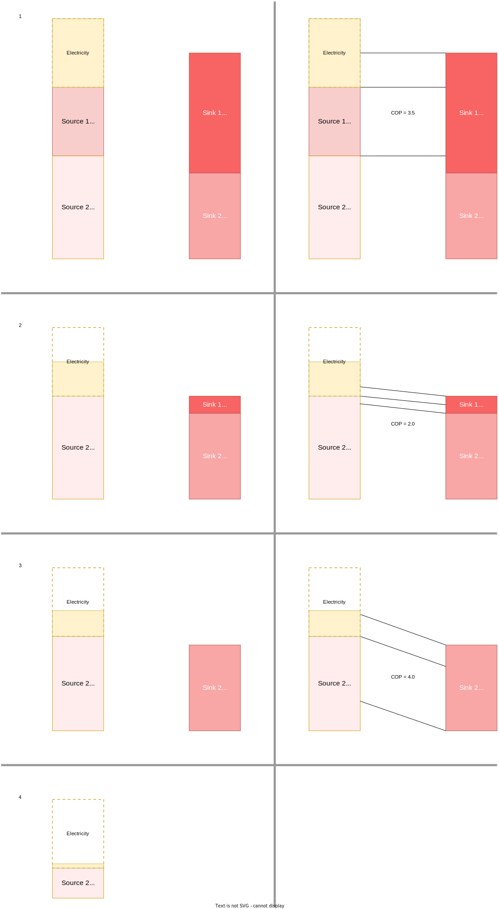
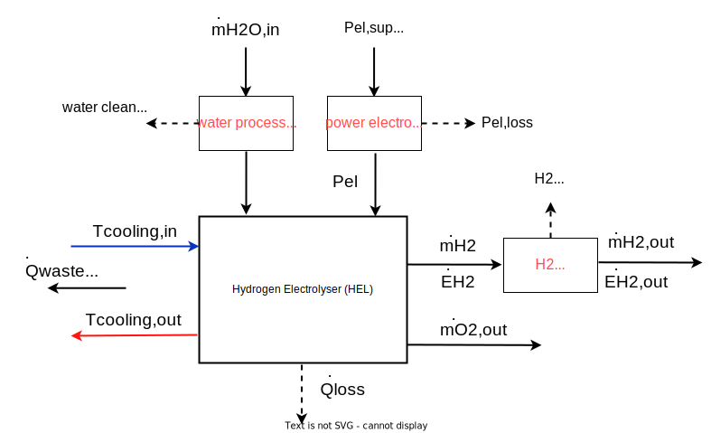
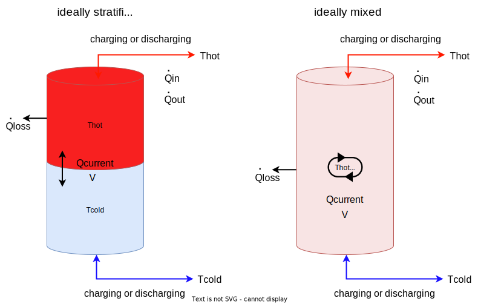
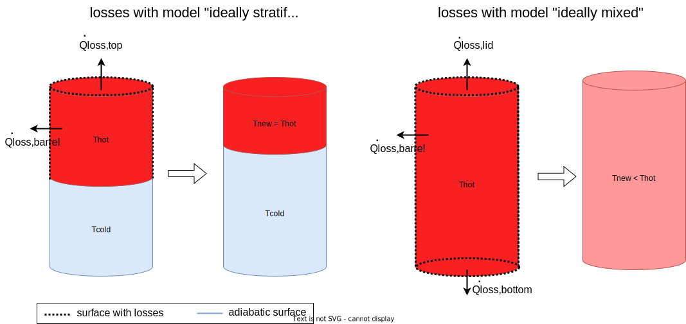

# Technical description of main components

In this chapter the mathematical models of components, that are used in ReSiE for the simulation of energy systems, are described. In this context a component is defined as one energy processing part (e.g. a heat pump) of the overall system, while the combination of multiple interconnected components is defined as an energy system. For each component the implemented calculation rules and relevant physical quantities and parameters are described. You can find a detailed description of customizable parameters in the [corresponding chapter](resie_component_parameters.md).

**Note: Not all components described here are implemented in ReSiE yet but all will be included in upcoming versions! Currently, only simplified component models are integrated. Also, the descriptions are not yet completed and may change later.**

## Conventions

Symbols:

- Scalars are shown in italic letters (normal math: \(T \ t\))
- Vectors or time series in bold and italic letters (boldsymbol: \(\boldsymbol{T \ t}\))
- Matrices are bold and non-italic (textbf: \(\textbf{T t}\))
- Time-derivatives are noted with \(\dot{E}\), meaning \(\dot{E} = \frac{dE}{dt}\)
- General energies are noted with \(E\), general power with \(\dot{E} = P\). Thermal energies are noted with \(Q\) and thermal power with \(\dot{Q}\).
 
Components:

- Energy flows into a component are positive, energy flows out of a component are negative
- Components are single units like a heat pump, a buffer tank, a battery or a photovoltaic power plant while energy systems are interconnected components
- Unlike in reality, where the ‘nominal power’ or ‘design power’ or ‘rated power’ of a component is not necessarily the maximum power that the component can deliver or requires, the ‘power’ parameter of a component here in ReSiE always refers to the maximum power that a component can deliver or requires. This is typically defined by one of the inputs or outputs of the component, e.g. by the electrical power consumption of an electrolyser or the heat production of a gas boiler.
- The fraction of utilised power divided by nominal power at a given point in time is called the part load ratio (PLR), or operation point, or power fraction, and can be signified with \(\kappa\) for the sake of brevity

## Heat pump (HP)
Heat pumps use thermodynamic cycles to elevate a medium on one side of the cycle to a higher temperature by lowering the temperature of the medium on the other side, which requires an input of electricity to run the sub-components. The electricity used becomes part of the heat being moved. Heat pump technologies include plants to provide buildings or heat networks with heat for room heating and DHW, as well as other uses such as refrigeration components or Peltier elements. While there are also heat pumps using chemical fuels instead of electricity, these are not included in the model within ReSiE. The two most common technologies, electrically driven variable-speed and on-off compressor heat pumps, are the best fit for the heat pump model described in the following.

### General description
The general system chart of a heat pump with the denotation of the in- and outputs is shown in the figure below. In general, a gaseous refrigerant is compressed by the compressor requiring electrical energy, resulting in a high temperature of the refrigerant. The refrigerant is then condensed in the condenser and it releases the energy to the condenser liquid at a high temperature level. After that, the refrigerant is expanded and completely liquefied in the expansion valve. In the following evaporator, the refrigerant is then evaporated at a low temperature level with the help of a low-temperature heat source, after which it is fed back into the compressor.


The energy balance at the heat pump is built up from the incoming electricity \(P_{el}\), the incoming heat at a low temperature level \(T_{source,in}\) and the outgoing heat flow at a higher temperature level \(T_{sink,out}\).

The energy balance of the heat pump model is shown in the following figure:


 
Using the electrical power \(P_{el,in}\), an energy flow \(\dot{Q}_{in}\) with temperature \(T_{source,in}\) is transformed to the energy flow \(\dot{Q}_{out}\) with temperature \(T_{sink,out}\).
The thermal energy losses \(\dot{Q}_{th,loss}\) and the losses in the power electronics \(P_{el,loss}\) are not taken into account in the actual heat pump model described below, as this would complicate the model even further. 
Instead, the energy losses are considered outside of the actual heat pump model and are therefore not part of the energy balance equation. The consideration of losses is described in more detail below.

The efficiency of the heat pump is defined by the coefficient of performance (COP). The COP determines the electrical power \(P_{el}\) required to raise the temperature of a mass flow from the lower temperature level \(T_{source,in}\) to \(T_{sink,out}\): 

$$ COP = \frac{\dot{Q}_{out}}{P_{el}} \quad  \leq \quad COP_{Carnot} = \frac{T_{sink,out}[K]}{T_{sink,out}-T_{source,in} } $$

$$ COP = \eta_{Carnot} \  COP_{Carnot} \quad \text{with} \quad 0 \leq \eta_{Carnot} \leq 1 $$

The COP is always smaller than the maximum possible Carnot coefficient of performance (\(COP_{Carnot}\)), which is calculated from the condenser outlet and evaporator inlet temperature. The maximum possible COP calculated by Carnot is reduced by the carnot efficiency factor \(\eta_{Carnot}\), which is according to [Arpagaus2018][^Arpagaus2018] around 45 % for high temperature heat pumps and around 40 % for conventional heat pumps.

The energy balance (or power balance) of the heat pump can be drawn up on the basis of the latter figure and on the ratio between supplied and dissipated heat power, expressed as the COP:

$$\dot{Q}_{out} = \frac{COP}{COP -1} \ \dot{Q}_{in} \mathrm{\quad with \quad} \dot{Q}_{out} = \dot{Q}_{in} + P_{el} $$

While ReSiE deals in energy values and energy flow (power), if required the following equation can be used to determine other variables of the heat input or output:

$$ \dot{Q} = \dot{m} \ c_{p} \ (T_{in} - T_{out}) $$

where \(\dot{m}\) is the mass flow of the medium and \(c_{p}\) its specific heat capacity.

### Modelling approaches: Overview
According to [Blervaque2015][^Blervaque2015], four different categories are described in the literature when it comes to the simulation of heat pumps:

- **quasi-static empirical models**: equation-fit models based on discretized manufacturer or certification data fitted to polynomials, used for example in EnergyPlus or TRNSYS
- **dynamic empirical models**: equation-fit models extended by continuous transient effects 
- **detailed physical models**: thermodynamic approach based on dynamic and refrigerant flow modelling, many parameters required
- **simplified physical models** or parameter-estimation models: based on physical model, but with less input parameter needed due to internal assumptions

[^Blervaque2015]:Blervaque, H et al. (2015): Variable-speed air-to-air heat pump modelling approaches for building energy simulation and comparison with experimental data. *Journal of Building Performance Simulation 9 (2)*, S. 210–225. doi: [10.1080/19401493.2015.1030862](https://doi.org/10.1080/19401493.2015.1030862). 

[^Arpagaus2018]: Arpagaus C. et al. (2018): High temperature heat pumps: Market overview, state of the art, research status, refrigerants, and application potentials, *Energy*, doi: [10.1016/j.energy.2018.03.166](https://doi.org/10.1016/j.energy.2018.03.166)

For the simulation of energy systems in an early design phase, for which QuaSi is intended, only quasi-static or dynamic empirical models can be considered due to the lack of detailed information about the technical components used and the computational effort required for physical models. Therefore, an empirical model based on manufacturer data or certification process data is implemented in ReSiE.

There are several aspects to be considered when simulating a heat pump based on equation-fitting, which will be briefly described in the following:

The COP of a heat pump, representing the efficiency in a current timestep, depends highly on the temperature of the source and the requested temperature of the heat demand. Generally speaking, the efficiency and thus the COP decreases with larger temperature differences between source and sink.

Additionally, the maximum thermal power of the heat pump is not constant for different operational temperatures. The available thermal power is decreasing with lower source temperature, an effect that mainly occurs in heat pumps with air as the source medium. The rated power given in the literature for a specific heat pump is usually only valid for a specified combination of sink and source temperature. The specification for the declaration of the rated power is described in DIN EN 14511[^DINEN14511].

[^DINEN14511]: DIN EN 14511:2018 (2018): Air conditioner, liquid chilling packages and heat pumps for space heating and cooling and process chillers, with electrically driven compressors. DIN e.V., Beuth-Verlag, Berlin.

Furthermore, the efficiency and therefore the COP is changing in part load operation. In the past, mostly on-off heat pump were used, regulating the total power output in a given time span by alternating the current state between on and off. This causes efficiency losses mostly due to thermal capacity effects and initial compression power needed at each start, or rather the compression losses at each shutdown. [Socal2021][^Socal2021]
In the last few years, modulating heat pumps have become more common, using a frequency inverter at the electrical power input to adjust the speed of the compression motor and therefore affect the thermal power output. Interestingly, this method leads to an efficiency increase in part load operation with a peak in efficiency at around 30 to 60 % of the maximum power output. In the literature, many research groups have investigated this effect, compare for example to Bettanini2003[^Bettanini2003], Toffanin2019[^Toffanin2019], Torregrosa-Jaime2008[^Torregrosa-Jaime2008], Fuentes2019[^Fuentes2019], Blervaque2015[^Blervaque2015] or Fahlen2012[^Fahlen2012].

When heat pumps with air as source medium are used, the losses due to icing effects need to be considered as well.

[^Bettanini2003]: Bettanini, E.; Gastaldello, A.; Schibuola, L. (2003): Simplified Models to Simulate Part Load Performance of Air Conditioning Equipments. *Eighth International IBPSA Conference, Eindhoven*, Netherlands, S. 107–114.

[^Toffanin2019]: Toffanin, R. et al. (2019): Development and Implementation of a Reversible Variable Speed Heat Pump Model for Model Predictive Control Strategies. *Proceedings of the 16th IBPSA Conference*, S. 1866–1873.

[^Torregrosa-Jaime2008]: Torregrosa-Jaime, B. et al. (2019): Modelling of a Variable Refrigerant Flow System in EnergyPlus for Building Energy Simulation in an Open Building Information Modelling Environment. *Energies 12 (1)*, S. 22. doi: [10.3390/en12010022](https://doi.org/10.3390/en12010022).

[^Fuentes2019]: Fuentes, E. et al. (2016): Improved characterization of water-to-water heat pumps part load performance. *REHVA Journal*, August 2016.

[^Blervaque2015]: Blervaque, H et al. (2015): Variable-speed air-to-air heat pump modelling approaches for building energy simulation and comparison with experimental data. *Journal of Building Performance Simulation 9 (2)*, S. 210–225. doi: [10.1080/19401493.2015.1030862](https://doi.org/10.1080/19401493.2015.1030862). 

[^Fahlen2012]: Fahlén, Per (2012): Capacity control of heat pumps. *REHVA Journal Oktober 2012*, S. 28–31.

For a more realistic representation, all four discussed effects need to be considered - temperature-dependent COP, temperature-dependent power, part-load-dependent COP and icing losses. The calculation of these dependencies will be described below.

### Modelling approaches: Detail
#### Temperature-dependent COP

The temperature-dependent \(COP_{dynamic}\) can be calculated from different methods:

- Using the \(COP_{Carnot}\) with the Carnot efficiency factor \(\eta_{Carnot}\) as explained above. This is easy, simple and fast, but leads to unrealistically high efficiency with small temperature differences between source and sink.
- Looking up the \(COP_{dynamic}\) in a look-up table in dependence of the condenser outlet and the evaporator inlet temperature. These are usually taken from manufacturer data sheets and/or measurements and interpolated between support values.
- Calculating the \(COP_{dynamic}\) as fraction of temperature-dependent electrical and thermal power, gained from the maximum power output of the heat pump, which is itself a function of the inlet and outlet temperatures. This method however implies that the heat pump runs at full power, as the COP furthermore changes with the PLR (see following sections).

As example for a lookup-table COP, the following figure from Steinacker2022[^Steinacker2022] shows a map of a high-temperature heat pump as a set of curves, depending on the evaporator inlet and condenser outlet temperature and assuming full power. In three dimensions, this figure would result in a surface that can be interpolated between the given support values.


For ReSiE the first two were chosen as available methods, with the Carnot method mostly for cases in which little information on the heat pump is available or high performance is required. For the method using lookup-tables, bi-linear interpolation is done for values between the support values. 

##### By-pass
When the source temperature is equal or higher than the requested sink temperature, a heat pump does not have to go through the thermodynamic cycle and can instead carry the heat from the source to the sink acting like a heat exchanger. In real systems this still requires some electricity to run the pumps and the sensors. To model this, a constant, relatively high \(COP_{bypass}\) is chosen to approximate the work the pumps have to perform.

##### Losses
Losses in a heat pump can be considered either as efficiency losses, which lead to a reduction in the COP and thus an
increase in the electrical energy input, or as actual energy losses that affect the energy balance of the entire model, 
such as heat losses due to radiation or heat losses in the power electronics. Efficiency losses that affect the COP, 
e.g. due to partial load operation or high output temperatures, are discussed in the other sections. 
Actual energy losses are not directly included in the heat pump model, but can be taken into account by means of a "wrap-around". 
Both electrical (\(P_{el,loss}\)) and thermal energy losses (\(\dot{Q}_{th,loss}\)) can be applied as fractions of the 
current electrical and thermal energy demand of the heat pump at each time step, which leads to an increase in energy 
demand that cannot be utilised as useful thermal energy:

$$P_{el,supply} = P_{el} + P_{el,loss} = \frac{P_{el}}{\eta_{el}}$$

$$\dot{Q}_{in,supply} = \dot{Q}_{in} + \dot{Q}_{th,loss} = \frac{\dot{Q}_{in}}{\eta_{th}}$$

When modelling, attention must be paid to which effects are already taken into account in a provided COP curve and 
which must be additionally mapped via the "wrap-around" for electricity and heat demand using the efficiencies 
\(\eta_{el}\) and \(\eta_{th}\).

Note that \(\eta_{th}\) should rather be seen as a fictitious efficiency that covers all heat losses of the heat pump 
in relation to the thermal energy input in every time step. When using measured data, it represents the energy that is 
missing in the energy balance when measuring the thermal input, electrical input and thermal output energy. 

In measurement data a certain constant electrical demand can often be observed when the heat pump is not running, which is likely caused by eletronic components that are always running or in stand-by mode. This can be approximated by a constant electric power loss term \(P_{el,loss,constant}\) that is always applied and effectively reduces the available electric energy or, if electricity is not the limiting factor, an additional electric demand from the heat pump. Considering this additional loss term results in:

$$P_{el,supply} = P_{el} + P_{el,loss} + P_{el,loss,constant}$$

$$P_{el} = (P_{el,supply} - P_{el,loss,constant}) \cdot \eta_{el} $$

#### Maximum and minimum thermal output power

With the COP of the heat pump determined by one of the methods described in the previous section, the maximum and minimum power of the heat pump is modeled independently, but in relation to the source and sink temperatures. In general, power of the heat pump is understood as the thermal output of the heat pump here. In the following the nominal power \(\dot{Q}_{nominal}\) of the heat pump, user-provided via the input file, is defined as the highest maximum thermal output power value over all possible temperature values and at the part load ratio with the best efficiency \(\kappa_{opt}\). This is different than in real systems, where the nominal power is defined at a particular pair of input/output temperature values. For the model instead, it is important that \(\dot{Q}_{out} \leq \dot{Q}_{nominal}\) in all cases.

Comparing available data of many different heat pumps from Stiebel-Eltron[^Stiebel-EltronTool], specifically those with air as the source medium, three important observations can be made:

* The minimum power of a heat pump also plays a role as this can be a significant fraction of the maximum power and in some cases even limit the heat pump to a single on-or-off operational state at a fixed power
* The maximum and minimum power values vary a lot across the possible source and sink temperatures
* The differences between heat pump systems necessitates that the curves, if this information is available, can be given as input to the simulation for improved accuracy compared to averaged curves

In the simulation, the maximum and minimum power are calculated based on \(\dot{Q}_{nominal}\) multiplied with a reduction factor as a function of the source and sink temperature, \(f_{max}(T_{source,in},T_{sink,out})\). This reduction curve has to be normalized and should return values in \([0,1]\):

$$ \dot{Q}_{out,max} = f_{max}(T_{source,in},T_{sink,out}) \cdot \dot{Q}_{nominal}$$
$$ \dot{Q}_{out,min} = f_{min}(T_{source,in},T_{sink,out}) \cdot \dot{Q}_{nominal}$$

If no specific curves are known for the heat pump, a model based on biquadratic polynomials is described in TRNSYS Type 401 and can be used as a best guess. Note that this must be normalised before it is entered into the model:

$$ \dot{Q}_{out,max} = c_{q1} + c_{q2} \ \bar{T}_{source,in} + c_{q3} \ \bar{T}_{sink,out}  + c_{q4} \ \bar{T}_{source,in} \ \bar{T}_{sink,out} \\
+ \ c_{q5} \ \bar{T}_{source,in}^2  + c_{q6} \ \bar{T}_{sink,out}^2  $$

where all temperatures are normalised according to
$$ \bar{T} = \frac{T \ [°C]}{273.15} + 1 $$

Note that this does not include a formulation for minimum power, which is assumed to be zero. It is an open question if any set of coefficients exists, that can represent most heat pump technologies with reasonable accuracy. We would be glad to include these as default values.

[^Stiebel-EltronTool]: Stiebel-Eltron Heat Pump Toolbox: [https://www.stiebel-eltron.com/toolbox/waermepumpe/](https://www.stiebel-eltron.com/toolbox/waermepumpe/)

#### Part load efficiency

The COP of the modeled heat pump depends not only on the temperatures of the sink and the source but also on the current part load ratio (PLR) \(\kappa\). The COP can be corrected using a part load factor (PLF) that is dependent of the PLR:

\(COP(\kappa) = COP(1.0) \cdot PLF(\kappa) \)

The PLF curve is an input to the simulation and can be configured by a variety of function prototypes. This is described in more detail in the [corresponding section on function definitions](resie_component_parameters.md#efficiency-functions).

The literature provides different examples for the correlation of the COP to the PLR (see section "Overview" for literature examples). This relation is non-linear as shown for example in the following figure given the part-load-dependent COP of an inverter-driven ENRGI-Heatpump at different temperature levels (Source: Enrgi[^2]).


[^2]: [https://enrgi.de/wp-content/uploads/2022/08/Datenblatt_ecoGEO_B-C_1-9kW.pdf](https://enrgi.de/wp-content/uploads/2022/08/Datenblatt_ecoGEO_B-C_1-9kW.pdf)

The part-load behavior depends also on the type of the heat pump (on-off or inverter heat pump), as shown for example in Bettanini2003[^Bettanini2003] or in Socal2021[^Socal2021]. For illustration, the following figure is taken from the latter reference to demonstrate the different part load factors of the COP (y-axis) at different part load ratios for different heat pump technologies:


Taking the correction factor curve from the figure above for inverter heat pumps, the maximum part load factor is reached at 50 % part load with an increase of the COP by about 10%. Contrary, in Toffanin2019[^Toffanin2019], the part load factor is assumed to be much higher, reaching its maximum at 25 % part load ratio with a part load factor of 2.1 (efficiency increase of 110 %). These discrepancies illustrate the wide range of literature data and the difficulty in finding a general part load curve. In Lachance2021[^Lachance2021], several part load curves are compared.

A unified formulation for on-off and inverter heat pumps can be derived from descriptions in the literature. The PLF curve for inverter-driven heat pumps is based on Blervaque2015[^Blervaque2015] and Filliard2009[^Filliard2009]. There, the curve is defined in two separate sections. The section below the point of maximum efficiency is a function according to the PLF calculation in DIN EN 14825 for water-based on-off heat pumps, differing from the cited paper according to Fuentes2019[^Fuentes2019]. The section above the point of the maximum efficiency is approximated as linear. The definition of these curve can be done entering the coefficient \(c\) and the coordinates of the two points highlighted in the figure below. Here, \(c\) is chosen as 0.95 and \(a\) is used to stretch the curve to meet the intersection point with the straight line.


This results in the following equation to calculate the part load factor for inverter-driven heat pumps, defined by the coefficients \(c\) and \(a\) according to DIN EN 14825 and the point of maximum efficiency at (\(\kappa_{opt}\),\(PLF_{opt}\)):

$$
PLF(\kappa) = 
\begin{cases}
a \ \frac{\kappa}{c \ \kappa + 1 - c}  & \text{ for } \kappa < \kappa_{opt} \\
\frac{PLF(1.0) - PLF_{opt}}{1-\kappa_{opt}} \ (\kappa  - \kappa_{opt} ) + PLF_{opt}   & \text{ for } \kappa >= \kappa_{opt} 
\end{cases} \\
\text{ with } a = \frac{PLF_{opt}}{\kappa_{opt}} \left ( c \ (\kappa_{opt}-1)+1  \right ) \text{ and } 0 < c < 1
$$
 
For on-off heat pumps, \(a = 1\) and \(\kappa_{opt} = 1\).

##### Calculating energies from the part-load-dependent efficiency
As described in the [corresponding section](resie_transient_effects.md#part-load-ratio-dependent-efficiency), it is possible to calculate the input and output energies from the efficiency as function of the PLR through numerical inversion in a pre-processing step. However because of reasons described in [the section on the slicing algorithm](resie_energy_system_components.md#slicing-algorithm), this does not work if there are multiple sources or multiple sinks to be considered. In addition, several multidimensional functions for various effects would have to be considered, which increases the complexity a lot. Therefore this is not implemented, which leads to worse performance for heat pumps with exactly one source and exactly one sink as compared to the theoretical case. A future update might address this problem.

[^Socal2021]: Socal, Laurent (2021): Heat pumps: lost in standards, *REHVA Journal August 2021*.
[^Filliard2009]: Filliard, Bruno; Guiavarch, Alain; Peuportier, Bruno (2009): Performance evaluation of an air-to-air heat pump coupled with temperate air-sources integrated into a dwelling. *Eleventh International Building Simulation Conference 2009*, S. 2266–73, Glasgow.
[^Lachance2021]:Lachance, Alex; Tamasauskas, Justin; Breton, Stéphanie; Prud’homme, Solange (2021): Simulation based assessment on representativeness of a new performance rating procedure for cold climate air source heat pumps. *E3S Web Conf. 246, S. 6004.* doi: [10.1051/e3sconf/202124606004](https://doi.org/10.1051/e3sconf/202124606004).

##### Cycling losses, start-up ramps and cooldown
The general effect of energy system components experiencing reduced output power and/or efficiency during a starting phase of operation is described in [this section](resie_transient_effects.md#part-load-ratio-dependent-efficiency). This effect is also observed for heat pumps and described in the literature. At the moment this effect is not included in the model and not implemented. This will be included in a future update as it is a vital part of a detailed operational simulation. 

The cycling losses of an alternating heat pump are covered by the part-load-dependent efficiency functions. 

#### Icing-losses of heat pumps with air as source medium

To account for icing losses of heat pumps with air as source medium, the approach presented in TRNSYS Type 401 is used[^Wetter1996]. When enabling calculation of icing-losses it is necessary to ensure that the COP curves do not already take icing into consideration.

For the calculation of icing losses, five coefficients are needed: \(c_{ice,A}\), \(c_{ice,B}\), \(c_{ice,C}\), \(c_{ice,D}\) and \(c_{ice,E}\). According to the Type 401, icing losses are calculated using a superposition of a gaussian curve with its maximum between 0 °C and 5 °C representing the maximum likelihood of frost within the heat pump (high absolute humidity) and a linear curve, representing the higher sensible energy effort to heat-up the components of the heat pump for defrosting. Exemplary curves are shown in the following figure (linear, gauss and superposition):


The exemplary coefficients for the curves in the figure above are \(c_{ice,A} = 3\), \(c_{ice,B} = -0.42\), \(c_{ice,C}=15\), \(c_{ice,D}=2\), \(c_{ice,E}=30\).

The resulting superposition, which represents the percentage loss of the COP due to icing as a function of ambient temperature, is expressed by the following formula, where the coefficients are reduced to the last letter for better readability:
$$
 \Delta COP_{ice,loss} = \begin{cases}
		A + B \ T_{source,in} + C \ exp^{-\frac{(T_{source,in}-D)^2}{E}} &\text{for } A + B \ T_{source,in} > 0\ \\[5pt]
	    C \ exp^{-\frac{(T_{source,in}-D)^2}{E}} &\text{for } A + B \ T_{source,in} \leq 0\ \\	
	\end{cases} \\
$$

\(\Delta COP_{ice,loss}\) can then be used to reduce the COP for icing losses:

$$ COP_{ice,corrected} =  COP \ (1- \frac{1}{100} \ \Delta COP_{ice,loss}) $$

According to the results found in Wei2021[^Wei2021], it is assumed that the decrease of the COP due to icing losses will only increase the power input of the heat pump. It will not affect the thermal power output.

[^Wei2021]: Wei, Wenzhe et al. (2021): Investigation on the regulating methods of air source heat pump system used for district heating: Considering the energy loss caused by frosting and on–off. In: *Energy and Buildings 235*, S. 110731. doi: [10.1016/j.enbuild.2021.110731](https://doi.org/10.1016/j.enbuild.2021.110731).


### Steps to perform in the simulation model of the heat pump
The following section shows the calculation steps that are performed in the heat pump model of ReSiE to determine operation.

#### Slicing algorithm
A heat pump can be set up within an energy system such that multiple sources and/or multiple sinks are connected to it via busses. This corresponds to a real system providing heat for different demands (such as room heating and DHW) or being supplied with sources of different temperatures with the aim of preferably using higher source temperatures for increased efficiency. A real system would typically supply one sink at a time based on temperatures in pipes or tanks and similarly switch between sources based on their temperatures. In the model the heat pump cuts the current time step into slices such that exactly one source layer and exactly one sink layer is considered in each slice and the amount of time spent on each slice adds up to equal or less than the entire time step.



The figure above shows how the algorithm works for an example with two sources and two sinks and a limited amount of electricity available. Both sources and sinks are sorted according to priorities, but the heat pump could also change the order based on [control modules](resie_operation_control.md#control-modules). The algorithm goes through four steps to calculate which source layer supplies how much heat to which sink layer and how much electricity is used overall:

1. In the first step source 1 has 4 units of energy left at 25 °C to supply 7 units of heat at 70 °C and 4 units of electricity are available. With a COP of 4.0, the result is that the source layer is used up completely, which requires 2 units of electricity and produces 6 units of heat.
2. In the second step 1 unit of heat is left to be supplied at 70 °C. The second source layer supplies 0.5 units of heat and requires 0.5 units of electricity, for a COP of 2.0.
3. In the third step the second sink layer with 5 units of heat at 45 °C can be supplied from the remaining 5.5 units of the second source layer. With a COP of 4.0 this requires 1.25 units of electricity. If the remaining available electricity had been less than 1.25 units, some energy of the second sink layer would have been left unsupplied.
4. In the fourth step it is detected that one of the inputs or outputs, namely the heat output, was used up completely and the algorithm finishes.

Note that the algorithm also works with sources and sinks that can supply/request an infinite amount of energy as long as it is never the heat input *and* heat output that are infinite.

#### Process of calculating energies for one slice
The following pseudo-code example shows how the energies for one slice are calculated:

```pseudo
function energies_for_one_slice(
    available_heat_in,
    available_el_in,
    available_heat_out,
    T_source_in,
    T_sink_out,
    kappa
) returns
    used_heat_in,
    used_el_in,
    used_heat_out
begin

    if (COP is constant) then
        COP = COP_const()
    else if (T_source_in >= T_sink_out) then
        COP = COP_bypass()
    else
        COP = COP_dynamic(T_source_in, T_sink_out)
        COP = COP * PLF(kappa)
        COP = COP * (1 - icing_losses(T_source_in) / 100)
    end

    used_heat_in = available_heat_in
    used_el_in = used_heat_in / (COP - 1)
    used_heat_out = used_heat_in + used_el_in

    if (used_heat_out > available_heat_out) then
        used_heat_out = available_heat_out
        used_el_in = used_heat_out / COP
        used_heat_in = used_el_in * (COP - 1)
    end

    if (used_el_in > available_el_in) then
        used_el_in = available_el_in
        used_heat_in = used_el_in * (COP - 1)
        used_heat_out = used_heat_in + used_el_in
    end
end
```
This function is not concerned with the power at which the heat pump can operate for the given slice and does not decide the PLR. The inputs to the function are available energies (or to be supplied for the heat output), temperatures and the PLR. They are specific to the slice in question.

#### Part load operation and optimisation of PLR
Given the slicing algorithm and the function `energies_for_one_slice` as described above, it is then the question of how much power is available for each slice and at which PLR each slice is performed. The minimum and maximum power for each slice depends only on temperatures, however the PLR does affect the COP.

Three different approaches to solve this problem are implemented, controlled by the `model_type` parameter:

* For the `simplified` model, the PLR is set to `1.0` for all possible slices and the slicing algorithm is performed once to get a result. This offers good performance and can be used if the PLF function is constant.
* For `on-off` heat pumps, the PLRs are initially set to a value determined from the demands in that time step. Then an optimisation of the PLR values is performed to find values that meet demands and try to make the time spent on each slice sum up to the time step. This captures the cycling losses of a on-off heat pump using the PLF function, which is strictly less than `1.0`.
* This works similarly for `inverter` heat pumps, which also optimise PLR values, however the objective function is chosen to prefer lower electricity input, to capture the increased efficiency of the heat pump when running close to the optimal PLR.

In the latter two cases the optimisation is required for accurate calculation, but incurs a fairly large performance penalty. It can be configured to use fewer iterations, however no clever configuration can avoid this penalty and it might be better to use the simplified model when performance is important, then switch to a detailed calculation once a specific solution is identified.

[^Wetter1996]: Wetter M., Afjei T.: TRNSYS Type 401 - Kompressionswärmepumpe inklusive Frost- und Taktverluste. Modellbeschreibung und Implementation in TRNSYS (1996). Zentralschweizerisches Technikum Luzern, Ingenieurschule HTL. URL: [https://trnsys.de/static/05dea6f31c3fc32b8db8db01927509ce/ts_type_401_de.pdf](https://trnsys.de/static/05dea6f31c3fc32b8db8db01927509ce/ts_type_401_de.pdf)


**Inputs und Outputs of the Heat Pump:**

Symbol | Description | Unit
-------- | -------- | --------
\(\dot{Q}_{in,supply}\) | heat flow supplied to the HP (heat source, including thermal losses) | [W]
\(\dot{Q}_{in}\) | heat flow supplied to the HP (heat source, directly into the heat pump excluding losses) | [W]
\(\dot{Q}_{out}\) | heat flow leaving the HP (heat sink) | [W]
\(P_{el,supply}\) | electric power demand of the HP (including losses from the power electronics) | [W]
\(P_{el}\) | electric power demand of the HP (directly into the heat pump, excluding losses) | [W]
\(\dot{Q}_{th,loss}\) | thermal energy losses | [W]
\(P_{el,loss}\) | electrical energy losses | [W]
\(T_{sink,out}\) | condenser outlet temperature | [°C]
\(T_{source,in}\) | evaporator inlet temperature | [°C]
\(COP\) | calculated COP | [-]
\(COP_{effective}\) | calculated COP including losses of the power electronics | [-]
\(T_{in,mixed}\) | weighted-mean of chosen input temperatures | [°C]
\(T_{out,mixed}\) | weighted-mean of chosen output temperatures | [°C]
\(\kappa_{avg}\) | weighted-mean of the \(\kappa\) of each slice | [-]
\(t_{active}\) | activation time factor as fraction of the simulation time step, during which the heat pump was active | [-]

**Parameters of the Heat Pump:** 

Symbol | Description | Unit
-------- | -------- | --------
\(\dot{Q}_{nominal}\) | nominal (= maximum!) thermal energy output of heat pump |  [W]
\(\dot{Q}_{out,max}(T_{source,in}, T_{sink,out})\) | function for maximum thermal heat output at given temperatures | [W]
\(\dot{Q}_{out,min}(T_{source,in}, T_{sink,out})\) | function for minimum thermal heat output at given temperatures | [W]
\(f_{max}(T_{source,in},T_{sink,out})\) | function applied to \(\dot{Q}_{nominal}\) to calcualate  \(\dot{Q}_{out,max}\) | [-] [0:1]
\(f_{min}(T_{source,in},T_{sink,out})\) | function applied to \(\dot{Q}_{nominal}\)  to calcualate  \(\dot{Q}_{out,min}\) | [-] [0:1]
\(COP_{dynamic}(T_{source,in}, T_{sink,out})\) | function for COP depending on \(T_{source,in}\) and \(T_{sink,out}\) | [-]
\(COP_{constant}\) | constant COP, if given overrides dynamic COP and bypass calculation | [-]
\(COP_{bypass}\) | COP during bypass operation | [-]
\(PLF(\kappa)\) | function used to modify the COP depending on \(\kappa\)
\(\kappa_{max}\) | maximum PLR, usually 1.0, but might differ depending on control modules | [-]
\(c_{ice,A} \ : \ c_{ice,E}\) | five coefficients for curve with icing losses according to TRNSYS Type 401 (air-sourced heat pumps only) | [-]
\(\eta_{el}\) | efficiency of the power electronics | [-]
\(\eta_{th}\) | efficiency factor representing possible thermal energy losses with respect to the thermal input power | [-]
\(P_{el,loss,constant}\) | constant loss of electricity input, even when the heat pump is not running | [W]

## Chiller
Various technologies exist to provide cooling power on a scale of buildings or for industrial processes. All of them function similar to [heat pumps](resie_energy_system_components.md#heat-pump-hp) in that they transfer heat from one end of a thermodynamic cycle to the other. The difference is that for a chiller the useful energy is not \(\dot{Q}_{out}\) but \(\dot{Q}_{in}\).

Regarding the efficiency of a chiller, a common concept is the energy efficiency ratio (EER) defined as:
 
$$ EER = \frac{\dot{Q}_{in}}{P_{el}} = \frac{\dot{Q}_{out} - P_{el}}{P_{el}} = COP - 1 $$

Because cooling demands in ReSiE are modeled as fixed sources of heat, no changes in the heat pump definition is required and the EER is not needed for calculation. This should be taken into account when consulting literature to determine the efficiency as sometimes the EER value is listed, but labeled as COP.

The example ["Heating and cooling demands"](resie_exemplary_energy_systems.md#heating-and-cooling-demands) shows how a cooling demand can be handled using a heat pump.

### Compression chiller (CC)
Compression chillers are modeled as compression [heat pumps](resie_energy_system_components.md#heat-pump-hp). The produced waste heat, at a higher temperature then the cooling demand, can be removed from the system by a generic bounded sink.

### Absorption/adsorption chiller (AAC)

Absorption/adsorption chillers are not implemented yet.


## Hydrogen Electrolyser (HEL)

Implements traits: [PLR-dependent efficiency](resie_transient_effects.md#part-load-ratio-dependent-efficiency)

The hydrogen electrolyser uses electrical energy to split water into its components hydrogen (\(H_2\)) and oxygen (\(O_2\)) as shown in the following reaction equation: 

$$ 2 \ H_2O \rightarrow 2 \ H_2 + O_2 $$

While there is electrolyser technology to work with other chemical reactions or solutions of minerals in water (e.g. sea water hydrolysis), this model focuses on electrolysers splitting purified water as this is the most relevant technology at time of writing.

The use of waste heat of the electrolysis is an important factor for the overall efficiency of the electrolyser. This importance stems from both a substantial, non-reducable part of the input electricity being transformed into waste heat and by several effects concerning the temperature and availability of the heat outputs.

The general energy and mass flow in the electrolyser as well as the losses considered in the model can be seen in the following figure.



The relationship between supplied hydrogen of the electrolysis (energy \(\dot{E}_{H_2}\) or mass flow \(\dot{m}_{H_2}\)) and the consumption of electrical energy \(P_{el}\) is given in the following equation, where \(e_{H_2}\) can be either the net or the gross calorific value of hydrogen:
$$
\begin{align}
\dot{E}_{H_2}=  P_{el} \enspace \eta_{H_2}
\end{align}
$$

$$ 
\begin{equation}
\dot{m}_{H_2} =  \frac{\dot{E}_{H_2}}{e_{H_2}} 
\end{equation}
$$

Some part of the waste heat apart of the cooling loop can potentially be utilised. Electrolysers tend to be designed for high power draw and subsequentially produce a comparitively large amount of low temperature waste heat from power system cooling, radiative and conductive losses of the stacks and pressure handling, among other sources. Depending on the installation and configuration of the equipment some of this low temperature waste heat can be usable instead of being removed from the energy system entirely. A realised \(1 \ MW_e\) PEM electrolyser [^Stickel2024] was reported to make use of the low temperature waste heat and produce in 2023, via a heat pump, 261 MWh high temperature heat using 91 MWh of electricity for a COP of 2.87. However as not all installations can make use of this waste heat, in the model this can be toggled off, which will cause the low temperature waste heat to be counted towards the overall losses of the electrolyser.

Due to the difficulty of finding good numbers for parameters as well as reducing the model complexity to energy balances, the model displayed above is restructured to combine the losses of water purification and power electronics by affecting the efficiency of producing hydrogen from input electricity and the amount of high and low temperature waste heat. The losses of hydrogen from purification processes is modeled as two efficiencies curves for produced hydrogen with one including losses and one excluding them.


The figure above shows the inputs and outputs of the reduced model with the following relations:

$$ \dot{E}_{H_2} = \eta_{H_2}(\kappa) \ P_{el} $$

$$ \dot{E}_{H_2,out} = (\eta_{H_2}(\kappa) - \eta_{H_2,loss}(\kappa)) \ P_{el} $$

$$ P_{H_2,loss} = \dot{E}_{H_2} - \dot{E}_{H_2,out} $$

$$ \dot{Q}_{heat,high} = \eta_{heat,high}(\kappa) \ P_{el} $$

$$ \dot{Q}_{heat,low} = \eta_{heat,low}(\kappa) \ P_{el} $$

$$ \dot{Q}_{loss,heat} = P_{el} - \dot{Q}_{heat,high} - \dot{Q}_{heat,low} - \dot{E}_{H_2} $$

$$ P_{losses} = \dot{Q}_{loss,heat} - P_{H_2,loss} $$

Since the oxygen produced during the electrolysis process can also be utilized under certain circumstances, the resulting oxygen mass flow \(\dot{m}_{O_2,out}\) is determined from the stoichiometric ratio of the hydrolysis reaction equation:

$$ \dot{m}_{O_2,out} =  v_{O_2,H_2} \ \dot{m}_{H_2} $$
$$ \text{with} \quad v_{O_2,H_2} = \frac{atomic \ mass \ O_2}{2 \cdot atomic \ mass \ H_2} = \frac{2 \cdot 15.999 \ u}{2 \cdot 2 \cdot 1.0008 \ u} = 7.9386 $$

**Note: At the moment the pressure, at which the stacks operate and the hydrogen is extracted and purified, is assumed to be constant throughout the entire process and does not affect efficiencies or heat by-products. This might be addressed in a future release.**

### Unit dispatch

Depending on the sizing and technology of realised electrolysers, the whole plant often consists of more than one stack and/or more than one set of power supply equipment. This is modeled as the electrolyser consisting of \(N_{unit}\) units, which are all the same in regards to design power and efficiencies. The efficiency functions given as input parameters thus relate to a single unit with its own power supply subsystem. The electricity input of the overall electrolyser is split across the active units in a single timestep with no losses occuring before the split. Rather, each unit individually calculates its losses from the available energy. In a similar manner the hydrogen, oxygen and heat outputs are summed over the active units with losses being considered by each.

Different options exist for how to dispatch the units to meet a demand, in particular as the minimum power fraction \(\kappa_{min,unit}\) of each unit tends to be fairly high and a lower overall \(\kappa_{min}\) can only be achieved by not activating all units. In addition, the efficiencies of each unit are not necessarily optimal at full load and a performance increase can be achieved by choosing the right number of units to activate close to the optimal PLR.

**Note:** The electrolyser is only operated between \(\kappa_{min}\) and maximum 100 % load. A specification of power above nominal power, which can occur in practice under certain circumstances, is not supported. The efficiency curves should take this into account. The nominal power should reflect the maximum operation point that can be sustained for several hours.

The currently implemented dispatch strategies for electrolysers are:

* **Equal distribution:** This spreads the load evenly across all units. This is a simplified model that ignores \(\kappa_{min,unit}\).
* **Equal distribution with minimum power fraction:** Same as an equal distribution, however if the total \(\kappa\) is lower than \(\kappa_{min,unit}\), then a number of units are activated at a calculated \(\kappa\) to ensure the minimum restriction is observed and the demand is met.
* **Try optimal PLR:** Attempts to activate a number of units close to their optimal PLR to meet the demand. If no optimal solution exists, typically at very low \(\kappa\) or close to the nominal power, falls back to activating only one or all units.

**Inputs and Outputs of the Electrolyser:**

Symbol | Description | Unit
-------- | -------- | --------
\(P_{el}\) | electrical power requirement of the electrolyser | [W]
\(\dot{m}_{O_2,out}\) | oxygen mass flow delivered by the electrolyser | [kg/h]
\(\dot{m}_{H_2}\) | hydrogen mass flow produced by the electrolyser (before \(H_2\) losses) | [kg/h]
\(\dot{m}_{H_2,out}\) | hydrogen mass flow provided by the electrolyser (after \(H_2\) losses) | [kg/h]
\(\dot{E}_{H_2}\) | hydrogen energy flow discharged from the electrolyser (before \(H_2\) losses) | [W]
\(\dot{E}_{H_2,out}\) | hydrogen energy flow provided by the electrolyser (after \(H_2\) losses) | [W]
\(P_{loss,H2}\) | \(H_2\) losses | [W]
\(\dot{Q}_{heat,high}\) | high temperature heat provided by the electrolyser | [W]
\(\dot{Q}_{heat,low}\) | low temperature heat provided by the electrolyser | [W]
\(\dot{Q}_{loss}\) | thermal losses (unusable waste heat) | [W]
\(P_{losses}\) | Overall losses of the electrolyser | [W]

**Parameters of the Electrolyser:**

Symbol | Description | Unit
-------- | -------- | --------
\(P_{el,rated}\) | total electric power consumption of the electrolyser under full load (operating state 100 %) | [W]
\(N_{unit}\) | number of units that make up the electrolyser plant | [-]
dispatch strategy | method of dispatching the units of the electrolyser to meet demand | [-]
\(\eta_{H_2}(\kappa)\) | efficiency of hydrogen production of each unit as function of \(\kappa\) | [-]
\(\eta_{H_2,loss}(\kappa)\) | percentage of hydrogen losses of each unit as function of \(\kappa\) | [-]
\(\eta_{heat,high}(\kappa)\) | efficiency of high temperature heat production of each unit as function of \(\kappa\) | [-]
\(\eta_{heat,low}(\kappa)\) | efficiency of low temperature heat production of each unit as function of \(\kappa\) | [-]
\(\kappa_{min,unit}\) | minimum \(\kappa\) of each unit | [-]
\(\kappa_{min}\) | minimum total \(\kappa\) of the electrolyser | [-]
\(\kappa_{opt}\) | optimal \(\kappa\) of each unit at which \(H_2\) production is most efficient | [-]
\(e_{H_2} \) | mass-dependent energy of hydrogen (net calorific value or gross calorific value) | [Wh/kg]
\(v_{O_2,H_2} \) | stoichiometric mass-based ratio of oxygen and hydrogen supply during electrolysis | [kg \(O_2\) / kg \(H_2\)]
\(T_{heat,high}\) | cooling HT fluid outlet temperature of electrolyser | [°C]
\(T_{heat,low}\) | cooling LT fluid outlet temperature of electrolyser | [°C]

### Typical efficiency functions
**Note:** These are exemplary values and do not imply validation or extensive research.

**Constant efficiencies**

* Adapted from a realised \(1 \ MW_e\) PEM electrolyser described in Stickel2024[^Stickel2024] from the data of 2023, a year of mostly nominal operation. Of note is that the electrolyser was still in the process of being improved. The values are thus perhaps somewhat pessimistic for the expected efficiency.
    * \(\eta_{heat,low}(\kappa) = 0.0664\)
    * \(\eta_{heat,high}(\kappa) = 0.161\)
    * \(\eta_{H_2}(\kappa) = 0.617\)
    * \(\eta_{H_2,loss}(\kappa) = 0.04\) Note: This value was estimated.
    * \(\kappa_{min,unit} = 0.4\)
    * \(\kappa_{min,unit} = 0.25\)
    * \(N_{unit} = 4\)

[^Stickel2024]: Matthias Walter Stickel: Technisches Monitoring & Betriebsoptimierung im Reallabor - Erzeugung von grünem Wasserstoff und Abwärmenutzung inmitten des Stadtquartiers, Poster presentation at 15. Energiewendebauen Projektetreffen (2024) Kassel, [Category D of the poster results](https://ewb.innoecos.com/Group/15.Treffen.Kassel/MediaGallery/Start/Index/66515)

## Combined heat and power plant (CHPP)
Implements traits: [PLR-dependent efficiency](resie_transient_effects.md#part-load-ratio-dependent-efficiency)

A CHPP turns the energy stored in a chemical fuel into electricity and heat at a temperature usable for heating and DHW purposes. Typical examples are internal combustion engines or gas turbines. Because the outputs are not produced independently of each other, control of the CHPP has to consider one output as the target to meet while the other is a by-product that has to be consumed, stored or transported.


Energy balance of a CHPP:
$$ \dot{E}_{fuel} = P_{el} + \dot{Q}_{heat} + \dot{Q}_{loss} $$

The production of electricity and heat follows different efficiency curves:

$$ P_{el} = \eta_{el}(\kappa) \cdot \dot{E}_{fuel} $$
$$ \dot{Q}_{heat} = \eta_{heat}(\kappa) \cdot \dot{E}_{fuel} $$

Because the nominal power \(\dot{E}_{rated}\) of a CHPP is typically either given as \(P_{el}\) or \(\dot{Q}_{heat}\) at \(\kappa = 1.0\), an efficiency curve for the fuel input (relative to either one of the outputs) is also needed. Note that this efficiency is larger than 1.0 as it relates to the amount of fuel consumed to produce a certain output, which is necessarily smaller. For example if the nominal power is given as relative to the electricity output, then the inputs and outputs are calculated with the following relations:

$$ P_{el} = \kappa \cdot \dot{E}_{rated} $$
$$ \dot{Q}_{heat} = \eta_{heat}(\kappa) \cdot P_{el} $$
$$ \dot{E}_{fuel} = \eta_{fuel}(\kappa) \cdot P_{el} $$

The losses are calculated as a direct result of the energy balance:

$$ \dot{Q}_{loss} = \dot{E}_{fuel} - P_{el} - \dot{Q}_{heat} $$

**Inputs and Outputs of the CHPP**

Symbol | Description | Unit
-------- | -------- | --------
\(P_{el}\) | electric power output of the CHPP | [W]
\(\dot{Q}_{heat}\) | thermal power output of the CHPP | [W]
\(\dot{E}_{fuel}\) | fuel input power of the CHPP | [W]
\(\dot{Q}_{loss}\) | thermal energy losses of the CHPP | [W]
\(T_{out}\) | temperature of heat output | [°C]

**Parameters of the CHPP**

Symbol | Description | Unit
-------- | -------- | --------
\(\dot{E}_{rated}\) | nominal power of the CHPP at \(\kappa = 1.0\) | [W]
\(\eta_{heat}(\kappa)\) | thermal efficiency as function of \(\kappa\) | [-]
\(\eta_{el}(\kappa)\) | electric efficiency as function of \(\kappa\) | [-]
\(\eta_{fuel}(\kappa)\) | fuel efficiency as function of \(\kappa\) | [-]
\(\kappa_{min}\) | minimum allowed PLR of the CHPP | [-]
\(T_{out}\) | temperature of heat output | [°C]

### Typical efficiency functions

**Note:** These are exemplary values and do not imply validation or extensive research.

A general overview of CHP technology can be found in Ebrahimi2015[^Ebrahimi2015].

**Internal combustion engines**

Relevant technologies include reciprocating / piston engines fed by natural gas or petroleum. Heat extraction is done by exhaust gas heat recovery and the motor jacketing cooling system. For engines of fairly large nominal power (\(> 1 \ MW_e\)) the motor oil / lube is also cooled and can provide additional heat output.

*Adapted from Ebrahimi2015:*

Piece-wise linear functions relative to fuel input.

&nbsp; | Support values
--- | ---
\(\kappa\) | 0.0, 0.125, 0.25, 0.375, 0.5, 0.625, 0.75, 0.875, 1.0
\(\eta_{el}\) | 0.01, 0.17, 0.25, 0.31, 0.35, 0.37, 0.38, 0.38, 0.38
\(\eta_{heat}\) no oil | 0.8, 0.69, 0.63, 0.58, 0.55, 0.52, 0.5, 0.49, 0.49
\(\eta_{heat}\) total | 0.93, 0.79, 0.71, 0.65, 0.61, 0.57, 0.55, 0.53, 0.53

[^Ebrahimi2015]: Ebrahimi, Masood; Keshavarz, Ali (2015): 2 - CCHP Technology. In: Mohamed Abdallah El-Reedy und Ali Keshavarz (Hg.): Combined cooling, heating and power. Decision-making, design and optimization. Amsterdam, Netherlands, Oxford, UK, Waltham, MA: Elsevier, S. 35–91.


## Fuel boiler (FB)


Implements traits: [PLR-dependent efficiency](resie_transient_effects.md#part-load-ratio-dependent-efficiency)

Energy balance of fuel boiler:
$$ \dot{Q}_{heat} = \dot{E}_{fuel} - \dot{Q}_{loss} = \eta_{heat}(\kappa) \ \dot{E}_{fuel} $$

**Inputs and outputs of the FB:**

Symbol | Description | Unit
-------- | -------- | --------
\(\dot{Q}_{heat}\) | thermal power output of the FB | [W]
\(\dot{E}_{fuel}\) | energy demand of the FB as chemical fuel | [W]
\(\dot{Q}_{loss}\) | thermal losses of the FB | [W]

**Parameters of the FB:**

Symbol | Description | Unit
-------- | -------- | --------
\(\dot{Q}_{design}\) | rated thermal power output of the FB at \(\kappa = 1.0\) | [W]
\(\eta_{heat}(\kappa)\) | thermal efficiency of fuel boiler as function of \(\kappa\) | [-]
\(\kappa_{min}\) | minimum allowed PLR of the FB | [-]

### Typical efficiency functions
**Note:** These are exemplary values and do not imply validation or extensive research.

**Note:** An important part of choosing efficiency values is considering if the efficiency is relative to the lower, higher or gross heating value of the fuel. The simulation model outputs energy values for the required fuel for operation. How a given energy value corresponds to an amount of fuel is directly related to the heating value to which the efficiency is relative. For example, if a fuel with a GHV of 2.8\(\frac{kWh}{kg}\) and a fuel boiler with a constant efficiency of 0.9 relative to the GHV is used, this means a simulated heat output of 25.2 kWh can be expected from 10 kg or 28 \(kWh_{GHV}\) of input fuel.

**Conventional gas-fired boiler**

* Adapted from LeeSeo2019[^LeeSeo2019]: \(\eta(\kappa) = 0.2822 + 2.2013 \kappa - 2.8237 \kappa^2 + 1.2 \kappa^3\). Note that the coefficients in the paper do not match given values. The coefficients were adapted as we were not able to replicate the figures in the paper.

**Wood pellet boiler**

* Bottom-feed boiler, adapted from Verma2013[^Verma2013]: Constant 88.5%
* Top-feed boiler, adapted from Verma2013[^Verma2013]: 70% at \(\kappa = 0.3\), 87% at \(\kappa = 1.0\)
* Horizontal-feed boiler, adapted from Verma2013[^Verma2013]: Constant 88.25%

[^LeeSeo2019]: Lee, D.Y., Seo, B.M., Yoon, Y.B. et al. Heating energy performance and part load ratio characteristics of boiler staging in an office building. Front. Energy 13, 339–353 (2019). doi: [https://doi.org/10.1007/s11708-018-0596-5](https://doi.org/10.1007/s11708-018-0596-5).

[^Verma2013]: Verma, V. K.; Bram, S.; Delattin, F.; Ruyck, J. de (2013): Real life performance of domestic pellet boiler technologies as a function of operational loads: A case study of Belgium. In: Applied Energy 101, S. 357–362. DOI: 10.1016/j.apenergy.2012.02.017.

## Gas boiler (GB)
Modelled as [fuel boiler](resie_energy_system_components.md#fuel-boiler-fb) with burnable gasses as input.

## Oil heating (OH)
Modelled as [fuel boiler](resie_energy_system_components.md#fuel-boiler-fb) with liquid fuel as input.

## Electric heating rod (ER)
Modelled as [fuel boiler](resie_energy_system_components.md#fuel-boiler-fb) with electricity as input. This is not physically correct, as electricity is not a chemical fuel, however the numerical mechanisms are the same.

## Biomass boiler (BB)
Modelled as [fuel boiler](resie_energy_system_components.md#fuel-boiler-fb) with solid biomass fuel as input.


## Heat exchanger


There are many different types of heat exchangers, all of which result in different calculations when derived from first principles of thermodynamics. As detailed thermodynamics and hydraulics are not part of ReSiE's simulation model, a simplified model is used. Of the three inputs \(T_{source,in}\), \(T_{sink,in}\), \(\dot{Q}_{in}\) and three outputs \(T_{source,out}\), \(T_{sink,out}\), \(\dot{Q}_{out}\), typically \(T_{source,out}\) and \(T_{sink,in}\) remain unknown. Here, "source" and "sink" stand in for the commonly called hot and cold sides of a heat exchanger.

**Approximation of temperature reduction**

Given the unknown variables and the number of heat exchanger variations, no definitive calculation of \(T_{sink,out}\), which is the important variable for further calculations of other components, seems possible. The simplest solution is a reduction by a fixed amount (which might be zero). A more complicated approach is based on the logarithmic mean temperature difference (LMTD), which is defined as

$${LMTD} = \frac{\Delta T_A - \Delta T_B}{\ln{\Delta T_A} - \ln{\Delta T_B}}$$
$$\Delta T_A = T_{source,in} - T_{sink,out}$$
$$\Delta T_B = T_{source,out} - T_{sink,in}$$

for a counter-current heat exchanger. Similar calculations can be made for cocurrent and cross-current heat exchangers. Setting \(\Delta T_B = \alpha \cdot \Delta T_A\) allows us to disregard the unknown variables by introducing a new one in the form of \(\alpha\), which is a measure for the temperature spread across the length of the exchange area. As heat exchangers are designed for a specific range in temperatures and mass flow, \(\alpha\) is expected to change in respect to the temperatures, becoming smaller the more \(T_{source,in}\) approaches the extreme sides of the range.

This leads to the following formulation:

$$T_{source,in,avg} = \frac{1}{2} \cdot (T_{source,in,max} + T_{source,in,min})$$
$$\alpha(T_{source,in}) = 1 - \frac{abs(T_{source,in,avg} - T_{source,in})}{(T_{source,in,max} - T_{source,in,min})}$$
$$\alpha_c = min(\alpha_{max},\ \alpha(T_{source,in}))$$
$$T_{sink,out} = T_{source,in} - L_{min} \cdot \frac{\ln{\alpha_c^{-1}}}{1-\alpha_c}$$

with \([T_{source,in,min},\ T_{source,in,max}]\) being the design temperature range and \(L_{min} \cdot \alpha_{max}^{-1}\) being the minimal reduction in temperature.

**Note:** This is not a fully sound formulation, but has been deemed sufficiently accurate to values from experience.

## Heat sources
Some sources of heat, such as ground sources, require detailed models and are described in their own sections. A generic implementation for heat sources is provided, which can model any type of heat source which only provides heat, but does not take any in. Ground sources typically must be regenerated outside of the heating period and thus act as a seasonal storage of heat.

**Typical sources of heat**

heat medium | name | implementation
--- | --- | ---
ground | probes | [Geothermal Probes](resie_energy_system_components.md#geothermal-probes)
ground | horizontal collector | [Geothermal Heat Collector](resie_energy_system_components.md#geothermal-heat-collector)
ground | basket collector | not implemented
ground | trensh collector | not implemented
ground | spiral collector | not implemented
water | groundwater well | [Generic Heat Source](resie_energy_system_components.md#generic-heat-source)
water | surface waters | [Generic Heat Source](resie_energy_system_components.md#generic-heat-source)
water | waste heat from industrial processes | [Generic Heat Source](resie_energy_system_components.md#generic-heat-source)
water | waste water | [Generic Heat Source](resie_energy_system_components.md#generic-heat-source)
water | solar thermal collector | [Generic Heat Source](resie_energy_system_components.md#generic-heat-source)
water | district heating network (supply only) | [Generic Heat Source](resie_energy_system_components.md#generic-heat-source)
air | ambient air | [Generic Heat Source](resie_energy_system_components.md#generic-heat-source)
air | exhaust air | [Generic Heat Source](resie_energy_system_components.md#generic-heat-source)
air | hot air absorber | [Generic Heat Source](resie_energy_system_components.md#generic-heat-source)


### Generic Heat Source


Acts as a general bounded supply component on a medium that has a temperature and with an optional, simplified [heat exchanger](resie_energy_system_components.md#heat-exchanger) built in. Requires an input for \(T_{source,in}\) and for the maximum value of \(\dot{Q}_{out}\) in the current time step.

The heat exchanger can be modelled with a constant temperature reduction, a LMTD-based approach or no reduction at all.

$$
T_{sink,out} = \begin{cases}
    T_{source,in} &\text{for no reduction} \\[5pt]
    T_{source,in} - \Delta T &\text{for constant reduction} \\[5pt]
    T_{source,in} - L_{min} \cdot \frac{\ln{\alpha_c^{-1}}}{1-\alpha_c} &\text{for LMTD-based reduction} \\
\end{cases} \\
$$

Furthermore it is assumed that the heat exchanger can always be controlled and operated in such a way that \(\dot{Q}_{in} = \dot{Q}_{out}\), meaning that losses are considered to occur on the input side and thus outside of the energy system.

**Inputs and outputs:**

Symbol | Description | Unit
-------- | -------- | --------
\(\dot{Q}_{out}\) | thermal power output | [W]
\(T_{source,in}\) | temperature of the input side | [°C]
\(T_{sink,out}\) | temperature of the output side | [°C]

**Parameters:**

Symbol | Description | Unit
-------- | -------- | --------
\(\dot{Q}_{max}\) | maximum power of the heat source, either constant or from a profile | [W]
\(T_{source,in}\) | temperature of the input side, either constant or from a profile | [°C]
`reduction model` | which reduction model to use | [-]
\(\Delta T\) | constant reduction of temperature to the output side | [K]
\(T_{source,in,min}\) | minimal temperature of the design range | [°C]
\(T_{source,in,max}\) | maximal temperature of the design range | [°C]
\(L_{min}\) | minimal reduction of temperature (plus \(\alpha\)-correction) | [K]


### Geothermal Probes

#### Overview
Geothermal probes are vertical geothermal heat exchangers with a typical drilling depth of 50 - 250 m. Into the borehole, which usually has a diameter of 150 - 160 mm, pipes are laid. In most cases, two pipes are inserted into the borehole in a U-shape and the borehole is subsequently filled with filling material. The purpose of the filling material is to improve the thermal properties of the heat transfer between the probe tubes and the ground and to give the borehole stability. Geothermal probes serve as heat reservoirs for heat pumps and can also be used conversely as cold reservoirs in summer regeneration mode. In larger systems, several borehole heat exchangers are connected hydraulically in parallel to form fields of geothermal probes. Over longer periods of time, the temperature fields around adjacent probes in a field influence each other.
There are several approaches to model geothermal probes. In ReSiE, an approach based on g-functions is chosen. Using the g-functions, temperature responses of the surrounding earth to changes in thermal in- and output power can be calculated, as illustrated in the figure below. This approach eliminates the need to numerically calculate the temperature field of the entire ground at each time step and is therefore computationally efficient. The g-function values are based on analytical mathematical computational equations, which will be discussed in more detail later. 


#### Basic simplifications
The soil is assumed to be homogeneous with uniform and constant physical properties over time. The properties can be determined, for example, by a thermal response test, or estimated by assumptions of the soil typology with standard values from VDI 4640-1[^VDI4640-1]. In addition, it is assumed that the heat transport processes in the ground are based exclusively on heat conduction. Convective effects, like ground water flow, are therefore not taken into account. All probes in the probe field are assumed to be identical in geometry and design and are hydraulically connected in parallel, i.e. the same volume flow rate flows through all of them in each time step. The borehole and fluid temperatures of each individual probe are assumed to be the same and the total heat extraction and input rates are divided equally among all probes.

[^VDI4640-1]: Verein Deutscher Ingenieure, VDI 4640 Blatt 1, Thermische Nutzung des Untergrunds - Grundlagen, Genehmigungen, Umweltaspekte: = Thermal use of the underground - fundamentals, approvals, environmental aspects. Berlin: Beuth Verlag GmbH, 2021.

#### g-function approach
The general g-function approach was introduced by Eskilson.[^Eskilson] The current temperature at the borehole wall \(T_B\) as response to a specific heat extraction or injection \(\tilde{q}_{in,out}\) within one timestep can be determined using the following equation: 

[^Eskilson]: P. Eskilson, Thermal Analysis of Heat Extraction Boreholes. University of Lund, 1987. Available: [https://buildingphysics.com/download/Eskilson1987.pdf](https://buildingphysics.com/download/Eskilson1987.pdf)

$$ T_B = T_{s,u} + \frac{\tilde{q}_{in,out}}{2\pi\lambda_{soil}} \; g(t)\ $$

where \(T_{s,u}\) is the undisturbed ground temperature, \(\lambda_{soil}\) is the heat conductivity of the soil and \(g(t)\) the pre-calculated g-function value at the current simulation time \(t\). \(\tilde{q}_{in,out}\) can be calculated with the total heat extraction rate for one single probe \(\dot{Q}_{in,out}\), which is constant over each time step, and with the probe depth \(h_{\text{probe}}\). \(\dot{Q}_{in,out}\) is considered to be uniform over the entire depth of the probe. 

$$ \tilde{q}_{in,out} = \frac{\dot{Q}_{in,out}}{h_{\text{probe}}}\ $$

Since the heat extraction or injection rate varies with each time step, a superposition approach is chosen, which is based on Duhamels theorem[^Özisik]. The temperature at the borehole wall \(T_B\) is calculated by superimposing the temperature responses to past heat pulses:

[^Özisik]: Özisik, M.N. Heat conduction. New York: Wiley-Interscience, 1980. ISBN 047105481X

$$ T_B = T_{s,u} + \sum_{i=1}^n \left[ \frac{\tilde{q}_{in,out,i} - \tilde{q}_{in,out,i-1}}{2\pi\lambda_{soil}} \; g(t_n - t_{i-1}) \right]\ $$

The undisturbed ground temperature \(T_{s,u}\) can be assumed as a constant value averaged over the probe depth. With the assumption of a thermal borehole resistance \(R_{B}\) between the borehole wall and the circulating fluid, an average fluid temperature \(T_{\text{fl,avg}}\) can be calculated from the borehole temperature. The calculation approach of the thermal borehole resistance will be discussed in more detail later. 

$$ T_{\text{fl,avg}} = T_B + \tilde{q}_{in,out} \; R_B $$

Since a uniform borehole wall temperature over the entire probe depth is assumed, a depth-averaged fluid temperature is calculated.

#### Determination of the g-function
There are a number of approaches of varying complexity for determining the g-functions. Fortunately, there are already precomputed libraries, such as the open-source library of Spitler and Cook[^Spitler,Cook] from 2021, that is used in ReSiE to avoid time-consuming calculation for g-functions of a specific probe field configurations. The probe field configuration is understood as the number of probes in the field, the respective probe depth, the distance between the probes and the overall geometric arrangement of the probes. The library by Spitler and Cook offers 27 pre-calculated g-function values at different time nodes for each of almost 35,000 available configurations. Between these time nodes, ReSiE interpolates in order to be able to access the corresponding g-function values for each simulation time step. The g-functions extracted from the library are transformed and interpolated in ReSiE to meet the desired probe length and the spacing between the probes as described in the manual of the library. The first node of the library is always at \(ln(t / t_S) = -8.5\), where \(t_S\) is the steady-state time defined by Eskilson in 1987[^Eskilson]:

$$ t_S = \frac{h_{probe}^2}{9 \, a_{soil}} \quad \text{with} \quad a_{soil} = \frac{\lambda_{soil}}{\rho_{\text{soil}} \; c_{\text{p,soil}}}  $$

where \(a_{soil}\) is the thermal diffusivity of the surrounding earth and \(h_{probe}\) is the probe depth. Depending on the thermal properties of the soil, the first given value in the library mentioned above at \(ln(t/ t_S) = -8.5\) corresponds to a time \(t\) after several days to weeks. Since the simulation time step size is in the range of a few minutes to hours, further g-function values must be calculated to fill the given 27 nodes of the precalculated g-function values with a finer discretisation. This is curently done by interpolating linearly between the given time steps of the library, except for the time span between \(t = 0\) and \(t_{1} = t_S e^{-8.5}\). Here, short-time effects of the probes are dominant and a linear interpolation would cause a significantly different system behaviour. A spline interpolation has been investigated as well, but the results were not satisfying. Other interpolation methods are difficult, as the g-function is not necessarily monotonically increasing as in the figure below, especially for small probe fields, and therefore a fit to a ln-function of the whole g-function is not possible.

Different approaches were investigated to try to achieve a better representation of the short-time effects. This was done under the assumption that single probes in a probe field do not influence each other during these short periods of time.[^Li] Thus, a calculation method for the g-function can be chosen that is only valid for a single probe. Both an approach by Carslaw and Jaeger [^Carslaw,Jaeger] using an assumption of an infinite cylindrical source or sink and one by Kelvin[^Kelvin], described by Laloui and Loria[^LalouiLoria2020], using an infinite line source approach, were implemented and tested. Although, it was not possible to determine a reliable and reasonable intersection point between the calculated short-term g-function values and the long-term values from the library by Spitler and Cook. Therefore, in ReSie, a logarithmic function is directly fitted to the first given node of the g-function from Spitler and Cook instead of just linearly interpolating between the first node and the origin. This has shown significantly better results in the validation of the model relative to measurement data and to the results of the commercial software EED compared to a linear interpolation of short-term values. In particular, the short-term dynamic behavior of the model corresponds much better to the real behavior. The utilized logarithmic function for \(0 <= t < t_{1}\) has the following form

$$ f(t)=a \, ln(b \, t) $$

and is fitted to intersect with the first two nodes of the non-interpolated g-function from Spitler and Cook (at \(g_1 = g(t_1)\) and \(g_2 = g(t_2)\)). This leads to the analytical solution for \(f(t)\) as the short-term representation of any given disretized g-function:

$$ a = \frac{g_1}{\log\left( t_1 \exp\left(\frac{\log\left(\frac{ t_1^{g_2}}{ t_2^{g_1}}\right)}{g_1 - g_2}\right)\right)} \quad \text{and} $$
$$ b = \exp\left(\frac{\log\left(\frac{ t_1^{g_2}}{ t_2^{g_1}}\right)}{g_1 - g_2}\right) .$$

The fitted function \(f(t)\) is only applied for \(0 <= t < t_{1}\) to the resulting g-function, as the shape of the further precalculated g-function may not represent a ln-function, depending on the probe field. The deviations in the results made by applying a linear interpolation between the nodes for \( t > t_{1}\) are considered to be neglectable.

An exemplary g-function for one year (time step is one hour) is plotted below, with the fitted logarithmic function for short-term effects and a linear interpolation between the nodes of the long-term g-function from Spitler and Cook:


[^Li]: M. Li, K. Zhu, Z. Fang: Analytical methods for thermal analysis of vertical ground heat exchangers. Advances in Ground-Source Heat Pump Systems, 2016. doi: [https://doi.org/10.1016/B978-0-08-100311-4.00006-6](https://doi.org/10.1016/B978-0-08-100311-4.00006-6).

[^Carslaw,Jaeger]: H.S. Carslaw., J.C. Jaeger. Heat Flow in the Region bounded Internally by a Circular Cylinder. Proceedings of the Royal Society of Edinburgh, 1942. 

[^Kelvin]: T.W. Kelvin: Mathematical and Physical Papers. 1882. Cambridge University Press, London.

[^LalouiLoria2020]: L. Laloui, A. F. Rotta Loria: Analysis and Design of Energy Geostructures - Theoretical Essentials and Practical Application, Academic Press, 2020. doi:[https://doi.org/10.1016/B978-0-12-816223-1.00009-6](https://doi.org/10.1016/B978-0-12-816223-1.00009-6).

[^Spitler,Cook]: J. D. Spitler, J. C. Cook, T. West, and X. Liu:  G-Function Library for Modeling Vertical Bore Ground Heat Exchanger. Geothermal Data Repository, 2021. doi: [https://doi.org/10.15121/1811518](https://doi.org/10.15121/1811518).

The library with the precalculated g-functions is described in more detail in [^Spitler,Cook], available at [https://doi.org/10.15121/1811518](https://doi.org/10.15121/1811518). Several configuration categories are available:

- rectangle
- zoned rectangle
- open rectangle
- C-shape
- L-shape
- U-shape
- lopsided U-shape

Each of the configuration categories contain several thousand probe field configurations, accessable by two keys, while some of the categories only require the first key. 
The first key contains the number of probes in x and y direction, while the number of probes in x-direction has to be less or equal to the number of probes in y-direction (e.g. "6_11" for a probe field with 6x11 probes). The second key is used to define the special shapes like zoned rectangles. For details on how to define the second key, please see the publication linked above.


#### Thermal borehole resistance
All considered heat transfer processes within a borehole are summarized in the thermal borehole resistance, which is used to calculate a fluid temperature from a borehole temperature. The calculation of the thermal borehole resistance for the determination of the average fluid temperature \(T_{\text{fl,avg}}\) in ReSiE is based on an approach by Hellström1991[^Hellström]: 
[^Hellström]: G. Hellström, Ground Heat Storage: Thermal Analyses of Duct Storage Systems. Theorie. University of Lund, 1991.

$$ R_B = x \left[\beta + \frac{1}{2 \pi \lambda_{filling}}\left[ln\left( \frac{r_B^2}{2 r_{0,outer}r_D}\right)+\sigma \; ln\left( \frac{r_B^4}{p}\right)-\frac{\frac{r_{0,outer}^2}{4 r_D^2}\left(1-\sigma \frac{4 r_D^4}{p}\right)^2}{\frac{1+2\pi \lambda_{filling} \beta}{1-2 \pi \lambda_{filling} \beta}+\frac{r_{0,outer}^2}{4 r_D^2}\left(1+ \sigma \frac{16 r_B^4 r_D^4}{p^2}\right)}\right]\right] $$

with the following substitutions:

$$ \beta = \frac{1}{2\pi\alpha_i r_{0,inner}} + \frac{1}{2\pi\lambda_{pipe}}\ln\left(\frac{r_{0,outer}}{r_{0,inner}}\right)\ $$
$$ \sigma = \frac{\lambda_{filling} - \lambda_{soil}}{\lambda_{filling} + \lambda_{soil}}\ $$
$$ p = r_B^4 - r_D^4 $$
$$ x = \begin{cases}
                 \frac{1}{2} & \text{for U-probe} \\ 
                 \frac{1}{4} & \text{for double-U-probe} 
        \end{cases} $$

where \(\lambda_{filling}\) is the thermal conductivity of the backfill material, \(r_{0,outer}\) is the outer radius of a probe tube, \(r_{0,inner}\) is the inner radius of a probe tube, \(r_{B}\) is the borehole radius, \(r_{D}\) is the distance between the two adjacent probe tubes, \(\alpha_{i}\) is the heat transfer coefficient on the inside of the tube (see the calculation below), and \(\lambda_{soil}\) is the thermal conductivity of the soil.

Energies are transferred between the coupled components in ReSiE, but not volume flows. For this reason, an average power is calculated at the beginning of each time step on the basis of the energy extracted within the known time step width.
The spread of the heat transfer fluid is assumed to be constant during the operation. On the basis of the average heat energy input or output within the current time step, a mass flow can be calculated using the following equation, whereby this is halved in the case of an double U-probe.
$$\dot{m}_{\text{fl}} = \frac{|\dot{Q}_{\text{in,out}}|}{2 \; c_{p,\text{fl}} \; \sigma_{\text{fl}}}$$

where \(\dot{m}\) represents the fluid mass flow, \(\dot{Q}_{\text{in,out}}\) the total heat extraction or input, \(c_{\text{p,fl}}\) the specific heat capacity of the fluid and \(\sigma_{\text{fl}}\) the spread between inlet and outlet temperatures, which is assumed to be constant within the whole simulation. Since the inner cross-section \(D_{i}\) of the tube is known (or set as a default value), statements about the flow condition in the probe tube can be made on the basis of the mass flow after calculating the Reynolds number \(Re\). This is relevant because the heat transfer coefficient on the inside of the tube \(\alpha_{i}\) depends strongly on the level of turbulence. The more turbulent the flow, the greater is the heat transfer coefficient. 

$$ Re = \frac{c_{\text{fl}} \; D_i}{\nu_{\text{fl}}} = \frac{\dot{m}_{\text{fl}}}{\rho_{\text{fl}} \; \frac{\pi}{4} \; D_i^2} \; \frac{D_i}{\nu_{\text{fl}}} = \frac{4 \; \dot{m}_{\text{fl}}}{\rho_{\text{fl}} \; \nu_{\text{fl}} \; D_i \; \pi}$$

with \(c_{\text{fl}}\) as the fluid velocity, \(\nu_{\text{fl}}\) as the kinematic viscosity of the fluid and \(\rho_{\text{fl}}\) as the density of the fluid. Based on the Reynolds number \(Re\), a corresponding calculation equation of the Nußelt number \(Nu\) will be used in the following, depending on the flow condition. For Re \(\leq\) 2300, which is laminar flow, a simplified equation is used as suggested by Ramming[^Ramming] :

$$ Nu_\text{laminar} = \left( \left( \frac{k_a}{1-k_n} \left( \frac{\text{Pr} \; D_i \; \text{Re}}{l_{pipe}} \right)^{k_n} \right)^3 + 4.364^3 \right)^{\frac{1}{3}} $$
$$ \text{with  } k_a = 1.1 - \frac{1}{3.4 + 0.0667 \; Pr} \\ 
k_n = 0.35 + \frac{1}{7.825 + 2.6 \; \sqrt{Pr}} \\ 
l_{pipe} = \begin{cases} 2 \; h_{\text{probe}} & \text{for U-probe} \\ 4 \; h_{\text{probe}}& \text{for double-U-probe} \end{cases}$$

where \(Pr\) is the Prandtl number of the heat carrier fluid and \(D_i\) the inner diameter of one U-pipe.

[^Ramming]: K. Ramming: Bewertung und Optimierung oberflächennaher Erdwärmekollektoren für verschiedene Lastfälle. Dissertation, Technische Universität Dresden 2007. ISBN 9783940046413.


For \(Re\) > \(10^4\), which is turbulent flow, an equation by Gielinski1975[^Gielinski1975] is used to calculate the Nußelt number:
$$ Nu_\text{turbulent} = \frac{\frac{\zeta}{8} \; Re \; Pr}{\left(1 + 12.7 \sqrt{\frac{\zeta}{8}} \; \left(Pr^{\frac{2}{3}} - 1\right)\right)} $$
Where \(\zeta\) is calculated as follows
$$ \zeta = \left(1.8 \; \log(Re) - 1.5\right)^{-2}$$ 

[^Gielinski1975]: V. Gnielinski: Neue Gleichungen für den Wärme- und Stoffübergang in turbulent durchströmten Rohren und Kanälen. Forsch. Ing.wes. 41(1):8–16, 1975.

For 2300 < Re \(\leq\) \(10^4\), which is the transition between laminar and turbulent flow, an equation by Gielinski1995[^Gielinski1995] is used to calculate the resulting Nußelt number. 

$$ Nu_{transient} = (1-\gamma) \; Nu_{\text{laminar,}Re=2300} + \gamma \; Nu_{\text{turbulent,}Re=10^4} $$
$$ \text{with } \gamma = \frac{Re-2300}{10^4-2300} $$

In fully laminar or turbulent flow, the described equations above are used without further adjustments. This results in the final Nußelt number as:

$$ Nu = \begin{cases} 
                Nu_\text{laminar} & \text{for } Re \leq 2300 \\ 
                Nu_\text{transient} & \text{for } 2300 < Re \leq 10^4 \\ 
                Nu_\text{turbulent} & \text{for } Re > 10^4 \\ 
        \end{cases} $$

Based on the calculated Nußelt number, the heat transfer coefficient on the inside of the tube is calculated and with this, the thermal borehole resistance \(R_B\) (see above) can be determined:
$$ \alpha_i = \frac{\lambda_{fluid} \; Nu}{D_i} $$

[^Gielinski1995]:  V. Gnielinski: Ein neues Berechnungsverfahren für die Wärmeübertragung im Übergangsbereich zwischen laminarer und turbulenter Rohrströmung. Forsch. Ing.wes. 61:240–248, 1995.

Symbol | Description | Unit
-------- | -------- | --------
\(\alpha_{i}\) |heat transfer coefficient inside the tube| \([\frac{W}{m² K}]\)
\(\lambda_{soil}\) | thermal conductivity of soil | \([\frac{W}{mK}]\)
\(\lambda_{filling}\) | thermal conductivity of the backfill material | \([\frac{W}{mK}]\)
\(\lambda_{fluid}\) | thermal conductivity of fluid | \([\frac{W}{mK}]\)
\(\lambda_{pipe}\) | thermal conductivity of the pipe | \([\frac{W}{mK}]\)
\(\nu_{\text{fl}}\)  |kinematic viscosity of the fluid | \([\frac{m^{2}}{s}]\)
\(\rho_{\text{fl}}\) |density of the fluid | \([\frac{kg}{m^{3}}]\)
\(\rho_{\text{soil}}\) |density of the soil | \([\frac{kg}{m^{3}}]\)
\(\sigma_{\text{fl}}\)  | spread between fluid inlet and outlet temperature | \([K]\)
\(a_{soil}\)  | thermal diffusivity of the soil  | \([\frac{m²}{s}]\) 
\(c_{\text{fl}}\)  |fluid velocity | \([\frac{m}{s}]\)
\(c_{\text{p,fl}}\)  | specific heat capacity of the fluid | \([\frac{J}{kg K}]\)
\(c_{\text{p,soil}}\)  | specific heat capacity of the soil | \([\frac{J}{kg K}]\)
\(D_i\) |inner diameter of a U-pipe| \([m]\)
\(g(t)\) | g-function  | [-]
\(h_{\text{probe}}\) | probe depth | \([m]\)
i | index variable | [-]
\(\dot{m}\)  | fluid mass flow | \([\frac{kg}{s}]\)
n | total number of time steps so far | [-]
\(Nu\) |Nußelt number | [-]
\(Pr\) |Prandtl number of the heat carrier fluid| [-]
\(\dot{Q}_{\text{in,out}}\)  | total heat extraction or input | \([W]\)
\(\tilde{q}_{in,out}\)  | specific heat extraction or injection per probe meter  | \([\frac{W}{m}]\)
\(r_0\)  | radius of a U-tube | \([m]\)
\(R_B\) | thermal borehole resistance | \([\frac{mK}{W}]\)
\(Re\) |Reynolds number | [-]
\(r_{\text{eq}}\)  | equivalent radius of cylindric heat source or sink | \([m]\)
t | current simulation time | \([s]\)
\(T_B\)  | temperature at the borehole wall   | \([°C]\)
\(T_{\text{fl,avg}}\) | Average fluid temperature | \([°C]\)
\(t_S\)  | steady-state time by Eskilson[^Eskilson]   | \([s]\)
\(T_{s,u}\) | undisturbed ground temperature | \([°C]\)

### Geothermal Heat Collector


#### Overview
There are several types of geothermal heat collectors. The model in ReSiE covers classic horizontal geothermal heat exchangers with a typical depth of 1-2 m below the surface, e.g. by a number of pipes laid parallel to each other. In addition to the physical properties of the soil, local weather conditions have a noticable influence on the soil temperature due to the low installation depth below the earth's surface, e.g. compared to geothermal probe systems. When designing geothermal collectors, the aim is to achieve partial icing of the ground around the collector pipes during the heating season in order to utilize latently stored energy. However, the iced volume around the collector pipes must not be so large as to prevent precipitation from seeping into deeper layers of the earth. VDI 4640-2 specifies design values for the area-related heat extraction capacity depending on the soil type and the climate zone.


#### Simulation domain and boundary conditions
For modeling horizontal geothermal collectors, a numerical approach is chosen here, which discretizes the soil and calculates a two-dimensional temperature field at each time step. 

In the figure below, a schematic sectional view of the two-dimensional simulation domain is shown. A symmetrical temperature distribution in positive and negative x-direction of the collector tube axis is assumed in order to save computing time. Furthermore, boundary effects and interaction between adjacent collector tubes are neglected. Therefore, the simulation range in the x-direction includes half the pipe spacing between two adjacent collector pipes including half a collector pipe, where the outer simulation boundaries are assumed to be adiabatic. In y-direction the depth of the simulation area is freely adjustable. Because the lower simulation boundary conditions are assumed to be constant, a sufficiently large distance between the simulation boundary and the collector pipe should be considered, to avoid the calculation results being too strongly influenced by the constant temperature. 

The simulation area in z-direction is necessary exclusively for the later formation of control surfaces and volumes around the computational nodes for energy balancing and includes the pipe length.


Within the simulation domain, a computational grid is built for the numerical calculation of the temperature field in each time step. The nodes in x-direction get the index "i" (horizontal), those in y-direction the index "j" (vertical). The smaller the spatial step size defined between computational nodes in the x- and y-directions, the finer the computational grid becomes, leading to more accurate temperature calculations. However, this is also associated with a significant increase in computing time. In this model, the spatial step sizes between the computational nodes are not equally spread, instead a non-uniform grid is used. Areas with high energy fluctuations, like the area around the collector pipe and the layers near the earth's surface as well as the lower boundary, are simulated with a finer mesh to be able to represent short-term energy gradients, while areas with low energy fluctuations are modelled with a wider mesh. This allows for a good balance of accuracy and computational speed. The overall accuracy can be adjusted by the minimal mesh width and the expansion factor by which the mesh increases from node to node. The following presets are made, all using an expansion factor of 2.0, meaning the grid width is doubled from node to node until the maximum width is reached.

| Accuracy Mode    | Minimum Mesh Width | Maximum Mesh Width  |
|------------------|--------------------|---------------------|
| very_rough       | `D_o`              | `D_o * 256`         |
| rough            | `D_o / 2`          | `D_o * 128`         |
| normal           | `D_o / 4`          | `D_o * 64`          |
| high             | `D_o / 8`          | `D_o * 32`          |
| very_high        | `D_o / 16`         | `D_o * 16`          |

Here, a grid with the accuracy mode "normal" is shown as example:

<center>{: style="height:600px"}</center>

The following figure presents a convergence study for the numerical grid used in the geothermal collector across the different accuracy modes outlined above (with an additional "extreme_rough" to clarify the convergence). Notably, starting with the "normal" accuracy mode, convergence is observed, particularly during the soil’s phase change stage.


The computational nodes each represent control volumes of the soil with a constant temperature. By balancing the energy of the control volumes in each time step, their temperatures can be recalculated taking into account the heat storage effect. The calculation from \(\dot{Q}_{1}\) to \(\dot{Q}_{4}\) will be explained in detail later.

The control volumes are calculated as follows:
$$ V_{i,j} = \frac{(\Delta x_{i-1} + \Delta x_i)}{2} \; \frac{(\Delta y_{j-1} + \Delta y_j)}{2} \; \Delta z $$
where \(V_{i,j}\) is the control volume around a node and \(\Delta x\), \(\Delta y\), and \(\Delta z\) are the variable location step widths in x, y, and z directions, respectively.

**Numerical scheme.** The implemented solver uses an **implicit backward-Euler** discretization on the non-uniform grid. This results in a sparse linear system per time step that includes heat conduction in the soil and the boundary/source terms described below. Temperature-dependent properties and phase change are treated by a short Picard iteration. (See “Phase Change” and “Boundary Conditions” for how these terms enter the balance.)

#### Modelling of the soil
In the context of this model, the soil is considered to be homogeneous with uniform and temporally constant physical properties. 
However, an extension to include several earth layers in y-direction would be possible in a simple way by assigning appropriate 
parameters to the computational nodes. Also, different soil properties like heat conductivity and heat capacity of frozen and 
unfrozen soil are included. The basis of the temperature calculation is the energy balance in each control volume for each time step:

It is assumed that the heat transport between the volume elements in the soil is based exclusively on heat conduction. 
The heat fluxes \(\dot{Q}_{1}\) to \(\dot{Q}_{4}\) are supplied to or extracted from the adjacent volume elements around 
the node (i,j) and are calculated with the following equations based on the Fourier's Law of heat conduction:

$$\dot{Q}_1 = A_{y,z} \; \lambda_{soil} \; \frac{(T_{i-1,j} - T_{i,j})}{\Delta x_{i-1}} = \frac{(\Delta y_{j-1} + \Delta y_j)}{2} \; \Delta z \; \lambda_{soil} \; \frac{(T_{i-1,j} - T_{i,j})}{\Delta x_{i-1}}$$

$$\dot{Q}_2 = A_{y,z} \; \lambda_{soil} \; \frac{(T_{i+1,j} - T_{i,j})}{\Delta x_i} = \frac{(\Delta y_{j-1} + \Delta y_j)}{2} \; \Delta z \; \lambda_{soil} \; \frac{(T_{i+1,j} - T_{i,j})}{\Delta x_i}$$

$$\dot{Q}_3 = A_{x,z} \; \lambda_{soil} \; \frac{(T_{i,j-1} - T_{i,j})}{\Delta x_{i-1}} = \frac{(\Delta x_{i-1} + \Delta x_i)}{2} \; \Delta z \; \lambda_{soil} \; \frac{(T_{i,j-1} - T_{i,j})}{\Delta x_{i-1}}$$

$$\dot{Q}_4 = A_{x,z} \; \lambda_{soil} \; \frac{(T_{i,j+1} - T_{i,j})}{\Delta x_{i-1}} = \frac{(\Delta x_{i-1} + \Delta x_i)}{2} \; \Delta z \; \lambda_{soil} \; \frac{(T_{i,j+1} - T_{i,j})}{\Delta x_{i-1}}$$

where \(A\) is the contact area between the adjacent control volumes and \(\lambda_{soil}\) is the thermal conductivity of the soil.


**Numerical scheme.** The solver employs an **implicit backward-Euler** time discretization on the non-uniform grid. In each global time step, the code assembles and solves a sparse linear system that combines (i) heat conduction between neighbouring control volumes, (ii) storage in the control volume, and (iii) boundary/source contributions. Temperature-dependent properties and the phase-change term are handled by a short Picard iteration: properties are evaluated at the current iterate, the linear system is rebuilt and solved, and the iterate is updated until the prescribed tolerance is reached.

**Time integration.** In the implicit scheme, the conduction fluxes and the storage term are written at the new time level and combined with the boundary/source contributions. This yields, in each time step, a sparse linear system for the unknown temperature field at \(n\). There is no internal sub-stepping.

#### Linear system assembly (code behavior)
In each time step, the code constructs and solves
\[
\mathbf{A}\,\mathbf{T}_{n}=\mathbf{b},
\]
where \(\mathbf{T}_{n}\) contains the temperatures of all nodes at the new time level. Nodes are stored in row-major order: a node \((i,j)\) with \(i=1,\dots,n_x\), \(j=1,\dots,n_y\) is mapped to 
\[
p=(j-1)\,n_x+i \quad\text{so that}\quad T_{n,p}\equiv T_{n,i,j}.
\]

For each interior node \((i,j)\), the diagonal coefficient comprises a storage part and the conductances to its four neighbours. The storage term is
\[
a_{P0}=\frac{\rho_{soil}\,c_{soil}\!\big(T^{(k)}_{i,j}\big)\,V_{i,j}}{\Delta t},
\]
with \(T^{(k)}\) the current Picard iterate. The conductances \(G_W,G_E,G_N,G_S\) are computed on the non-uniform grid from the areas and distances given above. Thermal conductivity on faces is evaluated by arithmetic averaging of \(\lambda_{soil}\) from the two adjacent cells at \(T^{(k)}\). The resulting coefficients are
\[
a_W=G_W,\quad a_E=G_E,\quad a_N=G_N,\quad a_S=G_S,\qquad a_P=a_{P0}+a_W+a_E+a_N+a_S.
\]

The matrix row for node \((i,j)\) is
\[
a_P\,T_{n,i,j}-a_W\,T_{n,i-1,j}-a_E\,T_{n,i+1,j}-a_N\,T_{n,i,j-1}-a_S\,T_{n,i,j+1}=b_{i,j},
\]
which is inserted at row \(p\) with columns corresponding to the neighbour indices. On adiabatic outer boundaries, missing neighbours do not contribute entries. The bottom boundary is prescribed by overwriting the corresponding rows with \(A_{p,p}=1\) and \(b_p=T_{\text{ground}}\).

The right-hand side collects the old-time storage contribution and explicit sources:
\[
b_{i,j}=a_{P0}\,T_{n-1,i,j}+S^{\text{surf}}_{i,j}+S^{\text{pipe}}_{i,j}.
\]
On the surface (\(j=1\)), convection is included implicitly by increasing the diagonal and adding \(\alpha_{\text{konv}}A_{x,z}T_{\text{amb}}\) to \(b\). Long-wave radiation and solar input are evaluated explicitly using \(T_{n-1}\). Around the pipe, the extraction/injection power is distributed to the five surrounding soil nodes by fixed weights that sum to the represented half-domain.

During the Picard loop, \(c_{soil}(T)\) and \(\lambda_{soil}(T)\) are re-evaluated at the updated iterate. The system is reassembled and resolved until the maximum change in the temperature field falls below the specified tolerance.

#### Boundary Conditions
The control volumes around the computational nodes at the outer edges of the simulation area are calculated so that the respective control volumes do not extend beyond the simulation boundary.
In addition, the lateral simulation boundaries are considered adiabatic, so the heat fluxes over the adiabatic control surfaces are set to zero when calculating the temperature.
At the lowest computational nodes, the temperature is defined as constant before the simulation starts, which is why all computational steps for calculating new temperatures are eliminated.
For the nodes at the upper simulation edge, which represent the earth's surface, no heat conduction from above is considered. Instead, weather effects in the form of solar radiation into the ground (\(\dot{q}_{\text{glob}}\)), heat radiation from the ground to the surroundings (\(\dot{q}_{\text{rad}}\)) and convective heat exchange between the ground and the air flow above (\(\dot{q}_{\text{konv}}\)) are taken into account. The heat flow from above (in the figure: \(\dot{Q}_{3}\) of the uppermost nodes) is therefore calculated as:

$$\dot{Q}_{3,i,1} = A_{x,z} \; (\dot{q}_{\text{glob}} - \dot{q}_{\text{rad}} + \dot{q}_{\text{konv}}) = \frac{(\Delta x_{i-1} + \Delta x_i)}{2} \; \Delta z \; (\dot{q}_{\text{glob}} + \dot{q}_{\text{rad}} + \dot{q}_{\text{konv}})$$
where \(\dot{q}_{\text{glob}}\) is the incoming global radiation, \(\dot{q}_{\text{rad}}\) is the long wave radiation exchange with the ambient, and \(\dot{q}_{\text{konv}}\) is the convective heat flux between the surface and the air flowing over it. These terms are calculated as follows:

$$\dot{q}_{\text{glob}} = (1 - r) \; \dot{q}_{\text{solar,glob}}$$
with \(r\) as the reflectance of the earth's surface and \(\dot{q}_{\text{solar,glob}}\) as the global horizontal solar radiation on the surface;

$$\dot{q}_{\text{rad}} = \epsilon \; \sigma_{\text{Boltzmann}} \; (T_{\text{sky}}^4 - (T_{i,1} + 273.15)^4)$$
with
$$ T_{sky} = \left (\frac{\dot{q}_{\text{horizontal infrared radiation}}}{\sigma_{\text{Boltzmann}}} \right ) ^ {0.25} $$

where \(\epsilon\) is the emissivity of the surface, \(\sigma_{\text{Boltzmann}}\) is the Stefan-Boltzmann constant, \(T_{sky}\) the effective mean sky temperature (sky radiative temperature) in Kelvin, \(T_{i,1}\) the temperature of the surface soil element and \(\dot{q}_{\text{horizontal infrared radiation}}\) the horizontal infrared radiation intensity from the sky;

$$\dot{q}_{\text{konv}} = \alpha_{\text{konv}} \; (T_{\text{amb}} - T_{i,1})$$
with \(\alpha_{\text{konv}}\) as the convective heat transfer coefficient at the surface and \(T_{amb}\) the ambient air temperature.

**Implementation note.** In the implicit scheme, \(\dot{q}_{\text{konv}}\) is treated implicitly via the diagonal and RHS terms, while \(\dot{q}_{\text{rad}}\) is evaluated explicitly at the previous time step’s surface temperature to keep the linear system per step.

Another important aspect of the model is the interface between the collector pipe and the surrounding soil. The heat carrier fluid 
is modelled in one node. Each of the five neighbouring nodes are set to \(\Delta x = \Delta y = D_o / 2\) while the two volumina at the 
mirror axis are cut in half. As simplification, to each of the five nodes 1/4 of the soil volume surrounding the pipe is assigned, and 1/8 for the halved nodes. However, the temperature of the five nodes is averaged afterwards.


The temperature calculation in the nodes neighbouring the pipe differs from the others in that an internal heat source or sink appears in the calculation equation. The internal heat source or sink represents the thermal heat flow that is extracted from or introduced into the ground.
Since only half of the pipe's surroundings are in the simulation area, the heat flow given to the model is halved and distributed to each node as an internal heat source.

#### Heat Carrier Fluid
The description of the heat carrier fluid is very similar to the explanations in the chapter "Geothermal probes", which is why it is not explained here in detail. Additionally to the method for the calculation of the laminar Nußelt number for the determination of the convective heat transfer coefficient on the inside of the pipe \(\alpha_i \) introduced by Ramming and explained above, a method by Stephan[^Stephan1959] [^Waermeatlas] is implemented and can be chosen in the user input file:

$$ Nu_\text{laminar, Stephan} = 3.66 + 
\frac{
    0.0677 \left( {Re}_{{fluid}} \cdot {Pr}_{{fluid}} \cdot \frac{D_i}{l_{pipe}} \right)^{1.33}
}{
    1 + 0.1 \cdot {Pr}_{{fluid}} \left( {Re}_{{fluid}} \cdot \frac{D_i}{l_{pipe}} \right)^{0.83}
}
\cdot \left( \frac{{Pr}_{{fluid}}}{{Pr}_{{water}}} \right)^{0.11}
$$

[^Stephan1959]: Stephan, Karl (1959): Wärmeübergang und Druckabfall bei nicht ausgebildeter Laminarströmung in Rohren und in ebenen Spalten. In: Chemie Ingenieur Technik 31 (12), S. 773–778. DOI: 10.1002/cite.330311204 . 

[^Waermeatlas]: VDI-Gesellschaft Verfahrenstechnik und Chemieingenieurwesen (2013): VDI-Wärmeatlas. Mit 320 Tabellen. 11., bearb. und erw. Aufl. Berlin, Heidelberg: Springer Vieweg.

Instead of the thermal borehole resistance from the probe model, a length-related thermal pipe resistance is introduced for the geothermal collector model. First, the following equation in accordance to (Hirsch, Hüsing & Rockendorf 2017)[^Type710] is used to calculate the heat transfer coefficient between the heat carrier fluid and the surrounding soil.

[^Type710]: H. Hirsch, F. Hüsing, and G. Rockendorf: Modellierung oberflächennaher Erdwärmeübertrager für Systemsimulationen in TRNSYS, BauSIM, Dresden, 2016.

$$ k = \left( \frac{D_o}{D_i \; \alpha_i} + \frac{ln \left(\frac{D_o}{D_i} \right)\; D_o}{2 \; \lambda_p} + \frac{\Delta x_{min}}{2 \; \lambda_{soil}} \right)^{-1} $$

where \(k\) is the heat transfer coefficient, \(\alpha_i \) is the convective heat transfer coefficient on the inside of the pipe, \(\lambda_p\) is the thermal conductivity of the pipe, \(D_i \) is the inside diameter, and \(D_o \) is the outside diameter of the pipe. Multiplying by the outer cylinder area of the pipe and then dividing by the pipe length produces a length-specific value. The reciprocal of this length-specific heat transfer coefficient results in the length-specific thermal pipe resistance, which is used in this ReSiE model.

$$ R_p = \left( k \; \frac{\pi \; D_o \; l_{pipe}}{l_{pipe}} \right)^{-1} = \left( k \; \pi \; D_o  \right)^{-1} $$

The heat extraction or heat input capacity is related to the tube length of the collector and a mean fluid temperature \(T_{\text{fl,am}}\) is calculated using the length-related thermal resistance \(R_p \):
$$T_{\text{fl,am}} = T_{\text{soil,pipe surrounding}} + \tilde{q}_{\text{in,out}} \; R_p$$

with \(\tilde{q}_{\text{in,out}}\) as the length-specific heat extraction or injection rate and \(T_{\text{soil,pipe surrounding}}\) as the temperature of the nodes adjacent to the fluid node. 

Optional, dynamic fluid properties for a 30 vol-% ethylene glycol mix, adapted from TRNSYS Type 710, are implemented using the following temperature-dependent properties for the calculation of the dynamic viscosity \(\nu_{\text{fl}}\) and thermal conductivity of the fluid, \(\lambda_{fluid}\), both needed for the calculation of temperature-dependent Reynolds and Prandtl numbers:

$$ \nu_{\text{fl}} = 0.0000017158 \, T_{\text{fl,am}}^2 - 0.0001579079 \, T_{\text{fl,am}} + 0.0048830621 $$
$$ \lambda_{fluid} = 0.0010214286 \, T_{\text{fl,am}} + 0.447 $$

#### Phase Change
In this model, the phase change of the water in the soil from liquid to solid and vice versa is modeled via an **enthalpy formulation**. During the phase change, the fusion enthalpy is released or bound, which is why the temperature remains almost constant during the phenomenon of freezing or melting. The resulting temperature-dependent specific heat capacity of the soil, \(c_{soil}(T)\), is described over the user-defined freezing interval as follows:

$$ c_{soil}(T) = \begin{cases}
c_{soil,\ unfr} & T \geq T_{\text{freezing upper limit}} \\
c_{soil,\ fr} & T \leq T_{\text{freezing lower limit}} \\
c_{soil,\ fr} + (c_{soil,\ unfr} - c_{soil,\ fr}) \dfrac{T - T_{\text{freezing lower limit}}}{T_{\text{freezing upper limit}} - T_{\text{freezing lower limit}}} \;+\; h_{lat} \;\dfrac{d\lambda}{dT}(T) & \text{else}
\end{cases} $$

with a smooth liquid fraction between the limits,
\[
\lambda(T)=
\begin{cases}
0, & T \le T_{\text{freezing lower limit}}\\[2pt]
s^2(3-2s),\quad s=\dfrac{T-T_{\text{freezing lower limit}}}{T_{\text{freezing upper limit}}-T_{\text{freezing lower limit}}}, & T_{\text{freezing lower limit}}<T<T_{\text{freezing upper limit}}\\[6pt]
1, & T \ge T_{\text{freezing upper limit}}
\end{cases}
\]
and derivative inside the band
\[
\dfrac{d\lambda}{dT}(T)=\dfrac{6\,s(1-s)}{T_{\text{freezing upper limit}}-T_{\text{freezing lower limit}}}.
\]

As \(c_{soil}(T)\) is used in the energy balances of every volume element and depends on the temperature, a short iterative solving algorithm (Picard iteration) updates the temperature-dependent terms each time step. When a linear predictor indicates that no node lies in or enters the freezing interval in the current step, the system is assembled and solved once without activating the latent term.

As a result, the heat capacity significantly increases during the phase change, reducing the temperature variation between time steps. This effect is illustrated in the following figure, where a constant energy demand is drawn from a soil volume element.


The volume element has a mass of 1000 kg and is cooled down from 5 to -5 °C. The specific heat capacity is \( c_{soil,\ fr} = c_{soil,\ unfr} = 850 \ J/(kgK)\)  in frozen and unfrozen state with an energy of fusion of \(h_{lat} = 90 \, 000 \ J/kg \) . This results in a total energy of 27 361 Wh that is taken out of the element (54.7 W for 500 hours).

### Technical description – Symbols and units

Symbol | Description | Unit
-------- | -------- | --------
\(\alpha_{i}\) | convective heat transfer coefficient on the inside of the pipe  | [W / \((m² K)\)] 
\(\alpha_{\text{konv}}\) | convective heat transfer coefficient  | [W/  \((m² K)\)] 
\(\Delta x, \Delta y,\Delta z\)  | step widths in x, y, and z direction  | [m] 
\(\epsilon\)  | emissivity of the surface  | [-] 
\(\lambda_{soil}\)  | thermal conductivity of the soil  | [W / (m K)] 
\(\rho_{soil}\)  | density of the soil   | [kg / \(m³\)] 
\(\sigma_{\text{Boltzmann}}\) | Stefan-Boltzmann constant | [W / \((m² K^4)\)] 
\(A\)  | contact area between two adjacent control volumes  | [\(m²\)]
\(c_{soil}(T)\)  | specific heat capacity of the soil, depends on the temperature  | [J / (kg K)]
\(c_{soil,\ fr}\)  | specific heat capacity of the frozen soil   | [J / (kg K)]
\(c_{soil,\ unfr}\) | specific heat capacity of the unfrozen soil   | [J / (kg K)]
\(D_i \)  | inside diameter of the pipe   | [m]
\(D_o \)  | outside diameter of the pipe   | [m]
\(E_{glob}\)  | global solar radiation on horizontal surface | [W / \(m²\)]
\(h_{lat}\) | specific enthalpy of fusion of the soil| [J / kg]
\(i\)  | index for the node position in x-direction  | [-]
\(j\)  | index for the node position in y-direction  | [-]
\(l_{\text{pipe}}\) | total length of the pipe | [m] 
\(n\)  | index for the time step   | [-]
\(Nu\)  | Nußelt number	   | [-]
\(Pr\)  | Prandtl number	| [-]
\(\tilde{q}_{\text{in,out}}\)  | length-specific heat extraction or injection rate   | [W / m]
\(\dot{q}_{\text{horizontal infrared radiation}}\) | horizontal infrared radiation intensity from the sky | [W / \(m²\)]
\(\dot{q}_{\text{glob}}\)  | global radiation   | [W / \(m²\)]
\(\dot{q}_{\text{rad}}\)  |  long wave radiation exchange with the environment   | [W / \(m²\)]
\(\dot{q}_{\text{konv}}\)  | convective heat flux  | [W / \(m²\)]
\(\dot{Q}\)  | heat extraction or injection rate   | [W]
\(Q_{\text{in,out},i,j}\)  | heat energy supplied or released between two time steps   | [J]
\(r\)  | reflectance of the earth's surface   | [-]
\(R_e \)  | Reynolds number   | [-]
\(R_p \)  | length-specific thermal pipe resistance   | [(m K) / W]
\(T\)  | temperature   | [°C]
\(T_{abs}\)  | absolute temperature   | [K]
\(T_{\text{fl,am}}\) | mean fluid temperature   | [°C]
\(T_{\text{freezing upper limit}}\) | upper temperature limit of the freezing process | [°C]
\(T_{\text{freezing lower limit}}\) | lower temperature limit of the freezing process | [°C]
\(T_{sky} \) | effective mean sky temperature (sky radiative temperature) | [K]
\(T_{\text{soil,pipe surrounding}}\)| temperature of the nodes adjacent to the fluid node  | [°C]
\(V_{i,j}\)  | control volume   | [\(m³\)]

### Solarthermal collector
A solarthermal collector uses the energy from the sun to provide heat. Different collectors can be used, usually depending on the use case and needed temperature. For all collector types the same simulation model is used. Typical types of collectors are:
- flat plate collector
- evacuated tube collector
- WISC (wind and infrared sensitive collector)
- PVT collector (photovoltaic thermal hybrid solar collector)

#### General model of solarthermal collector
The model is based on the quasi dynamic model from DIN EN ISO 9806:2017[^ISO9806], which describes the extracted thermal power as:

$$
\begin{split} 
\dot{Q} = A_{\text{G}} & (\eta_{\text{0,b}}K_{\text{b}}(\theta_{\text{L}},\theta_{\text{T}})G_{\text{b}} + 
\eta_{\text{0,b}}K_{\text{d}}G_{\text{d}} -
a_{\text{1}}(\vartheta_{\text{m}} - \vartheta_{\text{a}}) -
a_{\text{2}}(\vartheta_{\text{m}} - \vartheta_{\text{a}})^2 -
a_{\text{3}}u'(\vartheta_{\text{m}} - \vartheta_{\text{a}}) \\
& + a_{\text{4}}(E_{\text{L}} - \sigma_{\text{Boltz}} T_{\text{a}}^4) - 
a_{\text{5}}\frac{d\vartheta_{\text{m}}}{dt} -
a_{\text{6}}u'G - 
a_{\text{7}}u'(E_{\text{L}} - \sigma_{\text{Boltz}} T_{\text{a}}^4) -
a_{\text{8}}(\vartheta_{\text{m}} - \vartheta_{\text{a}})^4),
\end{split}
$$

where the variables are defined as 

Symbol | Description | Unit
-------- | -------- | --------
\(A_{\text{G}}\) | gross collector area | m²
\(\eta_{\text{0,b}}\) | zero-loss efficiency at \((\vartheta_{\text{m}} - \vartheta_{\text{a}})=0\)K based on the beam solar irradiance \(G_{\text{b}}\) | -
\(K_{\text{b}}\) | incidence angle modifier (IAM) for beam irradiance | -
\(\theta_{\text{L}}\) | longitudinal incidence angle | °
\(\theta_{\text{T}}\) | transversal incidence angle | °
\(G_{\text{b}}\) | beam solar irradiance | W/m²
\(K_{\text{d}}\) | incidence angle modifier (IAM) for diffuse irradiance | -
\(G_{\text{d}}\) | diffuse solar irradiance | W/m²
\(\vartheta_{\text{m}}\) | mean fluid temperature | °C
\(\vartheta_{\text{a}}\) | ambient air temperature | °C
\(u'\) | reduced wind speed (u - 3 m/s) with u = surrounding wind speed | m/s
\(E_{\text{L}}\) | long wave irradiance (λ > 3 μm) | W/m²
\(\sigma_{\text{Boltz}}\) | Boltzmann constant | W/(m²K<sup>4</sup>)
\(T_{\text{a}}\) | absolute ambient air temperature | K
\(\frac{d\vartheta_{\text{m}}}{dt}\) | change of mean fluid temperature over time | K/s
\(a_{\text{1}}\) | heat loss coefficient | W/(m²K)
\(a_{\text{2}}\) | temperature dependence of the heat loss coefficient | W/(m²K²)
\(a_{\text{3}}\) | wind speed dependence of the heat loss coefficient | J/(m³K)
\(a_{\text{4}}\) | sky temperature dependence of long wave radiation exchange | -
\(a_{\text{5}}\) | effective thermal capacity | J/(m²K)
\(a_{\text{6}}\) | wind speed dependence of the zero loss efficiency | s/m
\(a_{\text{7}}\) | wind speed dependence of long wave radiation exchange | W/(m²K<sup>4</sup>)
\(a_{\text{8}}\) | radiation losses | W/(m²K<sup>4</sup>)

The values for the parameters \(a_{\text{1}}\) to \(a_{\text{8}}\) and \(\eta_{\text{0,b}}\), \(K_{\text{b}}\), \(K_{\text{d}}\) are available from thermal testing procedures. Sources for such documents are the solar keymark database[^SolarKeymark] or the ICC-SRCC database[^ICC-SRCC]. If only parameters of an older norm (e.g. EN ISO 9806:2013) are available, they can be put in place of the corresponding a parameters with all unknown values set to 0 or for WISC collectors conversion formulas can be used[^SolarKeymarkAnnexP1].
Most other variables can be acquired through weather data. Since the wind speed \(u\) is usually given at a height of 10 m an assumption must be made to by which factor the wind speed differs at the chosen location.

The model strongly depends on the mean fluid temperature. Since ReSie doesn't model fluid dynamics, a way must be found to derive the mean fluid temperature from other parameters. Since components don't have a return temperature that can be used as an inlet temperature for the solar collector, we will use the needed or demanded temperature of the components connected to the output of the solarthermal collector as a target temperature for the collector output. To be able to calculate the mean fluid temperature the user has to set either a fixed flow rate \(\dot{v}\) or a fixed temperature difference over the collector \(\Delta T\). The other non-fixed value is then a variable that is calculated in each time step. 

When energy is delivered to multiple components in one time step at different temperatures the average must be calculated. For all internal calculations the average is calculated by assuming that each component is supplied for a part of the total time step and it's averaged over those partial runtimes. The mean collector temperature in the output is calculated in the same way. In contrast the output temperature in the output files is averaged over the supplied energies. This was done to indicate in which time steps multiple components are supplied and in most cases it can be used to establish which components get energy from the solarthermal collector.  This helps to check the energy system for errors or unwanted behaviour.


[^ISO9806]: DIN EN ISO 9806, Solarenergie – Thermische Sonnenkollektoren – Prüfverfahren (German version EN ISO 9806:2017). DEUTSCHE NORM, pp. 1–107, 2018.
[^SolarKeymark]: Solar Keymark, https://solarkeymark.eu/database/
[^ICC-SRCC]: SOLAR RATING & CERTIFICATION CORPORATION (ICC-SRCC™), https://secure.solar-rating.org//Certification/Ratings/RatingsSummaryPage.aspx?type=1
[^SolarKeymarkAnnexP1]: Solar Keymark. "Annex P1 Collectors EN 12975 General: R6/ Edition 2023-05-12." Technical documentation. Zugriff am: 12. Juni 2024. [Online.] Verfügbar: https://solarkeymark.eu/the-network/certification-scheme-rules/


#### Solar irradiance
To get the irradiance on the collector plane the beam horizontal irradiance \(G_{\text{b,hor}}\) and diffuse horizontal irradiance \(G_{\text{d,hor}}\) from the weather data must be converted. For both conversions the incidence angle \(\theta\) and therefore the position of the sun in the sky is needed. For calculation of the sun position Algorithm 5 from [^GrenaFiveNewAlg] is used, as an good compromise between calculation speed and accuracy. To get the best estimation of the sun position over a timestep the middle of the timestep is used with consideration of the sunrise and sunset. The output is the sun zenith \(\Theta_s\) and sun azimuth \(\Phi_s\) which can be used to calculate the angle of incidence on the collector with  

$$ \Theta = arccos(cos(\beta)cos(\Theta_s) + sin(\beta)sin(\Theta_s)cos(\Phi_s - \gamma)). $$

The beam irradiance on the collector plane is then calculated with 

$$ G_b = G_{b,hor} \frac{cos(\Theta)}{cos(\Theta_s)}. $$

The diffuse irradiance on the collector plane is approximated as

$$ G_d = G_{d,ground} +  G_{d,sky}, $$

where the reflected diffuse irradiance from the ground is 

$$ G_{d,ground} = r (G_{b,hor} + G_{d,hor}) \frac{1-cos(\beta)}{2}, $$

with \(r\) being the reflectance of the ground around the collector which can be approximated by the albedo of the ground.
To calculate the diffuse irradiance on the collector plane from the sky the Hay model is used[^HayModel] with the formula


$$ G_{d,sky} = G_{d,hor} (1-A) \frac{1-cos(\beta)}{2} + A \frac{cos(\Theta)}{sin(\Theta_s)}, $$


where \(A\) is the anisotropy index which is calculated with

$$ A = \frac{G_{b,hor}}{cos(\Theta_s) G_{ext,n}}. $$

The calculation of the extraterrestrial normal irradiance \(G_{ext,n}\) is based on [^SpencerExt] with the current solar constant of \(G_{SC}=1361 \frac{W}{m²}\). The formula is
 
$$
\begin{split} 
G_{ext,n} = G_{SC} & (1.000110 + 0.034221 \cdot cos(\Gamma) + 0.001280 \cdot sin(\Gamma) \\
                   & + 0.000719 \cdot cos(2 \cdot \Gamma) + 0.000077 \cdot sin(2 \cdot \Gamma)), 
\end{split}
$$

where the day angle \(\Gamma\) is defined as

$$ \Gamma = 2\pi \frac{n_{day} - 1}{365}. $$

**Inputs and Outputs of the solarthermal collector:**

Symbol | Description | Unit
-------- | -------- | --------
\(\dot{Q}_{out}\) | Thermal power output | W
\(\vartheta_{out}\) | Collector output temperature | °C
\(\vartheta_m\) | Mean collector temperature | °C
\(\Delta T\) | Temperature difference between input and output | K
\(\dot{v}\) | Collector flow rate | m³/s
\(G_{dni}\) | Direct normal irradiance | W/m²
\(G_b\) |  Beam solar irradiance on the collector plane | W/m²
\(G_d\) |  Diffuse solar irradiance on the collector plane | W/m²

**Parameters of the solarthermal collector:**

Symbol | Description | Unit
-------- | -------- | --------
\(A_{gross}\) | collector gross area | m²
\(\beta\) | tilt angle of the collector | °
\(\gamma\) | azimuth angle of the collector with west positive | °
\(r\) | Reflectance of the ground around the collector |
\(\eta_{\text{0,b}}\) | zero-loss efficiency at \((\vartheta_{\text{m}} - \vartheta_{\text{a}})=0\)K based on the beam solar irradiance \(G_{\text{b}}\) | -
\(\boldsymbol{K_{b,t}}\) | Vector of transversal incidence angle modifiers for beam irradiance from <br> 0° to 80° in 10° steps | -
\(\boldsymbol{K_{b,l}}\) | Vector of longitudinal incidence angle modifiers for beam irradiance from <br> 0° to 80° in 10° steps | -
\(K_{d}\) | Incidence angle modifier for diffuse irradiance | -
\(\boldsymbol{a_n}\) | Vector of collector parameters for 1 <= n <= 8 | -
\(c_{v}\) | Volumetric heat capacity of the collector fluid | J/(K*m³)
\(f_{wind}\) | Factor for wind speed reduction | -


[^GrenaFiveNewAlg]: R. Grena, "Five new algorithms for the computation of sun position from 2010 to 2110," Solar Energy, vol. 86, no. 5, pp. 1323–1337, 2012, doi: 10.1016/j.solener.2012.01.024.
[^HayModel]: J. E. Hay, "Calculation of monthly mean solar radiation for horizontal and inclined surfaces," Solar Energy, vol. 23, no. 4, pp. 301–307, 1979, doi: 10.1016/0038-092X(79)90123-3.
[^SpencerExt]: J. W. Spencer, "Fourier series representation of the sun," Search, vol. 2, p. 172, 1971.


#### Limits of the simulation model
Describe limits depending on the actual implemented model (Transformer or bounded source) (ToDo) 


## Short-term thermal energy storage (STTES / BufferTank)


The short-term energy storage is a simplified model of a cylindrical tank without a detailed simulation of different layers within the storage. It can be modelled either as ideally mixed, meaning the whole storage always has the same temperature, or as a ideally stratified storage with two adiabatically separated temperature layers, without any interaction between the two layers. Also, a combination of both models is available. Here, a switch point is defined as the percentage of the load of the storage where the model switches from ideally stratified to ideally mixed.




The three models are compared in the following figure, showing the output temperature during unloading at a constant unloading rate with and without losses. 


Energy losses are taken into account, but in the case of the ideally stratified storage, only energy losses of the hot layer and no exergy losses are considered; the temperature of the upper layer remains the same, only the height of the hot layer is reduced due to losses to the ambiance. This is illustrated in the figure below. Also, possible energy gains into the cold layer are not included. When the buffer tank has reached its lower temperature, no losses are counted that would further discharge the storage tank below the specified lower temperature.

This model was chosen to keep the computational effort and number of input parameters as small as possible. If a more complex model is required, the seasonal thermal energy storage can be used, that includes detailed simulation of the thermal stratification.



The rated thermal energy content \(Q_{rated}\) of the STTES can be calculated using the volume \(V\), the density \(\rho\), the specific thermal capacity of the medium in the storage \(cp\) and the temperature span within the STTES:
$$ Q_{rated} = V \ \rho \ cp \ (T_{hot} - T_{cold}) $$

The amount of the total input (\(Q_{in,t}\)) and output energy (\(Q_{out,t}\)) in every timestep is defined as
$$  Q_{in,t} = \dot{Q}_{in,t} \ \Delta t = \dot{m}_{in} \ cp \ (T_{hot} - T_{cold}) \ \Delta t $$
and
$$  Q_{out,t} = \dot{Q}_{out,t} \ \Delta t = \dot{m}_{out} \ cp \ (T_{hot} - T_{cold}) \ \Delta t. $$

The current charging state \(x_{t+1}\) can be calculated using the following equation and the charging state of the previous timestep (\(x_{t}\)) as well as the input and output energy
$$ x_{t+1} = x_{t} + \frac{Q_{in,t} - Q_{out,t}}{Q_{rated}}   $$

leading to the total energy content in every timestep as
$$ Q_{current,t} = Q_{rated} \ x_{t}. $$

The limits of the thermal power in- and output (\(\dot{Q}_{in}\) and \(\dot{Q}_{out}\)) due to the current energy content \(Q_{current}\) and maximum c-rate of the STTES are given as
$$ \frac{Q_{rated} - {Q_{current}}}{\Delta \ t}  \stackrel{!}{\geq}   \dot{Q}_{in} \stackrel{!}{\leq}  c_{max,load} \ Q_{rated}  $$
$$ \frac{{Q_{current}}}{\Delta \ t}  \stackrel{!}{\geq}   \dot{Q}_{out} \stackrel{!}{\leq}  c_{max,unload} \ Q_{rated}  $$

For the ideally mixed model, the following temperature results in every time step:

$$ T_{t} =  T_{cold} + x_{t} ( T_{hot} -  T_{cold}) $$

The losses are modelled with basic thermal conductivity through the insulating material of the storage, differentiated into wall, lid and bottom. The outside temperature can either be the ambient temperature from the global weather file, a given temperature profile or a fixed temperature. The ground temperature for the heat conductivity through the bottom is assumed to be constant. Thermal transmission resistances at the inner and outer surfaces are not considered. The thermal power of the losses can be calculated as

$$
\dot{Q}_{losses} = U_{top}  * A_{top} * (T_{hot} - T_{ambient air}) + \\
                   U_{barrel}  * A_{barrel} * (T_{hot} - T_{ambient air}) + \\
                   U_{bottom}  * A_{bottom} * (T_{hot} - T_{ambient ground})
$$

The thermal losses into the ground are only condsidered for the model "ideally mixed".
With the user-given ratio of height (\(h\)) to radius (\(r\)) of the cylinder (\(hr = \frac{h}{r}\); minimum A/V is reached with hr = 2) and the volume, all surfaces can be calculated:

$$ V = \pi \ r^2 \ h $$

leads to

$$ r = \sqrt[3]{\frac{V}{hr \ \pi}} \qquad \text{and} \qquad h = hr \ r $$

and

$$ A_{barrel}= 2 \pi \ r \ h \qquad \text{and} \qquad A_{top} = A_{bottom} = \pi \ r^2 $$

For the ideally stratified model, \(\dot{Q}_{losses} \) leads to a reduction of the energy content of the storage by:

$$ Q_{losses} = \dot{Q}_{losses} \ \ \Delta \ t $$

For the ideally mixed model, a linear reduction of the temperature results in the new temperature of the storage:

$$ T_{afterloss} = T_{t} - \frac{Q_{losses}}{Q_{curent}} (T_{t} -  T_{cold}) $$


**Inputs and Outputs of the STTES:**

Symbol | Description | Unit
-------- | -------- | --------
\(\dot{Q}_{in}\) | thermal input power of the STTES | [W]
\(\dot{Q}_{out}\) | thermal output power of the STTES | [W]
\(\dot{m}_{in}\)  | current mass flow rate into the STTES | [kg/h]
\(\dot{m}_{out}\)  | current mass flow rate out of the STTES | [kg/h]

**Parameter of the STTES:**

Symbol | Description | Unit
-------- | -------- | --------
\(c_{max,load}\) | maximum charging rate (C-rate) of the STTES | [1/h]
\(c_{max,unload}\) | maximum discharging rate (C-rate) of the STTES | [1/h]
\(Q_{rated}\)  | rated thermal energy capacity of the STTES | [Wh]
\(Q_{losses}\)  | losses of the STTES | [Wh]
\(x_{start}\)  | thermal energy content of the STTES at the beginning of the simulation in relation to \(Q_{STTES,rated}\)  | [%]
\(V\)  | volume of the STTES | [m³]
\(r\)  | radius of the cylindrical STTES | [m]
\(h\)  | height of the cylindrical STTES | [m]
\(hr\)  | height to radius ratio (h/r) of the cylindrical STTES | [-]
\(A_{barrel}\)  | surface area of the cylinder barrel | [m²]
\(A_{top}\)  | surface area of the cylinder top | [m²]
\(A_{bottom}\)  | surface area of the cylinder bottom | [m²]
\(\rho\)  | density of the heat carrier medium in the STTES | [kg/m³]
\(cp\)  | specific heat capacity of the heat carrier medium in the STTES | [kJ/(kg K)]
\(T_{hot}\)  | rated upper temperature of the STTES | [°C]
\(T_{cold}\)  | rated lower temperature of the STTES | [°C]
\(T_{ambientair}\)  | ambient temperature of the air around the STTES | [°C]
\(T_{ambientground}\)  | ground temperature below the STTES | [°C]
\(U_{barrel}\)  | thermal transmission of the barrel of the STTES | [W/m²K]
\(U_{top}\)  | thermal transmission of the top of the STTES | [W/m²K]
\(U_{bottom}\)  | thermal transmission of the bottom of the STTES | [W/m²K]

**State variables of the STTES:**

Symbol | Description | Unit
-------- | -------- | --------
\({Q}_{current}\)  | current amount of thermal energy stored in the STTES | [Wh]
\(x\)  | current charging state of the STTES   | [%]
\(T_{t}\)  | current temperature of the STTES | [°C]

## Seasonal thermal energy storage (STES)
Seasonal thermal energy storages can be used to shift thermal energy from the summer to the heating period in the winter. Due to the long storage period, energy losses to the environment and exergy losses within the storage must be taken into account. Therefore, a stratified thermal storage model is implemented that is described below.

### Tank (TTES) and Pit (PTES) thermal energy storage 

Neglected: Thermal capacity of the surrounding soil, gravel-water storages

#### Generalized geometry for TTES and PTES

Figure and method of generalized geometry definition based on [Steinacker2022][^Steinacker2022].

The geometry of the STES can be either modelled as cylinder or truncated cone with a circular cross-sectional shape, or as cuboid or truncated quadratic pyramid with a quadratic cross-sectional shape. 

For both circular and quadratic cross-sectional shapes STES, the ratio between height and mean radius of the STES is defined as:
$$ hr_{STES} = \frac{h_{STES}}{\bar{r}_{STES}}  = \frac{h_{STES}}{\frac{R_{STES}+r_{STES}}{2}} $$ 

where the radius is equivalent to the edge length for the quadratic cross-sectional shape. 

The slope angle has to be in the range of
$$  180° - \arctan{\left(\frac{hr_{STES}}{2} \right)}	\geq \alpha_{STES} \geq \arctan{\left(\frac{hr_{STES}}{2} \right)}  $$
to ensure a valid shape. Analogously, the ratio between the height and the mean radius of the STES \(hr_{STES}\) has to be smaller as
$$	hr_{STES} \leq 2 \ \tan(\alpha_{STES}) \mathrm{\quad with \quad}   0 ° < \alpha_{STES} < 90 ° $$

**For circular cross-section:**

The upper radius of the STES in dependence of the Volume and \(hr_{STES}\) is calculated as:
$$
R_{STES} = \sqrt[3]{ \frac{3 \ V_{STES}}{\pi \ \tan(\alpha_{STES})  \ \left( 1 - \beta^3 \right) } }   \quad \mathrm{with} \quad  \beta = \frac{2 \ \tan(\alpha_{STES}) - hr_{STES}}{2 \ \tan(\alpha_{STES})+hr_{STES}}
$$
and the lower radius of the STES in dependence of the upper radius \(R_{STES}\):
$$ r_{STES} = R_{STES}  \ \beta $$

The height of the STES can be calculated as
$$ h_{STES} = hr_{STES} \ \frac{R_{STES}+r_{STES}}{2}   $$
resulting with the number of layers \(n_l\) into the thickness of each layer
$$ \Delta z_{l} = \frac{h_{STES}}{n_l} = \text{constant for all layers} $$

Lateral surface of each layer with height \(\Delta z_{l}\), upper radius \(R_l\) and lower radius \(r_l\) of each layer:
$$ M_{STES,l} = (R_l + r_l) \ \pi \ \sqrt{(R_l - r_l)^2 + \Delta z_{l}^2}  $$

Volume of each layer:
$$ V_{STES,l} = \frac{\Delta z_{l}}{3} \pi \ (R_l^2 + R_l \ r_l \ + r_l^2)  $$

**For quadratic cross-section:**

The upper edge length \(L_{STES}\) of the STES in dependence of the Volume and \(hr_{STES}\) is calculated as:
$$
L_{STES} = \sqrt[3]{ \frac{12 \ V_{STES}}{hr_{STES} \ (1 + \beta) \ (1 + \beta + \beta^2) } }   \quad \mathrm{with} \quad  \beta = \frac{2 \ \tan(\alpha_{STES}) - hr_{STES}}{2 \ \tan(\alpha_{STES}) + hr_{STES}}
$$
and the lower edge length \(l_{STES}\) of the STES in dependence of the upper edge length \(L_{STES}\) as:
$$ l_{STES} = L_{STES}  \ \beta $$

The height of the STES can be calculated as
$$ h_{STES} = hr_{STES} \ \frac{L_{STES}+l_{STES}}{4}   $$
resulting with the number of layers \(n_l\) into the thickness of each layer:
$$ \Delta z_{l} = \frac{h_{STES}}{n_l} = \text{constant for all layers} $$
With the upper edge length \(L_l\) of each segment \(l = 1 : n_l\)
$$   L_l =  l_{STES}  + ( L_{STES}  -  l_{STES} ) \  \frac{(l - 1) \  \Delta z_{l}}{h_{STES}}  $$
and the lower edge length \(l_l\)
$$   l_l =  l_{STES}  + ( L_{STES}  -  l_{STES}) \ \frac{l \  \Delta z_{l}}{h_{STES}}  $$
and the sidewall height of each segment \(h_{sidewall,l}\) from the length of the edge of each sidewall \(l_{edge,l}\):
$$ h_{sidewall,l} = \sqrt{l_{edge,l}^2 - \left( \frac{ L_{STES}  -  l_{STES}}{2}\right) ^2}   \quad \mathrm{with} \quad l_{edge,l} = \sqrt{ \Delta z_{l}^2 + \frac{(L_{STES}  -  l_{STES})^2}{2} } $$

the lateral surface of each layer can be calculated:
$$ M_{STES,l} = 2 \ (L_l + l_l) \ h_{sidewall,l} $$

Also the volume of each layer:
$$ V_{STES,l} = \frac{\Delta z_{l}}{3} \pi \ (L_l^2 + l_l \ L_l \ + l_l^2)  $$

For clarification, the following figure provides a sketch of the truncated quadratic pyramid:


#### Thermal model for stratified storage


General energy balance in every timestep \(t\):
$$ 	
Q_{STES,t} = Q_{STES,t-1} + (\dot{Q}_{STES,load} - \dot{Q}_{STES,unload} - \dot{Q}_{STES,loss,amb}) \ \Delta t
$$


Figure adapted from [Steinacker2022][^Steinacker2022].

Stratified storage model based on [Lago2019][^Lago2019] and modified to account for cones according to [Steinacker2022][^Steinacker2022] and for half-buried storages.

[^Lago2019]: Lago, J. et al. (2019): A 1-dimensional continuous and smooth model for thermally stratified storage tanks including mixing and buoyancy, *Applied Energy* 248, S. 640–
655: doi: [10.1016/j.apenergy.2019.04.139](https://doi.org/10.1016/j.apenergy.2019.04.139).

[^Steinacker2022]: Steinacker, H (2022): Entwicklung eines dynamischen Simulationsmodells zur Optimierung von wärmegekoppelten Wasserstoffkonzepten für die klimaneutrale Quartiersversorgung, unpublished master thesis, University of Stuttgart.

Three different energy or exergy loss mechanisms are taken into account as shown in the figure above:

- Energy losses to the environment through the outer walls (bottom, walls and lid) of each storage layer (\(\dot{Q}_{STES,loss}\)), characterized by the heat transfer coefficient of the outer surfaces \(U_{STES,bottom/wall/lid}\)
- Exergy losses due to diffusion processes between the storage layers \(\dot{Q}_{STES,diffus.}\), specified by the diffusion coefficient \(\xi_{STES}\)
- Exergy losses due to convection (buoyancy) between the storage layers \(\dot{Q}_{STES,buoy.}\).

As currently only direct charging/discharging is implemented and no indirect charging via heating rod e.g., the temperature \(T_l\) in layer \(l\) with height \(\Delta z_l\) is given by the partial differential equation 
$$
\frac{\delta T_{STES,l} }{\delta t} = \underbrace{\xi_{STES} \frac{\delta^2 T_{STES,l}}{\delta z^2}}_{\text{diffusion}} + \underbrace{\frac{M_{STES,l} \ U_{STES,l}}{\rho_{STES} \ c_{p,STES} \ V_{STES,l}} \left(T_{STES,amb,l} - T_{STES,l}\right)}_{\text{energy losses to ambient}}  + \  \;  \;  \; \\ 
\ \\
\ \underbrace{\frac{\dot m_{STES} (T_{STES,l,in}-T_{STES,l})}{\rho_{STES} \ V_{STES,l}}}_{\text{direct (un-)loading}}
$$

The ambient temperature of each layer \(T_{amb,l}\) can be either the ambient air temperature \(T_{amb,air}\) in the specific timestep or the ground temperature \(T_{ground}\) depending on the considered layer \(l\) and the number of layer buried under the ground surface.

Using the explicit Euler method for integration, the previous equation leads to the temperature in every timestep \(t\) and layer \(l\) with respect to the temperatures in the timestep before and the layers around (without the index \(_{STES}\) for better overview)
$$
\begin{aligned} 
	&T_{t+1,l}  = T_{t,l} + \left( \xi_{STES} \frac{T_{t,l+1} + T_{t,l-1} - 2 T_{t,l}}{\Delta z^2_{l,vol}} +  \sigma_l (T_{amb,l} - T_{t,l}) 	+ \phi_l \dot{m}_{t,l} \left(T_{t,l,in} - T_{t,l}   \right)  \right) \Delta t \\
%    
	& \text{with the volume-related layer height} \\
    &\Delta z_{l,vol} = \Delta z_l \ \sqrt{\frac{n_l \ V_{STES,l}}{V_{STES}} }  \ \ \text{(because \(\Delta z_l = const.\), but \(V_{STES,l} \neq const.\)),}  \\[5pt]
%    
    & \text{the coefficient of heat losses to the environment} \\
	&\sigma_l = \begin{cases}
		\frac{A_{STES,lid} \ U_{STES,lid} + M_{STES,l} \ U_{STES,l}}{c_{p,STES} \ \rho_{STES} \ V_{LZSWP,l}} &\text{for l = lid layer} \\[5pt]
		\frac{A_{STES,bottom} \ U_{STES,bottom} + M_{STES,l} \ U_{STES,l}}{c_{p,STES} \ \rho_{STES} \ V_{LZSWP,l}} &\text{for l = bottom layer} \\[5pt]
		\frac{M_{STES,l} \ U_{STES,l}}{c_{p,STES} \ \rho_{STES} \ V_{LZSWP,l}} &\text{for l = sandwich layers}		
	\end{cases} \\
%    
    &\text{and the coefficient for direct loading and unloading} \\ 
	&\phi_l =  \frac{1 }{\rho_{STES} \ V_{STES,l}} \ 
%	
\end{aligned}
$$

As the coefficients mentioned above are constant within the simulation time, they can be precomputed for computational efficiency.

To account for buoyancy effects, a check is made in each timestep to determine whether the temperature gradient in the STES corresponds to the physically logical state, meaning that the temperatures in the upper layers are higher than in the lower storage layers. If, however, an inverse temperature gradient is present, a mixing process is performed in each timestep for all layers, beginning with \(l=2\):
$$
T_l = T_l + \theta_l \ \text{max} (0, T_{l-1} - T_l) \text{ for } l > 1 \text{ and }\\
T_{l-1} = T_{l-1} - (1-\theta_l) \ \text{max} (0, T_{l-1} - T_l) \text{ for } l > 1
$$
using the volume-ratio of each layer \(\theta_l\) with respect to the surrounding layers, inspired by [Lago2019][^Lago2019]:
$$  \theta_{l}  = \frac{V_{STES,l-1}}{V_{STES,l} + V_{STES,l-1}} \in [0,1] \text{ for } l > 1. $$

For numerical stability, an internal time step is used for all calculations of the STES:

$$ dt_{internal} = \frac{dt_{global}}{5 \ \frac{\text{max}(mass_{in}, mass_{out})}{\text{mass of smallest segment}} }  $$
 
To quantify the losses or gains to the ambient, they are calculated using an energy balance at the end of each global time step comparing the old and new temperature distribution and all energy inputs and outputs in the current time step.

To illustrate the principle of the implemented model, the following figure shows the mass flow into and out of the STES during charging as well as exemplary the mass flow between the layers within the model. The corresponding temperatures are the temperatures of the source (input flow or layer temperature of the previous layer). If the mass inflow within one timestep is larger than the volume of the smallest segment, an algorithm takes care about the correct mass and temperature flows in and out of every layer. As a convention, the lowermost layer is labeled with the number 1. The inflow and outflow is currently always in the top and bottom layer. Also, as assumption and simplification, the return mass flow during unloading into the lowermost layer equals the design lower temperature that is set for the STES.


This method was extensively tested in [Steinacker2022][^Steinacker2022] and compared to calculations performed with TRNSYS Type 142 with high agreement. Is was shown that an optimal number of layers for this model is 25, considering computational efficiency and quality of the results. 

**Inputs and Outputs of the STES:**

Symbol | Description | Unit
-------- | -------- | --------
\(\dot{Q}_{STES,load}\) | thermal power input in the STES | [W]
\(\dot{Q}_{STES,unload}\) | thermal power output of the STES | [W]
\(\dot{m}_{STES,load}\)  | current mass flow rate into the STES | [kg/h]
\(\dot{m}_{STES,unload}\)  | current mass flow rate out of the STES | [kg/h]
\(T_{STES,load,hot}\)  |  temperature of input mass flow while loading the STES | [°C]
\(T_{STES,load,cold}\)  | temperature of output mass flow while loading the STES | [°C]
\(T_{STES,unload,hot}\)  |  temperature of input mass flow while unloading the STES | [°C]
\(T_{STES,unload,cold}\)  | temperature of output mass flow while unloading the STES | [°C]

**Parameter of the STES:**

Symbol | Description | Unit
-------- | -------- | --------
\(Q_{STES,rated}\)  | rated thermal energy capacity of the STES | [MWh]
\(x_{STES,start}\)  | thermal energy contend of the STES at the beginning of the simulation in relation to \(Q_{STES,rated}\)  | [%]
\(T_{STES,hot}\)  | rated upper temperature of the STES | [°C]
\(T_{STES,cold}\)  | rated lower temperature of the STES | [°C]
\(c_{STES,max,load}\) | maximum charging rate (C-rate) of STES | [1/h]
\(c_{STES,max,unload}\) | maximum discharging rate (C-rate) of STES | [1/h]
\(V_{STES}\)  | volume of the STES | [m³]
\(\alpha_{STES,slope}\)  | slope angle of the wall of the STES with respect to the horizon | [°]
\(hr_{STES}\)  | ratio between height and mean radius of the STES | [-]
\(\rho_{STES}\)  | density of the heat carrier medium in the STES | [kg/m³]
\(cp_{STES}\)  | specific heat capacity of the heat carrier medium in the STES | [kJ/(kg K)]
\(\xi_{STES}\)  | coefficient of diffusion of the heat carrier medium in the STES into itself | [m²/s]
\(U_{STES,lid}\)  | thermal transmission of the STES' lid | [W/m² K]
\(U_{STES,wall}\)  | thermal transmission of the STES' wall | [W/m² K]
\(U_{STES,bottom}\)  | thermal transmission of the STES' bottom | [W/m² K]
\(n_{STES,layers,total}\)  | number of thermal layer in the STES for the simulation | [pcs.]
\(n_{STES,layers,above \ ground}\)  | number of thermal layer of the STES above the ground surface | [pcs.]
\(\boldsymbol{T}_{STES,ground}\)  | timeseries or constant of ground temperature | [°C]
\(\boldsymbol{T}_{STES,amb}\)  | timeseries of ambient temperature | [°C]


**State variables of the STES:**

Symbol | Description | Unit
-------- | -------- | --------
\({Q}_{STES}\)  | current amount of thermal energy stored in the STES | [MWh]
\(x_{STES}\)  | current charging state of the STES   | [%]
\(\boldsymbol{T}_{STES}\)  | vector of current temperatures in every layer of the STES   | [°C]

### Borehole thermal energy storage (BTES)

See [Geothermal Probes](#geothermal-probes).

### Aquifer thermal energy storage (ATES)

Aquifer thermal energy storages are not implemented yet.

## Ice storage (IS)

Ice storages are not implemented yet (ToDo).

## Hydrogen fuel cell (FC)


Hydrogen fuel cells are not implemented yet (ToDo).

## Photovoltaic (PV)


For the calculation of the electrical power output of photovoltaic systems, a separate simulation tool was developed and integrated into ReSiE. It is based on the Python extension pvlib[^pvlib] and uses the model chain approach described in the pvlib documentation. Technical data of specific PV modules and DC-AC inverters are taken from the SAM model[^SAM-Model] and integrated into pvlib.

Inputs can include orientation, tilt, ambient albedo, type of installation (e.g. roof-added, free-standing), as well as module interconnection and specific PV modules and inverters chosen from the library. Additional losses, such as ohmic losses in cables or losses due to soiling, can be taken into account. A weather input dataset is required that includes direct normal, global horizontal and diffuse horizontal irradiance as well as ambient (dry bulb) temperature, humidity and wind speed.   

[^SAM-Model]: System Advisor Model Version 2020.11.29 (SAM 2020.11.29). National Renewable Energy Laboratory. Golden, CO. URL: [https://sam.nrel.gov](https://sam.nrel.gov)

[^pvlib]: Holmgren W. F., Hansen C. W. and Mikofski M. A. (2018): Pvlib Python: A python package for modeling solar energy systems, *Journal of Open Source Software 3(29), 884*, doi: [https://doi.org/10.21105/joss.00884](https://doi.org/10.21105/joss.00884)


## Wind power (WP)


windpowerlib (ToDo)

Achtung: Winddaten von EPW nicht geeignet!

## Battery (BA)


Energy balance of battery in every timestep:
$$  E_{BA,t+1} = E_{BA,t} + \Delta t \ ( \eta_{BA,charge} \ P_{el,BA,in} - \ \frac{P_{el,BA,out}}{\eta_{BA,discharge}} - P_{el,BA,loss,self}) $$

Self-Discharge losses of battery:
$$ P_{el,BA,loss,self} = r_{BA,self \ discharge} \ \frac{1 \ h}{\Delta t} \ E_{BA,t} $$

Charging losses of battery:
$$ P_{el,BA,loss,charge} = (1 - \eta_{BA,charge}) \ P_{el,BA,in} $$

Discharging losses of battery:
$$ P_{el,BA,loss,discharge} = \frac{1 - \eta_{BA,discharge}}{\eta_{BA,discharge}} \ P_{el,BA,out} $$

Current maximum capacity of the battery:
$$ E_{BA,max,current} = E_{BA,rated} \ (1-r_{BA,CapReduction}) ^{ n_{cycles \ performed}} $$
$$ \text{with} \ n_{cycles \ performed} = \frac{\int_{start}^{current} P_{el,BA,in} dt}{E_{BA,rated}} $$

Limits of electrical power in- and output (limit to current energy content and maximum c-rate of battery):
$$ \frac{E_{BA,max,current} - E_{BA}}{\Delta t \ \ \eta_{BA,charge} } \stackrel{!}{\geq}  P_{el,BA,in} \stackrel{!}{\leq}  c_{BA,max,charge} \ E_{BA,max,current}  $$
$$ \eta_{BA,discharge} \ \frac{E_{BA}}{\Delta t} \stackrel{!}{\geq}  P_{el,BA,out} \stackrel{!}{\leq}  c_{BA,max,discharge} \ E_{BA,max,current} $$

Relation between current charging state in percent and in energy content:
$$ E_{BA} = E_{BA,max,current} \ x_{BA} $$

**Inputs and Outputs of the BA:**

Symbol | Description | Unit
-------- | -------- | --------
\(P_{el,BA,in}\) | electrical power input in the BA | [W]
\(P_{el,BA,out}\) | electrical power output of the BA | [W]
\(P_{el,BA,loss,self}\) | electrical power losses of the BA due to self-discharging | [W]
\(P_{el,BA,loss,charge}\) | electrical power losses of the BA while charging| [W]
\(P_{el,BA,loss,discharge}\) | electrical power losses of the BA while discharging| [W]

**Parameter of the BA:**

Symbol | Description | Unit
-------- | -------- | --------
\(\eta_{BA,charge}\) | charging efficiency of battery | [-]
\(\eta_{BA,discharge}\) | discharging efficiency of battery | [-]
\(r_{BA,self \ discharge}\) | self-discharge rate of battery (% losses per hour regarding current energy content) | [1/h]
\(c_{BA,max,charge}\) | maximum charging rate (C-rate) of battery | [1/h]
\(c_{BA,max,discharge}\) | maximum discharging rate (C-rate) of battery | [1/h]
\({E}_{BA,rated}\)  | rated electrical energy capacity of the battery | [MWh]
\(r_{BA,CapReduction}\)  | percentage of the reduction of the current battery capacity due to one full charge cycle | [%/cycle]
\({E}_{BA,start}\)  | electrical energy contend of the battery at the beginning of the simulation   | [MWh]


**State variables of the BA:**

Symbol | Description | Unit
-------- | -------- | --------
\({E}_{BA}\)  | current amount of energy stored in the battery   | [MWh]
\({E}_{BA,max,current}\)  | current maximum capacity of the battery depending on the number of charging cycles already performed  | [MWh]
\(x_{BA}\)  | current charging state of the battery   | [%]


## Hydrogen compressor (HC)


## ToDo
- In Tabelle Parameter nur Parameter, die auch eingegeben werden, alle anderen im Text einführen
- check for consistency: part-load, timestep, start-up, shut-down
  
## References
///Footnotes Go Here///
