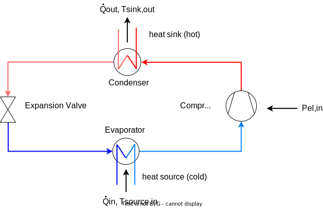
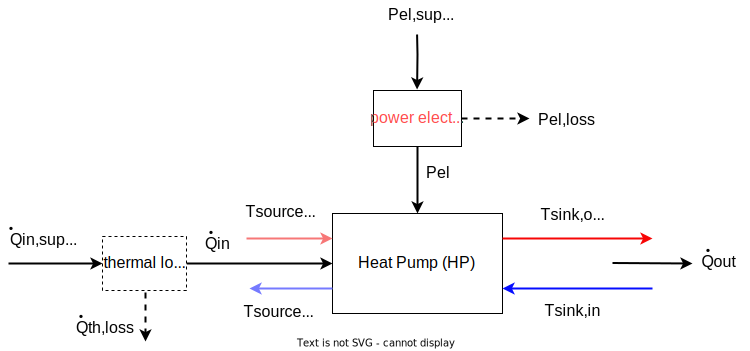
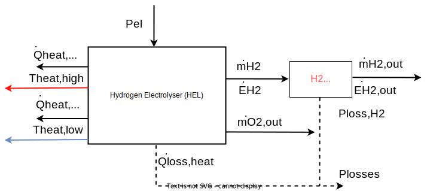
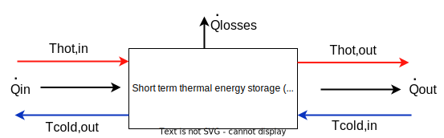

# Technical description of main components

In this chapter the mathematical models of components, that are used in ReSiE for the simulation of energy systems, are described. In this context a component is defined as one energy processing part (e.g. a heat pump) of the overall system, while the combination of multiple interconnected components is defined as an energy system. For each component the implemented calculation rules and relevant physical quantities and parameters are described. You can find a detailed description of customizable parameters in the [corresponding chapter](resie_component_parameters.md).

**Note: Not all components described here are implemented in ReSiE yet but all will be included in upcoming versions! Currently, only simplified component models are integrated. Also, the descriptions are not yet completed and may change later.**

## Conventions

Symbols:

- Scalars are shown in italic letters (normal math: \(T \ t\))
- Vectors or time series in bold and italic letters (boldsymbol: \(\boldsymbol{T \ t}\))
- Matrices are bold and non-italic (textbf: \(\textbf{T t}\))
- Time-derivatives are noted with \(\dot{E}\), meaning \(\dot{E} = \frac{dE}{dt}\)
- General energies are noted with \(E\), general power with \(\dot{E} = P\). Thermal energies are noted with \(Q\) and thermal power with \(\dot{Q}\).
 
Components:

- Energy flows into a component are positive, energy flows out of a component are negative
- Components are single units like a heat pump, a buffer tank, a battery or a photovoltaic power plant while energy systems are interconnected components
- The maximum power that a component can consume or produce is called the nominal power or design power. This is typically defined by one of the inputs or outputs of the component, for example as the electric power draw of an electrolyser or the heat production of a gas boiler.
- The fraction of utilised power divided by nominal power at a given point in time is called the part load ratio (PLR), or operation point, or power fraction, and can be signified with \(\kappa\) for the sake of brevity

## Heat pump (HP)
### General description of HP
As heat pumps, electrically driven variable-speed and on-off compressor heat pumps can be integrated into the simulation model of ReSiE. Their general system chart with the denotation of the in- and outputs is shown in the figure below. In general, a gaseous refrigerant is compressed by the compressor requiring electrical energy, resulting in a high temperature of the refrigerant. The refrigerant is then condensed in the condenser and it releases the energy to the condenser liquid at a high temperature level. After that, the refrigerant is expanded and completely liquefied in the expansion valve. In the following evaporator, the refrigerant is then evaporated at a low temperature level with the help of a low-temperature heat source, after which it is fed back into the compressor.

The energy balance at the heat pump is built up from the incoming electricity \(P_{el,HP}\), the incoming heat at a low temperature level \(T_{HP,source,in}\) and the outgoing heat flow at a higher temperature level \(T_{HP,sink,out}\). 

The energy balance of the heat pump model is shown in the following figure:

 
Using the electrical power \(P_{el,HP, supply}\), reduced by the losses of the power electronics \(P_{el,HP, loss}\), an energy flow \(\dot{Q}_{HP,in}\) with temperature \(T_{HP,source,in}\) is transformed to the energy flow \(\dot{Q}_{HP,out}\) with temperature \(T_{HP,sink,out}\). The efficiency of the heat pump is defined by the coefficient of performance (COP). The COP determines the electrical power \(P_{el,HP}\) required to raise the temperature of a mass flow from the lower temperature level \(T_{HP,source,in}\) to \(T_{HP,sink,out}\): 

$$ COP_{HP} = \frac{\dot{Q}_{HP,out}}{P_{el,HP}} \quad  \leq \quad COP_{Carnot} = \frac{T_{HP,sink,out}[K]}{T_{HP,sink,out}-T_{HP,source,in} } $$

$$ COP_{HP} = \eta_{Carnot} \  COP_{Carnot} \quad \text{with} \quad 0 \leq \eta_{Carnot} \leq 1 $$

The COP is always smaller than the maximum possible Carnot coefficient of performance (\(COP_{Carnot}\)), which is calculated from the condenser outlet and evaporator inlet temperature. The maximum possible COP calculated by Carnot is reduced by the carnot efficiency factor \(\eta_{Carnot}\), which is according to [Arpagaus2018][^Arpagaus2018] around 45 % for high temperature heat pumps and around 40 % for conventional heat pumps.

The energy balance (or power balance) of the heat pump can be drawn up on the basis of the latter figure and on the ratio between supplied and dissipated heat power, expressed as the COP:

$$\dot{Q}_{HP,out} = \frac{COP_{HP}}{COP_{HP} -1} \ \dot{Q}_{HP,in} \mathrm{\quad with \quad} \dot{Q}_{HP,out} = \dot{Q}_{HP,in} + P_{HP,el} $$

The power of the heat pump's electric supply, including the losses of the power electronics, is given as: 

$$P_{el,HP,supply} = \frac{P_{el,HP}}{\eta_{HP,LE}}$$

Since the temperatures of the heat flows entering and leaving the heat pump, which have not been considered so far, may also be relevant for connected components, the heat outputs can be calculated on the basis of the respective mass flow \(\dot{m}\) and the physical properties of the heat transfer medium (specific heat capacity \(c_{p}\) and, if applicable, the density \(\rho\)) by rearranging the following equation:

$$ \dot{Q} = \dot{m} \ c_{p} \ (T_{max} - T_{min}) $$

As a chiller follows the same principle as a heat pump, the same component can be used to simulate both technologies. The difference is the definition of the efficiency, as for a chiller the useful energy is not \(\dot{Q}_{HP,out}\) but \(\dot{Q}_{HP,in}\). This leads to the definition of the energy efficiency ratio (EER) for chillers as
 
$$ EER = \frac{\dot{Q}_{HP,in}}{P_{el,HP}} = \frac{\dot{Q}_{HP,out} - P_{el,HP}}{P_{el,HP}} = COP - 1   $$

As shown, the COP can be transferred to the EER. In the following, the description is made for heat pumps. The only adaption that has to be done for chillers is the change of the useful energy. Also, the efficiency function needs to be changed to EER (\(T_{HP,source,in}\), \(T_{HP,sink,out}\)) (if used) and for nonlinear part load efficiency the useful energy \(\dot{Q}_{HP,in}\) is assumed to be the linear reference energy instead of \(\dot{Q}_{HP,out}\) as for heating mode.

### Modelling approaches for HP: Overview
According to [Blervaque2015][^Blervaque2015], four different categories are described in the literature when it comes to the simulation of heat pumps:

- **quasi-static empirical models**: equation-fit models based on discretized manufacturer or certification data fitted to polynomials, used for example in EnergyPlus or TRNSYS
- **dynamic empirical models**: equation-fit models extended by continuous transient effects 
- **detailed physical models**: thermodynamic approach based on dynamic and refrigerant flow modelling, many parameters required
- **simplified physical models** or parameter-estimation models: based on physical model, but with less input parameter needed due to internal assumptions

[^Blervaque2015]:Blervaque, H et al. (2015): Variable-speed air-to-air heat pump modelling approaches for building energy simulation and comparison with experimental data. *Journal of Building Performance Simulation 9 (2)*, S. 210–225. doi: [10.1080/19401493.2015.1030862](https://doi.org/10.1080/19401493.2015.1030862). 

[^Arpagaus2018]: Arpagaus C. et al. (2018): High temperature heat pumps: Market overview, state of the art, research status, refrigerants, and application potentials, *Energy*, doi: [10.1016/j.energy.2018.03.166](https://doi.org/10.1016/j.energy.2018.03.166)

For the simulation of energy systems in an early design phase, for which QuaSi is intended, only quasi-static or dynamic empirical models can be considered due to the lack of detailed information about the technical components used and the computational effort required for physical models. Therefore, an empirical model based on manufacturer data or certification process data is implemented in ReSiE.

There are several aspects to be considered when simulating a heat pump based on equation-fitting, which will be briefly described in the following:

The COP of a heat pump, representing the efficiency in a current timestep, depends highly on the temperature of the source and the requested temperature of the heat demand. Generally speaking, the efficiency and thus the COP decreases with larger temperature differences between source and sink.

Additionally, the maximum thermal power of the heat pump is not constant for different operation temperatures. The available thermal power is decreasing with lower source temperature, an effect that mainly occurs in heat pumps with air as the source medium. The rated power given for a specific heat pump is only valid for a specified combination of sink and source temperature. The specification for the declaration of the rated power is described in DIN EN 14511[^DINEN14511].

[^DINEN14511]: DIN EN 14511:2018 (2018): Air conditioner, liquid chilling packages and heat pumps for space heating and cooling and process chillers, with electrically driven compressors. DIN e.V., Beuth-Verlag, Berlin.

Furthermore, the efficiency and therefor the COP is changing in part load operation. In the past, mostly on-off heat pump where used, regulating the total power output in a given time span by alternating the current state between on and off. This causes efficiency losses mostly due to thermal capacity effects and initial compression power needed at each start, or rather the compression losses at each shutdown. [Socal2021][^Socal2021]
In the last years, modulating heat pumps are more common, using a frequency inverter at the electrical power input to adjust the speed of the compression motor and therefor affecting the thermal power output. Interestingly, this method leads to an efficiency increase in part load operation with a peak in efficiency at around 30 to 60 % of the nominal power output. In the literature, many research groups have investigated this effect, compare for example to Bettanini2003[^Bettanini2003], Toffanin2019[^Toffanin2019], Torregrosa-Jaime2008[^Torregrosa-Jaime2008], Fuentes2019[^Fuentes2019], Blervaque2015[^Blervaque2015] or Fahlen2012[^Fahlen2012].

When heat pumps with air as source medium are used, the losses due to icing effects need to be considered as well.

[^Bettanini2003]: Bettanini, E.; Gastaldello, A.; Schibuola, L. (2003): Simplified Models to Simulate Part Load Performance of Air Conditioning Equipments. *Eighth International IBPSA Conference, Eindhoven*, Netherlands, S. 107–114.

[^Toffanin2019]: Toffanin, R. et al. (2019): Development and Implementation of a Reversible Variable Speed Heat Pump Model for Model Predictive Control Strategies. *Proceedings of the 16th IBPSA Conference*, S. 1866–1873.

[^Torregrosa-Jaime2008]: Torregrosa-Jaime, B. et al. (2019): Modelling of a Variable Refrigerant Flow System in EnergyPlus for Building Energy Simulation in an Open Building Information Modelling Environment. *Energies 12 (1)*, S. 22. doi: [10.3390/en12010022](https://doi.org/10.3390/en12010022).

[^Fuentes2019]: Fuentes, E. et al. (2016): Improved characterization of water-to-water heat pumps part load performance. *REHVA Journal*, August 2016.

[^Blervaque2015]: Blervaque, H et al. (2015): Variable-speed air-to-air heat pump modelling approaches for building energy simulation and comparison with experimental data. *Journal of Building Performance Simulation 9 (2)*, S. 210–225. doi: [10.1080/19401493.2015.1030862](https://doi.org/10.1080/19401493.2015.1030862). 

[^Fahlen2012]: Fahlén, Per (2012): Capacity control of heat pumps. *REHVA Journal Oktober 2012*, S. 28–31.

For a most realistic representation, all four discussed effects need to be considered - temperature-dependent COP, temperature-dependent power, part-load-dependent COP and icing losses. The calculation of these dependencies will be described below.

### Modelling approaches for HP: Detail
#### Temperature-dependent COP

The temperature-dependent COP can be calculated from different methods:

- using the \(COP_{Carnot}\) with the carnot efficiency factor \(\eta_{Carnot}\) as explained above (easy, simple and fast, but unreal high efficiency with small temperature differences of source and sink)
- looking up the COP in a look-up table in dependence of the condenser outlet and the evaporator inlet temperature (for computational efficiency, lookup-tables are fitted to polynomials in pre-processing)
- COP calculated as fraction of temperature-dependent electrical and thermal power, gained from generally developed polynomials. Here, the temperature-depended variation of the maximal power output of the heat pump can be directly taken into account.

As example for a lookup-table COP (second bulletpoint above), the following figure from Steinacker2022[^Steinacker2022] shows a map of a high-temperature heat pump as a set of curves, depending on the evaporator inlet and condenser outlet temperature. In three dimensions, this figure would result in a surface that can be parameterized with a three-dimensional spline interpolation algorithm.

#### Maximum thermal and electrical power

In order to address a change in maximum power output or input of the heat pump at different operating temperatures, two different approaches can be used.

The more complex but also more accurate approach is the use of polynomial fits of temperature-dependent thermal and electrical power. These polynomials depend on the condenser outlet and the evaporator inlet temperature and they need to be calculated from manufacturer data or from measurements. 

In order to address the early planning stage, general, market-averaged polynomials need to be created, representing an average heat pump. Additionally, one specific heat pump model can be used if the the required data is available. 

**ToDo**: Add method of calculating market-averaged polynomials!

Biquadratic polynomials according to TRNSYS Type 401
$$ \dot{Q}_{HP,max} = c_{q1} + c_{q2} \ \bar{T}_{HP,source,in} + c_{q3} \ \bar{T}_{HP,sink,out}  + c_{q4} \ \bar{T}_{HP,source,in} \ \bar{T}_{HP,sink,out} + \cdot  \cdot  \cdot \\
  \ c_{q5} \ \bar{T}_{HP,source,in}^2  + c_{q6} \ \bar{T}_{HP,sink,out}^2  $$

$$ P_{el,HP,max} = c_{p1} + c_{p2} \ \bar{T}_{HP,source,in} + c_{p3} \ \bar{T}_{HP,sink,out}  + c_{p4} \ \bar{T}_{HP,source,in} \ \bar{T}_{HP,sink,out} + \cdot  \cdot  \cdot \\
  \ c_{p5} \ \bar{T}_{HP,source,in}^2  + c_{p6} \ \bar{T}_{HP,sink,out}^2  $$
where all temperatures have to be normed according to
$$ \bar{T} = \frac{T \ [°C]}{273.15} + 1 $$

If both the thermal output and electrical input power are given as a temperature-dependent polynomial, the temperature-dependent COP (see previous section) can be directly calculated from these polynomials.

The second method to adjust the electrical and thermal energy would be a linear gradient that adjust the rated power in dependency of one temperature. Checking the available data of many different heat pumps from Stiebel-Eltron[^Stiebel-EltronTool], a simplified correlation can be observed:

- the thermal power is dependent on the source temperature, but independent on the sink temperature (the lower the source temperature the lower is the heating power)
- the electrical power is dependent on the sink temperature, but independent on the source temperature (the higher the sink temperature the higher is the electrical power consumption)

This gives the possibility to linearly adjust the available thermal power with the change of the source temperature and the electrical power demand with the change of the temperature of the sink. Which power needs to be adjusted depends on the choice of the control strategy - thermally or electrically controlled.
The gradients of the power de- or increase with a change of the temperature, \(f_{HP,\dot{Q} reduction}\) and \(f_{HP,P_{el} reduction}\), needs to be specified. Both factors can have a value of, for example, 0.02, which means a change of 2 % of the rated power per Kelvin of temperature shift with respect to the rated temperatures. The two factors are defined as follows:

$$
\dot{Q}_{HP,out,temp. \ dependent}  = \dot{Q}_{HP,out,rated} (1 + f_{HP,\dot{Q} reduction} \ (T_{HP,source,in,current} - T_{HP,source,in,rated}))
$$
$$
P_{el,HP,temp. \ dependent}  = P_{el,HP,rated} (1 + f_{HP,P_{el} reduction} \ (T_{HP,sink,out,current} - T_{HP,sink,out,rated}))
$$

With this method, the actual temperature-dependent relation of thermal and electrical power need to be determined using the temperature-dependent COP described earlier.

[^Stiebel-EltronTool]: Stiebel-Eltron Heat Pump Toolbox: [https://www.stiebel-eltron.com/toolbox/waermepumpe/](https://www.stiebel-eltron.com/toolbox/waermepumpe/)

#### Part load efficiency

The COP of the modeled heat pump depends not only on the temperatures of the sink and the source but also on the current part load ratio (PLR). The COP can be corrected using a part load factor (PLF) that is dependent of the PLR. The definition of the PLR and the PLF is given below:

PLR (part load ratio) \(= \frac{\text{power (el. or th.) of demand or availability in current timestep}}{\text{maximum power (el. or th.) of heat pump at current temperatures}} \)

PLF (part load factor = adjustment factor for COP):  \(COP_{part-load} = COP_{full-load} * PLF(PLR) \)

The literature provides different examples for the correlation of the COP to the PLR (see section "Overview" for literature examples). This relation is non-linear as shown for example in the following figure given the part-load-dependent COP of an inverter-driven ENRGI-Heatpump at different temperature levels (Source: Enrgi[^2]).

[^2]: [https://enrgi.de/wp-content/uploads/2022/08/Datenblatt_ecoGEO_B-C_1-9kW.pdf](https://enrgi.de/wp-content/uploads/2022/08/Datenblatt_ecoGEO_B-C_1-9kW.pdf)

The part-load behavior depends also on the type of the heat pump (on-off or inverter heat pump), as shown for example in Bettanini2003[^Bettanini2003] or in Socal2021[^Socal2021]. For illustration, the following figure is taken from the latter reference to demonstrate the different part load factors of the COP (y-axis) at different part load ratios for different heat pump technologies:

Taking the correction factor curve from the figure above for inverter heat pumps, the maximum part load factor is reached at 50 % part load with an increase of the COP by about 10%. Contrary, in Toffanin2019[^Toffanin2019], the part load factor is assumed to be much higher, reaching its maximum at 25 % part load ratio with a part load factor of 2.1 (efficiency increase of 110 %). These discrepancies illustrate the wide range of literature data and the difficulty in finding a general part load curve. In Lachance2011[Lachance2021^], several part load curves are compared.

The figure above shows also the difference of the part load factor comparing on-off and inverter heat pumps as well as the defined on-off losses in DIN EN 14825 for the calculation of the seasonal coefficient of performance (SCOP).

As described in the section "General description of HP", the COP is defined as the ratio of the heat output \(\dot{Q}_{HP,out}\) and the electrical input power \(P_{el,HP}\). The shown curves for the part load factor affects only the ratio of heat output to electrical input power and there is no information available on the actual change of the two dimensions. Therefore, the heat output of the heat pump itself is assumed to be linear in part load operation between \(\dot{Q}_{HP,out,min}\) at \(PLF_{HP,min}\) and \(\dot{Q}_{HP,out,max}\) at PLR = 1.0 as shown in the figure below. This leads to a non-linear relation of the power input to the part load ratio that was found more realistic as for inverter heat pumps, the observed efficiency change is mostly due to an efficiency change of the frequency converter and motor of the compressor. (QUELLE ToDo)

It is also important to note, that the typical PLF-curve for inverter-driven heat pumps is not invertible and can therefore not be used directly to calculate the PLR from PLF. Although, this needed for an operation strategy that uses limited availability or demand of the electrical or thermal power. To handle this problem, the PLF-curve is not used directly:

During preprocessing, the given curve of the PLF in dependence of the PLR (see orange curve in figure below as example) is discretized. Then, the electrical input power (yellow curve) is calculated at each discretization using the assumption of a linear thermal power output (grey curve) in part load operation. As the relation of the power input to the thermal power output is defined by the COP that is changing in every timestep, any COP can be chosen for this initial calculation during the preprocessing. For this example, a COP of 4 is chosen. This process results in two value tables for the electrical input power and the thermal output power. The latter one is, according to the assumption made above, a straight line as shown in the figure.
 

 Both value tables are then normalized to their maximum value as shown in the next figure. The thermal power input although can not be precalculated as it depends on the absolute difference of thermal output and electrical input power.  

In every timestep, the two precomputed and normalized value tables of the thermal output and electrical input power are scaled up to the current maximum power, limited by the heat pump current full-load operation state. There, the actual COP at the current timestep is represented in the ration of both values. The two scaled value tables can then be used to determine the actual PLF that is necessary to cover the current demand or to limit the operation state due to the limited available electrical power (interpolation on value table with known power, or interpolation in preprocessing). For the thermal output power, this is trivial as the ratio of the maximum thermal power output to the thermal power demand is equal to the PLF. To calculate the PLF for the thermal input power, if this is a limited source according to the operational strategy, the two scaled value tables need to be subtracted from each other to get a third table: 

$$
\dot{Q}_{HP,in}(PLF) = \dot{Q}_{HP,out}(PLF) - P_{el,HP,in}(PLF)
$$

This third value table, generated in each timestep, can then be used to determine the maximum possible PLF according to the available thermal input power from a limited thermal power source. 

All three PLF (from thermal input and output as well as electrical input power) are then compared and the smallest one is chosen as operating state in the current timestep. If this value is smaller than the minimal allowed PLF of the heat pump \(PLF_{HP,min}\), the heat pump will not be in operation in the current timestep. 

This method avoids the need to invert polynomial functions at each timestep and is computationally more efficient.

The definition of the part load factor curve is user-defined and differentiated into inverter and on-off heat pumps.
The part load factor curve for inverter-driven heat pumps is based on Blervaque2015[^Blervaque2015] and Filliard2009[^Filliard2009]. There, the curve is defined in two separate sections. The section below the point of maximum efficiency is a function according to the part load factor calculation in DIN EN 14825 for water-based on-off heatpumps, differing from the cited paper but according to Fuentes2019[^Fuentes2019]. The section above the point of the maximum efficiency is approximated as straight curve. The definition of these curve can be done entering the cc-coefficient and the coordinates of the two points highlighted in the figure below. Here, cc is chosen as 0.95 and \(a\) is used to stretch the curve to meet the intersection point with the straight line.

This results in the following equation to calculate the part load factor for inverter-driven heat pumps, defined by the coefficients cc and a according to DIN EN 14825, the point of maximum efficiency at (\(PLR_{max}\)/\(PLF_{max}\)) and the PLR_1 at PLF = 1:

$$
PLF(PLR) = 
\begin{cases}
a \ \frac{PLR}{cc \ PLR + (1 - cc)}  & \text{ for } PLR < PLR_{max} \\
\frac{PLF_1 - PLF_{max}}{1-PLR_{max}} \ ( PLR  -  PLR_{max} ) + PLF_{max}   & \text{ for } PLR >= PLR_{max} 
\end{cases} \\
\text{ with } a = \frac{PLF_{max}}{PLR_{max}} \left ( cc \ (PLR_{max}-1)+1  \right ) 
$$
 
For on-off heat pumps, \(a\) is set to 1 and the domain of the first equation above is set to the whole range of the PLR.

[^Socal2021]: Socal, Laurent (2021): Heat pumps: lost in standards, *REHVA Journal August 2021*.
[^Filliard2009]: Filliard, Bruno; Guiavarch, Alain; Peuportier, Bruno (2009): Performance evaluation of an air-to-air heat pump coupled with temperate air-sources integrated into a dwelling. *Eleventh International Building Simulation Conference 2009*, S. 2266–73, Glasgow.
[^Lachance2021]:Lachance, Alex; Tamasauskas, Justin; Breton, Stéphanie; Prud’homme, Solange (2021): Simulation based assessment on representativeness of a new performance rating procedure for cold climate air source heat pumps. *E3S Web Conf. 246, S. 6004.* doi: [10.1051/e3sconf/202124606004](https://doi.org/10.1051/e3sconf/202124606004).

#### Icing-losses of heat pumps with air as source medium

To account for icing losses of heat pumps with air as source medium, the approach presented in TRNSYS Type 401 is used[^Wetter1996]. When considering icing-losses, make sure that icing losses are not already included in the polynomials for thermal and electrical power!

For the calculation of icing losses, five coefficients are needed: \(c_{HP,ice,A}\), \(c_{HP,ice,B}\), \(c_{HP,ice,C}\), \(c_{HP,ice,D}\) and \(c_{HP,ice,E}\). According to the Type 401, icing losses are calculated using a superposition of a gaussian curve with its maximum between 0 °C and 5 °C representing the maximum likelihood of frost within the heat pump (high absolute humidity) and a linear curve, representing the higher sensible energy effort to heat-up the components of the heat pump for defrosting. Exemplary curves are shown in the following figure (linear, gauss and superposition):

The exemplary coefficients for the curves in the figure above are \(c_{HP,ice,A} = 3\), \(c_{HP,ice,B} = -0.42\), \(c_{HP,ice,C}=15\), \(c_{HP,ice,D}=2\), \(c_{HP,ice,E}=30\).

The resulting superposition, which represents the percentage loss of the COP due to icing as a function of ambient temperature, is expressed by the following formula, where the coefficients are reduced to the last letter for better readability:
$$
 \Delta COP_{ice,loss} = \begin{cases}
		A + B \ T_{HP,source,in} + C \ exp^{-\frac{(T_{HP,source,in}-D)^2}{E}} &\text{for } A + B \ T_{HP,source,in} > 0\ \\[5pt]
	    C \ exp^{-\frac{(T_{HP,source,in}-D)^2}{E}} &\text{for } A + B \ T_{HP,source,in} \leq 0\ \\	
	\end{cases} \\
$$

\(\Delta COP_{ice,loss}\) can then be used to reduce the COP for icing losses:

$$ COP_{ice,corrected} =  COP \ (1-\Delta COP_{ice,loss}) $$

According to the results found in Wei2021[^Wei2021], it is assumed that the decrease of the COP due to icing losses will only increase the power input of the heat pump. It will not affect the thermal power output.

[^Wei2021]: Wei, Wenzhe et al. (2021): Investigation on the regulating methods of air source heat pump system used for district heating: Considering the energy loss caused by frosting and on–off. In: *Energy and Buildings 235*, S. 110731. doi: [10.1016/j.enbuild.2021.110731]((https://doi.org/10.1016/j.enbuild.2021.110731).

### Steps to perform in the simulation model of the heat pump
The calculation is based on TRNSYS Type 401[^Wetter1996] that is almost similar to Type 204[^Alfjei1996] (Type 204 provides an english documentation). The cycling losses of the heat pump in both TRNSYS models are calculated using an exponential function to describe the thermal capacity effects during heat-up and cool-down. Here, these cycling losses will only be used during start and stop of the heat pump - actual cycling losses from on-off heatpumps will be considered separately in the process to allow the consideration of modulating heat pumps as well.

There are two different possibilities in calculating the full load power of the heat pump in dependence of \(T_{HP,sink,out}\) and \(T_{HP,source,in}\). An overview of the simulation steps and the required inputs are given in the following figure. A detailed description of the process shown in the figure is given below. Each of the main steps is described in more detail in the previous chapter.

Steps to calculate the electrical and thermal energy in- and outputs of HP using a polynomial fit of the thermal and electrical power (compare to left side of figure above):

- using polynomial fits to calculate stationary thermal in- and output and electrical full-load power at given temperatures of \(T_{HP,sink,out}\) and \(T_{HP,source,in}\) for given nominal thermal power
    - differing source and sink medium: 
        - air-water
        - water-water
        - sole-water
    - differing temperature range: 
        - normal heat pump
        - high-temperature heat pump
    - polynomial fits have to be normalized to rated power at specified temperatures! Rated power has to be related always to the same temperature lift according to DIN EN 14511 --> different fits for normal (B10/W35, W10/W35, A10/W35) and high temperature (B35/W85, W35/W85) heat pumps  
- reduce thermal power output due to transient capacity effects during start-up as average over current timestep and calculate COP\(_{transient}\) at full load with calculated thermal and electrical power
- may adjust COP\(_{transient}\) by icing losses for air-water and air-air heat pumps; calculate COP\(_{transient,ice}\), recalculate electrical input power
- get demand/availability of thermal or electrical energy (mind \(\eta_{HP,PE}\)!), differing if thermal and/or electric energy related operation strategy is chosen
- calculate smallest non-linear part-load ratio (PLR) with current demand and temperature-dependent, transient full-load power and precalculated value tables from PLF-curve, in dependency of heat pump type (inverter, on-off)
- calculate part-load thermal and electrical energy, recalculate COP\(_{transient,ice,partload}\)

If universal data table or the Carnot-COP reduced by an efficiency factor should be used instead of the more accurate model described above, a different calculation approach is needed (compare right side in the figure above):

- Get power at current temperatures
    - using nominal power without a temperature-dependency or
    - using polynomial fits to calculate stationary thermal **or** electrical full-load power at given temperatures of \(T_{HP,sink,out}\) and \(T_{HP,source,in}\), depending on control strategy (see above)
- get stationary full-load COP at given temperatures of \(T_{HP,sink,out}\) and \(T_{HP,source,in}\) either from
    - COP data table (fitted to polynomials in pre-calculation) or
    - Carnot-COP reduced by an efficiency factor
- determine the unknown, non-controlled full load power (electrical or thermal) with known, controlled power and COP
- continue with transient capacity effects as described above

Contrary to the TRNSYS Type 401, the mass flow here is variable and not constant within two time steps, therefore the \(T_{HP,sink,out}\) and \(\dot{Q}_{HP,sink,out}\) can be calculated directly without the need of iteration as implemented in Type 401. Here, the \(T_{HP,sink,out}\) is a fixed, user-specified value in the presented simplified model. 

The polynomials describing the temperature-depended thermal and electrical power of the heat pump need to be normalized to the power consumption at the rated operation point in order to be able to auto-scale the size in parameter variation studies. Therefore, the following steps are necessary:

- fit data to polynomial for thermal and electrical energy
- calculate power at specified nominal temperatures with generated fitted polynomial
- normalize polynomial to calculated rated power at specific temperature using a fraction_factor

[^Wetter1996]: Wetter M., Afjei T.: TRNSYS Type 401 - Kompressionswärmepumpe inklusive Frost- und Taktverluste. Modellbeschreibung und Implementation in TRNSYS (1996). Zentralschweizerisches Technikum Luzern, Ingenieurschule HTL. URL: [https://trnsys.de/static/05dea6f31c3fc32b8db8db01927509ce/ts_type_401_de.pdf](https://trnsys.de/static/05dea6f31c3fc32b8db8db01927509ce/ts_type_401_de.pdf)

[^Alfjei1996]: Afjei T., Wetter M., Glass A. (1997): TRNSYS Type 204 - Dual-stage compressor heat pump including frost and cycle losses. Model description and implementation in TRNSYS, Versin 2. Zentralschweizerisches Technikum Luzern, Ingenieurschule HTL. URL: [https://simulationresearch.lbl.gov/wetter/download/type204_hp.pdf](https://simulationresearch.lbl.gov/wetter/download/type204_hp.pdf)

**Inputs und Outputs of the Heat Pump:**

Symbol | Description | Unit
-------- | -------- | --------
\(\dot{Q}_{HP,in}\) | heat flow supplied to the HP (heat source) | [W]
\(\dot{Q}_{HP,out}\) | heat flow leaving the HP (heat sink) | [W]
\(P_{el,HP}\) | electric power demand of the HP | [W]
\(P_{el,HP,supply}\) | electric power demand of the HP incl. losses of the power electronics | [W]
\(T_{HP,sink,in}\) | condenser inlet temperature - not used | [°C]
\(T_{HP,sink,out}\) | condenser outlet temperature | [°C]
\(T_{HP,source,in}\) | evaporator inlet temperature | [°C]
\(T_{HP,source,out}\) | evaporator outlet temperature - not used | [°C]

**Parameter of the Heat Pump:** 

Symbol | Description | Unit
-------- | -------- | --------
\(\dot{Q}_{HP,rated}\) | rated thermal energy output of heat pump at specified conditions |  [W]
\(\dot{Q}_{HP,max}(T_{HP,sink,out}, T_{HP,source,in})\) | (normalized) polynomial of maximum full load thermal heat output at given temperatures | [W]
\(P_{el,HP,max}(T_{HP,sink,out}, T_{HP,source,in})\) | (normalized) polynomial of maximum full load electrical power output at given temperatures | [W]
or ||
\(f_{HP,\dot{Q} reduction}\) | linear reduction factor for nominal full load thermal output power with respect to \(T_{HP,source,in}\) | [%/°C]
\(f_{HP,P_{el} reduction}\) | linear reduction factor for nominal full load electrical input power with respect to \(T_{HP,sink,out}\) | [%/°C]
\(COP_{HP}(T_{HP,sink,out}, T_{HP,source,in})\) | coefficient of performance (COP) of the heat pump depending on \(T_{HP,sink,out}\) and \(T_{HP,source,in}\) | [-]
\(\eta_{Carnot}\) | efficiency factor of heat pump, reduces the Carnot-COP | [-]
and | |
\(PL_{HP,min}\) | minimum possible part load of the heat pump |  [%]
\(PLR_{HP,max}\) | part load ratio at point of maximum efficiency (inverter only) |  [-]
\(PLF_{HP,max}\) | part load factor at point of maximum efficiency (inverter only) |  [-]
\(PLF_{HP,PLR=1}\) | part load factor at part load ratio = 1 (inverter only) | [-]
\(cc_{HP}\) | coefficient for part load curve according to DIN EN 14825 | [-]
\(c_{HP,ice,A} \ : \ c_{HP,ice,E}\) | five coefficients for curve with icing losses according to TRNSYS Type 401 (air heat pump only) | [-]
\(\eta_{HP,PE}\) | efficiency of power electronics of heat pump | [-]
\(MOT_{HP}\) | minimum operating time of heat pump | [min]
\(SUT_{HP}\) | start-up time of the HP until full heat supply (linear curve) | [min]
\(CDT_{HP}\) | cool-down time of the HP from full heat supply to ambient (linear curve) | [min]

**State Variables of Heat Pump:**

Symbol | Description | Unit
-------- | -------- | --------
\(x_{HP}\)  | current operating state (on, off, part load)   | [%]

## Hydrogen Electrolyser (HEL)

Implements traits: [PLR-dependent efficiency](resie_transient_effects.md#part-load-ratio-dependent-efficiency)

The hydrogen electrolyser uses electrical energy to split water into its components hydrogen (\(H_2\)) and oxygen (\(O_2\)) as shown in the following reaction equation: 

$$ 2 \ H_2O \rightarrow 2 \ H_2 + O_2 $$

While there is electrolyser technology to work with other chemical reactions or solutions of minerals in water (e.g. sea water hydrolysis), this model focuses on electrolysers splitting purified water as this is the most relevant technology at time of writing.

The use of waste heat of the electrolysis is an important factor for the overall efficiency of the electrolyser. This importance stems from both a substantial, non-reducable part of the input electricity being transformed into waste heat and by several effects concerning the temperature and availability of the heat outputs.

The general energy and mass flow in the electrolyser as well as the losses considered in the model can be seen in the following figure.

The relationship between supplied hydrogen of the electrolysis (energy \(\dot{E}_{H_2}\) or mass flow \(\dot{m}_{H_2}\)) and the consumption of electrical energy \(P_{el}\) is given in the following equation, where \(e_{H_2}\) can be either the net or the gross calorific value of hydrogen:
$$
\begin{align}
\dot{E}_{H_2}=  P_{el} \enspace \eta_{H_2}
\end{align}
$$

$$ 
\begin{equation}
\dot{m}_{H_2} =  \frac{\dot{E}_{H_2}}{e_{H_2}} 
\end{equation}
$$

Some part of the waste heat apart of the cooling loop can potentially be utilised. Electrolysers tend to be designed for high power draw and subsequentially produce a comparitively large amount of low temperature waste heat from power system cooling, radiative and conductive losses of the stacks and pressure handling, among other sources. Depending on the installation and configuration of the equipment some of this low temperature waste heat can be usable instead of being removed from the energy system entirely. A realised \(1 \ MW_e\) PEM electrolyser [^Stickel2024] was reported to make use of the low temperature waste heat and produce in 2023, via a heat pump, 261 MWh high temperature heat using 91 MWh of electricity for a COP of 2.87. However as not all installations can make use of this waste heat, in the model this can be toggled off, which will cause the low temperature waste heat to be counted towards the overall losses of the electrolyser.

Due to the difficulty of finding good numbers for parameters as well as reducing the model complexity to energy balances, the model displayed above is restructured to combine the losses of water purification and power electronics by affecting the efficiency of producing hydrogen from input electricity and the amount of high and low temperature waste heat. The losses of hydrogen from purification processes is modeled as two efficiencies curves for produced hydrogen with one including losses and one excluding them.

The figure above shows the inputs and outputs of the reduced model with the following relations:

$$ \dot{E}_{H_2} = \eta_{H_2}(\kappa) \ P_{el} $$

$$ \dot{E}_{H_2,out} = (\eta_{H_2}(\kappa) - \eta_{H_2,loss}(\kappa)) \ P_{el} $$

$$ P_{H_2,loss} = \dot{E}_{H_2} - \dot{E}_{H_2,out} $$

$$ \dot{Q}_{heat,high} = \eta_{heat,high}(\kappa) \ P_{el} $$

$$ \dot{Q}_{heat,low} = \eta_{heat,low}(\kappa) \ P_{el} $$

$$ \dot{Q}_{loss,heat} = P_{el} - \dot{Q}_{heat,high} - \dot{Q}_{heat,low} - \dot{E}_{H_2} $$

$$ P_{losses} = \dot{Q}_{loss,heat} - P_{H_2,loss} $$

Since the oxygen produced during the electrolysis process can also be utilized under certain circumstances, the resulting oxygen mass flow \(\dot{m}_{O_2,out}\) is determined from the stoichiometric ratio of the hydrolysis reaction equation:

$$ \dot{m}_{O_2,out} =  v_{O_2,H_2} \ \dot{m}_{H_2} $$
$$ \text{with} \quad v_{O_2,H_2} = \frac{atomic \ mass \ O_2}{2 \cdot atomic \ mass \ H_2} = \frac{2 \cdot 15.999 \ u}{2 \cdot 2 \cdot 1.0008 \ u} = 7.9386 $$

**Note: At the moment the pressure, at which the stacks operate and the hydrogen is extracted and purified, is assumed to be constant throughout the entire process and does not affect efficiencies or heat by-products. This might be addressed in a future release.**

### Unit dispatch

Depending on the sizing and technology of realised electrolysers, the whole plant often consists of more than one stack and/or more than one set of power supply equipment. This is modeled as the electrolyser consisting of \(N_{unit}\) units, which are all the same in regards to design power and efficiencies. The efficiency functions given as input parameters thus relate to a single unit with its own power supply subsystem. The electricity input of the overall electrolyser is split across the active units in a single timestep with no losses occuring before the split. Rather, each unit individually calculates its losses from the available energy. In a similar manner the hydrogen, oxygen and heat outputs are summed over the active units with losses being considered by each.

Different options exist for how to dispatch the units to meet a demand, in particular as the minimum power fraction \(\kappa_{min,unit}\) of each unit tends to be fairly high and a lower overall \(\kappa_{min}\) can only be achieved by not activating all units. In addition, the efficiencies of each unit are not necessarily optimal at full load and a performance increase can be achieved by choosing the right number of units to activate close to the optimal PLR.

**Note:** The electrolyser is only operated between \(\kappa_{min}\) and maximum 100 % load. A specification of power above nominal power, which can occur in practice under certain circumstances, is not supported. The efficiency curves should take this into account. The nominal power should reflect the maximum operation point that can be sustained for several hours.

The currently implemented dispatch strategies for electrolysers are:

* **Equal distribution:** This spreads the load evenly across all units. This is a simplified model that ignores \(\kappa_{min,unit}\).
* **Equal distribution with minimum power fraction:** Same as an equal distribution, however if the total \(\kappa\) is lower than \(\kappa_{min,unit}\), then a number of units are activated at a calculated \(\kappa\) to ensure the minimum restriction is observed and the demand is met.
* **Try optimal PLR:** Attempts to activate a number of units close to their optimal PLR to meet the demand. If no optimal solution exists, typically at very low \(\kappa\) or close to the nominal power, falls back to activating only one or all units.

**Inputs and Outputs of the Electrolyser:**

Symbol | Description | Unit
-------- | -------- | --------
\(P_{el}\) | electrical power requirement of the electrolyser | [W]
\(\dot{m}_{O_2,out}\) | oxygen mass flow delivered by the electrolyser | [kg/h]
\(\dot{m}_{H_2}\) | hydrogen mass flow produced by the electrolyser (before \(H_2\) losses) | [kg/h]
\(\dot{m}_{H_2,out}\) | hydrogen mass flow provided by the electrolyser (after \(H_2\) losses) | [kg/h]
\(\dot{E}_{H_2}\) | hydrogen energy flow discharged from the electrolyser (before \(H_2\) losses) | [W]
\(\dot{E}_{H_2,out}\) | hydrogen energy flow provided by the electrolyser (after \(H_2\) losses) | [W]
\(P_{loss,H2}\) | \(H_2\) losses | [W]
\(\dot{Q}_{heat,high}\) | high temperature heat provided by the electrolyser | [W]
\(\dot{Q}_{heat,low}\) | low temperature heat provided by the electrolyser | [W]
\(\dot{Q}_{loss}\) | thermal losses (unusable waste heat) | [W]
\(P_{losses}\) | Overall losses of the electrolyser | [W]

**Parameters of the Electrolyser:**

Symbol | Description | Unit
-------- | -------- | --------
\(P_{el,rated}\) | total electric power consumption of the electrolyser under full load (operating state 100 %) | [W]
\(N_{unit}\) | number of units that make up the electrolyser plant | [-]
dispatch strategy | method of dispatching the units of the electrolyser to meet demand | [-]
\(\eta_{H_2}(\kappa)\) | efficiency of hydrogen production of each unit as function of \(\kappa\) | [-]
\(\eta_{H_2,loss}(\kappa)\) | percentage of hydrogen losses of each unit as function of \(\kappa\) | [-]
\(\eta_{heat,high}(\kappa)\) | efficiency of high temperature heat production of each unit as function of \(\kappa\) | [-]
\(\eta_{heat,low}(\kappa)\) | efficiency of low temperature heat production of each unit as function of \(\kappa\) | [-]
\(\kappa_{min,unit}\) | minimum \(\kappa\) of each unit | [-]
\(\kappa_{min}\) | minimum total \(\kappa\) of the electrolyser | [-]
\(\kappa_{opt}\) | optimal \(\kappa\) of each unit at which \(H_2\) production is most efficient | [-]
\(e_{H_2} \) | mass-dependent energy of hydrogen (net calorific value or gross calorific value) | [Wh/kg]
\(v_{O_2,H_2} \) | stoichiometric mass-based ratio of oxygen and hydrogen supply during electrolysis | [kg \(O_2\) / kg \(H_2\)]
\(T_{heat,high}\) | cooling HT fluid outlet temperature of electrolyser | [°C]
\(T_{heat,low}\) | cooling LT fluid outlet temperature of electrolyser | [°C]

### Typical efficiency functions
**Note:** These are exemplary values and do not imply validation or extensive research.

**Constant efficiencies**

* Adapted from a realised \(1 \ MW_e\) PEM electrolyser described in Stickel2024[^Stickel2024] from the data of 2023, a year of mostly nominal operation. Of note is that the electrolyser was still in the process of being improved. The values are thus perhaps somewhat pessimistic for the expected efficiency.
    * \(\eta_{heat,low}(\kappa) = 0.0664\)
    * \(\eta_{heat,high}(\kappa) = 0.161\)
    * \(\eta_{H_2}(\kappa) = 0.617\)
    * \(\eta_{H_2,loss}(\kappa) = 0.04\) Note: This value was estimated.
    * \(\kappa_{min,unit} = 0.4\)
    * \(\kappa_{min,unit} = 0.25\)
    * \(N_{unit} = 4\)

[^Stickel2024]: Matthias Walter Stickel: Technisches Monitoring & Betriebsoptimierung im Reallabor - Erzeugung von grünem Wasserstoff und Abwärmenutzung inmitten des Stadtquartiers, Poster presentation at 15. Energiewendebauen Projektetreffen (2024) Kassel, [Category D of the poster results](https://ewb.innoecos.com/Group/15.Treffen.Kassel/MediaGallery/Start/Index/66515)

## Combined heat and power plant (CHPP)
Implements traits: [PLR-dependent efficiency](resie_transient_effects.md#part-load-ratio-dependent-efficiency)

A CHPP turns the energy stored in a chemical fuel into electricity and heat at a temperature usable for heating and DHW purposes. Typical examples are internal combustion engines or gas turbines. Because the outputs are not produced independently of each other, control of the CHPP has to consider one output as the target to meet while the other is a by-product that has to be consumed, stored or transported.

Energy balance of a CHPP:
$$ \dot{E}_{fuel} = P_{el} + \dot{Q}_{heat} + \dot{Q}_{loss} $$

The production of electricity and heat follows different efficiency curves:

$$ P_{el} = \eta_{el}(\kappa) \cdot \dot{E}_{fuel} $$
$$ \dot{Q}_{heat} = \eta_{heat}(\kappa) \cdot \dot{E}_{fuel} $$

Because the nominal power \(\dot{E}_{rated}\) of a CHPP is typically either given as \(P_{el}\) or \(\dot{Q}_{heat}\) at \(\kappa = 1.0\), an efficiency curve for the fuel input (relative to either one of the outputs) is also needed. Note that this efficiency is larger than 1.0 as it relates to the amount of fuel consumed to produce a certain output, which is necessarily smaller. For example if the nominal power is given as relative to the electricity output, then the inputs and outputs are calculated with the following relations:

$$ P_{el} = \kappa \cdot \dot{E}_{rated} $$
$$ \dot{Q}_{heat} = \eta_{heat}(\kappa) \cdot P_{el} $$
$$ \dot{E}_{fuel} = \eta_{fuel}(\kappa) \cdot P_{el} $$

The losses are calculated as a direct result of the energy balance:

$$ \dot{Q}_{loss} = \dot{E}_{fuel} - P_{el} - \dot{Q}_{heat} $$

**Inputs and Outputs of the CHPP**

Symbol | Description | Unit
-------- | -------- | --------
\(P_{el}\) | electric power output of the CHPP | [W]
\(\dot{Q}_{heat}\) | thermal power output of the CHPP | [W]
\(\dot{E}_{fuel}\) | fuel input power of the CHPP | [W]
\(\dot{Q}_{loss}\) | thermal energy losses of the CHPP | [W]
\(T_{out}\) | temperature of heat output | [°C]

**Parameters of the CHPP**

Symbol | Description | Unit
-------- | -------- | --------
\(\dot{E}_{rated}\) | nominal power of the CHPP at \(\kappa = 1.0\) | [W]
\(\eta_{heat}(\kappa)\) | thermal efficiency as function of \(\kappa\) | [-]
\(\eta_{el}(\kappa)\) | electric efficiency as function of \(\kappa\) | [-]
\(\eta_{fuel}(\kappa)\) | fuel efficiency as function of \(\kappa\) | [-]
\(\kappa_{min}\) | minimum allowed PLR of the CHPP | [-]
\(T_{out}\) | temperature of heat output | [°C]

### Typical efficiency functions

**Note:** These are exemplary values and do not imply validation or extensive research.

A general overview of CHP technology can be found in Ebrahimi2015[^Ebrahimi2015].

**Internal combustion engines**

Relevant technologies include reciprocating / piston engines fed by natural gas or petroleum. Heat extraction is done by exhaust gas heat recovery and the motor jacketing cooling system. For engines of fairly large nominal power (\(> 1 \ MW_e\)) the motor oil / lube is also cooled and can provide additional heat output.

*Adapted from Ebrahimi2015:*

Piece-wise linear functions relative to fuel input.

&nbsp; | Support values
--- | ---
\(\kappa\) | 0.0, 0.125, 0.25, 0.375, 0.5, 0.625, 0.75, 0.875, 1.0
\(\eta_{el}\) | 0.01, 0.17, 0.25, 0.31, 0.35, 0.37, 0.38, 0.38, 0.38
\(\eta_{heat}\) no oil | 0.8, 0.69, 0.63, 0.58, 0.55, 0.52, 0.5, 0.49, 0.49
\(\eta_{heat}\) total | 0.93, 0.79, 0.71, 0.65, 0.61, 0.57, 0.55, 0.53, 0.53

[^Ebrahimi2015]: Ebrahimi, Masood; Keshavarz, Ali (2015): 2 - CCHP Technology. In: Mohamed Abdallah El-Reedy und Ali Keshavarz (Hg.): Combined cooling, heating and power. Decision-making, design and optimization. Amsterdam, Netherlands, Oxford, UK, Waltham, MA: Elsevier, S. 35–91.

## Fuel boiler (FB)

Implements traits: [PLR-dependent efficiency](resie_transient_effects.md#part-load-ratio-dependent-efficiency)

Energy balance of fuel boiler:
$$ \dot{Q}_{heat} = \dot{E}_{fuel} - \dot{Q}_{loss} = \eta_{heat}(\kappa) \ \dot{E}_{fuel} $$

**Inputs and outputs of the FB:**

Symbol | Description | Unit
-------- | -------- | --------
\(\dot{Q}_{heat}\) | thermal power output of the FB | [W]
\(\dot{E}_{fuel}\) | energy demand of the FB as chemical fuel | [W]
\(\dot{Q}_{loss}\) | thermal losses of the FB | [W]

**Parameters of the FB:**

Symbol | Description | Unit
-------- | -------- | --------
\(\dot{Q}_{design}\) | rated thermal power output of the FB at \(\kappa = 1.0\) | [W]
\(\eta_{heat}(\kappa)\) | thermal efficiency of fuel boiler as function of \(\kappa\) | [-]
\(\kappa_{min}\) | minimum allowed PLR of the FB | [-]

### Typical efficiency functions
**Note:** These are exemplary values and do not imply validation or extensive research.

**Note:** An important part of choosing efficiency values is considering if the efficiency is relative to the lower, higher or gross heating value of the fuel. The simulation model outputs energy values for the required fuel for operation. How a given energy value corresponds to an amount of fuel is directly related to the heating value to which the efficiency is relative. For example, if a fuel with a GHV of 2.8\(\frac{kWh}{kg}\) and a fuel boiler with a constant efficiency of 0.9 relative to the GHV is used, this means a simulated heat output of 25.2 kWh can be expected from 10 kg or 28 \(kWh_{GHV}\) of input fuel.

**Conventional gas-fired boiler**

* Adapted from LeeSeo2019[^LeeSeo2019]: \(\eta(\kappa) = 0.2822 + 2.2013 \kappa - 2.8237 \kappa^2 + 1.2 \kappa^3\). Note that the coefficients in the paper do not match given values. The coefficients were adapted as we were not able to replicate the figures in the paper.

**Wood pellet boiler**

* Bottom-feed boiler, adapted from Verma2013[^Verma2013]: Constant 88.5%
* Top-feed boiler, adapted from Verma2013[^Verma2013]: 70% at \(\kappa = 0.3\), 87% at \(\kappa = 1.0\)
* Horizontal-feed boiler, adapted from Verma2013[^Verma2013]: Constant 88.25%

[^LeeSeo2019]: Lee, D.Y., Seo, B.M., Yoon, Y.B. et al. Heating energy performance and part load ratio characteristics of boiler staging in an office building. Front. Energy 13, 339–353 (2019). doi: [https://doi.org/10.1007/s11708-018-0596-5](https://doi.org/10.1007/s11708-018-0596-5).

[^Verma2013]: Verma, V. K.; Bram, S.; Delattin, F.; Ruyck, J. de (2013): Real life performance of domestic pellet boiler technologies as a function of operational loads: A case study of Belgium. In: Applied Energy 101, S. 357–362. DOI: 10.1016/j.apenergy.2012.02.017.

## Gas boiler (GB)
Modelled as [fuel boiler](resie_energy_system_components.md#fuel-boiler-fb) with burnable gasses as input.

## Oil heating (OH)
Modelled as [fuel boiler](resie_energy_system_components.md#fuel-boiler-fb) with liquid fuel as input.

## Electric heating rod (ER)
Modelled as [fuel boiler](resie_energy_system_components.md#fuel-boiler-fb) with electricity as input. This is not physically correct, as electricity is not a chemical fuel, however the numerical mechanisms are the same.

## Biomass boiler (BB)
Modelled as [fuel boiler](resie_energy_system_components.md#fuel-boiler-fb) with solid biomass fuel as input.

## Heat exchanger

There are many different types of heat exchangers, all of which result in different calculations when derived from first principles of thermodynamics. As detailed thermodynamics and hydraulics are not part of ReSiE's simulation model, a simplified model is used. Of the three inputs \(T_{source,in}\), \(T_{sink,in}\), \(\dot{Q}_{in}\) and three outputs \(T_{source,out}\), \(T_{sink,out}\), \(\dot{Q}_{out}\), typically \(T_{source,out}\) and \(T_{sink,in}\) remain unknown. Here, "source" and "sink" stand in for the commonly called hot and cold sides of a heat exchanger.

**Approximation of temperature reduction**

Given the unknown variables and the number of heat exchanger variations, no definitive calculation of \(T_{sink,out}\), which is the important variable for further calculations of other components, seems possible. The simplest solution is a reduction by a fixed amount (which might be zero). A more complicated approach is based on the logarithmic mean temperature difference (LMTD), which is defined as

$${LMTD} = \frac{\Delta T_A - \Delta T_B}{\ln{\Delta T_A} - \ln{\Delta T_B}}$$
$$\Delta T_A = T_{source,in} - T_{sink,out}$$
$$\Delta T_B = T_{source,out} - T_{sink,in}$$

for a counter-current heat exchanger. Similar calculations can be made for cocurrent and cross-current heat exchangers. Setting \(\Delta T_B = \alpha \cdot \Delta T_A\) allows us to disregard the unknown variables by introducing a new one in the form of \(\alpha\), which is a measure for the temperature spread across the length of the exchange area. As heat exchangers are designed for a specific range in temperatures and mass flow, \(\alpha\) is expected to change in respect to the temperatures, becoming smaller the more \(T_{source,in}\) approaches the extreme sides of the range.

This leads to the following formulation:

$$T_{source,in,avg} = \frac{1}{2} \cdot (T_{source,in,max} + T_{source,in,min})$$
$$\alpha(T_{source,in}) = 1 - \frac{abs(T_{source,in,avg} - T_{source,in})}{(T_{source,in,max} - T_{source,in,min})}$$
$$\alpha_c = min(\alpha_{max},\ \alpha(T_{source,in}))$$
$$T_{sink,out} = T_{source,in} - L_{min} \cdot \frac{\ln{\alpha_c^{-1}}}{1-\alpha_c}$$

with \([T_{source,in,min},\ T_{source,in,max}]\) being the design temperature range and \(L_{min} \cdot \alpha_{max}^{-1}\) being the minimal reduction in temperature.

**Note:** This is not a fully sound formulation, but has been deemed sufficiently accurate to values from experience.

## Heat sources
Some sources of heat, such as ground sources, require detailed models and are described in their own sections. A generic implementation for heat sources is provided, which can model any type of heat source which only provides heat, but does not take any in. Ground sources typically must be regenerated outside of the heating period and thus act as a seasonal storage of heat.

**Typical sources of heat**

heat medium | name | implementation
--- | --- | ---
ground | probes | [Geothermal Probes](resie_energy_system_components.md#geothermal-probes)
ground | horizontal collector | [Geothermal Heat Collector](resie_energy_system_components.md#geothermal-heat-collector)
ground | basket collector | not implemented
ground | trensh collector | not implemented
ground | spiral collector | not implemented
water | groundwater well | [Generic Heat Source](resie_energy_system_components.md#generic-heat-source)
water | surface waters | [Generic Heat Source](resie_energy_system_components.md#generic-heat-source)
water | waste heat from industrial processes | [Generic Heat Source](resie_energy_system_components.md#generic-heat-source)
water | waste water | [Generic Heat Source](resie_energy_system_components.md#generic-heat-source)
water | solar thermal collector | [Generic Heat Source](resie_energy_system_components.md#generic-heat-source)
water | district heating network (supply only) | [Generic Heat Source](resie_energy_system_components.md#generic-heat-source)
air | ambient air | [Generic Heat Source](resie_energy_system_components.md#generic-heat-source)
air | exhaust air | [Generic Heat Source](resie_energy_system_components.md#generic-heat-source)
air | hot air absorber | [Generic Heat Source](resie_energy_system_components.md#generic-heat-source)

### Generic Heat Source

Acts as a general bounded supply component on a medium that has a temperature and with an optional, simplified [heat exchanger](resie_energy_system_components.md#heat-exchanger) built in. Requires an input for \(T_{source,in}\) and for the maximum value of \(\dot{Q}_{out}\) in the current time step.

The heat exchanger can be modelled with a constant temperature reduction, a LMTD-based approach or no reduction at all.

$$
T_{sink,out} = \begin{cases}
    T_{source,in} &\text{for no reduction} \\[5pt]
    T_{source,in} - \Delta T &\text{for constant reduction} \\[5pt]
    T_{source,in} - L_{min} \cdot \frac{\ln{\alpha_c^{-1}}}{1-\alpha_c} &\text{for LMTD-based reduction} \\
\end{cases} \\
$$

Furthermore it is assumed that the heat exchanger can always be controlled and operated in such a way that \(\dot{Q}_{in} = \dot{Q}_{out}\), meaning that losses are considered to occur on the input side and thus outside of the energy system.

**Inputs and outputs:**

Symbol | Description | Unit
-------- | -------- | --------
\(\dot{Q}_{out}\) | thermal power output | [W]
\(T_{source,in}\) | temperature of the input side | [°C]
\(T_{source,in}\) | temperature of the output side | [°C]

**Parameters:**

Symbol | Description | Unit
-------- | -------- | --------
\(\dot{Q}_{max}\) | maximum power of the heat source, either constant or from a profile | [W]
\(T_{source,in}\) | temperature of the input side, either constant or from a profile | [°C]
`reduction model` | which reduction model to use | [-]
\(\Delta T\) | constant reduction of temperature to the output side | [K]
\(T_{source,in,min}\) | minimal temperature of the design range | [°C]
\(T_{source,in,max}\) | maximal temperature of the design range | [°C]
\(L_{min}\) | minimal reduction of temperature (plus \(\alpha\)-correction) | [K]

### Geothermal Probes

#### Overview
Geothermal probes are vertical geothermal heat exchangers with a typical drilling depth of 50 - 250 m. Into the borehole, which usually has a diameter of 150 - 160 mm, pipes are laid. In most cases, two pipes are inserted into the borehole in a U-shape and the borehole is subsequently filled with filling material. The purpose of the filling material is to improve the thermal properties of the heat transfer between the probe tubes and the ground and to give the borehole stability. Geothermal probes serve as heat reservoirs for heat pumps and can also be used conversely as cold reservoirs in summer regeneration mode. In larger systems, several borehole heat exchangers are connected hydraulically in parallel to form fields of geothermal probes. Over longer periods of time, the temperature fields around adjacent probes in a field influence each other.
There are several approaches to model geothermal probes. In ReSiE, an approach based on g-functions is chosen. Using the g-functions, temperature responses of the surrounding earth to changes in thermal in- and output power can be calculated, as illustrated in the figure below. This approach eliminates the need to numerically calculate the temperature field of the entire ground at each time step and is therefore computationally efficient. The g-function values are based on analytical mathematical computational equations, which will be discussed in more detail later. 

#### Basic simplifications
The soil is assumed to be homogeneous with uniform and constant physical properties over time. The properties can be determined, for example, by a thermal response test, or estimated by assumptions of the soil typology with standard values from VDI 4640-1[^VDI4640-1]. In addition, it is assumed that the heat transport processes in the ground are based exclusively on heat conduction. Convective effects, like ground water flow, are therefore not taken into account. All probes in the probe field are assumed to be identical in geometry and design and are hydraulically connected in parallel, i.e. the same volume flow rate flows through all of them in each time step. The borehole and fluid temperatures of each individual probe are assumed to be the same and the total heat extraction and input rates are divided equally among all probes.

[^VDI4640-1]: Verein Deutscher Ingenieure, VDI 4640 Blatt 1, Thermische Nutzung des Untergrunds - Grundlagen, Genehmigungen, Umweltaspekte: = Thermal use of the underground - fundamentals, approvals, environmental aspects. Berlin: Beuth Verlag GmbH, 2021.

#### g-function approach
The general g-function approach was introduced by Eskilson.[^Eskilson] The current temperature at the borehole wall \(T_B\) as response to a specific heat extraction or injection \(\tilde{q}_{in,out}\) within one timestep can be determined using the following equation: 

[^Eskilson]: P. Eskilson, Thermal Analysis of Heat Extraction Boreholes. University of Lund, 1987. Available: [https://buildingphysics.com/download/Eskilson1987.pdf](https://buildingphysics.com/download/Eskilson1987.pdf)

$$ T_B = T_{s,u} + \frac{\tilde{q}_{in,out}}{2\pi\lambda_{soil}} \; g(t)\ $$

where \(T_{s,u}\) is the undisturbed ground temperature, \(\lambda_{soil}\) is the heat conductivity of the soil and \(g(t)\) the pre-calculated g-function value at the current simulation time \(t\). \(\tilde{q}_{in,out}\) can be calculated with the total heat extraction rate for one single probe \(\dot{Q}_{in,out}\), which is constant over each time step, and with the probe depth \(h_{\text{probe}}\). \(\dot{Q}_{in,out}\) is considered to be uniform over the entire depth of the probe. 

$$ \tilde{q}_{in,out} = \frac{\dot{Q}_{in,out}}{h_{\text{probe}}}\ $$

Since the heat extraction or injection rate varies with each time step, a superposition approach is chosen, which is based on Duhamels theorem[^Özisik]. The temperature at the borehole wall \(T_B\) is calculated by superimposing the temperature responses to past heat pulses:

[^Özisik]: Özisik, M.N. Heat conduction. New York: Wiley-Interscience, 1980. ISBN 047105481X

$$ T_B = T_{s,u} + \sum_{i=1}^n \left[ \frac{\tilde{q}_{in,out,i} - \tilde{q}_{in,out,i-1}}{2\pi\lambda_{soil}} \; g(t_n - t_{i-1}) \right]\ $$

The undisturbed ground temperature \(T_{s,u}\) can be assumed as a constant value averaged over the probe depth. With the assumption of a thermal borehole resistance \(R_{B}\) between the borehole wall and the circulating fluid, an average fluid temperature \(T_{\text{fl,avg}}\) can be calculated from the borehole temperature. The calculation approach of the thermal borehole resistance will be discussed in more detail later. 

$$ T_{\text{fl,avg}} = T_B + \tilde{q}_{in,out} \; R_B $$

Since a uniform borehole wall temperature over the entire probe depth is assumed, a depth-averaged fluid temperature is calculated.

#### Determination of the g-function
There are a number of approaches of varying complexity for determining the g-functions. Fortunately, there are already precomputed libraries, such as the open-source library of Spitler and Cook[^Spitler,Cook] from 2021, that is used in ReSiE to avoid time-consuming calculation for g-functions of a specific probe field configurations. The probe field configuration is understood as the number of probes in the field, the respective probe depth, the distance between the probes and the overall geometric arrangement of the probes. The library by Spitler and Cook offers 27 pre-calculated g-function values at different time nodes for each of almost 35,000 available configurations. Between these time nodes, ReSiE interpolates in order to be able to access the corresponding g-function values for each simulation time step. The g-functions extracted from the library are transformed and interpolated in ReSiE to meet the desired probe length and the spacing between the probes as described in the manual of the library. The first node of the library is always at \(ln(t / t_S) = -8.5\), where \(t_S\) is the steady-state time defined by Eskilson in 1987[^Eskilson]:

$$ t_S = \frac{h_{probe}^2}{9 \, a_{soil}} \quad \text{with} \quad a_{soil} = \frac{\lambda_{soil}}{\rho_{\text{soil}} \; c_{\text{p,soil}}}  $$

where \(a_{soil}\) is the thermal diffusivity of the surrounding earth and \(h_{probe}\) is the probe depth. Depending on the thermal properties of the soil, the first given value in the library mentioned above at \(ln(t/ t_S) = -8.5\) corresponds to a time \(t\) after several days to weeks. Since the simulation time step size is in the range of a few minutes to hours, further g-function values must be calculated to fill the given 27 nodes of the precalculated g-function values with a finer discretisation. This is curently done by interpolating linearly between the given time steps of the library, except for the time span between \(t = 0\) and \(t_{1} = t_S e^{-8.5}\). Here, short-time effects of the probes are dominant and a linear interpolation would cause a significantly different system behaviour. A spline interpolation has been investigated as well, but the results were not satisfying. Other interpolation methods are difficult, as the g-function is not necessarily monotonically increasing as in the figure below, especially for small probe fields, and therefore a fit to a ln-function of the whole g-function is not possible.

Different approaches were investigated to try to achieve a better representation of the short-time effects. This was done under the assumption that single probes in a probe field do not influence each other during these short periods of time.[^Li] Thus, a calculation method for the g-function can be chosen that is only valid for a single probe. Both an approach by Carslaw and Jaeger [^Carslaw,Jaeger] using an assumption of an infinite cylindrical source or sink and one by Kelvin[^Kelvin], described by Laloui and Loria[^LalouiLoria2020], using an infinite line source approach, were implemented and tested. Although, it was not possible to determine a reliable and reasonable intersection point between the calculated short-term g-function values and the long-term values from the library by Spitler and Cook. Therefore, in ReSie, a logarithmic function is directly fitted to the first given node of the g-function from Spitler and Cook instead of just linearly interpolating between the first node and the origin. This has shown significantly better results in the validation of the model relative to measurement data and to the results of the commercial software EED compared to a linear interpolation of short-term values. In particular, the short-term dynamic behavior of the model corresponds much better to the real behavior. The utilized logarithmic function for \(0 <= t < t_{1}\) has the following form

$$ f(t)=a \, ln(b \, t) $$

and is fitted to intersect with the first two nodes of the non-interpolated g-function from Spitler and Cook (at \(g_1 = g(t_1)\) and \(g_2 = g(t_2)\)). This leads to the analytical solution for \(f(t)\) as the short-term representation of any given disretized g-function:

$$ a = \frac{g_1}{\log\left( t_1 \exp\left(\frac{\log\left(\frac{ t_1^{g_2}}{ t_2^{g_1}}\right)}{g_1 - g_2}\right)\right)} \quad \text{and} $$
$$ b = \exp\left(\frac{\log\left(\frac{ t_1^{g_2}}{ t_2^{g_1}}\right)}{g_1 - g_2}\right) .$$

The fitted function \(f(t)\) is only applied for \(0 <= t < t_{1}\) to the resulting g-function, as the shape of the further precalculated g-function may not represent a ln-function, depending on the probe field. The deviations in the results made by applying a linear interpolation between the nodes for \( t > t_{1}\) are considered to be neglectable.

An exemplary g-function for one year (time step is one hour) is plotted below, with the fitted logarithmic function for short-term effects and a linear interpolation between the nodes of the long-term g-function from Spitler and Cook:

[^Li]: M. Li, K. Zhu, Z. Fang: Analytical methods for thermal analysis of vertical ground heat exchangers. Advances in Ground-Source Heat Pump Systems, 2016. doi: [https://doi.org/10.1016/B978-0-08-100311-4.00006-6](https://doi.org/10.1016/B978-0-08-100311-4.00006-6).

[^Carslaw,Jaeger]: H.S. Carslaw., J.C. Jaeger. Heat Flow in the Region bounded Internally by a Circular Cylinder. Proceedings of the Royal Society of Edinburgh, 1942. 

[^Kelvin]: T.W. Kelvin: Mathematical and Physical Papers. 1882. Cambridge University Press, London.

[^LalouiLoria2020]: L. Laloui, A. F. Rotta Loria: Analysis and Design of Energy Geostructures - Theoretical Essentials and Practical Application, Academic Press, 2020. doi:[https://doi.org/10.1016/B978-0-12-816223-1.00009-6](https://doi.org/10.1016/B978-0-12-816223-1.00009-6).

[^Spitler,Cook]: J. D. Spitler, J. C. Cook, T. West, and X. Liu:  G-Function Library for Modeling Vertical Bore Ground Heat Exchanger. Geothermal Data Repository, 2021. doi: [https://doi.org/10.15121/1811518](https://doi.org/10.15121/1811518).

The library with the precalculated g-functions is described in more detail in [^Spitler,Cook], available at [https://doi.org/10.15121/1811518](https://doi.org/10.15121/1811518). Several configuration categories are available:

- rectangle
- zoned rectangle
- open rectangle
- C-shape
- L-shape
- U-shape
- lopsided U-shape

Each of the configuration categories contain several thousand probe field configurations, accessable by two keys, while some of the categories only require the first key. 
The first key contains the number of probes in x and y direction, while the number of probes in x-direction has to be less or equal to the number of probes in y-direction (e.g. "6_11" for a probe field with 6x11 probes). The second key is used to define the special shapes like zoned rectangles. For details on how to define the second key, please see the publication linked above.

#### Thermal borehole resistance
All considered heat transfer processes within a borehole are summarized in the thermal borehole resistance, which is used to calculate a fluid temperature from a borehole temperature. The calculation of the thermal borehole resistance for the determination of the average fluid temperature \(T_{\text{fl,avg}}\) in ReSiE is based on an approach by Hellström1991[^Hellström]: 
[^Hellström]: G. Hellström, Ground Heat Storage: Thermal Analyses of Duct Storage Systems. Theorie. University of Lund, 1991.

$$ R_B = x \left[\beta + \frac{1}{2 \pi \lambda_{filling}}\left[ln\left( \frac{r_B^2}{2 r_{0,outer}r_D}\right)+\sigma \; ln\left( \frac{r_B^4}{p}\right)-\frac{\frac{r_{0,outer}^2}{4 r_D^2}\left(1-\sigma \frac{4 r_D^4}{p}\right)^2}{\frac{1+2\pi \lambda_{filling} \beta}{1-2 \pi \lambda_{filling} \beta}+\frac{r_{0,outer}^2}{4 r_D^2}\left(1+ \sigma \frac{16 r_B^4 r_D^4}{p^2}\right)}\right]\right] $$

with the following substitutions:

$$ \beta = \frac{1}{2\pi\alpha_i r_{0,inner}} + \frac{1}{2\pi\lambda_{pipe}}\ln\left(\frac{r_{0,outer}}{r_{0,inner}}\right)\ $$
$$ \sigma = \frac{\lambda_{filling} - \lambda_{soil}}{\lambda_{filling} + \lambda_{soil}}\ $$
$$ p = r_B^4 - r_D^4 $$
$$ x = \begin{cases}
                 \frac{1}{2} & \text{for U-probe} \\ 
                 \frac{1}{4} & \text{for double-U-probe} 
        \end{cases} $$

where \(\lambda_{filling}\) is the thermal conductivity of the backfill material, \(r_{0,outer}\) is the outer radius of a probe tube, \(r_{0,inner}\) is the inner radius of a probe tube, \(r_{B}\) is the borehole radius, \(r_{D}\) is the distance between the two adjacent probe tubes, \(\alpha_{i}\) is the heat transfer coefficient on the inside of the tube (see the calculation below), and \(\lambda_{soil}\) is the thermal conductivity of the soil.

Energies are transferred between the coupled components in ReSiE, but not volume flows. For this reason, an average power is calculated at the beginning of each time step on the basis of the energy extracted within the known time step width.
The spread of the heat transfer fluid is assumed to be constant during the operation. On the basis of the average heat energy input or output within the current time step, a mass flow can be calculated using the following equation, whereby this is halved in the case of an double U-probe.
$$\dot{m}_{\text{fl}} = \frac{|\dot{Q}_{\text{in,out}}|}{2 \; c_{p,\text{fl}} \; \sigma_{\text{fl}}}$$

where \(\dot{m}\) represents the fluid mass flow, \(\dot{Q}_{\text{in,out}}\) the total heat extraction or input, \(c_{\text{p,fl}}\) the specific heat capacity of the fluid and \(\sigma_{\text{fl}}\) the spread between inlet and outlet temperatures, which is assumed to be constant within the whole simulation. Since the inner cross-section \(D_{i}\) of the tube is known (or set as a default value), statements about the flow condition in the probe tube can be made on the basis of the mass flow after calculating the Reynolds number \(Re\). This is relevant because the heat transfer coefficient on the inside of the tube \(\alpha_{i}\) depends strongly on the level of turbulence. The more turbulent the flow, the greater is the heat transfer coefficient. 

$$ Re = \frac{c_{\text{fl}} \; D_i}{\nu_{\text{fl}}} = \frac{\dot{m}_{\text{fl}}}{\rho_{\text{fl}} \; \frac{\pi}{4} \; D_i^2} \; \frac{D_i}{\nu_{\text{fl}}} = \frac{4 \; \dot{m}_{\text{fl}}}{\rho_{\text{fl}} \; \nu_{\text{fl}} \; D_i \; \pi}$$

with \(c_{\text{fl}}\) as the fluid velocity, \(\nu_{\text{fl}}\) as the kinematic viscosity of the fluid and \(\rho_{\text{fl}}\) as the density of the fluid. Based on the Reynolds number \(Re\), a corresponding calculation equation of the Nußelt number \(Nu\) will be used in the following, depending on the flow condition. For Re \(\leq\) 2300, which is laminar flow, a simplified equation is used as suggested by Ramming[^Ramming] :

$$ Nu_\text{laminar} = \left( \left( \frac{k_a}{1-k_n} \left( \frac{\text{Pr} \; D_i \; \text{Re}}{l_{pipe}} \right)^{k_n} \right)^3 + 4.364^3 \right)^{\frac{1}{3}} $$
$$ \text{with  } k_a = 1.1 - \frac{1}{3.4 + 0.0667 \; Pr} \\ 
k_n = 0.35 + \frac{1}{7.825 + 2.6 \; \sqrt{Pr}} \\ 
l_{pipe} = \begin{cases} 2 \; h_{\text{probe}} & \text{for U-probe} \\ 4 \; h_{\text{probe}}& \text{for double-U-probe} \end{cases}$$

where \(Pr\) is the Prandtl number of the heat carrier fluid and \(D_i\) the inner diameter of one U-pipe.

[^Ramming]: K. Ramming: Bewertung und Optimierung oberflächennaher Erdwärmekollektoren für verschiedene Lastfälle. Dissertation, Technische Universität Dresden 2007. ISBN 9783940046413.

For \(Re\) > \(10^4\), which is turbulent flow, an equation by Gielinski1975[^Gielinski1975] is used to calculate the Nußelt number:
$$ Nu_\text{turbulent} = \frac{\frac{\zeta}{8} \; Re \; Pr}{\left(1 + 12.7 \sqrt{\frac{\zeta}{8}} \; \left(Pr^{\frac{2}{3}} - 1\right)\right)} $$
Where \(\zeta\) is calculated as follows
$$ \zeta = \left(1.8 \; \log(Re) - 1.5\right)^{-2}$$ 

[^Gielinski1975]: V. Gnielinski: Neue Gleichungen für den Wärme- und Stoffübergang in turbulent durchströmten Rohren und Kanälen. Forsch. Ing.wes. 41(1):8–16, 1975.

For 2300 < Re \(\leq\) \(10^4\), which is the transition between laminar and turbulent flow, an equation by Gielinski1995[^Gielinski1995] is used to calculate the resulting Nußelt number. 

$$ Nu_{transient} = (1-\gamma) \; Nu_{\text{laminar,}Re=2300} + \gamma \; Nu_{\text{turbulent,}Re=10^4} $$
$$ \text{with } \gamma = \frac{Re-2300}{10^4-2300} $$

In fully laminar or turbulent flow, the described equations above are used without further adjustments. This results in the final Nußelt number as:

$$ Nu = \begin{cases} 
                Nu_\text{laminar} & \text{for } Re \leq 2300 \\ 
                Nu_\text{transient} & \text{for } 2300 < Re \leq 10^4 \\ 
                Nu_\text{turbulent} & \text{for } Re > 10^4 \\ 
        \end{cases} $$

Based on the calculated Nußelt number, the heat transfer coefficient on the inside of the tube is calculated and with this, the thermal borehole resistance \(R_B\) (see above) can be determined:
$$ \alpha_i = \frac{\lambda_{fluid} \; Nu}{D_i} $$

[^Gielinski1995]:  V. Gnielinski: Ein neues Berechnungsverfahren für die Wärmeübertragung im Übergangsbereich zwischen laminarer und turbulenter Rohrströmung. Forsch. Ing.wes. 61:240–248, 1995.

Symbol | Description | Unit
-------- | -------- | --------
\(\alpha_{i}\) |heat transfer coefficient inside the tube| \([\frac{W}{m^2 K}]\)
\(\lambda_{soil}\) | thermal conductivity of soil | \([\frac{W}{mK}]\)
\(\lambda_{filling}\) | thermal conductivity of the backfill material | \([\frac{W}{mK}]\)
\(\lambda_{fluid}\) | thermal conductivity of fluid | \([\frac{W}{mK}]\)
\(\lambda_{pipe}\) | thermal conductivity of the pipe | \([\frac{W}{mK}]\)
\(\nu_{\text{fl}}\)  |kinematic viscosity of the fluid | \([\frac{m^{2}}{s}]\)
\(\rho_{\text{fl}}\) |density of the fluid | \([\frac{kg}{m^{3}}]\)
\(\rho_{\text{soil}}\) |density of the soil | \([\frac{kg}{m^{3}}]\)
\(\sigma_{\text{fl}}\)  | spread between fluid inlet and outlet temperature | \([K]\)
\(a_{soil}\)  | thermal diffusivity of the soil  | \([\frac{m^2}{s}]\) 
\(c_{\text{fl}}\)  |fluid velocity | \([\frac{m}{s}]\)
\(c_{\text{p,fl}}\)  | specific heat capacity of the fluid | \([\frac{J}{kg K}]\)
\(c_{\text{p,soil}}\)  | specific heat capacity of the soil | \([\frac{J}{kg K}]\)
\(D_i\) |inner diameter of a U-pipe| \([m]\)
\(g(t)\) | g-function  | [-]
\(h_{\text{probe}}\) | probe depth | \([m]\)
i | index variable | [-]
\(\dot{m}\)  | fluid mass flow | \([\frac{kg}{s}]\)
n | total number of time steps so far | [-]
\(Nu\) |Nußelt number | [-]
\(Pr\) |Prandtl number of the heat carrier fluid| [-]
\(\dot{Q}_{\text{in,out}}\)  | total heat extraction or input | \([W]\)
\(\tilde{q}_{in,out}\)  | specific heat extraction or injection per probe meter  | \([\frac{W}{m}]\)
\(r_0\)  | radius of a U-tube | \([m]\)
\(R_B\) | thermal borehole resistance | \([\frac{mK}{W}]\)
\(Re\) |Reynolds number | [-]
\(r_{\text{eq}}\)  | equivalent radius of cylindric heat source or sink | \([m]\)
t | current simulation time | \([s]\)
\(T_B\)  | temperature at the borehole wall   | \([°C]\)
\(T_{\text{fl,avg}}\) | Average fluid temperature | \([°C]\)
\(t_S\)  | steady-state time by Eskilson[^Eskilson]   | \([s]\)
\(T_{s,u}\) | undisturbed ground temperature | \([°C]\)

### Geothermal Heat Collector

#### Overview
There are several types of geothermal heat collectors. The model in ReSiE covers classic horizontal geothermal heat exchangers with a typical depth of 1-2 m below the surface, e.g. by a number of pipes laid parallel to each other. In addition to the physical properties of the soil, local weather conditions have a noticable influence on the soil temperature due to the low installation depth below the earth's surface, e.g. compared to geothermal probe systems. When designing geothermal collectors, the aim is to achieve partial icing of the ground around the collector pipes during the heating season in order to utilize latently stored energy. However, the iced volume around the collector pipes must not be so large as to prevent precipitation from seeping into deeper layers of the earth. VDI 4640-2 specifies design values for the area-related heat extraction capacity depending on the soil type and the climate zone.

#### Simulation domain and boundary conditions
For modeling horizontal geothermal collectors, a numerical approach is chosen here, which discretizes the soil and calculates a two-dimensional temperature field at each time step. 

In the figure below, a schematic sectional view of the two-dimensional simulation domain is shown. A symmetrical temperature distribution in positive and negative x-direction of the collector tube axis is assumed in order to save computing time. Furthermore, boundary effects and interaction between adjacent collector tubes are neglected. Therefore, the simulation range in the x-direction includes half the pipe spacing between two adjacent collector pipes including half a collector pipe, where the outer simulation boundaries are assumed to be adiabatic. In y-direction the depth of the simulation area is freely adjustable. Because the lower simulation boundary conditions are assumed to be constant, a sufficiently large distance between the simulation boundary and the collector pipe should be considered, to avoid the calculation results being too strongly influenced by the constant temperature. 

The simulation area in z-direction is necessary exclusively for the later formation of control surfaces and volumes around the computational nodes for energy balancing and includes the pipe length.

Within the simulation domain, a computational grid is built for the numerical calculation of the temperature field in each time step. The nodes in x-direction get the index "i" (horizontal), those in y-direction the index "j" (vertical). The smaller the spatial step size defined between computational nodes in the x- and y-directions, the finer the computational grid becomes, leading to more accurate temperature calculations. However, this is also associated with a significant increase in computing time. In this model, the spatial step sizes between the computational nodes are not equally spread, instead a non-uniform grid is used. Areas with high energy fluctuations, like the area around the collector pipe and the layers near the earth's surface as well as the lower boundary, are simulated with a finer mesh to be able to represent short-term energy gradients, while areas with low energy fluctuations are modelled with a wider mesh. This allows for a good balance of accuracy and computational speed. The overall accuracy can be adjusted by the minimal mesh width and the expansion factor by which the mesh increases from node to node. The following presets are made, all using an expansion factor of 2.0, meaning the grid width is doubled from node to node until the maximum width is reached.

| Accuracy Mode    | Minimum Mesh Width | Maximum Mesh Width  |
|------------------|--------------------|---------------------|
| very_rough       | `D_o`              | `D_o * 256`         |
| rough            | `D_o / 2`          | `D_o * 128`         |
| normal           | `D_o / 4`          | `D_o * 64`          |
| high             | `D_o / 8`          | `D_o * 32`          |
| very_high        | `D_o / 16`         | `D_o * 16`          |

Here, a grid with the accuracy mode "normal" is shown as example:

{: style="height:600px"}

The following figure presents a convergence study for the numerical grid used in the geothermal collector across the different accuracy modes outlined above (with an additional "extreme_rough" to clarify the convergence). Notably, starting with the "normal" accuracy mode, convergence is observed, particularly during the soil’s phase change stage.

The computational nodes each represent control volumes of the soil with a constant temperature. By balancing the energy of the control volumes in each time step, their temperatures can be recalculated taking into account the heat storage effect. The calculation from \(\dot{Q}_{1}\) to \(\dot{Q}_{4}\) will be explained in detail later.

The control volumes are calculated as follows:
$$ V_{i,j} = \frac{(\Delta x_{i-1} + \Delta x_i)}{2} \; \frac{(\Delta y_{j-1} + \Delta y_j)}{2} \; \Delta z $$
where \(V_{i,j}\) is the control volume around a node and \(\Delta x\), \(\Delta y\), and \(\Delta z\) are the variable location step widths in x, y, and z directions, respectively.

The implemented solver uses explicit finite difference method for the central nodes combined with appropriate boundary conditions (no-flux to the right, Dirichlet to the ground).

#### Modelling of the soil
In the context of this model, the soil is considered to be homogeneous with uniform and temporally constant physical properties. 
However, an extension to include several earth layers in y-direction would be possible in a simple way by assigning appropriate 
parameters to the computational nodes. Also, different soil properties like heat conductivity and heat capacity of frozen and 
unfrozen soil are included. The basis of the temperature calculation is the energy balance in each control volume for each time step:

$$Q_{\text{in,out},i,j} = V_{i,j} \; \rho_{\text{soil}} \; c_{soil} \; (T_n - T_{n-1})_{i,j}$$

where \(Q_{\text{in,out},i,j}\) is the heat energy supplied or released between two time steps, \(V_{i,j}\) is the control volume, 
\(\rho_{soil}\) is the density of the soil, \(c_{soil}\) is the specific heat capacity of the soil , \(T\) is the temperature 
of the respective node, and \(n\) is an index for the time step. 
It is assumed that the heat transport between the volume elements in the soil is based exclusively on heat conduction. 
The heat fluxes \(\dot{Q}_{1}\) to \(\dot{Q}_{4}\) are supplied to or extracted from the adjacent volume elements around 
the node (i,j) and are calculated with the following equations based on the Fourier's Law of heat conduction:

$$\dot{Q}_1 = A_{y,z} \; \lambda_{soil} \; \frac{(T_{i-1,j} - T_{i,j})}{\Delta x_{i-1}} = \frac{(\Delta y_{j-1} + \Delta y_j)}{2} \; \Delta z \; \lambda_{soil} \; \frac{(T_{i-1,j} - T_{i,j})}{\Delta x_{i-1}}$$

$$\dot{Q}_2 = A_{y,z} \; \lambda_{soil} \; \frac{(T_{i+1,j} - T_{i,j})}{\Delta x_i} = \frac{(\Delta y_{j-1} + \Delta y_j)}{2} \; \Delta z \; \lambda_{soil} \; \frac{(T_{i+1,j} - T_{i,j})}{\Delta x_i}$$

$$\dot{Q}_3 = A_{x,z} \; \lambda_{soil} \; \frac{(T_{i,j-1} - T_{i,j})}{\Delta x_{i-1}} = \frac{(\Delta x_{i-1} + \Delta x_i)}{2} \; \Delta z \; \lambda_{soil} \; \frac{(T_{i,j-1} - T_{i,j})}{\Delta x_{i-1}}$$

$$\dot{Q}_4 = A_{x,z} \; \lambda_{soil} \; \frac{(T_{i,j+1} - T_{i,j})}{\Delta x_{i-1}} = \frac{(\Delta x_{i-1} + \Delta x_i)}{2} \; \Delta z \; \lambda_{soil} \; \frac{(T_{i,j+1} - T_{i,j})}{\Delta x_{i-1}}$$

where \(A\) is the contact area between the adjacent control volumes and \(\lambda_{soil}\) is the thermal conductivity of the soil.
The heat flows \(\dot{Q}_{1}\) to \(\dot{Q}_{4}\) supplied to and extracted from the volume element are summed up and multiplied 
by the internal time step size τ:

$$Q_{\text{in,out},i,j} = (\dot{Q}_1 + \dot{Q}_2 + \dot{Q}_3 + \dot{Q}_4) \; \tau$$

If the value of τ is chosen too large, numerical instabilities and thus completely wrong calculation results may occur. 
According to the TRNSYS Type 710 Model (Hirsch, Hüsing & Rockendorf 2017)[^Type710], the maximum internal time step size depends 
significantly on the physical properties of the soil and the minimum spacial step size and can be determined as follows:

[^Type710]: H. Hirsch, F. Hüsing, and G. Rockendorf: Modellierung oberflächennaher Erdwärmeübertrager für Systemsimulationen in TRNSYS, BauSIM, Dresden, 2016.

$$\tau_{\text{max}} = \min \left( \frac{c_{soil,\ frozen}}{\lambda_{soil,\ frozen}},\frac{c_{soil,\ unfrozen}}{\lambda_{soil,\ unfrozen}} \right) \; \frac{\rho_{soil} \; \min(\Delta x_{\text{min}}, \Delta y_{\text{min}})^2}{4}$$

By rearranging the equation of the energy balance from above, the new value for the temperature of each control volume can be 
calculated for the current time step as
$$ T_{n,i,j} = T_{n-1,i,j} + \frac{Q_{\text{in,out},i,j}}{V_{i,j} \; c_{soil}(T_{n-1,i,j}) \; \rho_{soil}} $$

#### Boundary Conditions
The control volumes around the computational nodes at the outer edges of the simulation area are calculated so that the respective control volumes do not extend beyond the simulation boundary.
In addition, the lateral simulation boundaries are considered adiabatic, so the heat fluxes over the adiabatic control surfaces are set to zero when calculating the temperature.
At the lowest computational nodes, the temperature is defined as constant before the simulation starts, which is why all computational steps for calculating new temperatures are eliminated.
For the nodes at the upper simulation edge, which represent the earth's surface, no heat conduction from above is considered. Instead, weather effects in the form of solar radiation into the ground (\(\dot{q}_{\text{glob}}\)), heat radiation from the ground to the surroundings (\(\dot{q}_{\text{rad}}\)) and convective heat exchange between the ground and the air flow above (\(\dot{q}_{\text{konv}}\)) are taken into account. The heat flow from above (in the figure: \(\dot{Q}_{3}\) of the uppermost nodes) is therefore calculated as:

$$\dot{Q}_{3,i,1} = A_{x,z} \; (\dot{q}_{\text{glob}} - \dot{q}_{\text{rad}} + \dot{q}_{\text{konv}}) = \frac{(\Delta x_{i-1} + \Delta x_i)}{2} \; \Delta z \; (\dot{q}_{\text{glob}} + \dot{q}_{\text{rad}} + \dot{q}_{\text{konv}})$$
where \(\dot{q}_{\text{glob}}\) is the incoming global radiation, \(\dot{q}_{\text{rad}}\) is the long-wave radiation exchange with the ambient, and \(\dot{q}_{\text{konv}}\) is the convective heat flux between the surface and the air flowing over it. These terms are calculated as follows:

$$\dot{q}_{\text{glob}} = (1 - r) \; \dot{q}_{\text{solar,glob}}$$
with \(r\) as the reflectance of the earth's surface and \dot{q}_{\text{solar,glob}} as the global horizontal solar radiation on the surface;

$$\dot{q}_{\text{rad}} = \epsilon \; \sigma_{\text{Boltzmann}} \; (T_{\text{sky}}^4 - (T_{i,1} + 273.15)^4)$$
with
$$ T_{sky} = \left (\frac{\dot{q}_{\text{horizontal infrared radiation}}}{\sigma_{\text{Boltzmann}}} \right ) ^ {0.25} $$

where \(\epsilon\) is the emissivity of the surface, \(\sigma_{\text{Boltzmann}}\) is the Stefan-Boltzmann constant, \(T_{sky}\) the effective mean sky temperature (sky radiative temperature) in Kelvin, \(T_{i,1}\) the temperature of the surface soil element and \(\dot{q}_{\text{horizontal infrared radiation}}\) the horizontal infrared radiation intensity from the sky;

$$\dot{q}_{\text{konv}} = \alpha_{\text{konv}} \; (T_{\text{amb}} - T_{i,1})$$
with \(\alpha_{\text{konv}}\) as the convective heat transfer coefficient at the surface and \(T_{amb}\) the ambient air temperature.

Another important aspect of the model is the interface between the collector pipe and the surrounding soil. The heat carrier fluid 
is modelled in one node. Each of the five neighbouring nodes are set to \(\Delta x = \Delta y = D_o / 2\) while the two volumina at the 
mirror axis are cut in half. As simplification, to each of the five nodes 1/4 of the soil volume surrounding the pipe is assigned, and 1/8 for the halved nodes. However, the temperature of the five nodes is averaged afterwards.

The temperature calculation in the nodes neighbouring the pipe differs from the others in that an internal heat source or sink appears in the calculation equation. The internal heat source or sink represents the thermal heat flow that is extracted from or introduced into the ground.
Since only half of the pipe's surroundings are in the simulation area, the heat flow given to the model is halved and distributed to each node as an internal heat source.

#### Heat Carrier Fluid
The description of the heat carrier fluid is very similar to the explanations in the chapter "Geothermal probes", which is why it is not explained here in detail. Additionally to the method for the calculation of the laminar Nußelt number for the determination of the convective heat transfer coefficient on the inside of the pipe \(\alpha_i \) introduced by Ramming and explained above, a method by Stephan[^Stephan1959] [^Waermeatlas] is implemented and can be chosen in the user input file:

$$ Nu_\text{laminar, Stephan} = 3.66 + 
\frac{
    0.0677 \left( {Re}_{{fluid}} \cdot {Pr}_{{fluid}} \cdot \frac{D_i}{l_{pipe}} \right)^{1.33}
}{
    1 + 0.1 \cdot {Pr}_{{fluid}} \left( {Re}_{{fluid}} \cdot \frac{D_i}{l_{pipe}} \right)^{0.83}
}
\cdot \left( \frac{{Pr}_{{fluid}}}{{Pr}_{{water}}} \right)^{0.11}
$$

[^Stephan1959]: Stephan, Karl (1959): Wärmeübergang und Druckabfall bei nicht ausgebildeter Laminarströmung in Rohren und in ebenen Spalten. In: Chemie Ingenieur Technik 31 (12), S. 773–778. DOI: 10.1002/cite.330311204.

[^Waermeatlas]: VDI-Gesellschaft Verfahrenstechnik und Chemieingenieurwesen (2013): VDI-Wärmeatlas. Mit 320 Tabellen. 11., bearb. und erw. Aufl. Berlin, Heidelberg: Springer Vieweg.

Instead of the thermal borehole resistance from the probe model, a length-related thermal pipe resistance is introduced for the geothermal collector model. First, the following equation in accordance to (Hirsch, Hüsing & Rockendorf 2017)[^Type710] is used to calculate the heat transfer coefficient between the heat carrier fluid and the surrounding soil.

[^Type710]: H. Hirsch, F. Hüsing, and G. Rockendorf: Modellierung oberflächennaher Erdwärmeübertrager für Systemsimulationen in TRNSYS, BauSIM, Dresden, 2016.

$$ k = \left( \frac{D_o}{D_i \; \alpha_i} + \frac{ln \left(\frac{D_o}{D_i} \right)\; D_o}{2 \; \lambda_p} + \frac{\Delta x_{min}}{2 \; \lambda_{soil}} \right)^{-1} $$

where \(k\) is the heat transfer coefficient, \(\alpha_i \) is the convective heat transfer coefficient on the inside of the pipe, \(\lambda_p\) is the thermal conductivity of the pipe, \(D_i \) is the inside diameter, and \(D_o \) is the outside diameter of the pipe. Multiplying by the outer cylinder area of the pipe and then dividing by the pipe length produces a length-specific value. The reciprocal of this length-specific heat transfer coefficient results in the length-specific thermal pipe resistance, which is used in this ReSiE model.

$$ R_p = \left( k \; \frac{\pi \; D_o \; l_{pipe}}{l_{pipe}} \right)^{-1} = \left( k \; \pi \; D_o  \right)^{-1} $$

The heat extraction or heat input capacity is related to the tube length of the collector and a mean fluid temperature \(T_{\text{fl,m}}\) is calculated using the length-related thermal resistance \(R_p \):
$$T_{\text{fl,m}} = T_{\text{soil,pipe surrounding}} + \tilde{q}_{\text{in,out}} \; R_p$$

with \(\tilde{q}_{\text{in,out}}\) as the length-specific heat extraction or injection rate and \(T_{\text{soil,pipe surrounding}}\) as the temperature of the nodes adjacent to the fluid node. 

Optional, dynamic fluid properties for a 30 vol-% ethylene glycol mix, adapted from TRNSYS Type 710, are implemented using the following temperature-dependent properties for the calculation of the dynamic viscosity \(\nu_{\text{fl}}\) and thermal conductivity of the fluid, \(\lambda_{fluid}\), both needed for the calculation of temperature-dependent Reynolds and Prandtl numbers:

$$ \nu_{\text{fl}} = 0.0000017158 \, T_{\text{fl,m}}^2 - 0.0001579079 \, T_{\text{fl,m}} + 0.0048830621 $$
$$ \lambda_{fluid} = 0.0010214286 \, T_{\text{fl,m}} + 0.447 $$

#### Phase Change
In this model, the phase change of the water in the soil from liquid to solid and vice versa is modeled by applying the apparent heat capacity method adapted from Muhieddine2015[^Muhieddine]. During the phase change, the phase change enthalpy is released or bound, which is why the temperature remains almost constant during the phenomenon of freezing or melting. Basically, the apparent heat capacity method in the phase change process assigns a temperature-dependent apparent heat capacity to the volume element, which is calculated via a normal distribution of the phase change enthalpy over a defined temperature range around the icing temperature, as shown in the following figure:

The resulting temperature-dependent specific heat capacity of the soil, \(c_{soil}(T)\), shown in the curve above, is described with the following equation:

$$ c_{soil}(T) = \begin{cases}
c_{soil,\ unfr} & T \geq T_{\text{freezing upper limit}} \\
c_{lat}(T) & T_{\text{freezing lower limit}} < T < T_{\text{freezing upper limit}} \\
c_{soil,\ fr} & T \leq T_{\text{freezing lower limit}} \\
\end{cases} $$

with:

$$ c_{lat}(T) = h_{lat} \frac{5}{\Delta T_{lat} \sqrt{2 \pi}} \exp \left( -\frac{(T - T_{lat})^2}{2 (\frac{\Delta T_{lat}}{5})^2} \right) + c_{soil,\ fr} + (c_{soil,\ unfr} - c_{soil,\ fr}) \frac{T - (T_{lat} - \frac{\Delta T_{lat}}{2})}{\Delta T_{lat}}$$

$$ \Delta T_{lat} = T_{\text{freezing upper limit}} - T_{\text{freezing lower limit}}  $$ 

$$ T_{lat} = \frac{T_{\text{freezing upper limit}} + T_{\text{freezing lower limit}} }{2} $$

where \(T_{\text{freezing upper limit}} \) and \(T_{\text{freezing lower limit}} \) are the upper and lower temperature limit of the freezing process, \(T_{lat}\) the mid point between these upper and lower temperature limit and \(\Delta T_{lat}\) is the temperature difference between the upper and lower temperature limit. \(h_{lat}\) is the specific freezing (or fusion) enthalpy of the soil and \(c_{soil,\ unfr} \) and \(c_{soil,\ fr} \) are the specific heat capacity of the unfrozen and frozen soil. As \(c_{soil}(T)\) is used in the energy balances of every volume element, but also depends on the soil temperature, a solving algorithm is used to determine its correct value as well as the correct temperature of each volume element in every time step.

As a result, the heat capacity significantly increases during the phase change, reducing the temperature variation between time steps. This effect is illustrated in the following figure, where a constant energy demand is drawn from a soil volume element.

The volume element has a mass of 1000 kg and is cooled down from 5 to -5 °C. The specific heat capacity is \( c_{soil,\ fr} = c_{soil,\ unfr} = 850 \ J/(kgK)\)  in frozen and unfrozen state with an energy of fusion of \(h_{lat} = 90 \, 000 \ J/kg \) . This results in a total energy of 27 361 Wh that is taken out of the element (54.7 W for 500 hours).

[^Muhieddine]: M. Muhieddine, E. Canot, and R. March, Various Approaches for Solving Problems in Heat Conduction with Phase Change: HAL, 2015.

Symbol | Description | Unit
-------- | -------- | --------
\(\alpha_{i}\) | convective heat transfer coefficient on the inside of the pipe  | [W / \((m^2 K)\)] 
\(\alpha_{\text{konv}}\) | convective heat transfer coefficient  | [W/  \((m^2 K)\)] 
\(\Delta x, \Delta y,\Delta z,\)  | step widths in x, y, and z direction  | [m] 
\(\epsilon\)  | emissivity of the surface  | [-] 
\(\lambda_{soil}\)  | thermal conductivity of the soil  | [W / (m K)] 
\(\rho_{soil}\)  | density of the soil   | [kg / \(m^3\)] 
\(\sigma_{\text{Boltzmann}}\) | Stefan-Boltzmann constant | [W / \((m^2 K^4)\)] 
\(\tau\)  |  internal time step size  | [s] 
\(A\)  | contact area between two adjacent control volumes  | [\(m^2\)]
\(c_{soil}(T)\)  | specific heat capacity of the soil, depends on the temperature  | [J / (kg K)]
\(c_{soil,\ fr}\)  | specific heat capacity of the frozen soil   | [J / (kg K)]
\(c_{soil,\ unfr}\) | specific heat capacity of the unfrozen soil   | [J / (kg K)]
\(D_i \)  | inside diameter of the pipe   | [m]
\(D_o \)  | outside diameter of the pipe   | [m]
\(E_{glob}\)  | global solar radiation on horizontal surface | [W / \(m^2\)]
\(h_{lat}\) | specific enthalpy of fusion of the soil| [J / kg]
\(i\)  | index for the node position in x-direction  | [-]
\(j\)  | index for the node position in y-direction  | [-]
\(l_{\text{pipe}}\) |total length of a the pipe | [m] 
\(n\)  | index for the time step   | [-]
\(Nu\)  | Nußelt number	   | [-]
\(Pr\)  | Prandtl number	|
\(\tilde{q}_{\text{in,out}}\)  | length-specific heat extraction or injection rate   | [W / m]
\(\dot{q}_{\text{horizontal infrared radiation}}\) | horizontal infrared radiation intensity from the sky | [W / \(m^2\)]
\(\dot{q}_{\text{glob}}\)  | global radiation   | [W / \(m^2\)]
\(\dot{q}_{\text{rad}}\)  |  long-wave radiation exchange with the environment   | [W / \(m^2\)]
\(\dot{q}_{\text{konv}}\)  | convective heat flux  | [W / \(m^2\)]
\(\dot{Q}\)  | heat extraction or injection rate   | [W]
\(Q_{\text{in,out},i,j}\)  | heat energy supplied or released between two time steps   | [J]
\(r\)  | reflectance of the earth's surface   | [-]
\(R_e \)  | Reynolds number   | [-]
\(R_p \)  | length-specific thermal pipe resistance   | [(m K) / W]
\(T\)  | temperature   | [°C]
\(T_{abs}\)  | absolute temperature   | [K]
\(T_{\text{fl,am}}\) | mean fluid temperature   | [°C]
\(T_{\text{freezing upper limit}}\) | upper temperature limit of the freezing process | [°C]
\(T_{\text{freezing lower limit}}\) | lower temperature limit of the freezing process | [°C]
\(T_{sky} \) | effective mean sky temperature (sky radiative temperature) | [K]
\(T_{\text{soil,pipe surrounding}}\)| temperature of the nodes adjacent to the fluid node  | [°C]
\(V_{i,j}\)  | control volume   | [\(m^3\)]

## Chiller
### Simple model of compression  chiller (SCC)
A simple model of an air cooled compression chiller is implemented to account for rather irrelevant cooling demands without significant changes in temperatures of the energy to be cooled. This model is a rough approximation, but offers a fast and easy calculation. It is based on a constant seasonal energy efficiency ratio (SEER) as yearly average of the energy efficiency ratio (EER) without part-load dependent or temperature dependent efficiency. The energy flow chart is given below. The displayed temperature are only for illustration and will not be considered in this simple model.

The SEER is defined as

\( SEER =  \text{yearly average of} \ \frac{\text{cooling power} \ \dot{Q}_{SCC,in}}{\text{electricity demand} \ P_{el,SCC,supply}}  \)

Comparing the definition of the EER to the COP given in the chapter of heat pumps, the following relation of the two efficiencies for heat pumps and compression chillers can be obtained

\(EER = COP - 1 \)

In this simple model, a constant SEER is given and set equivalent to the EER in every timestep to calculate the electrical power \(P_{el,SCC,supply}\) needed to cool down a given amount of thermal energy \(Q_{SCC,in}\) in every timestep:

\(P_{el,SCC,supply} = \frac{\dot{Q}_{SCC,in}}{EER}  \)

The thermal output power, calculated from the energy balance of the chiller

\(\dot{Q}_{SCC,out} = P_{el,SCC,supply} + \dot{Q}_{SCC,in} = \dot{Q}_{SCC,loss}\),

is transferred to the environment by an air cooler and labeled as losses.

**Inputs and Outputs of the SCC:**

Symbol | Description | Unit
-------- | -------- | --------
\(\dot{Q}_{SCC,out}\) | thermal power output of the SCC to the ambient air (= \(\dot{Q}_{SCC,losses}\)) | [W]
\(\dot{Q}_{SCC,in}\) | thermal power input into the SSC, equals the thermal cooling power | [W]
\(P_{el,SCC,in}\) | electrical energy power input in the SCC | [W]

**Parameter of the SCC:**

Symbol | Description | Unit
-------- | -------- | --------
\(SEER_{SSC}\) | Seasonal energy efficiency ratio (SEER) of the compressor chiller (= constant for all temperatures and part-load)| [-]
\(Q_{SCC,in,rated}\) | rated thermal power input of the SCC under full load | [W]
\(PL_{SSC,min}\) | minimum allowed partial load of the SCC with respect to \(\dot{Q}_{SCC,in}\) | [-]

**State variables of the SSC:**

Symbol | Description | Unit
-------- | -------- | --------
\(x_{SSC}\)  | current operating state of the SSC (on, off, part load)   | [%]

### General model for compression chiller (CC)
The general model of a compression chiller, including a part-load dependent and temperature dependent efficiency, is modeled in the same way as the heat pump described in the chapter "Heat pump". Instead of defining the thermal energy output as useful energy, the thermal energy input is defined as useful energy. Accordingly, the efficiency is described differently, as EER for the compression chiller instead of COP for heat pumps (see also the section above on the definition of EER).

### General model for absorption/adsorption chiller (AAC)

Absorption/adsorption chiller are not implemented yet (ToDo).

## Short-term thermal energy storage (STTES / BufferTank)

The short-term energy storage is a simplified model of a cylindrical tank without a detailed simulation of different layers within the storage. It can be modelled either as ideally mixed, meaning the whole storage always has the same temperature, or as a ideally stratified storage with two adiabatically separated temperature layers, without any interaction between the two layers. Also, a combination of the both models are available. Here, a switchpoint is defined as the percentage of the load of the storage where the model switches from ideally stratified to ideally mixed.

The three models are compared in the following figure, showing the output temperature during unloading at a constant unloading rate with and without losses. 

Energy losses are taken into account, but in the case of the ideally statified storage, only energy losses of the hot layer and no exergy losses are considered; the temperature of the upper layer remains the same, only the height of the hot layer is reduced due to losses to the ambient. This is illustrated in the figure below. Also, possible energy gains into the cold layer are not included. When the buffer tank has reached its lower temperature, no losses are counted that would further discharge the storage tank below the specified lower temperature.
This model was chosen to keep the computational effort and number of input parameters as small as possible. If a more complex model is required, the seasonal thermal energy storage can be used, that includes detailed simuation of the thermal stratification.

The rated thermal energy content \(Q_{STTES,rated}\) of the STTES can be calculated using the volume \(V_{STTES}\), the density \(\rho_{STTES}\), the specific thermal capacity of the medium in the storage \(cp_{STTES}\) and the temperature span within the STTES:
$$ Q_{STTES,rated} = V_{STTES} \ \rho_{STTES} \ cp_{STTES} \ (T_{STTES,hot} - T_{STTES,cold}) $$

The amount of the total input (\(Q_{STTES,in,t}\)) and output energy (\(Q_{STTES,out,t}\)) in every timestep is defined as
$$  Q_{STTES,in,t} = \dot{Q}_{STTES,in,t} \ \Delta t = \dot{m}_{STTES,in} \ cp_{STTES} \ (T_{STTES,hot} - T_{STTES,cold}) \ \Delta t $$
and
$$  Q_{STTES,out,t} = \dot{Q}_{STTES,out,t} \ \Delta t = \dot{m}_{STTES,out} \ cp_{STTES} \ (T_{STTES,hot} - T_{STTES,cold}) \ \Delta t. $$

The current charging state \(x_{STTES,t+1}\) can be calculated using the following equation and the charging state of the previous timestep (\(x_{STTES,t}\)) as well as the input and output energy
$$ x_{STTES,t+1} = x_{STTES,t} + \frac{Q_{STTES,in,t} - Q_{STTES,out,t}}{Q_{STTES,rated}}   $$

leading to the total energy content in every timestep as
$$ Q_{STTES,t} = Q_{STTES,rated} \ x_{STTES,t}. $$

The limits of the thermal power in- and output (\(\dot{Q}_{STTES,in}\) and \(\dot{Q}_{STTES,out}\)) due to the current energy content and maximum c-rate of the STTES are given as
$$ \frac{Q_{STTES,rated} - {Q}_{STTES}}{\Delta \ t}  \stackrel{!}{\geq}   \dot{Q}_{STTES,in} \stackrel{!}{\leq}  c_{STTES,max,load} \ Q_{STTES,rated}  $$
$$ \frac{{Q}_{STTES}}{\Delta \ t}  \stackrel{!}{\geq}   \dot{Q}_{STTES,out} \stackrel{!}{\leq}  c_{STTES,max,unload} \ Q_{STTES,rated}  $$

For the ideally mixed model, the following temperature results in every time step:

$$ T_{STTES,t} =  T_{STTES,cold} + x_{STTES,t} ( T_{STTES,hot} -  T_{STTES,cold}) $$

The losses are modelled with basic thermal conductivity through the insulating material of the storge, differentiated into wall, lid and bottom. The outside temperature can either be the ambient temperature from the global weather file, a given temperature profile or a fixed temperature. The ground temperature for the heat conductivty through the bottom is assument to be constant. Thermal transmission resistances at the inner and outher surfaces are not considered. The thermal power of the losses can be calculated as

$$
\dot{Q}_{STTES,losses} = U_{STTES,top}  * A_{STTES,top} * (T_{STTES,hot} - T_{STTES,ambient air}) + \\
                         U_{STTES,side}  * A_{STTES,side} * (T_{STTES,hot} - T_{STTES,ambient air}) + \\
                         U_{STTES,bottom}  * A_{STTES,bottom} * (T_{STTES,hot} - T_{STTES,ambient ground})
$$

The thermal losses into the ground are only condsidered for the model "ideally mixed".
With the user-given ratio of height (\(h\)) to radius (\(r\)) of the cylinder (\(hr = \frac{h}{r}\); minimum A/V is reached with hr = 2) and the volume, all surfaces can be calculated:

$$ V_{STTES} = \pi \ r^2 \ h $$

leads to

$$ r = \sqrt[3]{\frac{V_{STTES}}{hr \ \pi}} \qquad \text{and} \qquad h = hr \ r $$

and

$$ A_{STTES,barrel}= 2 \pi \ r \ h \qquad \text{and} \qquad A_{STTES,top} = A_{STTES,bottom} = \pi \ r^2 $$

For the ideally stratisfied model, \(\dot{Q}_{STTES,losses} \) leads to a reduction of the energy content of the storage by:

$$ Q_{STTES,losses} = \dot{Q}_{STTES,losses} \ \ \Delta \ t $$

For the ideally mixed model, a linear reduction of the temperature results in the new temperature of the storage:

$$ T_{STTES,afterloss} = T_{STTES,t} - \frac{Q_{STTES,losses}}{Q_{STTES,curent}} (T_{STTES,t} -  T_{STTES,cold}) $$

**Inputs and Outputs of the STTES:**

Symbol | Description | Unit
-------- | -------- | --------
\(\dot{Q}_{STTES,in}\) | thermal power input in the STTES | [W]
\(\dot{Q}_{STTES,out}\) | thermal power output of the STTES | [W]
\(\dot{m}_{STTES,in}\)  | current mass flow rate into the STTES | [kg/h]
\(\dot{m}_{STTES,out}\)  | current mass flow rate out of the STTES | [kg/h]

**Parameter of the STTES:**

Symbol | Description | Unit
-------- | -------- | --------
\(c_{STTES,max,load}\) | maximum charging rate (C-rate) of STTES | [1/h]
\(c_{STTES,max,unload}\) | maximum discharging rate (C-rate) of STTES | [1/h]
\(Q_{STTES,rated}\)  | rated thermal energy capacity of the STTES | [MWh]
\(Q_{STTES,losses}\)  | losses of the STTES | [MWh]
\(x_{STTES,start}\)  | thermal energy content of the STTES at the beginning of the simulation in relation to \(Q_{STTES,rated}\)  | [%]
\(V_{STTES}\)  | volume of the STTES | [m\(^3\)]
\(r\)  | radius of the cylindical STTES | [m]
\(h\)  | height of the cylindical STTES | [m]
\(hr\)  | height to radius ratio (h/r) of the cylindical STTES | [-]
\(A_{STTES,barrel}\)  | surface area of the cylinder barrel | [m\(^2\)]
\(A_{STTES,top}\)  | surface area of the cylinder top | [m\(^2\)]
\(A_{STTES,bottom}\)  | surface area of the cylinder bottom | [m\(^2\)]
\(\rho_{STTES}\)  | density of the heat carrier medium in the STTES | [kg/m\(^3\)]
\(cp_{STTES}\)  | specific heat capacity of the heat carrier medium in the STTES | [kJ/(kg K)]
\(T_{STTES,hot}\)  | rated upper temperature of the STTES | [°C]
\(T_{STTES,cold}\)  | rated lower temperature of the STTES | [°C]
\(T_{STTES,ambientair}\)  | ambient temperature of the air around the STTES | [°C]
\(T_{STTES,ambientground}\)  | ground temperature below the STTES | [°C]
\(U_{STTES,barrel}\)  | thermal transmission of the barrel of the STTES | [W/m\(^2\)K]
\(U_{STTES,top}\)  | thermal transmission of the top of the STTES | [W/m\(^2\)K]
\(U_{STTES,bottom}\)  | thermal transmission of the bottom of the STTES | [W/m\(^2\)K]

**State variables of the STTES:**

Symbol | Description | Unit
-------- | -------- | --------
\({Q}_{STTES}\)  | current amount of thermal energy stored in the STTES | [MWh]
\(x_{STTES}\)  | current charging state of the STTES   | [%]
\(T_{STTES,t}\)  | current temperature of the STTES | [°C]

## Seasonal thermal energy storage (STES)
Seasonal thermal energy storages can be used to shift thermal energy from the summer to the heating period in the winter. Due to the long storage period, energy losses to the environment and exergy losses within the storage must be taken into account. Therefore, a stratified thermal storage model is implemented that is described below.

### Tank (TTES) and Pit (PTES) thermal energy storage 

Neglected: Thermal capacity of the surrounding soil, gravel-water storages

#### Generalized geometry for TTES and PTES

Figure and method of generalized geometry definition based on [Steinacker2022][^Steinacker2022].

Ratio between height and mean radius of the STES:
$$ hr_{STES} = \frac{h_{STES}}{\bar{r}_{STES}}  = \frac{h_{STES}}{\frac{R_{STES}+r_{STES}}{2}} $$ 

Upper radius of the STES in dependence of the Volume and \(hr_{STES}\):
$$
R_{STES} = \sqrt[3]{ \frac{3 \ V_{STES}}{\pi \ \tan(\alpha_{STES})  \ \left( 1 - \beta^3 \right) } }   \quad \mathrm{with} \quad  \beta = \frac{2 \ \tan(\alpha_{STES}) - hr_{STES}}{2 \ \tan(\alpha_{STES})+hr_{STES}}
$$
Lower radius of the STES in dependence of the upper radius \(R_{STES}\):
$$ r_{STES} = R_{STES}  \ \beta $$

Slope angle has to be in the range of
$$    180° - \arctan{\left(\frac{hr_{STES}}{2} \right)}	\geq \alpha_{STES} \geq \arctan{\left(\frac{hr_{STES}}{2} \right)} $$
to ensure the shape of a cylinder, a cone or a truncated cone. Analogously, the ratio between the height and the mean radius of the STES \(hr_{LZWSP}\) has to be smaller as
$$	hr_{LZWSP} \leq 2 \ \tan(\alpha_{LZWSP}) \mathrm{\quad with \quad}   0 ° < \alpha_{LZWSP} < 90 ° $$

The height of the STES can be calculated as
$$ h_{STES} = hr_{STES} \ \frac{R_{STES}+r_{STES}}{2}   $$
resulting with the number of layers \(n_l\) into the thickness of each layer
$$ \Delta z_{l} = \frac{h_{STES}}{n_l} = \text{constant for all layers} $$

Lateral surface of each layer with height \(h_l\), upper radius \(R_l\) and lower radius \(r_l\) of each layer:
$$ M_{STES,l} = (R_l + r_l) \ \pi \ \sqrt{(R_l - r_l)^2 + h_l^2}  $$

Volume of each layer:
$$ V_{STES,l} = \frac{h_l}{3} \pi \ (R_l^2 + R_l \ r_l \ + r_l^2)  $$

#### Thermal model for stratified storage

General energy balance in every timestep \(t\):
$$ 	
Q_{STES,t} = Q_{STES,t-1} + (\dot{Q}_{STES,load} - \dot{Q}_{STES,unload} - \dot{Q}_{STES,loss,amb}) \ \Delta t
$$

Figure adapted from [Steinacker2022][^Steinacker2022].

Stratified storage model based on [Lago2019][^Lago2019] and modified to account for cones according to [Steinacker2022][^Steinacker2022] and for half-buried storages.

[^Lago2019]: Lago, J. et al. (2019): A 1-dimensional continuous and smooth model for thermally stratified storage tanks including mixing and buoyancy, *Applied Energy* 248, S. 640–
655: doi: [10.1016/j.apenergy.2019.04.139](https://doi.org/10.1016/j.apenergy.2019.04.139).

[^Steinacker2022]: Steinacker, H (2022): Entwicklung eines dynamischen Simulationsmodells zur Optimierung von wärmegekoppelten Wasserstoffkonzepten für die klimaneutrale Quartiersversorgung, unpublished master thesis, University of Stuttgart.

Three different energy or exergy loss mechanisms are taken into account as shown in the figure above:

- Energy losses to the environment through the outer walls (bottom, walls and lid) of each storage layer (\(\dot{Q}_{STES,loss}\)), characterized by the heat transfer coefficient of the outer surfaces \(U_{STES,bottom/wall/lid}\)
- Exergy losses due to diffusion processes between the storage layers \(\dot{Q}_{STES,diffus.}\), specified by the diffusion coefficient \(\xi_{STES}\)
- Exergy losses due to convection (buoyancy) between the storage layers \(\dot{Q}_{STES,buoy.}\).

The temperature \(T_l\) in layer \(l\) with height \(\Delta z_l\) is given by the partial differential equation 
$$
\frac{\delta T_{STES,l} }{\delta t} = \underbrace{\xi_{STES} \frac{\delta^2 T_{STES,l}}{\delta z^2}}_{\text{diffusion}} + \underbrace{\frac{M_{STES,l} \ U_{STES,l}}{\rho_{STES} \ c_{p,STES} \ V_{STES,l}} \left(T_{STES,amb,l} - T_{STES,l}\right)}_{\text{energy losses to ambient}}  + \  \;  \;  \; \\ 
\ \\
\ \underbrace{\frac{\dot m_{STES} (T_{STES,l,in}-T_{STES,l})}{\rho_{STES} \ V_{STES,l}}}_{\text{direct (un-)loading}}
$$

The ambient temperature of each layer \(T_{amb,l}\) can be either the ambient air temperature \(T_{amb,air}\) in the specific timestep or the ground temperature \(T_{ground}\) depending on the considered layer \(l\) and the number of layer buried under the ground surface.

Using the explicit Euler method for integration, the previous equation leads to the temperature in every timestep \(t\) and layer \(l\) with respect to the temperatures in the timestep before and the layers around (without the index \(_{STES}\) for better overview)
$$
\begin{aligned} 
	&T_{t+1,l}  = T_{t,l} + \left( \xi_{STES} \frac{T_{t,l+1} + T_{t,l-1} - 2 T_{t,l}}{\Delta z^2_{l,vol}} +  \sigma_l (T_{amb,l} - T_{t,l}) 	+ \phi_l \dot{m}_{t,l} \left(T_{t,l,in} - T_{t,l}   \right)  \right) \Delta t \\
%    
	& \text{with the volume-related layer height} \\
    &\Delta z_{l,vol} = \Delta z_l \ \sqrt{\frac{n_l \ V_{STES,l}}{V_{STES}} }  \ \ \text{(because \(\Delta z_l = const.\), but \(V_{STES,l} \neq const.\)),}  \\[5pt]
%    
    & \text{the coefficient of heat losses to the environment} \\
	&\sigma_l = \begin{cases}
		\frac{A_{STES,lid} \ U_{STES,lid} + M_{STES,l} \ U_{STES,l}}{c_{p,STES} \ \rho_{STES} \ V_{LZSWP,l}} &\text{for l = lid layer} \\[5pt]
		\frac{A_{STES,bottom} \ U_{STES,bottom} + M_{STES,l} \ U_{STES,l}}{c_{p,STES} \ \rho_{STES} \ V_{LZSWP,l}} &\text{for l = bottom layer} \\[5pt]
		\frac{M_{STES,l} \ U_{STES,l}}{c_{p,STES} \ \rho_{STES} \ V_{LZSWP,l}} &\text{for l = sandwich layers}		
	\end{cases} \\
%    
    &\text{and the coefficient for direct loading and unloading} \\ 
	&\phi_l =  \frac{1 }{\rho_{STES} \ V_{STES,l}} \ 
%	
\end{aligned}
$$

As the coefficients mentioned above are constant within the simulation time, they can be precomputed for computational efficiency.

To illustrate the principle of the implemented model, the following figure shows the mass flow into and out of the STES as well as exemplary for one transition between two layers the mass flow between the layers within the model. The corresponding temperatures are the temperatures of the source (input flow or layer temperature of the previous layer). As a convention, the lowermost layer is labeled with the number 1. The inflow and outflow is always in the top and bottom layers. For correct results, the integrated mass flow within one timestep has to be smaller than the volume of the smallest layer element of the storage (ToDo: Maybe fix this issue in ReSiE?)

To account for buoyancy effects, a check is made in each timestep to determine whether the temperature gradient in the reservoir corresponds to the physically logical state, meaning that the temperatures in the upper layers are higher than in the lower storage layers. If, however, an inverse temperature gradient is present, a mixing process is performed in each timestep for all layers, beginning with \(l=2\):
$$
T_l = T_l + \theta_l \ \text{max} (0, T_{l-1} - T_l) \text{ for } l > 1 \text{ and }\\
T_{l-1} = T_{l-1} - (1-\theta_l) \ \text{max} (0, T_{l-1} - T_l) \text{ for } l > 1
$$
using the volume-ratio of each layer \(\theta_l\) with respect to the surrounding layers, inspired by [Lago2019][^Lago2019]:
$$  \theta_{l}  = \frac{V_{STES,l-1}}{V_{STES,l} + V_{STES,l-1}} \in [0,1] \text{ for } l > 1. $$

This method was extensively tested in [Steinacker2022][^Steinacker2022] and compared to calculations performed with TRNSYS Type 142 with high agreement. Is was shown that an optimal number of layers for this model is 25, considering computational efficiency and quality of the results. 

**Inputs and Outputs of the STES:**

Symbol | Description | Unit
-------- | -------- | --------
\(\dot{Q}_{STES,load}\) | thermal power input in the STES | [W]
\(\dot{Q}_{STES,unload}\) | thermal power output of the STES | [W]
\(\dot{m}_{STES,load}\)  | current mass flow rate into the STES | [kg/h]
\(\dot{m}_{STES,unload}\)  | current mass flow rate out of the STES | [kg/h]
\(T_{STES,load,hot}\)  |  temperature of input mass flow while loading the STES | [°C]
\(T_{STES,load,cold}\)  | temperature of output mass flow while loading the STES | [°C]
\(T_{STES,unload,hot}\)  |  temperature of input mass flow while unloading the STES | [°C]
\(T_{STES,unload,cold}\)  | temperature of output mass flow while unloading the STES | [°C]

**Parameter of the STES:**

Symbol | Description | Unit
-------- | -------- | --------
\(Q_{STES,rated}\)  | rated thermal energy capacity of the STES | [MWh]
\(x_{STES,start}\)  | thermal energy contend of the STES at the beginning of the simulation in relation to \(Q_{STES,rated}\)  | [%]
\(T_{STES,hot}\)  | rated upper temperature of the STES | [°C]
\(T_{STES,cold}\)  | rated lower temperature of the STES | [°C]
\(c_{STES,max,load}\) | maximum charging rate (C-rate) of STES | [1/h]
\(c_{STES,max,unload}\) | maximum discharging rate (C-rate) of STES | [1/h]
\(V_{STES}\)  | volume of the STES | [m\(^3\)]
\(\alpha_{STES,slope}\)  | slope angle of the wall of the STES with respect to the horizon | [°]
\(hr_{STES}\)  | ratio between height and mean radius of the STES | [-]
\(\rho_{STES}\)  | density of the heat carrier medium in the STES | [kg/m\(^3\)]
\(cp_{STES}\)  | specific heat capacity of the heat carrier medium in the STES | [kJ/(kg K)]
\(\xi_{STES}\)  | coefficient of diffusion of the heat carrier medium in the STES into itself | [m\(^2\)/s]
\(U_{STES,lid}\)  | thermal transmission of the STES' lid | [W/m\(^2\) K]
\(U_{STES,wall}\)  | thermal transmission of the STES' wall | [W/m\(^2\) K]
\(U_{STES,bottom}\)  | thermal transmission of the STES' bottom | [W/m\(^2\) K]
\(n_{STES,layers,total}\)  | number of thermal layer in the STES for the simulation | [pcs.]
\(n_{STES,layers,above \ ground}\)  | number of thermal layer of the STES above the ground surface | [pcs.]
\(\boldsymbol{T}_{STES,ground}\)  | timeseries or constant of ground temperature | [°C]
\(\boldsymbol{T}_{STES,amb}\)  | timeseries of ambient temperature | [°C]

**State variables of the STES:**

Symbol | Description | Unit
-------- | -------- | --------
\({Q}_{STES}\)  | current amount of thermal energy stored in the STES | [MWh]
\(x_{STES}\)  | current charging state of the STES   | [%]
\(\boldsymbol{T}_{STES}\)  | vector of current temperatures in every layer of the STES   | [°C]

### Borehole thermal energy storage (BTES)

Borehole thermal energy storages are not implemented yet (ToDo).

### Aquifer thermal energy storage (ATES)

Aquifer thermal energy storages are not implemented yet (ToDo).

## Ice storage (IS)

Ice storages are not implemented yet (ToDo).

## Hydrogen fuel cell (FC)

Hydrogen fuel cells are not implemented yet (ToDo).

## Photovoltaik (PV)

For the calculation of the electrical power output of photovoltaic systems, a separate simulation tool was developed and integrated into ReSiE. It is based on the Python extension pvlib[^pvlib] and uses the model chain approach described in the pvlib documentation. Technical data of specific PV modules and DC-AC inverters are taken from the SAM model[^SAM-Model] and integrated into pvlib.

Inputs can include orientation, tilt, ambient albedo, type of installation (e.g. roof-added, free-standing), as well as module interconnection and specific PV modules and inverters chosen from the library. Additional losses, such as ohmic losses in cables or losses due to soiling, can be taken into account. A weather input dataset is required that includes direct normal, global horizontal and diffuse horizontal irradiance as well as ambient (dry bulb) temperature, humidity and wind speed.   

[^SAM-Model]: System Advisor Model Version 2020.11.29 (SAM 2020.11.29). National Renewable Energy Laboratory. Golden, CO. URL: [https://sam.nrel.gov](https://sam.nrel.gov)

[^pvlib]: Holmgren W. F., Hansen C. W. and Mikofski M. A. (2018): Pvlib Python: A python package for modeling solar energy systems, *Journal of Open Source Software 3(29), 884*, doi: [https://doi.org/10.21105/joss.00884](https://doi.org/10.21105/joss.00884)

## Wind power (WP)

windpowerlib (ToDo)

Achtung: Winddaten von EPW nicht geeignet!

## Battery (BA)

Energy balance of battery in every timestep:
$$  E_{BA,t+1} = E_{BA,t} + \Delta t \ ( \eta_{BA,charge} \ P_{el,BA,in} - \ \frac{P_{el,BA,out}}{\eta_{BA,discharge}} - P_{el,BA,loss,self}) $$

Self-Discharge losses of battery:
$$ P_{el,BA,loss,self} = r_{BA,self \ discharge} \ \frac{1 \ h}{\Delta t} \ E_{BA,t} $$

Charging losses of battery:
$$ P_{el,BA,loss,charge} = (1 - \eta_{BA,charge}) \ P_{el,BA,in} $$

Discharging losses of battery:
$$ P_{el,BA,loss,discharge} = \frac{1 - \eta_{BA,discharge}}{\eta_{BA,discharge}} \ P_{el,BA,out} $$

Current maximum capacity of the battery:
$$ E_{BA,max,current} = E_{BA,rated} \ (1-r_{BA,CapReduction}) ^{ n_{cycles \ performed}} $$
$$ \text{with} \ n_{cycles \ performed} = \frac{\int_{start}^{current} P_{el,BA,in} dt}{E_{BA,rated}} $$

Limits of electrical power in- and output (limit to current energy content and maximum c-rate of battery):
$$ \frac{E_{BA,max,current} - E_{BA}}{\Delta t \ \ \eta_{BA,charge} } \stackrel{!}{\geq}  P_{el,BA,in} \stackrel{!}{\leq}  c_{BA,max,charge} \ E_{BA,max,current}  $$
$$ \eta_{BA,discharge} \ \frac{E_{BA}}{\Delta t} \stackrel{!}{\geq}  P_{el,BA,out} \stackrel{!}{\leq}  c_{BA,max,discharge} \ E_{BA,max,current} $$

Relation between current charging state in percent and in energy content:
$$ E_{BA} = E_{BA,max,current} \ x_{BA} $$

**Inputs and Outputs of the BA:**

Symbol | Description | Unit
-------- | -------- | --------
\(P_{el,BA,in}\) | electrical power input in the BA | [W]
\(P_{el,BA,out}\) | electrical power output of the BA | [W]
\(P_{el,BA,loss,self}\) | electrical power losses of the BA due to self-discharging | [W]
\(P_{el,BA,loss,charge}\) | electrical power losses of the BA while charging| [W]
\(P_{el,BA,loss,discharge}\) | electrical power losses of the BA while discharging| [W]

**Parameter of the BA:**

Symbol | Description | Unit
-------- | -------- | --------
\(\eta_{BA,charge}\) | charging efficiency of battery | [-]
\(\eta_{BA,discharge}\) | discharging efficiency of battery | [-]
\(r_{BA,self \ discharge}\) | self-discharge rate of battery (% losses per hour regarding current energy content) | [1/h]
\(c_{BA,max,charge}\) | maximum charging rate (C-rate) of battery | [1/h]
\(c_{BA,max,discharge}\) | maximum discharging rate (C-rate) of battery | [1/h]
\({E}_{BA,rated}\)  | rated electrical energy capacity of the battery | [MWh]
\(r_{BA,CapReduction}\)  | percentage of the reduction of the current battery capacity due to one full charge cycle | [%/cycle]
\({E}_{BA,start}\)  | electrical energy contend of the battery at the beginning of the simulation   | [MWh]

**State variables of the BA:**

Symbol | Description | Unit
-------- | -------- | --------
\({E}_{BA}\)  | current amount of energy stored in the battery   | [MWh]
\({E}_{BA,max,current}\)  | current maximum capacity of the battery depending on the number of charging cycles already performed  | [MWh]
\(x_{BA}\)  | current charging state of the battery   | [%]

## Hydrogen compressor (HC)

## ToDo
- In Tabelle Parameter nur Parameter, die auch eingegeben werden, alle anderen im Text einführen
- check for consistency: part-load, timestep, start-up, shut-down
  
## References
///Footnotes Go Here///