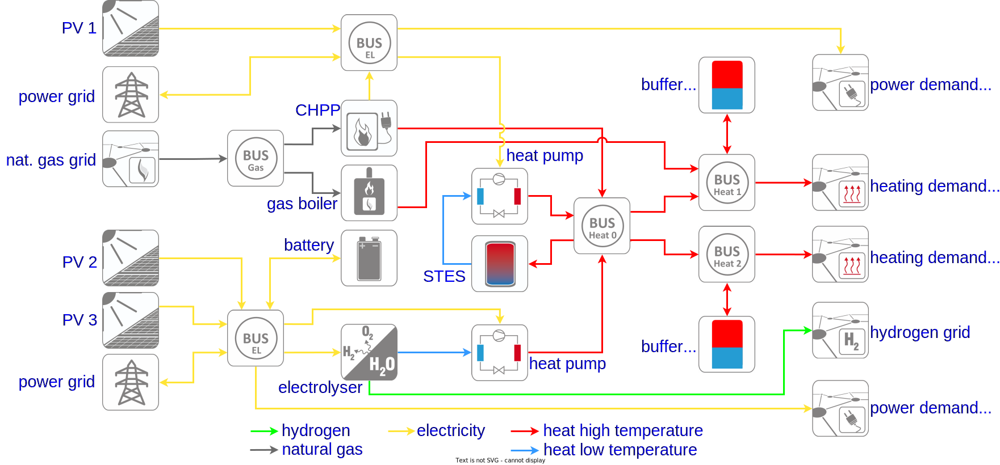
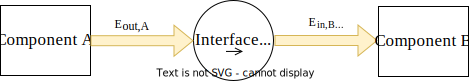
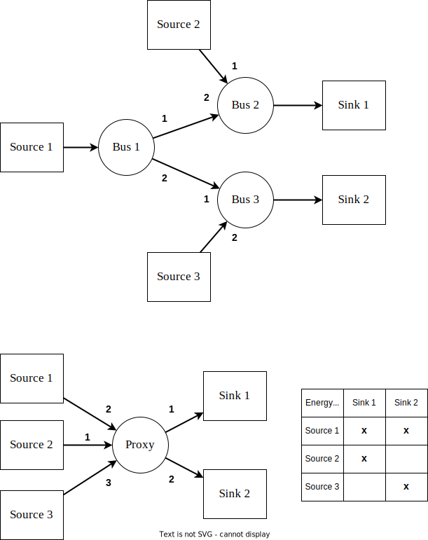

# Energy systems

In the simulation model technical equipment units are connected to each other to form a network of components across which the use of energy is balanced. The specific way the components are connected is named energy system. In the following any change in how the components are connected is considered to result in a similar but different energy system. An example of a multi-sector energy system for an urban strict of two buildings is shown in the figure below.

There, arrows indicate the flow of energy between the components, with the colors of the arrows representing the respective medium. A main heat bus supplies two secondary heat busses, which each connect with a buffer tank and the demand side of a building. The main heat bus draws heat from the waste heat of a hydrogen electrolyser (HEL), elevated to the required temperature by a heat pump, as well as a combined heat-and-power plant (CHPP). A gas boiler supplies one of the buildings for additional peak load capacity. In order to shift available energy between seasons, a seasonal thermal energy storage (STES) is connected to the main heat bus.

Such an energy system requires several operational strategies and control mechanisms to operate as expected. How these can be modeled for this example is described in more detail in the chapter on operation and control. For the following we focus on the graph structure that is formed from the components and the connections between them.

## Characteristics of an energy system

The example in the introduction above shows some of the important characteristics that an energy system requires for a correct simulation. Using one of the available graphical user interfaces to construct an energy system should automatically fulfill these as invalid configurations are not allowed, but it is good to keep these in mind when writing a project file from scratch.

### No unmatched inputs / outputs

Each component has defined inputs and outputs. A necessary condition for the simulation to work is that every input and output connects to something. If an input or output is not relevant for the analysis / question that underlies the simulation, an undesired input or output can be connected to a grid connection that does not appear in the simulation output.

### Bidirectional flow only for storage

Energy flow is always in one direction, namely from the output of one component to the input of another. While it is possible to construct a cycle by connecting the output of a component to the input of another component and in turn the output of that back to the the input of the first component, this will lead to problems in calculating the correct order of execution.

The exception to this rule are storage component, which typically are connected to both the input and output of a bus component. In the example energy system this is displayed as a bidirectional arrow between the bus and the storage.

### No mixing of media

Along with the number of inputs and outputs a component has, each also has a defined medium. This is used to ensure that the components in an energy system are connected in such a way that the output of a component works on the same medium as the input of the other component. It is not possible to connect mismatching inputs / outputs.

### Exactly one component per input / output

Each output of a component must connect to exactly one input of another component and vice versa. If there is a need to connect multiple components to the same receiver, there must be a bus used as an intermediary. This was chosen for several reasons:

* It simplifies calculations as there is always exactly one other component to consider.
* It improves readability of the energy system as, while it requires additional busses, it reduces the overall connectedness of the graph.
* It enables an important layer of control behavior as input priorities can be handled by the intermediate bus.
* Storage components work better if they are connected to a bus because large demand fluctuations might overload the storage capacity leading to flickering values of the storage as it is filled or depleted within a single timestep. Being connected to a bus enables the energy sources on the same bus to side-step the storage and feed into the demand side directly.

## Energy media

All energy handled by the simulation model exists in the form of some medium that carries that energy. This includes but is not limited to the two major forms of energy used in buildings, namely electricity and heat. For a complete physical simulation each medium would carry its own set of restrictions and modeling challenges, however for ReSiE this was simplified. Different media are reduced to categories that differ only in name.

For example, alternating current of a certain voltage can be converted to a different voltage or to direct current. The actual energy carried by this current is not simply a scalar value but depends on how the current is used to perform work. For the simulation model this exact simplification has been done, which results in different energy media for different currents, each of which carries a scalar amount of energy. For other physical media (especially water) similar simplifications are used.

The following lists which media are currently implemented as default and what they represent.

@TODO still correct?
**Note:** Temperatures of fluids are crucial for a correct simulation even in this simplified model due to how they are utilized to carry energy and how they affect the efficiency and performance of energy system components. Currently, this is implemented in a simplified way where temperatures are handed over between components together with the supplied or requested energies. This does not allow to simulate the temperature change in a district heating grid due to energy mismatch of supply and demand! This may change with later versions of ReSiE. Currently, if different temperatures are present at one bus, always the highest temperature will be set as bus temperature which can lead to inefficient operation of connected components like a HP.

### Electricity
* `m_e_ac_230v`: Household electricity at 230 V AC and 50/60 Hz.

### Chemicals - Gasses
* `m_c_g_natgas`: A natural gas mix available through the public gas grid.
* `m_c_g_h2`: Pure hydrogen gas.
* `m_c_g_o2`: Pure oxygen gas.

### Heat - Low temperature water
Different low temperature regimes:

* `m_h_w_lt1`
* `m_h_w_lt2`
* `m_h_w_lt3`
* `m_h_w_lt4`
* `m_h_w_lt5`

### Heat - High temperature water
Different high temperature regimes:

* `m_h_w_ht1`
* `m_h_w_ht2`
* `m_h_w_ht3`
* `m_h_w_ht4`
* `m_h_w_ht5`

### User definable media names
The names of all media can also be user-defined. Therefore, the name of each medium of each in- and output of all components can be declared in the input file. Alternatively, only a few default media names can be overwritten by user-defined media names. They have to match exactly the medium name of the interconnected component.

For busses, grids, demands, storages (except seasonal thermal energy storage), the medium name of each component can be given with the specifier `medium` (`String`) in the input file. For transformers and seasonal thermal energy storages, user-definable media names of each in- and output can be given using the specifier `m_heat_in`, `m_heat_out`, `m_gas_in`, `m_h2_out`, `m_o2_out`, `m_el_in` or `m_el_out` depending on the inputs and outputs of a transformer. The specifiers can also be found in the [description of components](resie_description_components.md) for each component.

## Interfaces

When writing the implementation of components a problem has emerged in the functionality handling the processing[^1] of energy. There must be a way to track the energy balances between components which is the same for all types of components, so that the processing code does not need to know which types of component it can connect to and how to transfer energy. In particular this has been shown to be a problem with control and processing calculations for components that are supposed to feed into a demand and fill a storage at the same time.

[^1]: Here "processing" is a stand-in for the transport, transfer or transformation of energy. The term is used to differentiate the "action" from the control of a component.

An energy system component A connected via an interfaces to an other component B.

To solve this problem interfaces have been introduced, which act as an intermediary between components. The output of a component connects to the "left" of an interface and the input of the receiving component on the "right". That way energy always flows from left to right.

When a component outputs energy, it writes a negative amount of energy to the right side of the interfaces of all its inputs and writes a positive amount of energy to the left side of all its outputs. The connected components can then maintain the energy balance by writing matching positive / negative energy values to their inputs / outputs. In addition, this mechanism is also used to differentiate between energy demands and the loading potential for storage components.

This mechanism has proven useful as otherwise the implementation of every component would have to check if it is connected to a bus or a single other component as well as if it is a storage component or not. The interfaces simplify this behavior and decouple the implementations of components, which is important to maintain the flexibility of the overall simulation software in regards to new components.

## Units
Currently, ReSiE is based on the following units:

- time in seconds [s]
- energy in watt-hour [Wh]
- power in watt [W]
- temperatures in degree celsius [°C]

Values provided in the project input file or in profiles should have these units and the plots created directly from ReSiE has to be labeled accordingly (while offering the change of scale by a scale factor - but then the unit displayed in the plots has to specified respectively in the input file). 

**Note:** While some components would work the same given different units, e.g. [kW] and [kJ] for power and energy values in profiles, other components require specific units for some of their parameters, which have to match the units of the other parameters and profiles. Currently there is no mechanism to automatically convert between units, therefore it is not advised to use any other units.

### Output units

Note that all energy-related output values requested in the input file to plot or to write to the `output.csv` file are returned as energies and not as power! For example, if all inputs are given in [W] and [Wh], the output value of the heat delivered by a heat pump is given as energy in [Wh] delivered within the current time step. If the simulation time step is set to `15min`, an output of 100 kWh equals a thermal power of 400 kW.

## Component chains

A "chain" refers to multiple components of the same type being connected to each other. As only transformer, busses and storages can have both an input and an output, only these three types can form chains. There is some special consideration for such component chains, which is discussed here. Although the word chain suggests a linear connection, a chain can be any connected sub-graph of the entire energy system with multiple branches. However such complex chains are rare in practise as they serve little purpose.

### Transformer chains

With multiple transformers in a chain there arises a problem in calculating the energy each transformer can process, as this depends on the energy the others can process. This is the main purpose behind the `potential` operation, which only exists for transformers and is used in a simple algorithm to solve the problem:

1. The last transformer in a chain, where last refers to not outputting to another transformer, calculates its energy potentials assuming that any input or output that has not been determined yet is infinite.
2. This repeats for the other transformers going to the front of the chain, where front refers to not having a transformer as an input.
3. The transformer at the front now performs the `process` step, which is possible as now the whole energy system is specified in regards to energy potentials.
4. This repeats for the other transformers going to the back of the chain, however each transformer recalculates its own potentials because the inputs will have changed from the previous assumed-as-infinite values.

This back-and-forth approach works as it communicates the non-infinite demands and supplies from non-transformers across the chain and then recalculates with the correct `process` values once all potentials are specified.

**Note:** At the moment this does not work if transformers are connected across one or more busses, because this is not recognised as a chain. This will be addressed in a future version of ReSiE.

### Bus chains

Because busses are both used as an abstraction over the actual hydraulical and electrical network of an energy system, as well as the component for distributing energy in a sub-network of the energy system, it often makes sense from a modelling perspective to have multiple busses of the same medium connected to each other, forming a chain. For example an energy system of a district might provide heat in a central bus that outputs to other busses in each building, which have local heat storages and other components.

Given that energy can only flow in one direction in such a chain, the entire chain can be replaced by a single bus, which has all non-bus inputs and outputs as its own inputs and outputs. This is called a proxy bus, with the original busses being called the principals. During the construction of the proxy bus, the energy flow matrices of the principals, as well as the direction of energy flow between busses is taken into consideration to determine which inputs of the proxy bus can provide energy for which outputs and in which order this is happening.

**Note:** This mechanism of a proxy bus only works if there no loops between the busses. This produces a modelling challenge as it would be convenient to model a district heating network as multiple busses that request and provide heat to/from each other. It is currently an open question how to best address this problem and we hope to improve this in future versions of ReSiE.

Illustration of how a proxy bus is created and how input/output priorities and energy flow is preserved.
