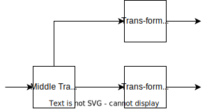
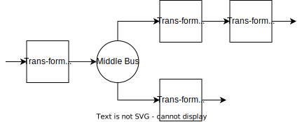
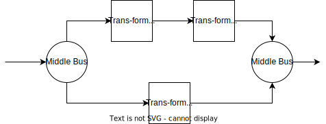
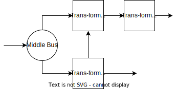
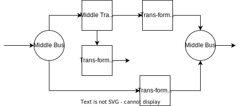
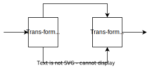
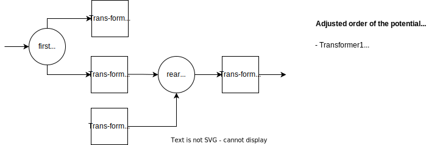
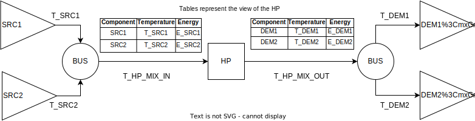
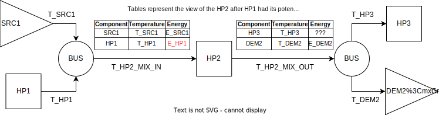

# Energy systems

In the simulation model technical equipment units are connected to each other to form a network of components across which the use of energy is balanced. The specific way the components are connected is named energy system. In the following any change in how the components are connected is considered to result in a similar but different energy system. An example of a multi-sector energy system for an urban district of two buildings is shown in the figure below.

There, arrows indicate the flow of energy between the components, with the colors of the arrows representing the respective medium. A main heat bus supplies two secondary heat busses, which each connect with a buffer tank and the demand side of a building. The main heat bus draws heat from the waste heat of a hydrogen electrolyser (HEL), elevated to the required temperature by a heat pump, as well as a combined heat-and-power plant (CHPP). A gas boiler supplies one of the buildings for additional peak load capacity. In order to shift available energy between seasons, a seasonal thermal energy storage (STES) is connected to the main heat bus.

Such an energy system requires several operational strategies and control mechanisms to operate as expected. How these can be modeled for this example is described in more detail in the chapter on operation and control. For the following we focus on the graph structure that is formed from the components and the connections between them.

## Characteristics of an energy system

The example in the introduction above shows some of the important characteristics that an energy system requires for a correct simulation. Using one of the available graphical user interfaces to construct an energy system should automatically fulfill these as invalid configurations are not allowed, but it is good to keep these in mind when writing a project file from scratch.

### No unmatched inputs / outputs

Each component has defined inputs and outputs. A necessary condition for the simulation to work is that every input and output connects to something. If an input or output is not relevant for the analysis / question that underlies the simulation, an undesired input or output can be connected to a grid connection that does not appear in the simulation output.

### Bidirectional flow only for storage

Energy flow is always in one direction, namely from the output of one component to the input of another. While it is possible to construct a cycle by connecting the output of a component to the input of another component and in turn the output of that back to the the input of the first component, this will lead to problems in calculating the correct order of execution.

The exception to this rule are storage component, which typically are connected to both the input and output of a bus component. In the example energy system this is displayed as a bidirectional arrow between the bus and the storage.

### No mixing of media

Along with the number of inputs and outputs a component has, each also has a defined medium. This is used to ensure that the components in an energy system are connected in such a way that the output of a component works on the same medium as the input of the other component. It is not possible to connect mismatching inputs / outputs.

### Exactly one component per input / output

Each output of a component must connect to exactly one input of another component and vice versa. If there is a need to connect multiple components to the same receiver, there must be a bus used as an intermediary. This was chosen for several reasons:

* It simplifies calculations as there is always exactly one other component to consider.
* It improves readability of the energy system as, while it requires additional busses, it reduces the overall connectedness of the graph.
* It enables an important layer of control behavior as input priorities can be handled by the intermediate bus.
* Storage components work better if they are connected to a bus because large demand fluctuations might overload the storage capacity leading to flickering values of the storage as it is filled or depleted within a single timestep. Being connected to a bus enables the energy sources on the same bus to side-step the storage and feed into the demand side directly.

## Energy media

All energy handled by the simulation model exists in the form of some medium that carries that energy. This includes but is not limited to the two major forms of energy used in buildings, namely electricity and heat. For a complete physical simulation each medium would carry its own set of restrictions and modeling challenges, however for ReSiE this was simplified. Different media are reduced to categories that differ only in name.

For example, alternating current of a certain voltage can be converted to a different voltage or to direct current. The actual energy carried by this current is not simply a scalar value but depends on how the current is used to perform work. For the simulation model this exact simplification has been done, which results in different energy media for different currents, each of which carries a scalar amount of energy. For other physical media (especially water) similar simplifications are used.

Temperatures of fluids are crucial for a correct simulation even in this simplified model due to how they are utilized to carry energy and how they affect the efficiency and performance of energy system components like heat pumps. This is implemented as temperatures being communicated between components as separate values alongside supplied or requested energies. This differs from a full hydraulic/thermodynamic simulation where the temperature determines the energy.

Because of temperatures being separated from the medium, media cannot be categorized by temperatures neatly. Instead regimes are used, which mostly refer to the nominal temperature. This helps to distinguish between low and high temperature heat inputs/ouputs even if the actual temperatures in each time step vary and might even be the same. Similar considerations can be made for properties like pressure or voltage.

The name of the media used in the code of ReSiE and for defaults follows a scheme based on segments seperated by underscores, for example `m_c_g_natgas` for natural gas. The first segment is always `m`, which has technical reasons and helps distinguish media names from other similar variables. The second segment represents the type of energy the medium carries and the third segment is a subcategory of this which roughly describes the physical medium carrying the energy. The fourth segment distinguishes similar media as subtypes and must be unique within the category.

The following table presents a possible categorisation of media using the three segments and a number of default media names used by various implemented components as well as future models. This is not intended to be a complete categorisation of all forms of energy.

| Energy type | Medium category | Subtypes |
| ----------- | --------------- | -------------------------------------------------------- |
| `e`: electrical | `ac`: AC | `230v`: Household electricity at 230 V AC and 50/60 Hz. |
| `c`: chemical | `g`: gasses | `natgas`: A natural gas mix available through the public gas grid. |
|  |  | `h2`: Pure hydrogen gas. |
|  |  | `o2`: Pure oxygen gas.[^1] |
|  | `s`: solids | `chips`: Wood chips or pellets. |
|  | `l`: liquids | `oil`: Heavy oil used in oil boilers. |
| `h`: heat | `w`: water | `lt1`: First low temperature regime. |
|  |  | `ht1`: First high temperature regime. |
| `p`: pressure | `a`: air with atmospheric composition | `p1`: First pressure regime of gaseous air. |

[^1]: Note that oxygen is not typically considered an energy carrier. At the moment no commodity transport model is implemented in ReSiE, which is why oxygen is listed as an energy carrier for the use in electrolysers. This will be addressed in future versions of ReSiE.

### User definable media names
The names of all media can also be user-defined. The name of any medium of any in- and output of all components can be declared in the input file. This does not change the requirement that the names of media connected via direct input-output or via busses have to match each other.

For some components such as busses, grid connections, demands and some storages, the medium name of each component can be given with the specifier `medium` (`String`). For others, such as transformers and storages with temperature differentials, user-definable media names of each in- and output can be given using certain specifiers such as `m_heat_in` or `m_el_out`. The exact specifiers can be found in the [specification of parameters](resie_component_parameters.md) for each component.

## Interfaces

When writing the implementation of components a problem has emerged in the functionality handling the processing[^2] of energy. There must be a way to track the energy balances between components which is the same for all types of components, so that the processing code does not need to know which types of component it can connect to and how to transfer energy. In particular this has been shown to be a problem with control and processing calculations for components that are supposed to feed into a demand and fill a storage at the same time.

[^2]: Here "processing" is a stand-in for the transport, transfer or transformation of energy. The term is used to differentiate the "action" from the control of a component.

An energy system component A connected via an interfaces to an other component B.

To solve this problem interfaces have been introduced, which act as an intermediary between components. The output of a component connects to the "left" of an interface and the input of the receiving component on the "right". That way energy always flows from left to right.

When a component outputs energy, it writes a negative amount of energy to the right side of the interfaces of all its inputs and writes a positive amount of energy to the left side of all its outputs. The connected components can then maintain the energy balance by writing matching positive / negative energy values to their inputs / outputs. In addition, this mechanism is also used to differentiate between energy demands and the loading potential for storage components.

This mechanism has proven useful as otherwise the implementation of every component would have to check if it is connected to a bus or a single other component as well as if it is a storage component or not. The interfaces simplify this behavior and decouple the implementations of components, which is important to maintain the flexibility of the overall simulation software in regards to new components.

## Units
Currently, ReSiE is based on the following units:

- time in seconds [s]
- energy in watt-hour [Wh]
- power in watt [W]
- temperatures in degree celsius [°C]

Values provided in the project input file or in profiles should have these units and the plots created directly from ReSiE has to be labeled accordingly (while offering the change of scale by a scale factor - but then the unit displayed in the plots has to specified respectively in the input file). 

**Note:** While some components would work the same given different units, e.g. [kW] and [kJ] for power and energy values in profiles, other components require specific units for some of their parameters, which have to match the units of the other parameters and profiles. Currently there is no mechanism to automatically convert between units, therefore it is not advised to use any other units.

### Output units

Note that all energy-related output values requested in the input file to plot or to write to the `output.csv` file are returned as energies and not as power! For example, if all inputs are given in [W] and [Wh], the output value of the heat delivered by a heat pump is given as energy in [Wh] delivered within the current time step. If the simulation time step is set to `15min`, an output of 100 kWh equals a thermal power of 400 kW.

## Component chains

A "chain" refers to multiple components of the same type being connected to each other. As only transformer, busses and storages can have both an input and an output, only these three types can form chains. There is some special consideration for such component chains, which is discussed here. Although the word chain suggests a linear connection, a chain can be any connected sub-graph of the entire energy system with multiple branches. However such complex chains are rare in practise as they serve little purpose.

### Transformer chains

With multiple transformers in a chain there arises a problem in calculating the energy each transformer can process, as this depends on the energy the others can process. This is the main purpose behind the `potential` operation, which only exists for transformers and serves as a preprocessing step within each time step to handle interdependencies between multiple transformers. For a linear chain of transformers, this is relatively straightforward. For transformer chains with multiple interconnections between busses and transformers, the determination of the correct sequence of the `potential` and `process` steps quickly leads to a complex non-trivial problem. The interdependence of the transformers requires a sophisticated calculation sequence that also takes into account the priorities of the individual components. This can be simplified by the presence of grids on busses, which ensure that the mutual dependencies of transformers are interrupted. The following section attempts to describe the algorithm used in ReSiE. This algorithm is not perfect and cannot determine a useful calculation order for every possible energy system. However, a variety of energy systems have been successfully tested. In [a later section](resie_energy_systems.md#energy-systems-that-can-cause-problems-when-automatically-determining-the-order-of-operation), a (non-exhaustive) list of known energy systems or constellations that cause problems in the automatic determination of the calculation sequence is described. 

Important terms and definitions:

- Chain: For the purpose of the following algorithms a chain is defined [as described above](resie_energy_systems.md#component-chains), with the addition that the chain can contain both busses and transformers. Because bus chains [have their own handling](resie_energy_systems.md#bus-chains) and are merged in a preprocessing step, we can assume that a bus is not connected to another bus. Chains can be interrupted by several things:
    - Storages, as there is no bypass directly through a storage. Storages cannot communicate information from their input to their output interface (and vice versa) within one time step.
    - The connection matrix of a bus denies the connection from an input to an output component.
    - A component inputting into a bus is connected to a grid outputting out of the bus, taking the connection matrix into account. This means that the input component does not depend on the following transformers, as it can always transfer energy in the grid, and there is no limitation at this interface.
    - A component outputting out of a bus is connected to a grid inputting into the bus, taking the connection matrix into account. This means that the output component does not depend on the previous transformers, as it can always get energy from the grid, and there is no limitation at this interface.

- Directions: When speaking of "first", "last", "forward" or "backward/reverse", always the direction of energy flow is meant, from source to sink.

- A component can "see" another component if it is either directly connected or both are connected to the same bus in a way that energy could be moved between the components. This means that one component has to be an input to the bus and the other an output.

- Middle Transformer (MT): A middle transformer is defined as a transformer with two or more input interfaces and/or two or more output interfaces, with each "seeing" at least one other transformer.

- Middle Bus (MB): A middle bus is defined as a bus with two or more input interfaces and/or two or more output interfaces, with each "seeing" at least one other transformer.

- Parallel Branches (PB): Parallel branches are defined as branches that offer more than one way between two busses, with each way containing at least one other transformer under consideration of the direction of the energy flow.

#### Algorithm for linear chains

For a linear chain of transformers, meaning that there are no busses or transformers with more than one input or more than one output with each "seeing" more than one other transformer, the following method is used to determine the order of operation:

1. The first transformer in a chain calculates its energy potentials assuming that any input or output that has not been determined yet is infinite.
2. This repeats for the other transformers going to the end of the chain.
3. The transformer at the end now performs the `process` step, which is possible as now the whole energy system is specified in regards to energy potentials.
4. This repeats for the other transformers going to the front of the chain, however each transformer recalculates its own potentials because the inputs will have changed from the previous assumed-as-infinite values.

This back-and-forth approach works as it communicates the non-infinite demands and supplies from non-transformers across the chain and then recalculates with the correct `process` values once all potentials are specified.

#### Algorithm for complex chains

The following method is used to determine the order of operation. First, all PBs in the current energy system are determined. Then, the following steps are performed and called recursively while considering the already checked components to avoid double-counting, starting with the whole energy system as the current components:

1. Determine all MTs in the current components and take the first one (meaning no other MT is in the inputs of the chosen MT). If there is no MT, skip the next step.
2. Determine the single branches of the MT that start or end at the MT and check them for interdependencies with each other under consideration of the effects described in the pulletpoint "Chains" above. Also, the way through the MT is not considered here. If there are any interdependencies (see figure below for an example), the order of the branches for the calculation is adjusted to ensure that the dependencies are calculated first. The default order is to start with the longest branch that contains the most number of transformers. If there are logical loops, they are detected and removed, which may lead to an incorrect order of operation. Then, the components (transformers and busses) of each branch are taken and the function is called recursively. The branches start to do their potential from "outside", meaning each branch starts at the point furthest from the MT (input branches are calculated forward, output branches backward). After all branches have finished, the MT does its potential. During the process, the MT does its process first, then the branches do their process starting from the "inside" with the components near the MT (input branches are calculated backwards, output branches forward).
3. Determine all MBs in the current components and take the first one (meaning no other MB is in the inputs (forward or indeterminite order) or in its outputs (reverse order) of the chosen MB). If there is no MB, skip the next step.
4. Determine the single branches of the MB that start or end at the MB and check them for interdependencies which each other, considering possible interruptions of the chain. Also, the way through the MB is not considered here. If some branches are part of a PB, then they are merged together into one branch. If branches have interdependencies (see figure below for an example), the order of the branches is adjusted accordingly to calculate the dependencies first, but only at potential step, as during process, the input/output order of the bus has to match the order of operation! The default order depends on the direction of calculation, if the current components should be calculated forward (which is also default at the first function call), first the input branches and then the output branches are given recursively to the function as current components. If they should be calculated backward, the output branches come first. Also, the input/output order specified in the bus is considered. If there are logical loops, they are detected and removed, which may lead to an incorrect order of operation. 
5. If no MB or MT can be found in the current components, the process or potential of the components is determined by their order in the energy system. The direction is set by the current direction, which defaults to forward (potential step) and backward (process step). If one of the components is part of a parallel branch, this is detected and the parallels are handled separately: 
Depending on the output order of the MB (input order is not considered here, but logically they should be the same!), each of the parallel branches performs its potentials in both ways (forward and backward) to ensure that possible limitations reach both ends of the chain before continuing with the next branch of the parallel branches.

Further aspects:

- If an MB is connected to another MB, the first MB holds the rear MB in one of its output branches. When determining the correct calculation order of the branches of the rear MB, the connection branch between the two MBs has to perform its potentials after all of the other branches of the rear MB if the calculation is backward. 
- In some cases, components can be considered multiple times if they are part of multiple branches at one MB or MT! Therefore, after the order has been determined, only the first appearance of the process is considered and all other process steps of the same component are deleted from the order of operation. For potential steps, this is not done as in some cases, components have to have multiple potential steps. If one component has its potential and right afterwards its process step, the potential step is deleted as it is effectively the same at this point. This is repeated until there are no more changes in the order of operation. 

Interdependencies occur when there are allowed connections between two branches of an MB or an MT, e.g:

#### Energy Systems that can cause problems when automatically determining the order of operation

There are some energy systems that cause problems when determining the order of operation with the above algorithm. If a simulation gives an unexpected result, this may be due to an incorrect calculation order. It can then help to use the order output in auxiliary_info as the basis for a custom-defined `order_of_operation` in the input file that can map the energy system correctly by adjusting the order (or adding/deleting) of `potential` and `process` steps of the transformers (see [this section](resie_input_file_format.md#order-of-operation)). If calculation time does not matter much, it may be possible to achieve an optimal calculation result by adding further potential steps. The following lists a non-exhaustive collection of these problematic constellations:

-   A middle bus or middle transformer that is part of a parallel branch may cause problems for the automated generation of the order of operation. Although, it should be possible to simulate these energy systems with a custom order.
  

-   Logical loops, e.g. if a CHPP is directly connected to the same heat pump both on the electric and the thermal side. The optimal operational state of the two components could only be determined with an iterative solving or with setting up and solving a single equation, but not with the stepwise approach of ReSiE.
   

- Energy systems without a connection to any grid (insular system) may not find an optimal solution at the point where the storages are empty! Adding a grid in the simulation can help to find a suitable order of operation and an appropriate solution of the simulation. The grid input/output can then be seen as necessary energy balancing required to operate the insular system in a stable manner.
- Energy systems with multiple middle busses with heat sources of different temperatures in the rear MB used by a heat pump can cause problems in the calculation. The branches of the rear MB should be calculated forward to make sure that the rear heat pump knows the available energy and the temperatures. However, due to the interconnected nature of these middle buses, the rear MB is calculated in reverse in order to allow information to propagate to the first MB. Unfortunately, this order can lead to balance errors. These errors occur because the rear heat pump, which operates based on different COP, doesn't have prior knowledge of the available energy during its potential step. It assumes that it will receive all the necessary energy at the temperature prioritized as the highest input. A custom order can help to solve this.

### Bus chains

Because busses are both used as an abstraction over the actual hydraulical and electrical network of an energy system, as well as the component for distributing energy in a sub-network of the energy system, it often makes sense from a modelling perspective to have multiple busses of the same medium connected to each other, forming a chain. For example an energy system of a district might provide heat in a central bus that outputs to other busses in each building, which have local heat storages and other components.

Given that energy can only flow in one direction in such a chain, the entire chain can be replaced by a single bus, which has all non-bus inputs and outputs as its own inputs and outputs. This is called a proxy bus, with the original busses being called the principals. These proxy busses are created for every bus chain within the preprocessing of ReSiE in order to facilitate easier calculation for the computation of energy flow and distribution via busses. For the simulation outputs, these proxy busses are then converted back to the original pricipal busses. During the construction of the proxy bus, the energy flow matrices of the principals, as well as the direction of energy flow between busses is taken into consideration to determine which inputs of the proxy bus can provide energy for which outputs and in which order this is happening.

**Note:** This mechanism of a proxy bus only works if there are no loops between the busses. This produces a modelling challenge as it would be convenient to model a district heating network as multiple busses that request and provide heat to/from each other. It is currently an open question how to best address this problem and we hope to improve this in future versions of ReSiE.

Illustration of how a proxy bus is created and how input/output priorities and energy flow is preserved.

## Bus and interface functionalities with temperature layers

The general purpose and functionality of interfaces in a simple one-to-one connection between two components have already been described above. However, when multiple interfaces connect several components using a bus as an intermediate distributor, the system becomes more complex. Interfaces must not only transfer information about demands and sources but also convey the maximum energy determined during the transformer's potential step, the actual energy during the process step and minimum and maximum temperatures.

The complexity increases further when heat pumps are involved, as interfaces must handle different temperature levels simultaneously. This is somewhat contrary to the general definition of media, which typically represent one temperature per time step. For example, consider a heat pump connected to two sources with different supply temperatures and two demands, each with different demand temperatures as shown in the figure below. Since a heat pump cannot send two temperatures simultaneously via an interface, the model abstracts this operation by splitting it within a time step. For instance, within a 15-minute time step, the heat pump might provide a high temperature for hot water for 5 minutes and a low temperature for underfloor heating for 10 minutes. At the same time, it can draw energy from two sources at different temperatures, resulting in various COPs based on the composition of the individual input and output layers. This results in an average mixing temperature over the current time step for the input and output interfaces based on the current distribution of energy flows and their temperatures.

During the potential step, the maximum required and available energies at the respective temperatures are calculated and written to the interface. The interface then forwards this information to the bus, which stores the information and allocates the energy to other components. The method can also be used to override the priorities on the bus, which are set to a constant ordering for the entire simulation. This allows the heat pump to determine during its potential and process steps from which source it draws energy in the current time step, regardless of the priorities on the bus.

If there are other transformers in the list of sources or sinks that have not yet been calculated at the time of the heat pump's potential step, the heat pump might lack complete information for its calculations. This is shown in the modified example from above in the figure below. While the temperatures are written during the control step and non-transformer components also write their maximum energy in this step, the energies of transformers are only calculated later during the potential or process step. To address this, a mechanism allows the heat pump to determine how much energy it could supply or take for each temperature, regardless of the current energy distribution to other inputs or outputs. The bus handles any excess energy by linearly reducing the theoretically maximum possible energy at other temperatures proportionally when energy is called up at one temperature (internal parameter `has_calculated_all_maxima` indicating that a component has calculated each source or target individually as if no other ones exists, like geothermal probe, solar thermal collector and heat pump). Another method implemented for components with temperature-depended energy demand (seasonal thermal energy storage) is a direct re-calculation within the component triggered by the bus (internal parameter `recalculate_max_energy` in the `MaxEnergy` struct). These methods ensure a closed-loop step-by-step calculation, even with incomplete information. Full information (energies and temperatures) must be available at least for the input or output, which should be ensured by the algorithm determining the order of operations.

In concrete terms, a **bus and the communication with the connected components work as follows** (this may only be relevant if you plan to develop your own components):

- All components call `set_max_energy(Interface)` on all of their interfaces during their `Control` step. If they already know their maximum available or demanded energy, they hand it over. If they do not know their maximum energy, they will later call the function again during their `Potential` step. Components have the *possibility* to also communicate to which component the energy should be delivered or taken from using the parameter `purpose_uac`. The handed-over values therefore *can* be vectors when calling `set_max_energy(Interface)`, each index representing information for one target component and one time span within the current time step (see the above description of temperature layers). Components do not have to split the energy to different target components, only if they want control over the actual targets due to internal control modules or different temperatures, e.g.,. If no target is specified, the bus will distribute the energy. During `Control`, at least the maximum and minimum temperatures of the components are communicated via the `set_max_energy(Interface)` function. In general, the maximum temperature is used for supplies, meaning a component can deliver energy at this temperature or lower. The minimum temperature is used by demands, meaning energy is demanded at this temperature or above. This follows the assumption that temperatures can always be cooled down, although this would result in a loss of exergy. This works because cooling demands are handled as fixed energy supplies.
- If `set_max_energy(Interface)` is called on a direct 1-to-1 connection, the information is written in the `MaxEnergy` struct within the interface. This involves checking whether the temperatures match the existing information of the component on the other side of the interface (if already written to the interface) and whether the maximum energy that may already be written is not exceeded. The `MaxEnergy` struct can also handle vectors for all entries.
- If a bus is connected to the interface, `set_max_energy(Interface)` also calls `set_max_energy(Bus)`. Here, the information provided by the component is written in the `balance_table_inputs`/`balance_table_outputs` for input and output interfaces within the bus. These structs hold much information for each connected interface, including these four versions of a `MaxEnergy` struct:
    - `energy_potential`: holds information on maximum energy, temperatures, target components and information on how to handle the maximum energy (like the parameters `has_calculated_all_maxima` or `recalculate_max_energy` described above) written by `set_max_energy(Bus)`.
    - `energy_potential_temp`: A temporary version of `energy_potential` that is required for internal distribution of input and output energies of the bus. With the help of this, the bus calculates how much energy from a source can go to which target while checking for correct minimum and maximum temperatures and considering the target/source names the components may have handed over with their `set_max_energy(Interface)`, or if not, the priorities on the bus, the bus energy matrix, as well as internal control constraints, such as whether a component is allowed to load storages. This distribution is then written to the `balance_table` within the bus, which holds information on how much energy is transferred between the components at what temperature. This information can then be sent to other components when they call `balance_on()` on one of the interfaces of the bus. The return of the `balance_on()` only includes energy that are still available/demanded, already distributed energies or energy from other components where the boundary conditions are not met (temperatures, denied connections, e.g.) are not included.
    - `energy_pool`: When a component has finally calculated the actual energy that will be delivered or taken in its `Process` or `Load` step, the components call `sub!()` or `add!()` on each of their interfaces to add or subtract energy from this interface. Doing this, information is written into the interface in the `balance` and `sum_abs_change` parameters, and, if a bus is connected, also into the `energy_pool` within the bus while at the same time the `energy_potential` in the bus is reset to zero. This indicates that the bus is no longer dealing with potentially available/demanded energies but instead with actual energies that will be delivered or taken by the connected components. This is the reason why the `sub!()` or `add!()` functions always have to be called from the components, even if no energy is taken from or delivered to an interface.
    - `energy_pool_temp`: A temporary version of `energy_pool` that is required for internal distribution of the actually delivered or taken input and output energies of the bus. If `energy_pool` holds values, the `energy_potential` is empty. This differentiation helps to handle the different simulation steps within the bus.
