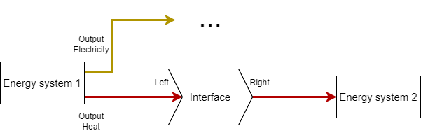

# Energy network topology

In the simulation model energy systems are connected to each other to form a network of systems across which the use of energy is balanced. The specific way the systems are connected is called the energy network topology. This is inspired by, but not quite the same as the term topology in graph theory. In the following any change in how the energy systems are connected is considered to result in a similar but different topology.

In the example above a topology is displayed. Arrows denote the flow of energy from one system to the next with the colors of arrows denoting which medium is involved. Yellow is electricity, purple is natural gas, dark red is low temperature water and light red is high temperature water. Two busses form the main way how energy is exchanged.

## Characteristics of a topology

The example in the introduction above shows some of the important characteristics that a topology requires for a correct simulation. Using one of the available graphical user interfaces to construct an energy network should automatically fulfill these as invalid configurations are not allowed, but it is good to keep these in mind when writing a project file from scratch.

### No unmatched inputs / outputs

Each energy system has defined inputs and outputs. A necessary condition for the simulation to work is that every input and output connects to something. If an input or output is not relevant for the analysis / question that underlies the simulation, an undesired input or output can be connected to a grid connection that does not appear in the simulation output.

### Bidirectional flow only for storage

Energy flow is always in one direction, namely from the output of one energy system to the input of another. While it is possible to construct a cycle by connecting the output of a system to the input of another system and in turn the output of that back to the the input of the first system, this will lead to problems in calculating the correct order of execution.

The exception to this rule are storage systems, which typically are connected to both the input and output of a bus system. In the example topology this is displayed as a bidirectional arrow between the bus and the storage.

### No mixing of media

Along with the number of inputs and outputs an energy system has, each also has a defined medium. This is used to ensure that the systems in a topology are connected in such a way that the output of a system works on the same medium as the input of the other system. It is not possible to connect mismatching inputs / outputs.

### Exactly one energy system per input / output

Each output of an energy system must connect to exactly one input of another system and vice versa. If there is a need to connect multiple systems to the same receiver, there must be a bus used as an intermediary. This was chosen for several reasons:

* It simplifies calculations as there is always exactly one other system to consider.
* It improves readability of the topology as, while it requires additional busses, it reduces the overall connectedness of the graph.
* It enables an important layer of control behaviour as input priorities can be handled by the intermediate bus.
* Storage systems work better if they are connected to a bus because large demand fluctuations might overload the storage capacity leading to flickering values of the storage as it is filled or depleted within a single timestep. Being connected to a bus enables the energy producers on the same bus to side-step the storage and feed into the demand side directly.

## Energy media

All energy handled by the simulation model exists in the form of some medium that carries that energy. This includes but is not limited to the two major forms of energy used in buildings, namely electricity and heat. For a complete physical simulation each medium would carry its own set of restrictions and modeling challenges, however for Resie this was simplified. Different media are reduced to categories that differ only in name.

For example, alternating current of a certain voltage can be converted to a different voltage or to direct current. The actual energy carried by this current is not simply a scalar value but depends on how the current is used to perform work. For the simulation model this exact simplifaction has been done, which results in different energy media for different currents, each of which carries a scalar amount of energy. For other physical media (especially water) similar simplifications are used.

The following lists which media are currently implemented and what they represent.

**Note:** Temperatures of fluids are crucial for a correct simulation even in this simplified model due to how they are utilized to carry energy and how they affect the efficiency and performance of energy systems. However this has not yet been implemented in the model. For now different regimes of temperatures are used.

### Electricity
* `m_e_ac_230v`: Household electricity at 230V AC and 50/60Hz.

### Chemicals - Gasses
* `m_c_g_natgas`: A natural gas mix available through the public gas grid.
* `m_c_g_h2`: Pure hydrogen gas.
* `m_c_g_o2`: Pure oxygen gas.

### Heat - Low temperature water
Different low temperature regimes:

* `m_h_w_lt1`
* `m_h_w_lt2`
* `m_h_w_lt3`
* `m_h_w_lt4`
* `m_h_w_lt5`

### Heat - High temperature water
Different high temperature regimes:

* `m_h_w_ht1`
* `m_h_w_ht2`
* `m_h_w_ht3`
* `m_h_w_ht4`
* `m_h_w_ht5`

### User definable media names
The names of all media can also be user-defined. Therefore, the name of each medium of each in- and output of all energy systems can be declared in the input file. Alternatevly, only a few default media names can be overwritten by user-defined media names. They have to match exactly the medium name of the interconnected energy system.

For busses, grids, demands, storages (except seasonal thermal energy storage), the medium name of each energy system can be given with the specifier `medium` (`String`) in the input file. For transformers and seasonal thermal energy storages, user-definable media names of each in- and output can be given using the specifier `m_heat_in`, `m_heat_out`, `m_gas_in`, `m_h2_out`, `m_o2_out`, `m_el_in` or `m_el_out` depending on the inputs and outputs of a transformer.

## Interfaces

When writing the implementation of energy systems a problem has emerged in the functionality handling the production[^1]. There must be a way to track the energy balances between systems which is the same for all types of energy systems, so that the production code does not need to know which types of energy systems it can connect to and how to transfer energy. In particular this has been shown to be a problem with control and production calculations for systems that are supposed to feed into a demand and fill a storage at the same time.

[^1]: Here "production" is a stand-in for the creation, transformation or destruction of energy. The term is used to differentiate the "action" from the control of an energy system.

To solve this problem interfaces have been introduced, which act as an intermediary between energy systems. The output of a system connects to the "left" of an interface and the input of the receiving system on the "right". That way energy always flows from left to right.

When an energy system produces energy, it writes a negative amount of energy to the right side of the interfaces of all its inputs and writes a positive amount of energy to the left side of all its outputs. The connected energy systems can then maintain the energy balance by writing matching positive / negative energy values to their inputs / outputs. In addition, this mechanism is also used to differentiate between energy demands and the loading potential for storage systems.

This mechanism has proven useful as otherwise the implementation of every energy system would have to check if it is connected to a bus or a single other system as well as if it is a storage system or not. The interfaces simplify this behaviour and decouple the implementations of energy systems, which is important to maintain the flexibility of the overall simulation software in regards to new energy systems.
