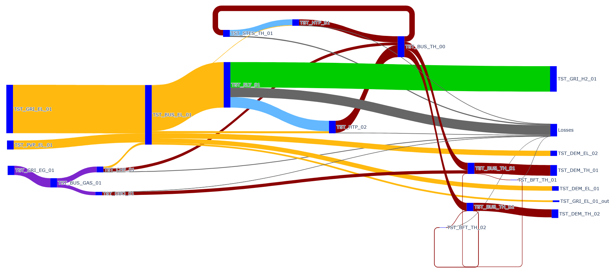
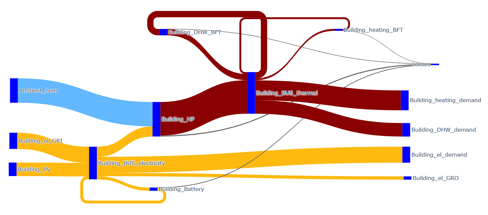
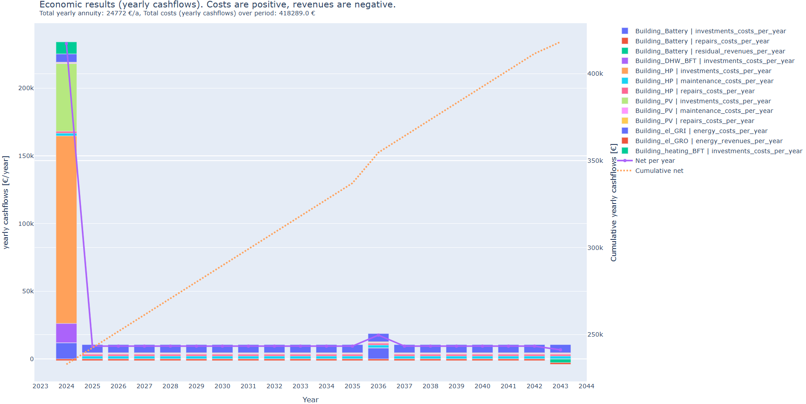
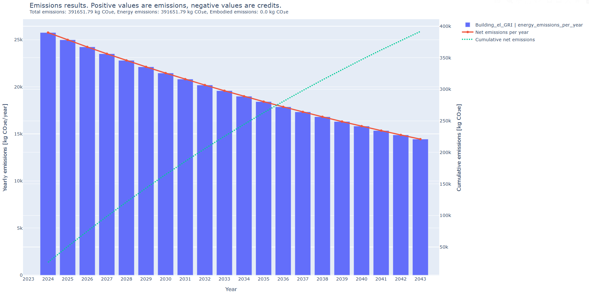
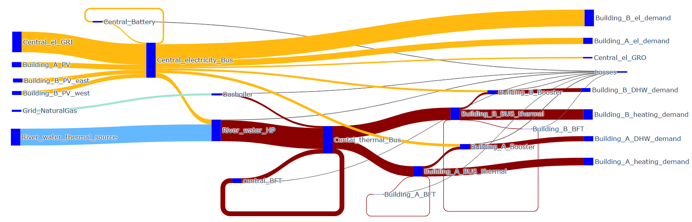
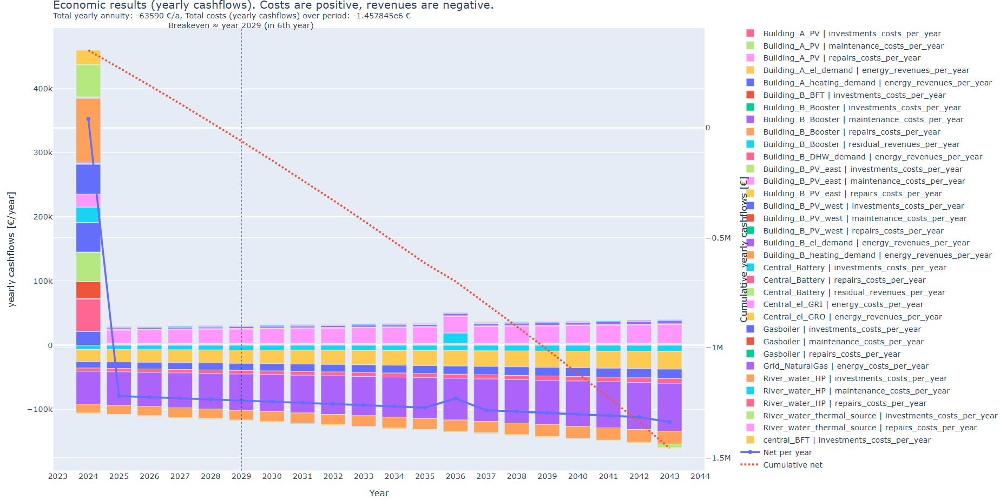
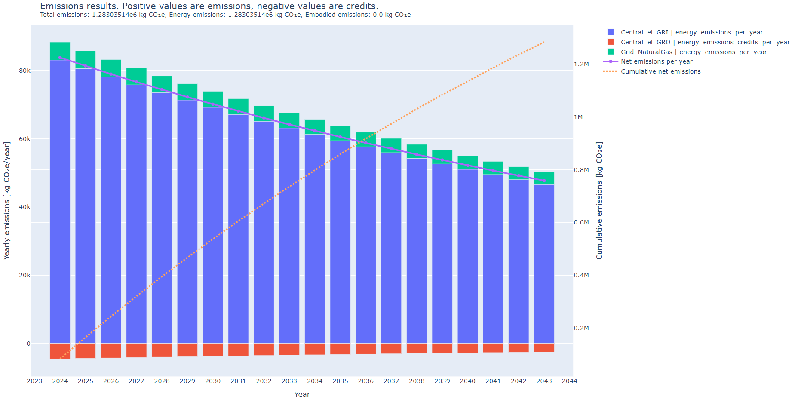

# Examples

In this chapter, some exemplary energy systems will be described and discussed. This may help to understand the capabilities, limitations and usage of ReSiE.

For all examples the required input files are shipped together with ReSiE as JSON files in the subdirectory `examples`. The project files may link to profile files (as `.prf`), which are also shipped alongside ReSiE in the `profiles` subdirectory. The examples can be executed with

```bash
julia --project=. src/resie-cli.jl run --exit-after-run examples/name_of_example.json
```

in the ReSiE directory. More information on how to use the CLI can be found [in this chapter](resie_installation.md). The outputs are written to the `output` subdirectory by default. Please note that output files from multiple simulation runs (including different examples) are not deleted, but are overwritten.

All examples will produce an interactive plot of interesting result data (default `output/output_plot.html`) and a sankey plot of yearly sums of energy (default `output/output_sankey.html`). You can customize both plots as described in [the chapter on the input file format](resie_input_file_format.md). The log files (default `output/logfile_general.log` and `output/logfile_balanceWarn.log`) are of interest as well, particularly if the example generates warnings on purpose.

## Minimal example of a heat pump


File: `examples/simple_heat_pump.json`

A fairly minimal example of operating a heat pump to supply a heat demand by using electricity from the grid and a heat source. The heat source provides temperatures in the range of 19 °C to 27 °C. The demand takes in heat at temperatures varying from 49 °C to 66 °C. The heat pump works with a fixed COP of 3.0.

This example demonstrates how an energy system with a heat pump can be structured on a basic level. Heat pumps are an important and versatile component, however also provide some modelling challenges in combination with other components that handle heat in a complex way. Therefore this example is a known baseline from which energy systems using a heat pump can extend.

For a slightly more advanced version you can change the line `"cop_function": "const:3.0"` from the subconfig of the heat pump to `"cop_function": "carnot:0.4"`. The varying temperatures of input and output are then considered in a simplified Carnot-efficiency calculation and result in a dynamic COP.

## Heating and cooling demands


File: `examples/heating_and_cooling.json`

In this example a heating and a cooling demand are satisfied by making use of the low temperature heat as the source for the heat pump supplying high temperature heat, while only the excess is removed as waste heat. The excess is elevated to a higher level so that heat exchangers can effectively remove the heat from the system. This demonstrates that a cooling demand is in fact a heat source in disguise and can be modelled as a fixed supply of low temperature heat.

There is no additional heat supplier in the system, which is only possible as the cooling demand has a fairly high base load all the time and a heat storage is used to buffer peaks. This could model an office building which, in addition to room cooling, also produces waste heat from a cluster of servers.

The heat pumps works on multiple temperature layer, resulting in different COPs for different combinations of input and output temperatures. The heat pump 1 can cover the demand directly, or load the the buffer tank on a higher temperature, or both is done within the same timestep. This results in a mean COP and mean output temperature over the whole timestep. The defined prioritization (usable energy of heat pump 1 has a higher priority as heat pump 2) works as expected.

## District with sector coupling


File: `examples/multisector_district.json`

This example demonstrates complex behaviour of an energy system covering multiple sectors over the span of a year. Heating and electricity demands in two different subdivisons (e.g. for two groups of buildings) are supplied with a variety of producers. Interesting components include a hydrogen electrolyser feeding into a hydrogen grid and a seasonal thermal energy storage.

This example is also discussed in depth in Ott2023[^Ott2023], however the results discussed in the publication are based on the simplified component models from the time of publication. The example file in the ReSiE repository will use the currently implemented models, therefore results differ.

The following figure shows a sankey plot of the yearly sums of energy. All components play a role in the operation of the energy system to different degrees, which can be seen by following the flow of energy in the plot.



The example has also been set up in a specific way such that the energy balance is not upheld in every time step. Distributed over the span of the two heating periods at the beginning and end of the year, the heating demand 2 is not fully met. This can happen because there is no source of heat in the energy system which can produce an arbitrary amount of heat without possibly being limited by an input or output. The CHP comes close, but fails to cover peaks in demand when the buffer tanks are empty as it is not sufficiently sized for peak load coverage. The gas boiler does act as peak load supplier, but is connected only to heating demand 1.

[^Ott2023]: Ott, E.; Steinacker, H.; Stickel, M.; Kley, C. and Fisch, M.N.: Dynamic open-source simulation engine for generic modeling of district-scale energy systems with focus on sector coupling and complex operational strategies, 2023, Journal of Physics: Conference Series 2600, 022009

## Multi-family house including economy and GHG emissions


File: `examples/multi_family_house.json`

This example represents the energy system of a multi-family house with electricity, space heating and domestic hot water demands. Electricity is supplied by a photovoltaic plant, a battery and the public electricity grid, where the battery is not allowed to take energy from or deliver energy to the grid. Heat is supplied by an air-source heat pump using ambient air as a heat source. Two buffer tanks are used to separate space heating and domestic hot water at different temperature levels. The connections from the hotter domestic hot water buffer tank to the colder heating buffer tank and the heating demand are disabled, as ReSiE automatically cools down thermal energy and would therefore transfer energy between these components. The connections from the heating buffer tank to the DHW demand and the DHW buffer tank can be allowed, as the temperature is lower and no energy will be delivered. 

The heat pump is modelled as an inverter heat pump with a Carnot-based COP, part-load dependencies, icing behaviour and losses. It supplies heat at two different temperature levels through one heat output interface and one shared thermal bus, in order to serve the thermal energy for space heating at a lower temperature than for domestic hot water. This improves the COP compared to supplying all heat at the higher domestic hot water temperature level.

The example demonstrates a building-scale sector-coupled system including local electricity generation, electrical storage, grid exchange and heat pump operation. Surplus PV electricity can be used by the demands, stored in the battery or exported to the grid. Remaining electricity demand is supplied by the grid.

The resulting energy-flow Sankey plot can be seen here:



A particular focus of this example is the combined evaluation of operation, economy and greenhouse gas emissions over an observation period of 20 years. Grid electricity uses dynamic price and emission profiles for Germany in 2024, while exported electricity receives a constant feed-in price. In addition to the standard result plots, the example produces economic cashflow and present value plots as well as emission plots and CSV outputs.

In the economic evaluation, this example is mainly interpreted from the perspective of the building owner, as internal electricity and heat demands are not assigned energy prices, while investment costs, grid electricity costs and feed-in revenues are considered:



The GHG emissions are modelled without emission credits and without embodied emissions. Grid electricity as the only GHG emission uses a dynamic, hourly emission profile with a yearly change rate:



The example can be used to investigate the influence of PV and battery sizing, heat pump operation, temperature levels, dynamic electricity prices and grid emission factors on self-consumption, grid exchange, operational costs and GHG emissions.

## District with river-water heat pump including economy and GHG emissions


File: `examples/river_water_district.json`

This example represents a small district with two buildings, photovoltaic plants, electricity demands, space heating demands and domestic hot water demands. The buildings are connected to a central electricity bus and a central thermal bus. Heat is supplied by a river-water heat pump, a central buffer tank and a gas boiler for peak load coverage. The central battery is not allowed to take energy from or deliver energy to the grid.

The example demonstrates how central and decentral structures can be combined in one energy system. Heat is distributed from the central thermal bus to both buildings at a comparatively low temperature level for space heating. Domestic hot water is prepared locally in each building by using thermal boosters, which raise the temperature only where the higher domestic hot water temperature is required. This reduces the temperature level of the central heat supply and can improve the operation of the heat pump.

On the electrical side, the PV plants of both buildings, a central battery, grid import and grid export are connected to one central electricity bus. The locally generated electricity can supply the building electricity demands, the thermal boosters, the river-water heat pump and the battery. Remaining electricity demand is supplied by the grid, while excess electricity can be exported.

The resulting energy-flow Sankey plot can be seen here:



A particular focus of this example is the combined evaluation of operation, economy and greenhouse gas emissions over an observation period of 20 years. Electricity imports use dynamic price and emission profiles for Germany in 2024, exported electricity receives a constant feed-in price and natural gas is modelled with yearly changing  price and emission assumptions. In addition to the standard result plots, the example produces economic cashflow and present value plots, emission plots, price and emission profile plots and CSV outputs.

In the economic evaluation, this example is mainly interpreted from the perspective of an integrated district energy operator. Electricity and heat supplied to the buildings are modelled as revenues, while grid electricity, natural gas, investment costs, maintenance and repair are modelled as expenses. In the results, a return of invest after 6 years can be observed:



The emissions are modelled without embodied emissions. Emission credits are accounted for feed-in of unused PV electricity. Grid electricity and natural gas use dynamic emission profiles:



The example can be used to investigate the interaction between central PV and battery operation, dynamic electricity prices, a river-water heat pump, fossil peak load coverage, local domestic hot water boosting, grid exchange, operating costs and time-dependent greenhouse gas emissions.