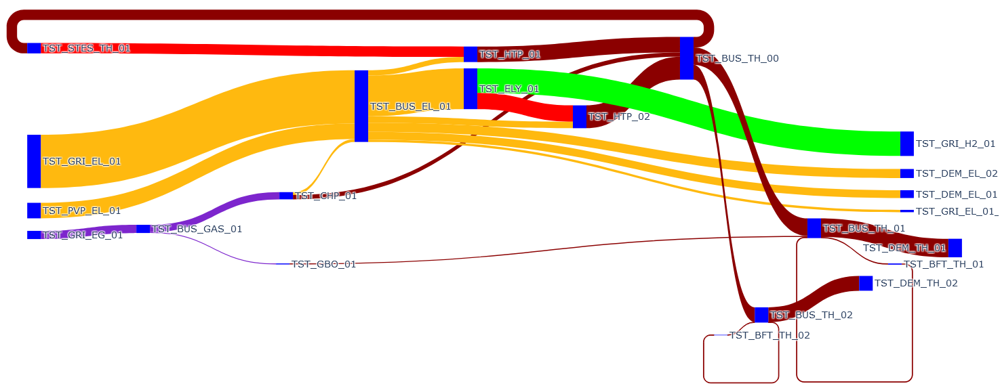

# Exemplary energy systems

In this chapter, some exemplary energy systems will be described and discussed. This may help to understand the capabilities, limitations and usage of ReSiE.

For all examples the required input files are shipped together with ReSiE as JSON files in the subdirectory `examples`. The project files may link to profile files (as `.prf`), which are also shipped alongside ReSiE in the `profiles` subdirectory. The examples can be executed with

```bash
julia --project=. src/resie-cli.jl examples/name_of_example.json
```

in the ReSiE directory. The outputs are written to the `output` subdirectory by default. Please note that output files from multiple simulation runs (including different examples) are not deleted, but are overwritten.

All examples will produce an interactive plot of interesting result data (default `output/output_plot.html`) and a sankey plot of yearly sums of energy (default `output/output_sankey.html`). You can customize both plots as described in [the chapter on the input file format](resie_input_file_format.md). The log files (default `output/logfile_general.log` and `output/logfile_balanceWarn.log`) are of interest as well, particularly if the example generates warnings on purpose.

## Minimal example of a heat pump


File: `examples/simple_heat_pump.json`

A fairly minimal example of operating a heat pump to supply a heat demand by using electricity from the grid and a heat source. The heat source provides temperatures in the range of 19 °C to 27 °C. The demand takes in heat at temperatures varying from 49 °C to 66 °C. The heat pump works with a fixed COP of 3.0.

This example demonstrates how an energy system with a heat pump can be structured on a basic level. Heat pumps are an important and versatile component, however also provide some modelling challenges in combination with other components that handle heat in a complex way. Therefore this example is a known baseline from which energy systems using a heat pump can extend.

For a slightly more advanced version you can remove the line `"constant_cop": 3.0` from the subconfig of the heat pump. The varying temperatures of input and output are then considered in a simplified Carnot-efficiency calculation and result in a dynamic COP.

## Heating and cooling demands


File: `examples/heating_and_cooling.json`

In this example a heating and a cooling demand are satisfied by making use of the low temperature heat as the source for the heat pump supplying high temperature heat, while only the excess is removed as waste heat. The excess is elevated to a higher level so that heat exchangers can effectively remove the heat from the system. This demonstrates that a cooling demand is in fact a heat source in disguise and can be modelled as a fixed supply of low temperature heat.

There is no additional heat supplier in the system, which is only possible as the cooling demand has a fairly high base load all the time and a heat storage is used to buffer peaks. This could model an office building which, in addition to room cooling, also produces waste heat from a cluster of servers.

**Note:** At the moment a heat pump can supply multiple components, in this case the buffer tank and the heating demand, at the same time, but only at the higher of the two temperatures. This makes the HP less efficient than it could be as it will supply the heating demand with 70 °C heat even if the requested temperature is lower. This will likely be addressed in future updates.

**Note:** At the moment the order of operations determined by ReSiE for this energy systems does not work as expected as it prioritises the second HP over the first. This is solved by manually adjusting the order of operations and importing it in the input file. This issue will likely be addressed in future updates.

## District with sector coupling


File: `examples/multisector_district.json`

This example demonstrates complex behaviour of an energy system covering multiple sectors over the span of a year. Heating and electricity demands in two different subdivisons (e.g. for two groups of buildings) are supplied with a variety of producers. Interesting components include a hydrogen electrolyser feeding into a hydrogen grid and a seasonal thermal energy storage.

This example is also discussed in depth in Ott2023[^Ott2023], however the results discussed in the publication are based on the simplified component models from the time of publication. The example file in the ReSiE repository will use the currently implemented models, therefore results may differ.

The following figure shows a sankey plot of the yearly sums of energy. All components play a role in the operation of the energy system to different degrees, which can be seen by following the flow of energy in the plot.



The example has also been set up in a specific way such that the energy balance is not upheld in every time step. For a few hours distributed over the span of the year, the heating demand 2 is not fully met. This can happen because there is no source of heat in the energy system which can produce an arbitrary amount of heat without possibly being limited by an input or output. The CHP comes close, but fails to cover peaks in demand when the buffer tanks are empty as it is not sufficiently sized for peak load coverage. The gas boiler does act as peak load supplier, but is connected only to heating demand 1.

[^Ott2023]: Ott, E.; Steinacker, H.; Stickel, M.; Kley, C. and Fisch, M.N.: Dynamic open-source simulation engine for generic modeling of district-scale energy systems with focus on sector coupling and complex operational strategies, 2023, Journal of Physics: Conference Series 2600, 022009

