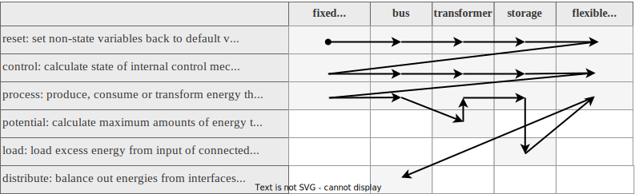

# Fundamentals

The simulation engine works on the concept of energy balances on the level of technical equipment units. While conservation of energy is expected to be observed in any simulation of physical processes, the simulation engine specifically does not consider other concepts often appearing in energy simulations such as full thermodynamics, static/dynamic fluid simulation or electric power flow. These limitations are shared by a number of simulation engines similar to ReSiE, as research and use of these tools has shown that these are necessary limitations to cut the scope of the simulation down to something that finishes calculations in a reasonable time scale.

The geometry of buildings also does not play a role in the simulation and the full network of technical systems connected in a building (and across buildings) is reduced to a network of energy system components that each process energy. Given the typical task of finding a suitable selection of components to satisfy a fixed demand of energy in a building, it is therefore the engine's task to work backwards to find solutions for bounded[^1] sources of energy, ensuring the energy balances are held for each component along the way.

[^1]: *Bounded* and *fixed* here refers to a classification in regards to how much energy a component processes. Bounded sources and sinks have lower and upper limits, but are flexible in the amount they process. Fixed sources and sinks represent a precise demand of energy that must be met or components that process a certain amount energy regardless of demand.

To illustrate, let's look at a simple example. A heating demand, in the medium of hot water, must be met by a gas boiler, which in turn requires an input of natural gas from a public grid.

<center>

Example of the energy flow of a gas boiler providing heat for the heating demand C.</center>

A practical way to operate the gas boiler in this example would be a demand-driven strategy. As such the task to be performed is to meet the demand by operating the gas boiler such that the overall energy balance is conserved.

This can be done by first calculating the hot water demand \(E_{in,C}\) to be met, which is trivial from the perspective of the simulation as it is an input to the simulation. Then the gas boiler can meet this demand by burning gas to provide \(E_{out,B}\), which in turn imposes a demand of natural gas \(E_{in,B}\) and removes \(E_{loss}\) from the system as losses. Finally the grid connection can fulfill this gas demand \(E_{out,A}\) by drawing from outside the system boundary. Overall this behaviour can be summarized as:

$$
\begin{equation}
|E_{out,A}| = |E_{in,B}| = |E_{out,B}| + |E_{loss}|
\end{equation}
$$

$$
\begin{equation}
|E_{in,B}| - |E_{loss}| = |E_{out,B}| = |E_{in,C}|
\end{equation}
$$

#### Losses
While the conservation of energy is upheld, this does not mean that losses cannot be modeled. Energy losses invariably end up as ambient heat, which can contribute to the energy balance of a building, however the technical equipment of a building rarely can be found in a thermal zone that should be kept to comfort levels. Equipment with large power draw might even impose a cooling demand on the thermal zone in which they reside.

Due to the difficulty of generalizing the impact of these losses, they are not generally included in the energy flow model. Instead, the implementation of components that typically incur significant losses take this into account with imperfect conversion of energy. These losses are considered outside the system boundary and ignored. It is possible to track these for further analysis outside the simulation, e.g. as internal heating load for a thermal simulation of technical equipment and the surrounding room.

Within the implementation of components, losses are currently handled as positive values, but for the output, **losses to the ambient are defined as negative and gains from the ambient as positive values**.

## Domain and boundaries

Due to the generalized nature of the energy system used by ReSiE, there is no explicit scale inherent to the model. However in practicality there is a large number of parameters and nominal values involved in running an accurate simulation. The implementation of components in ReSiE is done while keeping a scale of buildings and districts in mind, meaning that performing a simulation of a large electric power network would yield inaccurate results. In particular transport losses are not modeled and (electric) power is represented as a simplified model.

The domain of the simulation can therefore be considered as the technical equipment providing energy to a number of connected buildings up to a scale where transport losses cannot be ignored anymore. Outside the domain are three major other domains to and from which the energy system connect:

<center>{: style="height:400px"}</center>

The first of these is the environment, which plays a role for components that directly draw energy from the environment such as solar collectors or heat pumps fed by ambient heat from the atmosphere or the ground. The second are public grids, usually for electricity, heat and natural gas, however grids of any kind of energy-carrying medium can be modeled. An important difference to the environment is that energy can be both drawn from the grids and fed back into them if there is a surplus.

The third domain are demands, which encompass any kind of system or process that requires energy and that must be met exactly. While demand simulation is an important part of the overall building energy simulation process, ReSiE is not concerned with calculating the demands and requires the values as an input. Demands can also be abstracted to impose the use of energy upon an energy system. For example if there is a power plant nearby, which produces a large amount of waste heat, this can be implemented as a cooling demand. This allows the waste heat to be used for providing energy for other heating demands while moving any excess into the environment. In that case the cooling demand provides energy to the energy system and this differs from an environmental input in the sense that the energy must be used up completely.

## Energy system components

As mentioned earlier, a component of an energy system is any kind technical equipment that deals with transforming, transporting or transferring energy. In the implementation the equipment is abstracted to a single component even if in reality the equipment is spread out in space and consists of numerous individual parts. For some components this matches nicely with commonly used terminology. For example a "gas boiler" includes all pipes, valves and other parts required to make it work.

For other equipment this is not the case. For example an electrolyser requires several components before and after the electrolysis step, such as water purification and hydrogen postprocessing. However given that these components are not used for anything else, they are included in the energy system component model under the label of "electrolyser".

### System function

Components can be classified into seven categories, which are:

* `Bounded sink`: A component taking in a flexible amount of energy. For example a chiller taking in waste heat that is a by-product of the processing of other components.
* `Bounded source`: A component outputting a flexible amount of energy, drawing it from outside the system boundary. For example drawing in heat from the ambient environment.
* `Fixed sink`: A component consuming an amount of energy fixed within a time step. For example a demand of hot water for heating.
* `Fixed source`: A component outputting an amount of energy fixed within a time step. For example a photovoltaic power plant.
* `Transformer`: A component transforming energy in at least one medium to energy in at least one medium. For example a heat pump using electricity to elevate heat to a higher temperature.
* `Storage`: A component storing energy in a given medium. For example a buffer tank storing hot water.
* `Bus`: A special type of component used to facilitate the transport of energy from and to other components. Has only one implementation.

This classification is used by the simulation engine to reason about the order in which calculations must happen. This is described in more detail in the section on the order of operations below. The implementation of the various types of components is described in its own chapter.

## Simulation sequence
The simulation follows a fairly basic structure:

```pseudocode
components = load_components()
order = order_of_operations(components)
for time = t_start to t_end {
    ...
}
```

First the components are loaded and initialized from the input project file. Then the order of operations is determined. The components and the order are given to a loop over each time step, which performs calculations and writes the output. The output is written in each time step, as opposed to only being collected and written later on, so that aborting a simulation results in partial output.

### Main loop over time
```pseudocode
for time = t_start to t_end {
    perform_steps(components, order)
    check_balances(components)
    write_output(components)
    advance_simulation()
}
```

Inside the loop over time, first the simulation steps are performed for each component. Then each component is checked to ensure the energy balances are preserved, meaning that all energy outputs (including losses) have a matching input and vice versa. This is necessary in particular as a safeguard against bugs in the implementation and operational strategies that produce unexpected results.

After the balance check, output is written according to the output specification in the project file. The simulation engine specifically does not write all output as this can produce excessive amounts of data. Finally, the simulation is advanced to the next time step.

The simulation steps for each component are:

* `Reset`: Reset values for the next time step.
* `Control`: Calculate control behavior to check if a component should run or not. Also write information on required/provided temperatures and energy limitations, if these are already known at this point.
* `Potential`: Calculates the potential energy that can be processed by a transformer. This is necessary when several transformers are connected directly or through busses, as this might lead to multiple solutions of how to operate the transformers. No energy is processed in this step.
* `Process`: Process energy depending on the type of the component and if the control behavior dictates the component should run.
* `Load`: For storage components, take in any excess of energy after the processing of connected components.
* `Distribute`: For bus components, distribute energy supplied and requested by each connected component and calculate the energy transfered between connected busses.

### Determining order of operations

For each component of the energy system some or all of the simulation steps are performed on that component. An *operation* is a pair of a component and a simulation step. **Note:** In the following "order of operations" and "order of operation" is used as they describe the same concept albeit with slightly different meaning.

Determining the order of operations follow an algorithm consisting of a base order and several rearrangement steps. Each rearrangement step imposes some order over some or all of the operations and is potentially overwritten by the rearrangement steps following after that.

**Note: As of now, it is an open question if this algorithm produces correct results for all relevant energy systems.**

1. Set up a base order of operations determined by the system function of the components:
    1. `Reset`: `Fixed source`, `Fixed sink`, `Bus`, `Transformer`, `Storage`,  `Bounded source`, `Bounded sink` 
    2. `Control`: `Fixed source`, `Fixed sink`, `Bus`, `Transformer`, `Storage`,  `Bounded source`, `Bounded sink` 
    3. `Process`:  `Fixed source`, `Fixed sink`, `Bus`
    4. `Potential`: `Transformer`
    5. `Process`: `Transformer`, `Storage`
    6. `Load`: `Storage`
    7. `Process`:  `Bounded source`, `Bounded sink` 
    8. `Distribute`: `Bus`
2. The `Potential` and `Process` operations of transformers are ordered by a complex algorithm [described here](resie_energy_systems.md#transformer-chains) in more detail. This is technically not a rearrangement, as it happens during establishing the base order.
3. Reorder the `Control` operations to make sure that components that require temperature information during their control step from other components comes last: First the components that require this information in their output (geothermal probe, solar thermal collector), then the components that require the temperature information in their input interface (seasonal thermal store).
4. Reorder the `Process` operation of components connected to the input and output interfaces of busses to ensure they follow the priorities on the bus. This acts as an addition to the initial order determined by the algorithm of 2. and applies only if there is no grid input/output at this bus, as with grid input/output, the output/input priorities of connected components do not matter.  
5. Reorder the `Distribute` operation of all busses in a chain of busses to come after that of their [proxy bus](resie_energy_systems.md#bus-chains). This is necessary only for technical reasons and does not strictly matter for the algorithm.
6. Reorder the `Process` and `Load` operations of storages such that the loading (and unloading) of storages follows the priorities on busses.

The base order is also illustrated in the following figure, adapted from [Ott2023][^Ott2023]:

[^Ott2023]: Ott E.; Steinacker H.; Stickel M.; Kley C.; Fisch M. N. (2023): Dynamic open-source simulation engine for generic modeling of district-scale energy systems with focus on sector coupling and complex operational strategies, *J. Phys.: Conf. Series*

All rearrangement steps are carried out one after the other, which means that the last rearrangement step carried out has the highest priority and can contradict the previously carried out rearrangements. In this case, the reordering rules of the previous reorderings are ignored and overwritten.

If the simulation parameter `auxiliary_info` is used, the generated order of operations is written to the info file. This can be very useful to check for errors produced by an incorrect order. It can also be used as a template to define a custom order of operations that can be imported via the project input file. See section on the [project file format](resie_input_file_format.md) for details.

#### Cycles and feedback loops

Cycles in the energy flow of the energy system can lead to issues with finding solutions to the order of operations. However these cycles are not a problem in actualized energy systems, as not all parts of a cycle are active at the same time. For example an electrolyser might feed into a hydrogen storage, which feeds into a fuel cell, which feeds back into an electrical bus. It would make little sense however to have both components run at the same time, as this would ultimately waste electricity. So while these connections causes cycles in the graph, in operation these cycles do not cause issues.

Constructing an energy system with such a cycle requires the user to carefully choose input and output priorities and disable certain storage loading in order for the components to operate as expected. The listed rearrangement steps above should produce an order that takes the priorities into account and works on cycles. However mathematically this not guarranteed. It is recommended to check the resulting order of operations for any issues.
