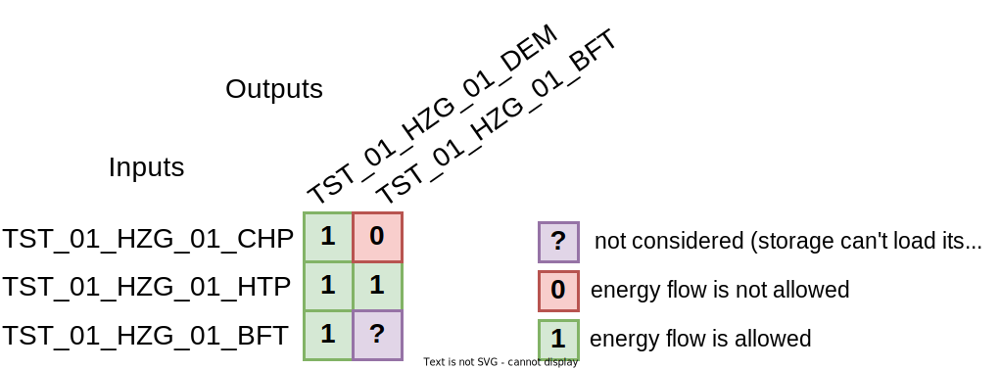

# Input file format

The required inputs to the simulation engine are given in the form a project file, which encodes the parameters in `JSON` format. Certain data, specifically large time series data, is offloaded into separate files in a CSV-like format and then referenced in the project file. The simulation engine can then be invoked by pointing to the project file. This means that the command-line interface has relatively few parameters and arguments are mostly put inside the project file. This file format and its expected content is described in detail in this chapter.

## Conventions

There are a few common issues that the file format itself cannot address. The conventions listed here have been established through the use of the input file format and can be considered part of it, but can also be ignored if needs be.

### Comments

The `JSON` format does not define comments. If there is a need to provide additional information to the reader inside the project file, or more commonly if alternative parameter values should be listed along the actual values, there is the option to add a parameter next to which element you want to comment on. Parameters with unknown name are simply ignored by the simulation engine, thus their values can be used to contain the comment text. To distinguish these comment parameters from actual parameters, prefix their name with a double underscore `__`.

### User address code

The energy system components in the project need to be addressed somehow as the connections work with these addresses as IDs. While the only requirement is that these User Address Codes (UAC) are unique, it makes sense to use an address system that provides additional information and is understandable by humans. This is especially useful if the results of the simulation are fed into BIM or monitoring software. Even if this is not the case, it still useful to use some kind of address system for easier debugging.

An example for a UAC system could be a hierarchical structure based on location and affiliation of the components within the buildings, encoded as segments and separated by an underscore. For example, `TST_A1_HVAC_01_BT` could reference a buffer tank (`BT`) used in the first (`01`) `HVAC` cycle of the building `A1` in a project with prefix `TST`.

Please note that UACs should not contain the following characters or sequences:

- the sequence `->`
- equal to any media names

### Energy media

The specification of components and outputs often mention a medium, such as `m_h_w_ht1:OUT` to specifiy a high temperature heat output of some component. You can find a full explanation of what media are in the context of ReSiE [in the chapter on energy systems](resie_energy_systems.md#energy-media). We encourage the use of this naming structure, but this is not strictly necessary.

## Project file structure

The overall structure of the project file is split into three general sections and one specific one, each of which is discussed in more detail in the following sections.

```json
{
    "io_settings": {...},
    "simulation_parameters": {...},
    "components": {...},
    "order_of_operation": {...}
}
```

## Input / Output settings
```json
"io_settings": {
    "auxiliary_info": true,
    "auxiliary_info_file": "./auxiliary_info.md",
    "auxiliary_plots": true,
    "auxiliary_plots_path": "./output",
    "auxiliary_plots_formats": ["png", "svg"],
    "sankey_plot_file": "./output/output_sankey.html",
    "sankey_plot": "default",
    "csv_output_file": "./output/out.csv",
    "csv_time_unit": "hours",
    "csv_output_keys": {
        "TST_01_HZG_01_CHP": ["m_h_w_ht1:OUT"],
        ...
    },
    "csv_output_weather": true,
    "output_plot_file": "./output/output_plot.html",
    "output_plot_time_unit": "date",
	"output_plot": {
		"1": {
			"key": {"TST_01_HZG_01_CHP": ["m_h_w_ht1:OUT"]},
			"axis": "left",
			"unit": "kW",
			"scale_factor": 0.001
		},
		...
	},
    "plot_weather_data": true,
    "step_info_interval": 500
},
```

* `csv_output_file` (`String`): (Optional) File path to where the CSV output will be written. Defaults to `./output/out.csv`.
* `csv_time_unit` (`String`): Time unit for the time stamp of the CSV file. Has to be one of: `seconds`, `minutes`, `hours`, `date`. Defaults to `date`.
* `csv_output_keys` (`Union{String, Dict{String, List{String}}}`): Specifications for CSV output file. See [section "Output specification (CSV-file)"](resie_input_file_format.md#output-specification-csv-file) for details.
* `csv_output_weather` (`Boolean`): (Optional) If true, the weather data read in from a given weather file is exported to the CSV file. Defaults to `false`.
* `auxiliary_info` (`Boolean`): If true, will write additional information about the current run to a markdown file.
* `auxiliary_info_file` (`String`): (Optional) File path to where the additional information will be written. Defaults to `./output/auxiliary_info.md`.
* `auxiliary_plots` (`Boolean`): If true, ReSiE will create additional plots of components, if available (currently only available for geothermal probe). Defaults to `false`.
* `auxiliary_plots_path` (`String`): (Optional) File path to where the additional plots will be saved. Defaults to `./output/`.
* `auxiliary_plots_formats` (`Array{String}`): Array of file formats that should be created. Can be one or multiple of `["html", "pdf", "png", "ps", "svg"]`. Defaults to [".png"].
* `sankey_plot_file` (`String`): (Optional) File path to where the Sankey plot will be written. Defaults to `./output/output_sankey.html`.
* `sankey_plot` (`Union{String, Dict{String, String}`): Specifications for sankey plot. See [section "Output specification (Sankey)"](resie_input_file_format.md#output-specification-sankey) for details.
* `output_plot_file`: (Optional) File path to where the output line plot will be written. Defaults to `./output/output_plot.html`.
* `output_plot_time_unit`: Unit for x-axis of output plot. Can be one of `seconds`, `minutes`, `hours`, `date`. Defaults to `date`. Note that the plotted energies always refer to the simulation time step and not to the unit specified here!
* `output_plot` (`Union{String, Dict{Int, Dict{String, Any}}`): Specifications for output line plot. See [section "Output specification (interactive .html plot)"](resie_input_file_format.md#output-specification-interactive-html-plot) for details.
* `plot_weather_data` (`Boolean`): (Optional) If true, the weather data read in from a given weather file is plotted to the line plot. Defaults to `false`.
* `step_info_interval` (`Integer`): (Optional) Defines how often a progress report on the loop over the timesteps of the simulation is logged to the info channel. This is useful to get an estimation of how much longer the simulation requires (albeit that such estimation is always inaccurate). If no value is given, automatically sets a value such that 20 reports are printed over the course of the simulation. To deactivate these reports, set this to 0.


### Output specification (Sankey)

The energy system and the energy flows between its components can be displayed in a sankey plot. This plot shows not only the connections between all components but also the sums of energy transferred between them within in the simulation time span. This can be super helpful to check the overall functionality of the energy system, its structure and the overall energy balance.

In the `io_settings`, `sankey_plot` can be either ```"nothing"``` if no sankey should be created, ```"default"``` that creates a sankey plot with default colors or an array mapping all medium names used in the energy system to a color. This can be useful to better represent the various media, as the default colors may be confusing.
For a list of available named colors, refer to the [Julia Colors documentation](https://juliagraphics.github.io/Colors.jl/stable/namedcolors/). Note that the color for the medium "Losses" and "Gains" must be specified as well, even if it is not defined in the input file.

Below is an example of a custom color list for an energy system with common media (plus "Losses" and "Gains"):
```json
 "sankey_plot": {
    "m_h_w_lt1": "red",
    "m_h_w_lt2": "red",
    "m_h_w_ht1": "darkred",
    "m_e_ac_230v": "darkgoldenrod1",
    "m_c_g_natgas": "purple3",
    "m_c_g_h2": "green3",
    "m_c_g_o2": "firebrick1",
    "Losses": "grey40",
    "Gains": "grey40"
}
```					

The resulting plot will be saved by default in `./output/output_sankey.html`. The plot can be opened with any browser and offers some interactivity for the positions of elements.

### Output specification (CSV-file)

The output values of each component and the energy (and temperature if present) transferred between components can be written to a CSV-file. Therefore, the parameter `csv_output_keys` can either be ```"all_incl_flows"```, ```"all_excl_flows"```, ```"nothing"``` or a list of entries as described below. For ```"csv_output_keys": "all_incl_flows"```, all possible output channels of all components and all energy/temperature flows between components across busses will be written, while   ```"csv_output_keys": "all_excl_flows"``` writes all component outputs, but no flow outputs to the CSV-file, and for ```"nothing"``` no file will be created. 
 
If one of ```"all_incl_flows"``` or ```"all_excl_flows"``` is set, the list of outputs is sorted alphabetically. With ```"all_incl_flows"```, the energy and temperature flows are placed behind the component outputs. In addition, the flows are filtered so that no flows are output that are denied by the energy flow matrix in the bus. Temperatures are excluded if they are not used during the simulation time. Note that temperatures only contain values during the times when energy is being transferred, otherwise they are `NaN`, as the temperatures may not be defined outside of these times.

A custom output does not filter or sort, but uses the order specified in the input file. To specify a custom selection of outputs, use the following syntax:

```json
"csv_output_keys": {
    "TST_01_HZG_01_CHP": ["m_h_w_ht1:OUT", "m_e_ac_230v:OUT", "LossesGains"],
    "TST_01_ELT_01_BAT": ["Load"],
    "m_h_w_ht1":  ["TST_STC_01->TST_HP_01", "TST_STC_01->TST_DEM_02"]
    ...
}
```
There are two different ways of outputs. One is the output of parameters of components as defined in the [component parameters section](resie_component_parameters.md) (first and second line in the example above), and the other one is the energy or temperature flows between components across busses (third line in the example above). See below for a description on the syntax.

**Component output**

For the component parameter output, the keys must correspond exactly to the UAC of the components defined in the component specification. By the definition of a map, each component can only appear once in this map. If multiple outputs for a single component should be tracked, multiple entries should be put in the list mapped to that component's UAC. Each entry describes one input, output or other variable of that component. For example, `m_h_w_ht1:OUT` means that the output of medium `m_h_w_ht1` (hot water) of that component should be tracked.

The second part of the entry describes which of the available variables of the component the desired output is. For most components either `IN` (input) and/or `OUT` (output) is available, which additional variables depending on the type. For example, storage components often have the variable `Load` available, which corresponds to the amount of energy stored in the component. Also, most of the transformer and storage components have the output variable `LossesGains`, which represents the total energy losses (negative) or gains (positive) to or from the ambient, while some components have an additional splitting into different media of the losses, like `Losses_heat` or `Losses_hydrogen`.  These additional variables do not have a medium associated with them and hence should be declared with their name alone. For details, which output channels are available for each component, see the [chapter on the component parameters](resie_component_parameters.md). 

**Flow output**

Energy and temperature flows can only be output if a connection between two components across one or more busses exists without any other component in between. Currently, always both energy and temperature are output, even for non-thermal media. To specify a specific flow between two components,  the key  has to be the medium of the bus between the components as specified in the component parameters. The second part of the entry is a vector of strings, each with the syntax of "source_component_uac->target_component_uac". Here, multiple connections can be specified, separated by a comma. The UACs have to match the the name of the components. For example: `"m_h_w_ht1":  ["TST_STC_01->TST_HP_01", "TST_STC_01->TST_DEM_02"]` defines two energy flows in medium `m_h_w_ht1`.

**Weather output**

To output the weather data read in from a provided weather file, the flag `csv_output_weather` in the `io_settings` can be set to `true`.

### Output specification (interactive .html plot)

The output values of each component and the energy (and temperature if present) transferred between components  can be plotted to an interactive HTML-based line plot. Therefore, the parameter `output_plot` can either be ```"all_incl_flows"```, ```"all_excl_flows"```, ```"nothing"``` or a list of entries as described below. For ```"output_plot": "all_incl_flows"```, all possible output channels of all components and all energy/temperature flows between components across busses will be plotted in the line plot, while   ```"output_plot": "all_excl_flows"``` plots all component outputs, but no flows, and for ```"nothing"``` no plot will be created. 
 
If one of ```"all_incl_flows"``` or ```"all_excl_flows"``` is set, the order of lines in the plot is sorted alphabetically. With ```"all_incl_flows"```, the energy and temperature flows are placed behind the component outputs. In addition, the flows are filtered so that no flows are output that are denied by the energy flow matrix in the bus. Temperatures are excluded if they are not used during the simulation time. Note that temperatures only display values during the times when energy is being transferred, as they may not be defined outside of these times.

The results will be saved by default in `./output/output_plot.html`. The plot can be opened with any browser and offers some interactivity like zooming or hiding data series.

A custom output does not sort alphabetically, but uses the order specified in the input file. It filters temperature flows if they contain no data, e.g. for non-thermal media or if no energy has been transferred. To specify a custom selection of outputs, use the following syntax:

```json
"output_plot": {
    "1": {
        "key": {"TST_HP_01": ["m_h_w_lt1:IN"]},
        "axis": "left",
        "unit": "kW",
        "scale_factor": 0.001
    },
    "2": {
        "key": {"TST_HP_01": ["m_h_w_ht1:OUT"]},
        "axis": "left",
        "unit": "kW",
        "scale_factor": 0.001
    },
    "3": {
        "key": {"m_h_w_ht1": ["TST_STC_01->TST_DEM_02"]},
        "axis": ["left", "right"],
        "unit": ["kWh", "°C"],
        "scale_factor": [0.001, 1]
    }
    ...
}
```
As for the CSV-output, the plot can both display component outputs as defined in the [component parameters section](resie_component_parameters.md) (first and second block in the example above) and energy or temperature flows between components across busses (third block  in the example above). 

The name of each object of this entry is a consecutive number starting from 1. Each value is a list of objects containing the fields ```"key"``` , ```"axis"``` that can be either "left" or "right" to choose on which y-axis the data should be plotted, ```"unit"``` as string displayed in the label of the output and ```"scale_factor"``` to scale the output data. Differing from ```"csv_output_keys"```, here every output UAC has to be set as individual entry. Compare also to the example given above that displays the input and output thermal energy of one heat pump. Note that ```"unit"``` refers to the scaled data! If not handled differently, the default units are `Watt-hours` **during the current time step** and `°C` for temperatures. If `kilo-Watt-hours` should be plotted, a `"scale_factor": 0.001`  has to be applied to convert the `Wh` (default) to `kWh`.

**Component output**

To specify component outputs, the ```"key"```  has to match the UAC-name of the component, followed by a string defining the name of the output parameter requested from this component as defined in the [component parameters section](resie_component_parameters.md). See also the example above, first and second block. The ```"axis"```, ```"unit"``` and  ```"scale_factor"``` are scalar values that are applied to this single output parameter.

**Flow output**

To specify an energy and temperature flow output, the ```"key"``` has to match the medium of the bus that transports the energy and temperature flow from the source to the target component. As for the CSV output, the actual connection is defined as "source_component_uac->target_component_uac". See also the example above, third block. Here, ```"axis"```, ```"unit"``` and  ```"scale_factor"``` can be vector elements that contain either one entry for the energy or two entries for energy and temperature flow, if the temperature should be plotted additionally. Then, exactly two values have to be given, representing the meta information for the energy (first entry) and the temperature flow (second entry) between the two components specified. Note that even if two entries in the the meta information are given, the temperature might be filtered and not displayed if either no energy flow was present or a non-thermal media was requested.

**Weather output**

To plot the weather data read in from a provided weather file to the interactive HTML plot, the flag `plot_weather_data` in the `io_settings` can be set to `true`. Here, no scaling or other settings can be made yet.


## Simulation parameters
```json
"simulation_parameters": {
    "start": "01.01.2024 00:00",
    "end": "31.12.2024 23:00",
    "start_end_unit": "dd.mm.yyyy HH:MM",
    "time_step": 60,
    "time_step_unit": "minutes",
    "__OPTIONAL PARAMETER__": "",
    "start_output": "01.06.2024 00:00",
    "weather_file_path": "./path/to/dat/or/epw/weather_file.epw",
    "weather_interpolation_type_general": "stepwise",
    "weather_interpolation_type_solar": "linear_solar_radiation",
    "latitude": 48.755749,
    "longitude": 9.190182, 
    "time_zone": 1.0,
    "epsilon": 1e-9,
    "force_profiles_to_repeat": false
},
```

* `start` (`String`): Start time of the simulation as datetime format. 
* `start_output` (`String`, optional): The start time as datetime format at which the simulation begins to output the simulation results. Has to be equal or later than `start`. Can be used to perform heat-up simulation ahead of the actual simulation. Note that during heat-up, no warnings are output. The energies in the sankey, output CSV and output plot are starting at the start_output time specified.
* `end` (`String`): End time (inclusive) of the simulation as datetime format, will be rounded down to the nearest multiple of time_step.
* `start_end_unit` (`String`): Datetime format specifier for start, start_output and end time.
* `time_step` (`Integer`): Time step in the given `time_step_unit` format. Defaults to 900 seconds.
* `time_step_unit` (`String`): Format of the `time_step`, can be one of `seconds`, `minutes`, `hours`.
* `weather_file_path` (`String`, optional): File path to the project-wide weather file. Can either be an EnergyPlus Weather File (EPW, time step has to be one hour, without leap day or DST) or a .dat file from the DWD (see [https://kunden.dwd.de/obt/](https://kunden.dwd.de/obt/), free registration is required). See the component parameters on how to link weather file data to a component.
* `weather_interpolation_type_general` (`String`, optional): Interpolation type for weather data from weather file, except for solar radiation data. Can be one of: `"stepwise"`, `"linear_classic"`, `"linear_time_preserving"`, `"linear_solar_radiation"`. Defaults to "linear_classic". For details, see [this chapter](resie_time_definition.md#aggregation-segmentation-and-time-shifting-of-profile-data).
* `weather_interpolation_type_solar` (`String`, optional): Interpolation method for solar radiation data from weather file. Can be one of: `"stepwise"`, `"linear_classic"`, `"linear_time_preserving"`, `"linear_solar_radiation"`. Defaults to "linear_solar_radiation". For details, see [this chapter](resie_time_definition.md#aggregation-segmentation-and-time-shifting-of-profile-data).
* `latitude` (`Float`, optional): The latitude of the location in WGS84. If given, it overwrites the coordinates read out of the weather file!
* `longitude` (`Float`, optional): The longitude of location in WGS84. If given, it overwrites the coordinates read out of the weather file!
* `time_zone` (`Float`, optional): The time zone used in the current simulation in relation to UTC. If given, it overwrites the coordinates read out of the weather file! DWD-dat files are assumed to be in GMT+1.
* `epsilon` (`Float`, optional): The absolute tolerance for all floating-point comparisons in the simulation. Two values whose difference falls below this threshold are treated as equal. Defaults to 1e-9.
* `force_profiles_to_repeat` (`Bool`, optional): If set to true, all utilized profiles are allowed to be repeated, even if denied or not specified in the profile header! Attention: This parameter disables the profile parameter in the profile header! Defaults to false.

**A note on time:** Internally, the simulation engine works with timestamps in seconds relative to the reference point specified as `start`. To ensure consistent data, all specified profiles are read in with a predefined or created datetime index, which must cover the simulation period from `start` to `end` (inclusive). Internally, all profile datetime indexes are converted to local standard time without daylight savings, which is also used for the output timestamp! Leap days are filtered out in all inputs and outputs to ensure consistency with weather data sets. See the chapter profiles below and [Time, time zones and weather files](resie_time_definition.md) for more information.

## Components

The specification for the components involved in the simulation is the most complicated part of the input file. Some of the parameters and values being used relate to the simulation model underlying the simulation engine. If you need to write this part of the input file from scratch, it is advised to read the [chapters on the simulation model](resie_fundamentals.md) first, as this chapter only discusses the structure but not the meaning of the specification.

```json
"components": {
    "TST_01_HZG_01_CHP": {
        "type": "CHPP",
        "output_refs": {
            "m_heat_out": "TST_01_HZG_01_BUS",
            "m_el_out": "TST_01_ELT_01_BUS"
        },
        "control_parameters": {
            "load_storages m_e_ac_230v": false
        },
        "control_modules": [
            {
                "name": "storage_driven",
                "high_threshold": 0.9,
                "low_threshold": 0.2,
                "min_run_time": 3600,
                "storage_uac": "TST_01_HZG_01_BFT"
            }
        ],
        "power_el": 12500,
        "m_heat_out": "m_h_w_ht1"
    },
    "TST_01_HZG_01_HP": {
        "type": "HeatPump",
        "output_refs": [
            "TST_01_HZG_01_BUS"
        ],
        "power_th": 9000,
        "min_power_function": "const:0.0",
        "cop_function": "carnot:0.4",
        "power_losses_factor": 1.0,
        "heat_losses_factor": 1.0
    },
    "TST_01_HZG_01_BUS": {
        "type": "Bus",
        "medium": "m_h_w_ht1",
        "connections": {
            "input_order": [
                "TST_01_HZG_01_CHP",
                "TST_01_HZG_01_HTP",
                "TST_01_HZG_01_BFT"
            ],
            "output_order": [
                "TST_01_HZG_01_DEM",
                "TST_01_HZG_01_BFT"
            ],
            "energy_flow": [
                [1, 0],
                [1, 1],
                [1, 0]
            ]
        }
    },
    ...
}
```

The specification is a map mapping a component's UAC to the parameters required for initialization of that component. Parameters specific to the type of the component can be found in [the chapter on the various types](resie_component_parameters.md). In the following we discuss the parameters common to most or all types.

* `type` (`String`): The exact name of the type of the component.
* `medium` (`String`): Some components can be used for a number of different media, for example a bus or a storage. If that is the case, this entry must match exactly one of the medium codes used in the energy system (see also [this explanation](resie_energy_systems.md#energy-media)).
* `output_refs` (`List{String}`/`Dict{String,Any}`, non-Busses only): The UACs of other components to which the current component outputs. For components with one output, a list is sufficient (see heat pump in the example above). For components with multiple outputs, currently CHPPs and electrolysers, a dict instead of a list should be given with `"output name": "target UAC"` to achieve uniqueness (see CHPP in the example above). This applies not for busses as they are handled differently! The relevant output media names can be found in the [component parameters section](resie_component_parameters.md) in "Output media" in the attribute block of the relevant components.
* `control_parameters` (`Dict{String,Any}`): Parameters of the control and operational strategy of the component. See [this chapter](resie_operation_control.md) and [this section](resie_component_parameters.md#control-modules) for explanations. This entry can be omitted.
* `control_modules` (`List{Dict{String,Any}}`): List of control modules, where each entry holds the required parameters for that module. See [this chapter](resie_operation_control.md) and [this section](resie_component_parameters.md#control-modules) for explanations on control modules. This list can be omitted if no module is activated for the component.
* `m_heat_out` (`String`): The inputs and outputs of a component can be optionally configured with a chosen medium instead of the default value for the component's type. In this example the CHP's heat output has been configured to use medium `m_h_w_ht1`. The name can be one of the predefined media names, but can also be an other one (see also [this chapter on media naming](resie_energy_systems.md#energy-media)).  Which parameter configures which input/output (e.g. `m_el_in` for electricity input) can be found in the [chapter on input specification of component parameters](resie_component_parameters.md).

The following parameter entries are for `Bus` components only:

* `connections` (`Dict{String, Any}`): Configuration of the connections of components over a bus. Sub-configs are:
    * `output_order` (`List{String}`): Similar to the entry `output_refs`, however the order of UACs in this list corresponds to the output priorities of components on the bus with entries at the beginning being given the highest priority and receiving energy first.
    * `input_order` (`List{String}`): Similar to the entry `output_order` but for the inputs on the bus.
    * `energy_flow` (`List{List{Int}}`): A matrix that defines which components are allowed to deliver energy to which other components. Rows correspond to the inputs and columns to outputs of the bus, both in the order defined in the entries `input_order` and `output_order`. 
    Two different ways of defining the energy matrix are available: 
        * To simply allow or deny a connection, the `energy_flow` matrix should be filled with 1 or 0 only. The numbers should be 1 if the energy flow from the input (row) to the output (column) is allowed or 0 if it is not. No other numbers should be used. The following figure illustrates the principle of the `energy_flow` matrix on the basis of a bus with a CHP, a heat pump, a storage and a demand component. Only the heat pump is allowed to load the storage, while all three inputs (including storage) are allowed to deliver energy to the demand. 
    <center></center>
        * To manipulate the order of distribution for every source or sink differently, the matrix can also be filled with zeros (connections denied) or consecutive ascending numbers starting from 1 (connections allowed). Then, the distribution order is no longer orientated on the general input/output order (see above), but instead each input -> output connection is prioritized by the order specified in the energy flow matrix. This can be helpful to simulate local grids, e.g. two houses, each with a PV and a power demand that is met by the own PV on first priority, but with the possibility to exchange the excess energy of each house to the other house. **Important Notes:**
            * Using this feature can cause wrong simulation results, if there are more than one transformer in the bus input or output and if the order of distribution of these transformers are contrary to the order specified by the custom bus matrix order!
            * This feature can not be used for interconnected busses. If you still want to use this feature, first create a single bus from the interconnected busses, which is always possible.

## Order of operation

The order of operation is usually calculated by a heuristic according to the control strategies defined in the input file and the interconnection of all components. This should usually work well and result in a correct order of operation which is then executed at each time step. The calculated operating sequence can be exported as a text file using the `auxiliary_info` flag and the `auxiliary_info_file` path in the [Input/Output section](resie_input_file_format.md#input-output-settings) described above. In some cases, a custom order of operations may be required or desired. This can be done using the `order_of_operation` section in the input file. If this section is not specified or if it is empty, the order of operations will be calculated internally. If this section is not empty, the specified list will be read in and used as the calculation order. Note that the order of operations has a great influence on the simulation result and should be changed only by experienced users!

It may be convenient to first export the `auxiliary_info` without a specification in `order_of_operation` to first calculate the default order or operation. The text provided in the exported `auxiliary_info_file` can then be copied into `order_of_operation` in the input file and can be customized. The `order_of_operation` has to be a vector of strings each containing the UAC of a component and the desired operation step, separated by a whitespace. The UAC has to match exactly one of the UACs of the components defined in the section `components`. For a further description of the available operation steps, see [this section on the simulation sequence](resie_fundamentals.md#determining-order-of-operations).

Example of a generated order of operation:
```json
"order_of_operation": [
    "TST_DEM_01 s_reset",
    "TST_HP_01 s_reset",
    "TST_SRC_01 s_reset",
    "TST_GRI_01 s_reset",
    "TST_DEM_01 s_control",
    "TST_HP_01 s_control",
    "TST_SRC_01 s_control",
    "TST_GRI_01 s_control",
    "TST_DEM_01 s_process",
    "TST_HP_01 s_process",
    "TST_SRC_01 s_process",
    "TST_GRI_01 s_process"
]
```

## Profile file format

As discussed earlier, time series data is separated into its own file format so as to not clutter the project file and turn it unreadable. This profile file format resembles a `CSV` format with a few additions. Parameters and meta information are provided by adding a `#` to the start of a line.

Three different ways of defining a profile can be chosen by the parameter `time_definition`: 

- `startdate_timestepsize`: Data only along with a specified startdate and time step width
```csv
    # time_definition: 		     startdate_timestepsize
    # profile_start_date: 	     01.01.2020 00:00
    # profile_start_date_format: dd.mm.yyyy HH:MM
    # profile_time_step_seconds: 900
    # data_type:                 extensive
    0.881964197
    0.929535186
    ...
``` 
- `startdate_timestamp`: A given timestamp (first column) with a custom unit along with the data (second column) and a startdate
```csv
    # time_definition: 			 startdate_timestamp
    # profile_start_date: 		 01.01.2020 00:00:00
    # profile_start_date_format: dd.mm.yyyy HH:MM:SS
    # timestamp_format: 		 seconds 
    # data_type:                 intensive
    0;     0.881964197
    900;   0.929535186
    ...
```
- `datestamp`: A datetime stamp in a user-defined format (first column) along with the data (second column). If no time zone is given, the datetime stamp is assumed to be local standard time without daylight savings! If the time series includes DST, the `time_zone` has to be given in the IANA format, also known as tz identifier. A list is provided [here](https://en.wikipedia.org/wiki/List_of_tz_database_time_zones). Any offset in the timestamp (e.g. 01.01.2020 01:00+01:00) is ignored, the specified `time_zone` is only used to calculate the local standard time, but does not move profiles from different time zones to a common one! Note that leap days will be filtered out in order to be consistent with weather files. The example below shows how to enter data with DST.
```csv
    # time_definition: 	datestamp
    # timestamp_format: dd.mm.yyyy HH:MM 
    # time_zone: 		Europe/Berlin
    # data_type:        extensive
    01.01.2020 00:00;	0.881964197
    01.01.2020 01:00;	0.929535186
    ...
    29.03.2020 00:00;   0.389765722
    29.03.2020 01:00;   0.690234794
    29.03.2020 03:00;   0.280226908
    29.03.2020 04:00;   0.581270682
    ...
    25.10.2020 01:00;   0.351233194
    25.10.2020 02:00;   0.914702712
    25.10.2020 02:00;   0.384478124
    25.10.2020 03:00;   0.987093575
    ...
```
and in local standard time (without DST) without a `time_zone`:
```csv
    # time_definition: 	datestamp
    # timestamp_format: dd.mm.yyyy HH:MM 
    # data_type:        extensive
    01.01.2020 00:00;	0.881964197
    01.01.2020 01:00;	0.929535186
    ...
```

### Metadata and profile parameters

Ahead of the data, a block of metadata describes important information and parameters on the time series data. The metadata is given as comment lines (starting the line with `#`) of `name:value` pairs. Some specific metadata is expected, as described in the following, but any kind of metadata can be added to provide additional information. Just make sure that the lines start with a `#`.

* `data_type` (`String`, required): The kind of the provided data, has to be `intensive` or `extensive`. Intensive data refers to quantities that do *not* depend on the size or amount of material, e.g. temperature, power, relative costs or relative schedules. Extensive data refers to quantities that depend on the amount of material, e.g. energy, mass or absolute costs. See the [Wikipedia entry](https://en.wikipedia.org/wiki/Intensive_and_extensive_properties) on intensive and extensive properties for more information. 
  **Note:** It does not matter if a component requires an energy profile or a power profile in the "Component parameter" chapter! Just set the `data_type` in the profile correctly, the rest will be done by the simulation engine.
* `time_definition` (`String`, required): Specifies the kind of the definition of the timestamp, see above for details. Has to be one of `startdate_timestepsize`, `startdate_timestamp`, `datestamp`.
* `profile_start_date` (`DateTime`): The date of the first datapoint of the profile (only for `startdate_timestepsize` or `startdate_timestamp`)
* `profile_start_date_format` (`String`): The datetime format for the `profile_start_date` (only for `startdate_timestepsize` or `startdate_timestamp`).
* `profile_time_step_seconds` (`Integer`): The profile time step in seconds. Only required for `startdate_timestepsize`, but can be given for other time_definitions as well (if not given, the timestep will be detected from the data).
* `timestamp_format` (`String`): The format specifier for the datetime index (only for `startdate_timestamp` or `datestamp`). Can be `seconds`, `minutes`, `hours` or a custom datetime format. See table below for details on the datetime formatter.
* `time_zone` (`String`): A timezone in [IANA format](https://en.wikipedia.org/wiki/List_of_tz_database_time_zones) that applies for the datetime index. Must only be given if daylight saving is included in the `datestamp`. Only for `datestamp`.
* `time_shift_seconds` (`Integer`, optional): Specifies the number of seconds by which to shift the timestamps of a profile. A positive value shifts the timestamps forward in time, meaning a specific value will align with an earlier time step. Conversely, a negative value shifts the timestamps backward, aligning a specific value with a later time step. If the timestamps do not align with the simulation timestep after the shift, the values will be linearly interpolated. This can be useful, for example, if a profile does not align with the convention that values represent the timespan following the given time step. If this results in a missing value at the beginning or end of a profile, the last or first value is duplicated. Attention: The linear interpolation may lead to a different sum and mean of the converted profile compared to the original one!
* `interpolation_type` (`String`, optional): Specifies the interpolation type for profile segmentation. Can be one of: `"stepwise"`, `"linear_classic"`, `"linear_time_preserving"`, `"linear_solar_radiation"`. Defaults to "stepwise". Attention: Classic and time_preserving linear interpolation may lead to a different sum and mean of the converted profile in every time step compared to the original one! If you want to maintain the integral of a profile exactly, use step interpolation! A description and comparison of the different methods is given in [this chapter](resie_time_definition.md#aggregation-segmentation-and-time-shifting-of-profile-data).
* `repeat_profile` (`String`, optional): If set to `yes` or `true`, the profile will be repeated n-times to cover the whole simulation time. This only works if the profile starts at or ahead of the simulation start time. Note that the profiles are repeated completely starting again with the first value of the profile, even if the profile start is ahead of the simulation start! This feature can be used to perform multi-year simulation with yearly profiles, or to use a profile with a coverage of one week for a yearly simulation repeating this week over and over again.

The format specifier for a custom datetime format can be composed from the table below, that holds a selection of the possible format types that are defined by the Julia *Dates* module:
  
| Code | Examples	| Comment                                    |
|------|------------|--------------------------------------------|
| y    | 6	        | Numeric year with a fixed width            |
| Y    | 1996	    | Numeric year with a minimum width          |
| m    | 1, 12	    | Numeric month with a minimum width         |
| u    | Jan	    | Month name shortened to 3-chars            |
| U    | January	| Full month name                            |
| d    | 1, 31	    | Day of the month with a minimum width      |
| H    | 0, 23	    | Hour (24-hour clock) with a minimum width  |
| M    | 0, 59	    | Minute with a minimum width                |
| S    | 0, 59	    | Second with a minimum width                |
| s    | 000, 500	| Millisecond with a minimum width of 3      |

For example, a date is given as `24.12.2024 00:00`, the corresponding datetime format would be `dd.mm.yyyy HH:MM`. Or, `Dec/24/2024 000000` could be read in with the format specifier `u/dd/yyyy HHMMSS`

### Time series data

Following the metadata block, the time series data is listed with one `timestamp` and `value` pair per line, separated by semicolon `;`, or only a value per line, depending on the `time_definition`. The number value should use a point `.` as the decimal separator. If a datestamp is given as timestamp, note that leap days will be filtered out. If the datestamp includes daylight savings, a timezone has to be specified to ensure correct internal handling. Currently, only profiles with an equidistant time step width are supported.
