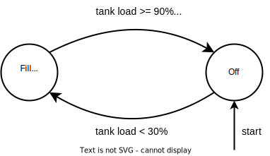

# Operation and control

An important part of what makes ReSiE's simulation model different from similar tools is how the control of energy system components is handled. Actualized energy systems, as they are built in real buildings, have a complex control scheme that also incorporates aspects that are not part of the model, such as hydraulic components and feed/return lines. This in turn requires that these complex control schemes can be modeled as close to reality as possible while staying inside the fundamental model of energy balances.

## The control step
Because the general calculation of energies of components might require information from other components in the energy system, particularly information that cannot be communicated across interfaces between directly connected components, it has proven beneficial to introduce a simulation step in which some information is determined and communicated before the operation of components is calculated in the `potential` and `process` steps. This step is also used to fetch information that is given as input or can otherwise be determined without any information from components.

## General mechanisms of control
Each component is assigned a controller that handles general mechanisms of control and updates any [control modules](resie_operation_control.md#control-modules) that might be attached to the component.

### Storage un-/loading flags
All components can be set to be dis-/allowed to un-/load storages to which they output or from which they draw energy. This only makes sense if an intermediary bus exists because direct connections to/from storages must always be allowed to transfer energy. The flags to control this behaviour are set in the `control_parameters` entry of the component parameter specification (compare [component specification](resie_component_parameters.md#storage-un-loading)). Similarly, components can be configured to be dis-/allowed to draw energy from storages. Any input/output not specified in this way is assumed to be allowed to un-/load storages.

### Consideration of interfaces for the potential step
Transformer components perform fairly complex calculations of their operation in the `potential` step (which is repeated in the `process` step). As part of this calculation they check how much energy is available on each of their input/output interfaces. Due to this complexity it is in rare cases necessary to specify that a particular input/output shouldn't be taken into account. This can be controlled with parameters in the `control_parameters` entry of the component configuration.

```json
{
    "uac": "TST_CHPP_01",
    "type": "CHPP",
    ...
    "control_parameters": {
        ...  
        "consider_m_el_out" : false,
    },
}
```

In the example above a CHPP is configured to not consider its electricity output for the calculations and assume the requested energy to be infinite. Any input/output not explicitly set to `false` will be considered.

## Control modules

More specialised behaviour is modeled as control modules, that can be assigned to components. The modules have predefined callbacks during specific parts of a timestep and the return values of the callbacks are aggregated across all relevant modules of the component. Because the callbacks are hardcoded into the code of a component, some modules can only be assigned to certain component types, that make use of the callbacks. **Note:** At the moment it is possible to assign any module to any component, but mismatching modules will have no effect. This may be improved in a future update.

The currently implemented callbacks are:

* `upper_plr_limit`: Sets the upper limit of the PLR to a given value. "Upper" in this case means that the PLR is calculated to not exceed this value, but it may be lower due to the exact circumstances of available energies on the inputs and outputs of a component. For example a module might set the limit to 75%, however the component is limited by available input energy and can only be operated at 50%. This callback is implemented for transformers.
* `charge_is_allowed`: Allows the charging of a battery.
* `discharge_is_allowed`: Allows the discharging of a battery.
* `reorder_inputs`: Reorders a list of input energy exchanges used in steps `potential` and `process`.
* `reorder_outputs`: Reorders a list of output energy exchanges used in steps `potential` and `process`.
* `determine_temperature_and_energy`: Callback for `negotiate_temperature`. Only checks if a control modules exists that handle the temperature between two components.
* `cooling_input_temperature_exceeded`: Callback for `limit_cooling_input_temperature`. Checks if a control module exists that interrupts energy flow due to exceeded return flow temperature limit.
* `check_src_to_snk`: Checks if a defined source is allowed to be used for supplying a defined sink. This is implemented for transformers that have a layered approach to calculating energy flow, which currently is only the heat pump.

**Note:** The callbacks `reorder_inputs`, `reorder_outputs`, `determine_temperature_and_energy` and `cooling_input_temperature_exceeded`  are not aggregated. They are evaluated one module at a time in the order they appear in the component config within the project file.

The following describes the currently implemented control modules. The required parameters are described in the [component specification chapter](resie_component_parameters.md#control-modules).

* `economical_discharge`: Handles the discharging of a battery to only be allowed if sufficient charge is available and a linked PV plant has available power below a given threshold. Mostly used for examplatory purposes.
* `profile_limited`: Sets the maximum PLR of a component to values from a profile. Used to set the operation of a component to a fixed schedule while allowing circumstances to override the schedule in favour of lower values.
* `storage_loading`: Controls a component to only operate when the charge of a linked storage component falls below a certain threshold and keep operating until a certain higher threshold is reached and minimum operation time has passed. This is often used to avoid components switching on and off rapidly to keep a storage topped up, as realised systems often operate with this kind of hysteresis behaviour.
* `temperature_sorting`: Controls a component, that can handle multiple inputs or outputs with different temperatures, so that the inputs/outputs are sorted by the temperatures they provide/request. For example a heat pump can use the heat source with the highest temperature first for improved efficiency.
* `negotiate_temperature`: Controls the temperature between two components if both of them have temperature-dependent maximal energies. For example a geothermal probe or a solar thermal collector as sources putting energy into a seasonal thermal energy storage. 
* `limit_cooling_input_temperature`: Control module to block energy transfer between two components if the return temperature is too high for the cooling requirements of the source. For example an electrolyser cools itself by transferring thermal energy into a seasonal thermal storage. If the seasonal thermal storage is too hot in the bottom layer to cool the electrolyser, no energy can be transferred.
* `forbid_src_to_snk`: Forbids that a defined source is used to supply a defined sink. As this uses the callback `check_src_to_snk`, this is specifically used for components with a layered approach to energy flow calculation, e.g. a heat pump. A bus has this functionality built-in and does not need a control module.

## State machines

Some control modules make use of state machines in their calculation. State machines are a [common concept](https://en.wikipedia.org/wiki/Finite-state_machine) in computer science and are useful in working with state based on predefined conditions. They have also been used in programming the building control system of actualized building. In the simulation model they are used with some modifications as described in the following.

<center></center>

The example above shows a state machine with two states "Off" and "Fill tank" that starts in state "Off". Between the two states are transitions based on boolean expressions of complex conditions as compared to symbols in the input alphabet in the common definition. When the state machine is checked to advance its state and the expression of a transition evaluates as true, it is followed to the new state.

One addition to the common concept of a state machine is that the implementation in ReSiE keeps track of how many steps a state machine was in the current state.

### Conditions

The conditions used in evaluating the boolean expressions of transitions are arbitrarily complex and as such depend on the implementation. The information they require for evaluation is defined in the parameters of the control module making use of the state machine. Apart from scalar parameter values such as thresholds, the conditions might require being linked to other components so current values can be requested from them.

The example above uses three different conditions:

* `tank load >= 90%`: Checks if the load of the linked buffer tank is above 90% of its capacity.
* `tank load < 30%`: Checks if the load of the linked buffer tank is below 30% of its capacity.
* `run time >= min. run time`: Checks if the state machine has been in the current state for longer than the defined minimum run time.

### Truth table

The transitions for each state are defined using a truth table over the conditions involved, resulting in a new state (which may result in the current state again). This has the advantage that is covers every possible case implicitly, but also has the disadvantage that this might result in large truth tables for state machines with many conditions.

| **tank load >= 90%** | **Min. run time** | **New state** |
| --- | --- | --- |
| true | true | Off |
| false | true | Fill tank |
| true | false | Fill tank |
| false | false | Fill tank |

The example above shows the truth table used for the state "Fill tank", which has two conditions. The state machine will stay in the current state until both conditions are true, in which case the new state will be "Off".
