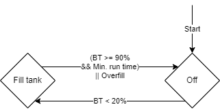
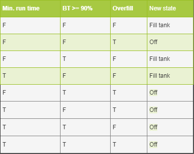
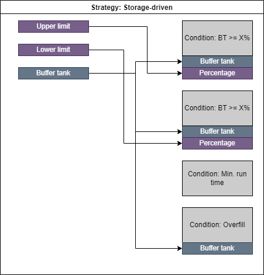

# Operation and control

An important part of what makes Resie's simulation model different from similar tools is how the control of energy systems is handled. Actualized energy networks, as they are built in real buildings, have a complex control scheme that also incorporates aspects that are not part of the model, such as hydraulic components. This in turn requires that these complex control schemes can be modeled as close to reality as possible while staying inside the fundamental model of energy balances.

## Control behaviour

The calculations for control have been decoupled from those of energy production, so that production can be modified depending on the result of the control. In the simplest case, control turns energy system on and off, but the implementation of various energy systems might take many more cases into account. The latter already is arbitrarily complex[^1], so the former must be as well.

[^1]: In the sense that each energy system can perform any number and kind of calculations using the current state of the simulation that the energy system has access to.

To facilitate this, all energy system implementations have access to a controller, that has access to information defined by its operational strategy and provides state information to the production functionality.

## State machines

State machines are a [common concept](https://en.wikipedia.org/wiki/Finite-state_machine) in computer science and are useful in working with state based on predefined conditions. They have also been used in programming the building control system of actualized building. In the simulation model they are used with some modifications as described in the following.



The example above shows a state machine with two states "Off" and "Fill tank" that starts in state "Off". Between the two states are transitions based on boolean expressions of complex conditions. When the state machine is checked to advance its state[^2] and the expression of a transition evaluates as true, it is followed to the new state.

One addition to the common concept of a state machine is that the implementation in Resie keeps track of how many steps a state machine was in the current state.

[^2]: Usually this happens once a simulation step for each state machine, but in the general definition of a state machine this is not time-dependant and works on "turns".

### Conditions

The conditions used in evaluating the boolean expressions of transitions are arbitrarily complex and as such depend on the implementation. However the code handling them must define which information it requires for evaluation. In particular a condition must define to which energy systems it needs access. As the specific systems are not defined before the project is loaded, these requirements affect the type and possibly the medium of the systems, e.g. a condition might ask for "a grid connection of medium m_e_ac_230v" or "a PV plant". It can also provide customizeable parameters with default values.

The example above uses four different conditions:

* `BT >= X%`: Checks if a linked buffer tank is above X% capacity.
* `BT < X%`: Checks if a linked buffer tank is below X% capacity.
* `Min. run time`: Checks if the system the state machine controls has been in the current state for longer or equal than its minimum run time.
* `Overfill`: Checks if the remaining empty capacity of a linked buffer tank is less than the minimum partial load of the system the state machine controls.[^3]

[^3]: Rather, this is its intended use. As of now there remains an issue with its implementation.

### Truth table

The transitions for each state are defined using a truth table over the conditions involved, resulting in a new state (which may result in the current state again). This has the advantage that is covers every possible case implicitly, but also has the disadvantage that this might result in large truth tables for state machines with many conditions.



The example above shows the truth table used for the state "Fill tank", which has three conditions. Cases where the `Overfill` condition is true always lead to the `Off` state, regardless of the values of the other conditions.

## Strategies

Instead of requiring the user to manually specify a state machine, it is desired to provide a number of predefined operational strategies that can be selected. Apart from simplifying the user input, this also makes it easier to enable production behaviour that depends on the chosen strategy, but not necessarily the current state of the controller as it may not need a state machine for control calculations.

For the given example above this would be best described as a storage-driven strategy as an energy system with this strategy would try to fill the linked storage system when it gets too low. The required linked energy systems and parameter values are carried over from the state machine constructed by the strategy to the required user input as illustrated in the following:



This leads to the required user input in the project file:

```json
"TST_01_HZG_01_CHP": {
    "type": "CHPP",
    "control_refs": ["TST_01_HZG_01_BFT"],
    "production_refs": [
        "TST_01_HZG_01_BUS",
        "TST_01_ELT_01_BUS"
    ],
    "strategy": {
        "name": "storage_driven",
        "high_threshold": 0.9,
        "low_threshold": 0.2
    },
    "power": 12500
},
```

A CHPP is operated by this `storage-driven` strategy, which requires two parameters `high_threshold` and `low_threshold` as well as a linked buffer tank, which is added in the `control_refs` of the CHPP. The user does not need to know about the implementation of this strategy, only about the meaning of its parameters.

Another use of operational strategies is controlling the production code without the use of a state machine. For example a demand-driven strategy requires only that any energy system is linked, with no specification as to which. This in turn is done so that determining the order of execution of simulation steps places the linked system before the controlled system. Otherwise the controlled energy system might try to meet a demand that has not been calculated yet.

For the predefined `demand_driven`, `supply_driven` and `storage_driven` control strategies, optional parameter flags can be set in the input file. Their default value is always `true` if the parameter is not given in the input file.

```json
    "strategy": {
        "name": "demand_driven",    // required
        "load_storages" : true,     // optional     
        "unload_storages" : true,   // optional 
        "operation_profile_path": "path/to/profile.prf",  // optional 
        "m_el_in" : true,           // optional    
        "m_el_out" : true,          // optional    
        "m_gas_in" : true,          // optional    
        "m_h2_out" : true,          // optional    
        "m_o2_out" : true,          // optional    
        "m_heat_out" : true,        // optional    
        "m_heat_in" : true          // optional    
        },
```

Each entry starting with an `m` (for medium) defines an input or output of the defined energy system. Obviously, an energy system has only a selection of the full list of inputs and outputs given above. If an input or output is set to false within the control strategy, the limitation of energy demand or supply on this interface is ignored when the current operation state of the energy system is determined. Note that this can lead to unexpected balance errors within the simulation! However, if users want more control over the operational strategy, these flags can be used to define complex rules for the operation of each energy system.

If the other two entries, `load_storages` or `unload_storages`, are set to false, the specified energy system is not allowed to load or unload <u>any</u> storage in the energy system. While the control matrix of each bus can only handle storages connected to the specified bus, this paramater allows to deny or allow system-wide storage loading or unloading for each energy system. Note that these rules are intersecting with the control matrix of a bus and storage-loading has to be allowed at both the control matrix and by the flag `load_storages`. If one of these rules is set to false, the loading is not allowed. 

Using the `storage_driven` control strategy, `load_storages` and `unload_storages` can also be set to `false`, although this is usually not very useful.

The `operation_profile_path` entry within the `strategy`-Struct can be used to specify a path as a string to a `*.prf` file containing a timestamp and values between 0 and 1 for each time step. They serve as an additional operation limitation for the transformer and can be used e.g. to operate a transformer only at times with a high share of renewable energy in the public power grid.