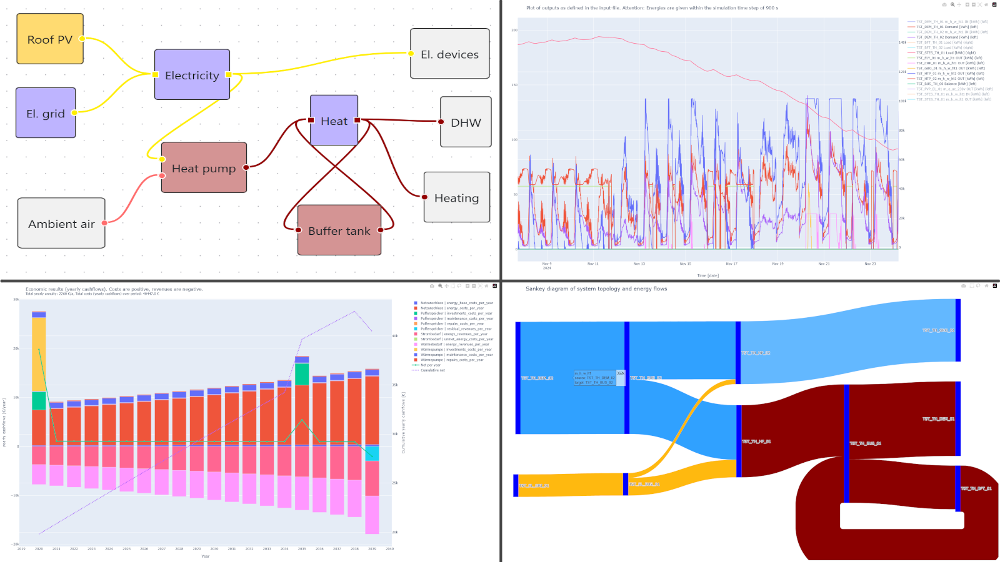

# What is ReSiE?

ReSiE is a simulation engine for the analysis of energy supply systems in multi-sectoral district-scale projects. It is used to simulate the power, heat and general energy flow between energy system components, such as heat pumps, CHP units, batteries, electrolysers, or ground-coupled heat storages and thermal sources. ReSiE also allows for economical analysis of results, calculation of GHG emissions and offers options for black-box optimisation. The name is derived from *Rechenkern für die Simulation von Energiesystemen* in German, meaning *calculation engine for the simulation of energy systems*.

## Purpose and scope

The main use case of ReSiE is aiding the creation and evaluation of concepts for the energy supply system of buildings and districts in the early planning stage of construction and renovation projects. At such a stage only limited information is available, yet decisions on the energy system have to be made, that are carried forward into more advanced planning stages where more details have to be considered. ReSiE aims to facilitate a workflow that transitions from these early to later stages.

The engine implements a novel mathematical approach based on aspects of systems analysis, agent-based simulation and graph theory, which can cover non-linear control mechanisms and imposes no limit on the complexity of component models. Compared to other available open source tools, commonly using a linear optimisation or MILP approach, ReSiE offers far more flexibility in what you can model and simulate with the tool and in how much detail. However this comes at the cost that optimisation is comparatively slow and can only work with black-box optimisation algorithms. It is thus less useful, compared to such other tools, to quickly find the right sizing of all components of a complex energy system. In return, ReSiE is particularly useful for the detailed simulation and evaluation of specific system behaviour under rule-based control strategies, including dynamic prioritisation of components, temperature-dependent source and sink selection, and state-based control mechanisms that are difficult to represent in linear optimisation models.

ReSiE calculates the energy that flows between components based on the demands and available energy sources in each time step, taking into account which constraints the connections between them impose. Temperatures are considered where necessary to calculate an amount of energy, however mass flow and the hydraulic system in general is not modeled directly. Where the energy balance cannot be maintained, this is also an output of the simulation, as this is important information on the operation of the energy system.

For selected components, such as geothermal heat sources and ground-coupled heat storages, ReSiE includes detailed models based on finite-volume methods. All of the more complex component models have been validated against measurement data and/or established simulation models.

## Next steps

We hope you find ReSiE interesting and useful for your work. Your next steps might be:

- Install ReSiE on your local machine, by following [the installation instructions](resie_installation.md)
- Browse [the examples](resie_exemplary_energy_systems.md) and simulate them
- Use [the UI tools SUSI and SIMON](resie_susi_simon.md) to create your own input file with SUSI or learn how to simulate on a server environment with SIMON
- Dive deep into the detailed descriptions of [the input file](resie_input_file_format.md) or [the simulation method](resie_fundamentals.md) in general or [the component models](resie_energy_system_components.md) in particular