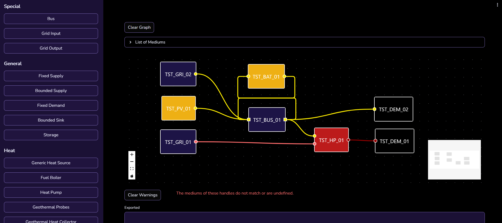
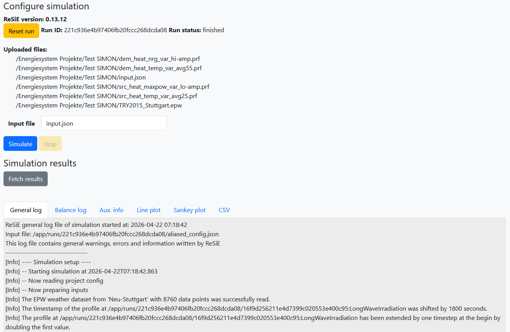

# SUSI and SIMON
Because ReSiE is a simulation engine usable via CLI, there is the need for additional tools to work with ReSiE in a more user-friendly manner. This is especially true as the required input files for a simulation are fairly complex and difficult to create manually without extensive experience. In addition, when performing long-running simulations or many simulations during optimisation or parameter variation, it is beneficial to run ReSiE on a server with more computing resources than a laptop. To address both these issues two tools are in development, which are described in the following.

## Simple UI for Simulation Input (SUSI)

**Note: SUSI is currently in development and no instance is publically available. We intend to run a public instance in the future once development is in a mostly complete state.**

SUSI is the tool to create the energy system input file as described in detail [in this chapter](resie_input_file_format.md) as well as the component parameters as described [in this chapter](resie_component_parameters.md). It provides a GUI for adding components to the energy system, connecting the components via their input and/or output handles and setting parameters to desired values, while providing guidance via default parameter values and allowed value ranges. Here is a screenshot demonstrating how SUSI looks like in use:

At time of writing the profiles (time series data) used by various components and the weather data are external to the input file and are linked via file paths. It is currently not possible to create these profiles, as described [in this chapter](resie_input_file_format.md#profile-file-format), within SUSI. This feature might be developed in the future.

## Simulation Interface and Management Over Network (SIMON)

**Note: SIMON is currently in development and no instance is publically available. We do not intend to run a public instance due to the high computing resources required. However we will gladly help other organisations and individuals to run their own instance.**

SIMON is the tool for running ReSiE simulation on a server environment, as well as managing the required input and produced output files. There are two ways to interact with SIMON to run a simulation. One way is via direct file upload and download, with the other way making use of a linked NextCloud instance. Users can log into the NextCloud instance and browse to a directory containing the input files. They can then select the files used in the simulation and start the run. The simulation runs independent from the user client and results are stored on the server until fetched. When the simulation is done, results are fetched and displayed in a simplifed manner, as well as automatically synchronised to the NextCloud directory. Here is a screenshot of SIMON after a simulation is finished and results are displayed:

