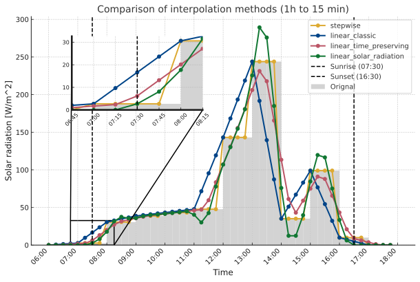
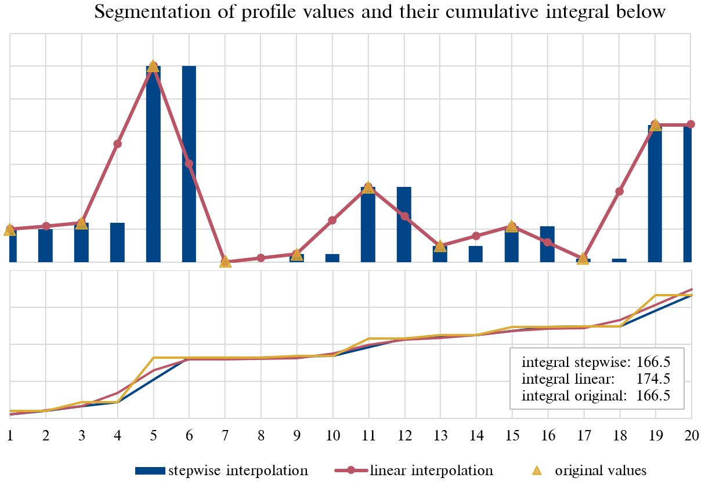
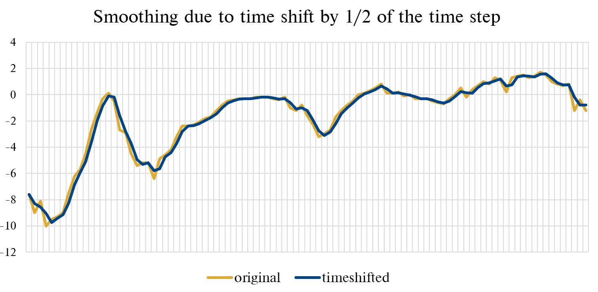

# Handling of time, time zones and weather data

As the [pvlib documentation](https://pvlib-python.readthedocs.io/en/stable/user_guide/timetimezones.html) perfectly summarises, "dealing with time and time zones can be a frustrating experience in any programming language and for any application". We try to be as clear as possible about how ReSiE deals with time and timestamps.

Internally, ReSiE works with timestamps in seconds relative to the starting date of the simulation. Along to the timestamp in seconds, a datetime for each simulation step is used to read out the related data of the given profiles. For all profile data, a corresponding datetime index is either read out of the profile file or is created with the given metadata during initialization.

## Daylight savings

The datetime indexes of profiles are internally converted to local standard time without any DST. This also applies to the datestamp of the output, which never includes DST. If a profile is given with a `datestamp` that includes DST, a `time_zone` must be given to enable the conversion of the data internally to standard time. **Note that the Julia TimeZone package covers DST periods only until 2038.** If you want to use later DST periods, you will have to recompile the TimeZone package. If that happens, a detailed error message with an explanation will be shown that describes the required steps (which have to be done only once per computer).

## Leap days

Leap days are filtered out in all inputs and outputs to ensure consistency with weather data sets, as usually they are given with 8760 hours per year. "Filtered out" means that if data is given with a datestamp on the 29th of February, it is skipped completely. If a profile is given without a datestamp but with a `profile_start_date`, the internally created datetime index skips possible leap days but uses the data continuously without skipping any data. If a time index relative to the `profile_start_date` is given, possible leap days will not be counted.

## Weather data and time definition

The weather data can be read in from an EPW file or from a DWD .dat file. Both are mapped to a datestamp covering the simulation period. The weather data is repeated, if more than one year should be simulated. This also works for fractions of a year, e.g. if only December and January should be simulated. See the [description of component parameters](resie_component_parameters.md) on how to link a component to a profile from a global weather data file.

In energy systems with a high share of renewable energies, the weather plays a key role for the simulation results. Therefore, special attention should be paid to the time definition of the weather data. This is particularly important if the horizontal solar radiation has to be converted to a tilted surface. Therefore, the solar position and directly related to this an exact time, has to be given along with the radiation data. A shift of half an hour of the time can have significant impact on the solar position and thus on the effective radiation on a tilted surface. This is particularly noticeable with vertical surfaces.

To complicate matters, the definitions of time from DWD and EPW are not consistent. The DWD defines the solar radiation given at a specific timestep as the mean value over the period *previous* to the time indicated. The air temperature is measured half an hour *before* the given time as an instantaneous value.[^DWD_TRY_documentation] Although the EPW standard specifies the solar radiation energies (unlike DWD, which denotes power) in the same way as the DWD as the "total amount of [...] solar radiation received [..] during the hour *preceding* the time indicated"[^EnergyPlus_EPW_Definition], temperatures are given as instantaneous temperatures "at the time indicated"[^EnergyPlus_EPW_Definition] respectively the *current* timestep. For consistency, the intensive values of a EPW file are therefore internally postponed by half an hour for a consistent mapping of the data to the datetime index. For a simulation timestep of one hour, this results in a slightly smoothened profile for intensive values due to the linear interpolation required for the time shift. If a simulation is done with a timestep of half an hour or shorter, this has no effect as the time shift is done at the profile with higher temporal resolution that does not need a linear interpolation (as long as the timesteps of the profile and the simulation are not displaced in relation to each other). 

The datestamp used in ReSiE for weather data starts on January 1st at 00:00 local standard time and is mapped to the first data point of the weather data set ("hour 1"). In Europe this would be CET without DST, which is "winter time" all year long. This means that in ReSiE, the weather data specified for a datestamp represents the timestep **following** the time indicated. While the ambient temperature is an *instantaneous* value from half the timestep ahead of the current timestamp, the solar radiation data is the *mean/sum* of the timestep ahead of the current timestamp.

When entering profile data from other sources while simultaneously using data from a weather file, this should be taken into account accordingly and the other profiles should be defined in the same way! The parameter `time_shift_seconds` in a profile file can be used to shift the data accordingly. Depending on the chosen simulation `time_step` and `start_date`, the shift can smoothen the values due to the linear interpolation that is required if the shifted timestamp does not align with the simulation timestep.

**Note on EPW**: Any DST or timezones that can be defined in the EPW header are not taken into account in ReSiE. A theoretically definable timestep deviating from 1 hour can currently not be handled either in ReSiE using the global weather file! Use individual profiles if you want to use data with a higher temporal resolution.

For details on the definition of the EPW format, see the DesignBuilder documentation[^EnergyPlus_EPW_Definition]. For more information on the .dat DWD format for typical meteorological years, refer to the documentation, available at [^DWD_TRY_documentation] (German only).

[^DWD_TRY_documentation]: Deutscher Wetterdienst: Handbuch Ortsgenaue Testreferenzjahre von Deutschland für mittlere, extreme und zukünftige Witterungsverhältnisse. 2017. Available at [here](http://www.bbsr.bund.de/BBSR/DE/FP/ZB/Auftragsforschung/5EnergieKlimaBauen/2013/testreferenzjahre/try-handbuch.pdf?__blob=publicationFile&v=).

[^EnergyPlus_EPW_Definition]: DesignBuilder: EnergyPlus Weather File (EPW) Format. Available [here](https://designbuilder.co.uk/cahelp/Content/EnergyPlusWeatherFileFormat.htm).

## General aspects on time

In general, to ensure accurate simulation results, users must adhere to the following guidelines:

- **Alignment of time steps across profiles**: Ensure that the considered year in all profiles is the same, particularly concerning the starting day when dealing with demands. This is important because the first weekday of a year can significantly affect energy demand profiles. 
- **Consistency of weather-related data:** Weather-dependent demand (such as heating demand) or supply profiles (like PV and wind power) should be simulated using the same weather data that is provided to ReSiE. Inconsistencies in weather data can result in inaccurate demand or supply simulations.
- **Uniform definition of time steps across simulation tools**: It is crucial to maintain a consistent definition of the time step across different simulation tools and weather data sets. Specifically, ensure clarity on whether the value provided for a particular time step represents the period before, around, or after the specified timestamp. 
- **Handling of localized time and daylight savings time (DST)**: When using localized time, especially when daylight saving time is included, schedules must be carefully managed to align with the correct timestamps. If a profile uses a time zone that includes DST, ReSiE internally converts it to local standard time because weather data typically does not include DST adjustments. For instance, if a demand profile was externally calculated based on a schedule indicating a start time of 7 am in Europe/Berlin, this corresponds to 7 am in both summer and winter in localized time, but it translates to 6 am in local standard time during summer. Therefore, if your profile includes DST, you must provide a timestamp along with a time zone identifier to ensure accurate handling within ReSiE.

## Aggregation, segmentation and time-shifting of profile data

ReSiE automatically adjusts the time series data of profiles to match the simulation time step specified in `"simulation_parameters": "time_step"` and ensures that the profile's timestamps are aligned with the `"simulation_parameters": "start"`. The tool supports both aggregation and segmentation for intensive (e.g., temperatures) and extensive values (e.g., energies). Please note that currently only exact dividers or multiples of the time steps of the simulation and the profiles can be handled by the algorithm (e.g. 60 min --> 15 min or 15 min --> 30 min). Otherwise an error will arise, like for 15 min --> 6 min or 15 min --> 20 min.

**Segmentation** can be performed using several different methods:

- `"stepwise"` means, the value given at a timestamp is distributed evenly or copied across the new smaller timestamps. 
- `"linear_classic"` interpolates the given values from the original timestamps linearly to the new timestamps, using the
   values and the correspinding given timestamps indicating the begin of the covered timespan as basis.
- `"linear_time_preserving"` interpolates the data by first shifting the data by half the original 
time step to make the values be measured at the time indicated. After the linear interpolation to a 
finer time step, the data is shifted back by 1/2 a time step to meet the required definition 
of the values representing the following time step. This should be used for time-critic data as it satisfies the original 
definition of time. But, this method will cut peaks and valleys in the data more than the classic interpolation.
- `"linear_solar_radiation"` interpolation uses a method described in the paper by McDowell et. al[^McDowell2018].
It is an interpolation with a correction factor to keep the sum of the interpolated values equal to the sum of the
original values **in every hour** and at the same time to predict a realistic course of the radiation between the given hourly values.
It also cuts radiation before sunrise and after sunset. This is also used in TRNSYS 18, but the methods can shows "wavy" curves 
as result and can only be used for the segmentation of hourly data.

[^McDowell2018]: T. McDowell, S. Letellier-Duchesne, M. Kummert (2018): "A New Method for Determining Sub-hourly Solar Radiation from Hourly Data" 

All  methods handle intensive and extensive values appropriately. The following figure compares the four methods to illustrate their results
when segmentating hourly data (light grey) to a 15 minute timestep. Note that each dot at a given time represents the sum/mean of the upcoming time step:

For **aggregation**, ReSiE sums the original values to compute the new time step for extensive data, while it calculates the mean of the original values for intensive data to generate the corresponding value in the new profile.

For a **time shift** to align profile timestamps with the simulation timestamps or to apply a (user-defined) time shift (`time_shift_secods`), ReSiE uses linear interpolation. For segmentation, the time shift is applied after the segmentation process, whereas for aggregation, it is applied beforehand. This approach ensures that the profile with the higher temporal resolution is used, minimizing the need for linear interpolation and reducing potential interpolation errors.

If some timestamps are missing at the beginning or end of the profile during the conversion process, and these are needed to compute the first or last value of the new profile, the values from the original profile are duplicated to fill in the gaps. In this case, an info log message is generated.

**Note**: Linear interpolation for time shifts and segmentation may smoothen the original profile, potentially changing the total sum/mean of the profile. If preserving the original sum/mean is crucial, use stepwise interpolation instead and no time shift. The difference is illustrated in the figures below. The first shows the different integral of the linear and stepwise segmentation methods, the second the smoothing effect of a time shift.

