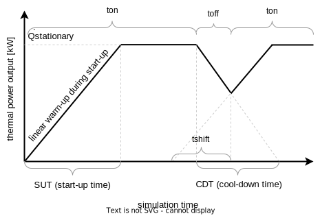
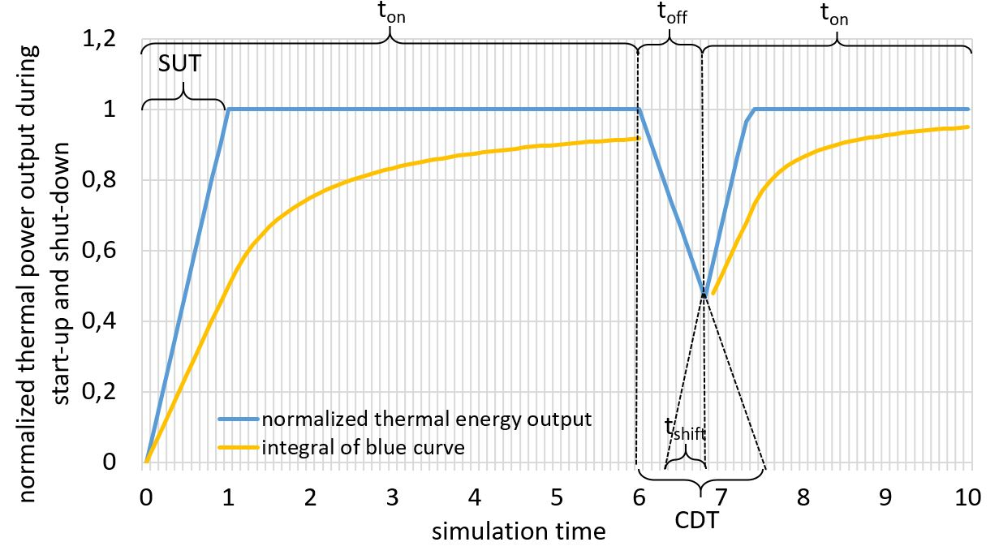
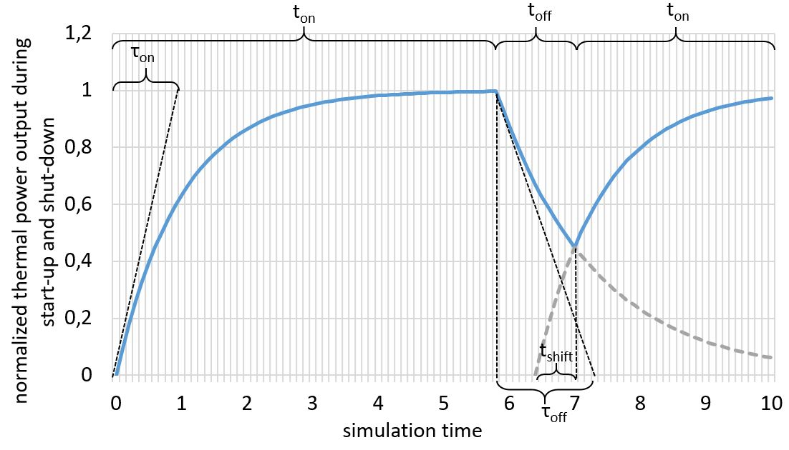

# General effects

## Reduction of usable heat during start-up of each component
To account for transient effects, the reduction of the usable heat output during start-up of a component can be described using either linear oder exponential start-up and cool-down ramps. Both are described in the following.

### Linear start-up
The following figure illustrate a linear start-up and cool-down behavior characterized by the start-up time (SUT) and cool-down time (CDT) the component needs to reach full thermal energy output or to cool down completely.

<center></center>

The current thermal power output can be expressed with the following sectionally defined function. The simulation engine tracks the time a component is running or not running. The on-time \(t_{on}\) represents the time since the last start-up of the component while \(t_{off}\) is the time since the last shut-down. To handle the case when the component has not cooled down completely since the last shut-down, the linear start-up curve can be shifted using \(t_{shift}\) to represent a warm start:

$$
 \dot{Q}_{out,current}(t_{on})  = \dot{Q}_{stationary} 
\begin{cases}
 \frac{t_{on}+t_{shift}}{\text{SUT}} & \text{ for } t_{on}+t_{shift} \ < \text{SUT} \\
1 & \text{ for } t_{on}+t_{shift} \ \geq  \text{SUT}
\end{cases} 
$$

The required timeshift \(t_{shift}\) of the warming-up curve can be calculated within the timestep where the component is turned on again using the cooling-down curve and the time since the last shut-down:

$$
\dot{Q}_{out,current}(t_{off}) = \text{max} \left ( \dot{Q}_{out,current}(t_{on}) \left ( 1-\frac{t_{off}}{\text{CDT}} \right ),0 \right ) 
$$
that leads with \(\dot{Q}_{out,current}(t_{on}=0) = \dot{Q}_{out,current}(t_{off})\) to 
$$
t_{shift} = \text{max} \left ( \frac{\dot{Q}_{out,current}(t_{on})}{\dot{Q}_{stationary} } \left( \text{SUT} - t_{off} \frac{\text{SUT}}{\text{CDT}} \right ), 0 \right )
$$

With this information, the average thermal power output in the current timestep between \(t_{on,lower}\) and \(t_{on,upper}\) can be calculated using the integral of the sectionally defined function above:

$$
 \dot{Q}_{out} = \frac{\dot{Q}_{stationary}}{t_{on,upper}-t_{on,lower}}
\begin{cases}
 \frac{t_{shift} \ (t_{on,upper}-t_{on,lower}) + \frac{1}{2} \ (t_{on,upper}^2-t_{on,lower}^2)}{\text{SUT}} & \text{ for } t_{on}+t_{shift} \ < \text{SUT} \\
t_{on,upper}-t_{on,lower} & \text{ for } t_{on}+t_{shift} \ \geq  \text{SUT}
\end{cases} 
$$

This time-averaged integral results in the following yellow curve that represents the normalized average thermal power output, calculated in each timestep with the lower time bound of \(t_{on,lower} = 0\):

<center></center>

Note that \(t_{shift}\) has to be set to zero at the first timestep of the simulation and \(t_{on,lower}\) and \(t_{on,upper}\) have to start counting again at every change of operation (on/off, not part-load).

### Exponential start-up
While the method above describes a linear thermal power output during the heat-up of a component that requires the integration of sectionally defined functions, the calculation of the time-step averaged thermal power can be also performed using continuous exponential functions. Therefore, the general time-related function of a PT1 element can be used to model the delay of the thermal energy output. This is used for example in the TRNSYS Type 401[^Wetter1996] for modulating heat pumps. The time span for each component to heat up is defined by the constant heat-up-time \(\tau_{on}\) and the cool-down time \(\tau_{off}\). This is not the same time span as defined above (SUT and CDT) for the linear warm-up! The following figure shows an exemplary operation curve, analogous to the one for linear transient effects above. A component is started from a cool basis, heated up to nominal thermal power output, then shut down and restarted before the component has cooled down completely.

<center></center>

The calculation of the reduced heat output due to transient effects at current time \(t_{on}\) since the last start of the component and with the constant heat-up-time \(\tau_{on}\) of each component can be calculated with the following expression:
$$
\dot{Q}_{out,current}(t_{on}) = \dot{Q}_{stationary} \left (1 - e^{-\frac{t_{on}}{\tau_{on}}} \right )
$$

If the component has not been cooled town completely since the last shut-down, the heat-up losses can be calculated using the following equation with \(t_{shift}\) representing the time shift for the exponential function (compare to figure above).
$$
\dot{Q}_{out,current}(t_{on}) = \dot{Q}_{stationary} \left (1 - e^{-\frac{t_{shift,on} + t_{on}}{\tau_{on}}} \right ) 
$$
$$
\text{  with  } \ \ t_{shift,on} = - \tau_{on} \ ln \left ( 1-\frac{\dot{Q}_{out,current}(t_{off})}{\dot{Q}_{stationary}} \right )
$$

The cool-down curve is calculated analogously in order to get the current state of the component in the case of restart in the next time step.
$$
\dot{Q}_{out,current}(t_{off}) = \dot{Q}_{stationary} \left (e^{-\frac{t_{shift,off}+t_{off}}{\tau_{off}}} \right ) 
$$
$$
 \text{  with  } \ \ t_{shift,off} = - \tau_{off} \ ln \left ( 1-\frac{\dot{Q}_{out,current}(t_{on})}{\dot{Q}_{stationary}} \right )
$$

To get the average thermal energy output within the current timestep between \(t_{on,lower}\) and \(t_{on,upper}\), an integration of the exponential function is needed. According to the TRNSYS Type 401[^Wetter1996], this leads to

$$
\dot{Q}_{out} = \dot{Q}_{stationary} \left ( 1 + \frac{\tau_{on}}{t_{on,upper}-t_{on,lower}} \ e^{-\frac{t_{shift,on}}{\tau_{on}}} \ \left ( e^{-\frac{t_{on,upper}}{\tau_{on}}} - e^{-\frac{t_{on,lower}}{\tau_{on}}} \right )   \right ) 
$$

For the zeroth timestep of the simulation, \(\dot{Q}_{out,current}(0)\) is set to zero. \(\dot{Q}_{out,current}(t_{off})\) does not have to be calculated in every time step, but only when the state of the component changes from "off" to "on". For this purpose, the energy output of the last time step with the state "on" must be documented, since this is required for the further calculation.

Below, an exemplary logic is given of a function handling the transient heat-up effects.
```
def heat_up_losses( Q_out(last_ontime),
                    last_state, 
                    this_state, 
                    t_simulation, 
                    t_on, 
                    t_off, 
                    tau_on, 
                    tau_off, 
                    t_on_upper, 
                    t_on_lower, 
                    t_shift_on)

    if t_simulation == 0:
        Q_out_last = 0
    else:
        Q_out_last = Q_out(last_ontime)
    end

    if last_state == on and this_state == off:
        t_off = 0
    end

    if last_state == off and this_state == on:
        t_on = 0
    end

    if this_state == on and t_on == 0:
        t_shif_off = f(Q_out_last)
        Q_off = f(t_shift_off, t_off)
        t_shift_on = f(Q_off)
        Q_out_new = f(t_shift_on)
        t_on += 1
    elif this_state == on:
        Q_out_new = f(t_shift_on)
        t_on += 1
    elif this_state == off:
        t_off += 1
    end

return Q_out_new, t_shift_on, t_on, t_off

```

[^Wetter1996]: Wetter M., Afjei T.: TRNSYS Type 401 - Kompressionswärmepumpe inklusive Frost- und Taktverluste. Modellbeschreibung und Implementation in TRNSYS (1996). Zentralschweizerisches Technikum Luzern, Ingenieurschule HTL. URL: [https://trnsys.de/static/05dea6f31c3fc32b8db8db01927509ce/ts_type_401_de.pdf](https://trnsys.de/static/05dea6f31c3fc32b8db8db01927509ce/ts_type_401_de.pdf)

## Non-linear part-load efficiency

Most components can be operated not only at full load, but also in part load operation. Due to several effects like the efficiency of electrical motors, inverters or thermal capacity effects, the efficiency of a component in part load usually differs from its efficiency at its full load operation point. How exactly the efficiency changes in part load depends on the specific component. Here, the general approach implemented in the simulation model is explained to consider part-load dependent efficiencies. This method needs to be extended for heat pumps which is described in the corresponding section.

The part-load ratio (PLR) in general is defined as:

\(PLR = \frac{\text{average loading power (el. or th.) of the component during current time step}}{\text{maximal possible power (el. or th.) of the component}} \)

The change of the efficiency with respect to the PLR can be given as curve, for example as shown in the following figure for the efficiency of a motor in part-load operation (Source: Eppinger2021[^Eppinger2021]):

<center></center>

Considering non-linear part-load efficiencies leads to several problems. First, the part-load efficiency curve is not necessarily a monotonic function, as shown in the figure above exemplarily. This implies that the function is also non-invertible. However, the inversion is needed to determine the part-load state at which power a component has to be operated at the current time step when external limits are present, e.g. if only a limited energy supply and/or a limited energy demand is given. 

Another problem is the fact, that efficiencies are always defined as ratios. When changing the efficiency due to part-load operation, it is not clear, how the two elements of the efficiency-ratio have to be adjusted as only their ratio is given. Here, in this simulation model, one input or one output has to be defined as basis for the efficiency that will be considered to have a linear behavior in part-load operation. The other in- or output energy will be adjusted to represent the non-linearities in the change of the efficiency at different PLR. 

A third difficulty is the inconsistent definition of the part-load ratio in the literature when considering non-linearities in part-load operation. In theory, every input and output has its own part-load ratio at a certain operation point of a component with multiple in- or outputs. Each of the PLR do not necessarily represent the same operational state of the component, so this would lead to an inconsistent base if several operational restrictions are given. This can be solved by defining a reference part-load ratio, e.g. with respect to the main output or by defining the efficiency curves relative to each other with the same base.

In the figure below, a part-load curve (orange curve) based on an exponential function of a fictitious component that has electricity as input (yellow curve) and heat as output (grey curve) is shown. The heat output (= useful energy) is assumed to be linear (straight line) with a rated power of 1 kW, resulting in a non-linear demand of electricity (= expended energy). 

<center></center>

The basis for the consideration of non-linear part-load efficiencies is the user-defined efficiency curve of a component

\(\eta(PLR)= f(PLR) \left (= \frac{E_{useful}(PLR)}{E_{expended}(PLR)} \right ) \)

as shown exemplarily as orange curve in the figure above. \(f(PLR)\) can be a linear, an exponential or a partially defined function. The efficiency curve can also be a non-monotonic function as long as the function of the expended energy (yellow curve for electrical input in the figure above)

\(E_{expended}(PLR)=\frac{PLR \ \ E_{useful,rated}}{\eta(PLR)} \) 

is monotonic in the range of \(PLR \in [0:1]\) and \( E_{useful,rated}\) depicts the rated power of the component. This is the case for all common part-load functions as the change in efficiency is not as big as the impact of the PLR on the energy curve \(E_{expended}(PLR)\). During preprocessing, the function \(E_{expended}(PLR)\) is calculated from \(\eta(PLR)\) and inverted to get \(PLR(E_{expended})\). 

The part-load function of the useful energy, that is assumed to be linear,

\(E_{useful}(PLR) = PLR \ \ E_{useful,rated}\)

needs to be inverted as well. As \(E_{useful}(PLR)\) is assumed to be linear, the inverse is trivial and meets the original definition of the PLR:

\(PLR(E_{useful}) = \frac{E_{useful}}{E_{useful,rated}}\).

During each timestep, both functions, \(E_{expended}(PLR)\) and \(E_{useful}(PLR)\), are evaluated according to the operational strategy to determine the part load ratio that is needed to meet the demand while not exceeding the maximum available power.

### PLR calculation for Gas Boiler

The following section provides a more detailed explanation of the calculations for maximal consumable gas and maximal produced heat for the GB under different operating strategies. At full load, no additional calculations are required, as the maximal consumable gas is equal to the maximal produced heat.
Before diving deeper into the computation steps, it should be noted that for the thermal efficiency curve of the gas boiler a polynomial fit is used. The data points for the fit are obtained from the graph via the visual metric and fitted with the NumPy polyfit function. The fit closely resembles the orange curve, with the **only difference** being that the implemented curve is monotonically increasing across the entire partial-load ratio interval.  

For a supply-driven strategy, the intake amount of gas is provided at the current time step. To determine PLR, the following procedure is followed: First, the output energy curve is divided by the thermal efficiency curve. Second, a lookup table is created. The entries in this table consist of tuples comprising the PLR value and the corresponding expended energy value, obtained in the first step. Finally, when estimating the part-load ratio corresponding to a provided energy input value, the upper and lower values around the provided value are identified using the lookup table. Once this is accomplished, the PLR value is calculated through linear interpolation.  
The computed PLR value is then used to compute the thermal efficiency (gray function). Last but not least, the energy balance equation is solved to determine the maximum producible heat based on the obtained thermal efficiency of the gas boiler. This is achieved by simply multiplying the thermal efficiency by the maximum consumable gas.

When a gas boiler (GB) is operated using a demand-driven strategy, the maximal produced heat and maximal consumable gas are determined as follows. First, the maximal produced heat is set to be equal to the rated power, instead of the demanded power. This prevents the case where the demanded power is infinite, which, in turn, would lead to a non-physical state. Second, the demand heat is checked to see if it exceeds the maximum producible heat. If this is the case, then the demand heat is limited to the maximum producible heat [^min_use_frac]. Afterwards, the part load ratio is calculated as \(PLR(E_{useful}) = \frac{E_{useful}}{E_{useful,rated}}\). Thermal efficiency is calculated by evaluating the pre-implemented function (orange curve) with the obtained PLR as input. Lastly, the maximal consumable gas is computed by solving the energy balance equation. In this case, the maximal produced heat is divided by the computed thermal efficiency.

If several outputs on a component exist, like with an combined heat and power plant, each output can have its own independent efficiency curve, so several efficiency curves are needed as input. In this case, it is necessary to ensure that the part-load factor is based on the same definition for all part-load depended efficiency curves to ensure comparability and a consistent basis.

**ToDo**

- Bezugsgröße für Berechnung der PLR definieren je Komponente? Oder pauschal auf thermischen Ausgang? Oder wählbar?
- Aufteilung der Wirkungsgradänderung auf Input/Output (aktuell: eines linear, das andere alles; aber aber 50/50 denkbar)
- explicit thermal efficiency curve for GB?

[^Eppinger2021]: Eppinger, B. et al.(2021): Simulation of the Part Load Behavior of Combined Heat Pump-Organic Rankine Cycle Systems. In: *Energies 14 (13)*, S. 3870. doi: [10.3390/en14133870](https://doi.org/10.3390/en14133870).
[^LeeSeo2019]: Lee, D.Y., Seo, B.M., Yoon, Y.B. et al. Heating energy performance and part load ratio characteristics of boiler staging in an office building. Front. Energy 13, 339–353 (2019). doi: [https://doi.org/10.1007/s11708-018-0596-5](https://doi.org/10.1007/s11708-018-0596-5).
[^min_use_frac]: Assuming the demand heat would not be set to the maximal produced heat, then the usage fraction would be greater than 1. This theoretically would not produce any issues as the usage fraction is set to 1 if there is no smaller value.

## Minimum operation time

To force the simulation engine to turn on a component for a defined minimum operation time, the partial load ratio is limited to allow the component to run for the defined turn-on time. The limit is determined by the maximum potential of the energy sink (e.g. free storage capacity) divided by the minimum operating time with a consideration of the maximum deliverable power of the component. This method does not take into account an unexpected decrease of the available energy input into the component, since no prediction is possible in this model. Therefore, the minimum operating time cannot be guaranteed.

**ToDo: elaborate further**


