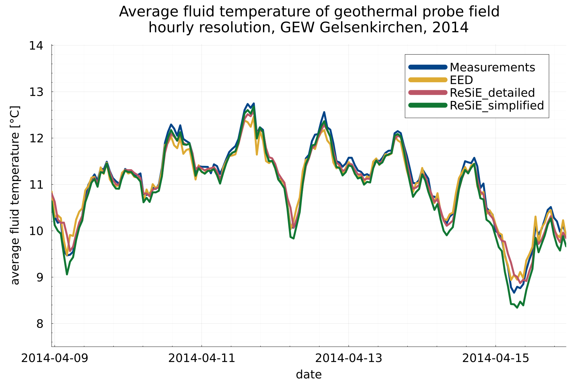

# Validation

In this section, the validation of single components of ReSiE is described. A validation of further detailed components and of whole energy systems will follow.

## Components
### Geothermal probe

The implementation of the model of the geothermal probes, as described in the [corresponding chapter](resie_energy_system_components.md#geothermal-probes), has been validated against measurement data and the commercial, widely used software Energy Earth Designer (EED) that uses a similar approach with g-functions as the model in ReSiE does. 
As measurement data, the project "GEW" in Gelsenkirchen, Germany was used. The monitoring project is described in detail in the publication Bockelmann2021[^Bockelmann2021]. Here, a probe field with 36 probes is investigated, including regeneration of the geothermal probe field using a reversible heat pump. For the validation presented here, the energies into and out of the probe field of the year 2014 were taken as inputs in EED and ReSiE, and the resulting average fluid temperature within the probe field was compared.

[^Bockelmann2021]: Bockelmann, Franziska: IEA HPT Annex 52 - Long-term performance monitoring of GSHP systems for commercial, institutional and multi-family buildings: Case study report for GEW, Germany, 2021, Braunschweig. doi:[https://doi.org/10.23697/0cfw-xw78](https://doi.org/10.23697/0cfw-xw78)

The 36 probes of the irregular shaped probe field were approximated using a rectangle shape with 3 x 12 probes with a distance of 8 m each in ReSiE, as there are no double-row L-configurations available as they are in EED, which would fit best to the original shape of the probe field. The g-function for this probe field was taken from the open source library by Spitler and Cook[^Spitler,Cook]. The thermal properties of the soil are known from a thermal response test at the site. 

[^Spitler,Cook]: J. D. Spitler, J. C. Cook, T. West, and X. Liu:  G-Function Library for Modeling Vertical Bore Ground Heat Exchanger. Geothermal Data Repository, 2021. doi: [https://doi.org/10.15121/1811518](https://doi.org/10.15121/1811518).

The results showed a high sensibility to the soil parameters and the thermal borehole resistance (or the parameters required to calculate it). The different probe field configuration in EED, a double L-configuration, compared to a rectangle in ReSiE, has almost no effect on the results.
The undisturbed ground temperature and also the temperature spread, that is assumed for the energy loading and unloading of the probe field, are also quite sensitive to the resulting average fluid temperature in the detailed model in ReSiE, as this directly affects the velocity of the fluid in the pipes and therefore the thermal resistance of the borehole. In the case study investigated, the power of the regeneration was much higher than the power of heat extraction, and therefore the temperature spread of loading had to be adjusted to meet the reality. The maximal output and input power was set very high to not limit the external energy sink and source into and out of the probe field. The thermal borehole resistance was calculated with the detailed model in ReSiE, but the simplified model with a constant thermal borehole resistance of \(0.1~W/(Km)\) shows also very good results in the comparison given the highly reduced amount of required input parameters.

For a better overview, the daily averaged mean temperature within the probe field is compared betweeen ReSiE (both simplified and detailed model), EED and the measurement data in the figure below. In the following table, the mean and the maximum absolute temperature differences are given, calculated for a timestep of one hour. Below, a line plot is comparing the daily averaged temperature of all four variants for an exemplary week.

| compared variants                   | mean abs. temp. diff. [K] | max. abs. temp. diff. [K] |
| ----------------------------------- | ------------------------- | ------------------------- | 
| ReSiE (detailed) vs. Measurement    | 0.47                      |  6.24                     |
| ReSiE (detailed) vs. EED            | 0.22                      |  1.41                     |
| ReSiE (simplified) vs. Measurement  | 0.44                      |  6.24                     |
| ReSiE (simplified) vs. EED          | 0.40                      |  1.97                     |

Here, one week of the figure above is plotted with a higher temporal resolution of one hour, showing the high level of agreement between the results of ReSiE, EED and the measurement data:

Below, a simulation of 25 years between ReSiE and EED is compared. The energy input and output profiles used in the validation described above are repeated for all 25 years. As the energy for regeneration is nearly the same as for energy extraction from the probe field, there is not much of a change in the average probe field temperature within the 25 years simulated. The comparison shows slight differences in the long term behaviour of the probe field of EED compared to ReSiE. This deviation was not further investigated so far but the differences are assumed to be neglectable. They do not originate from the different probe field layout, as the use of a rectangle probe field in EED has nearly no effect on the results, even after 25 years of simulation. The mean absolute temperature difference over 25 years between EED and ReSiE detailed (one hour resolution) is \(0.35~K\) and the maximum deviation is \(1.68~K\).

The input parameter of the simulation above is given in the following table. The highlighted values differ between the models:

| Parameter and unit                      | Value ReSiE   | Value EED | Value reality |
| --------------------------------------- | -----------   | --------- | ------------- | 
| probe field geometry                    | **3x12 rectangle**| **"10x10 L2-conf."**  | 36 irregular L-shape |
| borehole spacing [m]                    | 8             | 8         | irregular, 8 m in average     |
| probe depth [m]                         | 150           | 150       | 150           |
| probe type [-]                          | double-U      | double-U  | double-U      |
| borehole diameter [m]                   | 0.16          | 0.16      | 0.16          |  
| shank spacing [m]                       | 0.1           | 0.1       | ?             |  
| grout heat conductivity [W/(Km)]        | 2.0           | 2.0       | ?             |  
| effective thermal resistance [(Km)/W]   | 0.1 / calculated | calculated | ?         |
| soil undisturbed ground temperature [°C]| **13**        | **13**    | 12            |
| soil heat conductivity [W/(Km)]         | 1.6           | 1.6       | 1.6 (from thermal response test) |
| soil density [kg/m^3]                   | 1800          | 1800      | ? (clay and silt) |
| soil specific heat capacity [J/(kgK)]   | 2400          | 2400      | 2400          |
| ground heat capacity [MJ/(m^3/K)]       | -             | 4.32      | ?             |        
| pipe diameter outer [m]                 | 0.032         | 0.032     | 0.0320        |
| pipe diameter inner [m]                 | 0.0262        | 0.0262    | 0.0262        |
| pipe heat conductivity [W/(Km)]         | 0.42          | 0.42      | ?             |
| fluid specific heat capacity [J/(kgK)]  | 3795          | 3795      | 3795          |
| fluid density [kg/m^3]                  | 1052          | 1052      | 1052          |
| fluid kinematic viscosity [m^2/s]       | 3.9e-6        | -         | ?             |
| fluid dynamic viscosity [Kg/(ms)]       | -             | 4.103e-3  | ?             |
| fluid heat conductivity [W/(Km)]        | 0.48          | 0.48      | 0.48          |
| fluid prandtl number [-]                | 31.3          | ?         | 31.3          |
| borehole wall start temperature [°C]    | 13            | 13        | ?             |
| unloading temperature spread [K]        | **1.5**       | -         | 0.62 in average |
| loading temperature spread [K]          | **4.0**       | -         | 1.22 in average |

The profile of the input (regeneratrion) and output (heating) energy of the probe field (Wh in 15 min resolution) as well as the input and result files of EED and ReSiE (average fluid temperature, hourly resolution, in °C) can be downloaded [here](data/validation_probe.zip).

Also, a simulation performed with different time steps has been compared, from 15 minutes to 4 hours, showing only slight and expected differences in the average fluid temperature, caused by the different time resolution.

### Geothermal collector

The implemented model of the geothermal collector is based on the TRNSYS Type 710[^Type710]. Therefore, a validation of the implementation was done using the same TRNSYS Type for different simulations, comparing the mean fluid temperature of the collector. DELPHIN 6.1.6 was used to perform additional analogous simulations, which also considers the moisture content and transport within the soil. DELPHIN was originally developed as simulation program for coupled heat, moisture and mass transport in capillary-porous building materials by the University of Dresden[^DELPHIN]. 

Also, measurement data of a geothermal collector were used to compare the behaviour of all three simulation models with reality. However, the ground properties were not reliably known and only one month of continuous data without corruptions were available, limiting the validity of the results. Additionally, ahead and during this month, a lot of rain occurred, leading to a very high moisture content in the soil.  

First, the geothermal collector was simulated with all three simulations models for one year without any energy extraction to evaluate the behaviour of the finite element model without load. Here, difficulties occured in the determination of the initial conditions, especially the temperature distribution in the soil, leading to small deviations at the beginning of the simulation time. The models of ReSiE and TRNSYS show strong similarities, which is not surprising as the models are very similar. DELPHIN has slight deviations, which can be explained by the more detailed model that takes both moisture content and moisture transport into account.

| compared variants                   | mean abs. temp. diff. [K] | max. abs. temp. diff. [K] |
| ----------------------------------- | ------------------------- | ------------------------- | 
| ReSiE vs. DELPHIN                   | 0.74                      |  1.91                     |
| ReSiE vs. TRNSYS                    | 0.16                      |  1.18                     |

Then, a realistic energy demand profile for heating and hot water of a 2.500 m^2 building with 85 % living and 15 % commercial usage was used to evaluate the dynamic behaviour of the models. Especially in summer, small deviations between ReSiE and TRNSYS are visible, but an overall congruency can be observed. In short term analysis, the model in ReSiE shows stronger gradients in the change in extraction power compared to TRNSYS, which may originate from the different model of the thermal transport from fluid to the pipe-surrounding soil. Overall, all three models show acceptable differences. 

| compared variants                   | mean abs. temp. diff. [K] | max. abs. temp. diff. [K] |
| ----------------------------------- | ------------------------- | ------------------------- | 
| ReSiE vs. DELPHIN                   | 0.92                      |  4.87                     |
| ReSiE vs. TRNSYS                    | 0.92                      |  2.12                     |

As third analysis, a constant energy demand of 55 kW was taken from the collector over the span of three years. Here, especially the freezing effects of the soil can be observed. While ReSie and TRNSYS are quite similar, with small deviations in the freezing process, likely due to a different discretization of the numerical grid, the DELPHIN model obviously does not account for the additional thermal energy in the melting and freezing process in this case. In summer, small deviations of ReSiE and TRNSYS can be observed, but they are in the range of less than one Kelvin.

| compared variants                   | mean abs. temp. diff. [K] | max. abs. temp. diff. [K] |
| ----------------------------------- | ------------------------- | ------------------------- | 
| ReSiE vs. DELPHIN                   | 1.23                      |  5.09                     |
| ReSiE vs. TRNSYS                    | 0.31                      |  3.44                     |

In the following, the simulation results compared to the measurement data of one month, November, are shown. For the simulations local weather data from a nearby weather station were used. Here, the initial temperature distribution and the physical properties of the soil were completely unknown, which limits the validity of the results, as some parameters had to be determined iteratively, meaning the simulation results were fitted to the measurement data. Nevertheless, after the parameter fit the dynamic behaviour of the models was shown to be in agreement with each other and with the measurement data.

| compared variants                   | mean abs. temp. diff. [K] | max. abs. temp. diff. [K] |
| ----------------------------------- | ------------------------- | ------------------------- | 
| ReSiE vs. DELPHIN                   | 0.62                      |  2.34                     |
| ReSiE vs. TRNSYS                    | 0.55                      |  2.13                     |
| ReSiE vs. Measurements              | 0.37                      |  1.76                     |
| DELPHIN vs. Measurements            | 0.45                      |  1.83                     |
| TRNSYS vs. Measurements             | 0.49                      |  3.42                     |

In ReSiE the detailed model for the energy transport from fluid to soil was used, while the numerical mesh was of type "normal". All ambient data were read from a weather file. The following parameters were used for the simulations of the comparison of ReSiE, TRNSYS and DELPHIN:

| Variable                      | Value |
| ----------------------------- | ----- |
| accuracy_mode | "normal" |
| phase_change_upper_boundary_temperature | -0.25 °C |
| phase_change_lower_boundary_temperature | -1.0 °C |
| number_of_pipes | 47 |
| pipe_length | 93 m |
| pipe_spacing | 1.02 m |
| pipe_laying_depth | 2.0 m |
| pipe_radius_outer | 0.02 m |
| considered_soil_depth | 10.0 m |
| soil_specific_heat_capacity | 850 J/(kgK) |
| soil_specific_heat_capacity_frozen | 850 J/(kgK) |
| soil_density | 1900 kg/m^3 |
| soil_heat_conductivity | 2.4 W/(mK) |
| soil_heat_conductivity_frozen | 2.9 W/(mK) |
| soil_specific_enthalpy_of_fusion | 90000 J/K |
| surface_convective_heat_transfer_coefficient | 14.7 W/(m^2 K) |
| surface_reflection_factor | 0.25 |
| surface_emissivity | 0.9 |
| unloading_temperature_spread | 3.0 K |
| start_temperature_fluid_and_pipe | 15.5 °C  |
| undisturbed_ground_temperature | 9.0 °C  |
| pipe_thickness | 0.0037 m |
| pipe_heat_conductivity | 0.4 W/(mK) |
| fluid_specific_heat_capacity | 3944 J/(kgK) |
| fluid_heat_conductivity | 0.499 W/(mK) |
| fluid_density | 1025 kg/m^3 |
| fluid_kinematic_viscosity | 3.6e-6 m^2/s |
| fluid_prantl_number | 30 |

The parameters for the comparison with the measurement data were deviating as follows, due to extremely wet conditions, the beginning of the heating season and therefore warm soil, and the high volume flow through the collector:

| Variable                      | Value |
| ----------------------------- | ----- |
| soil_specific_heat_capacity | 2100 J/(kgK) |
| unloading_temperature_spread | 0.2 K |
| undisturbed_ground_temperature | 11.0 °C |
| start_temperature_fluid_and_pipe | 16.0 °C |
        
In DELPHIN, a thermal transmission from fluid to pipe of 50 W/m²K for the normal simulations and 700 W/m²K for the measurement data was used.

[^Type710]: H. Hirsch, F. Hüsing, and G. Rockendorf: Modellierung oberflächennaher Erdwärmeübertrager für Systemsimulationen in TRNSYS, BauSIM, Dresden, 2016.

[^DELPHIN]: H. Fechner, U. Ruisinger, A. Nicolai, J. Grunedwald: DELPHIN - Simulationsprogramm für den gekoppelten Warme-, Luft-, Feuchte-, Schadstoff- und Salztransport. TU Dresden / Bauklimatik-Dresden. [https://bauklimatik-dresden.de/delphin/index.php](https://bauklimatik-dresden.de/delphin/index.php)
