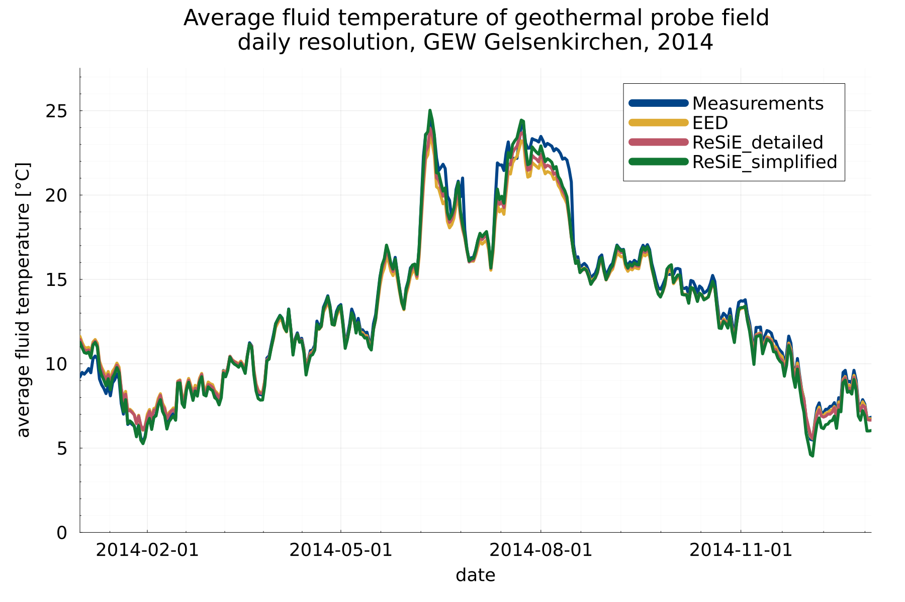
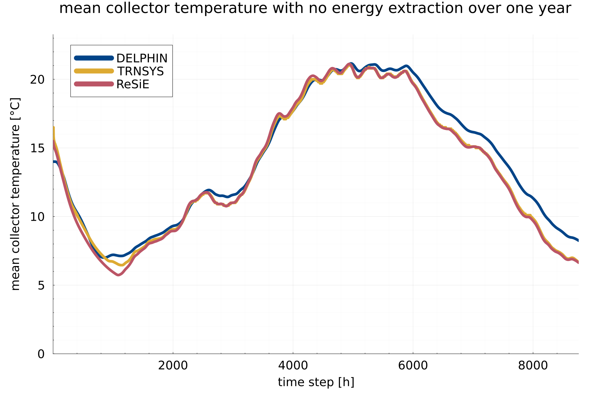
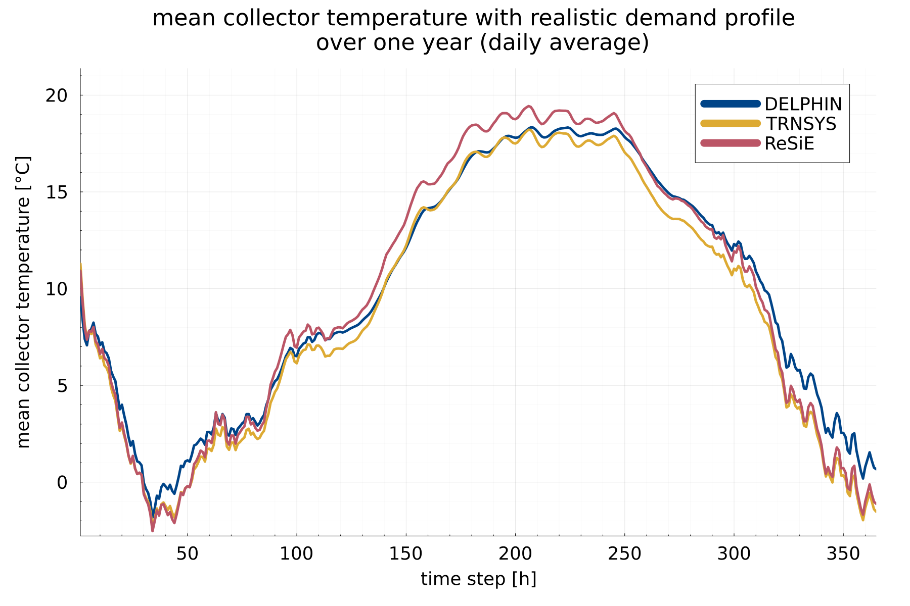
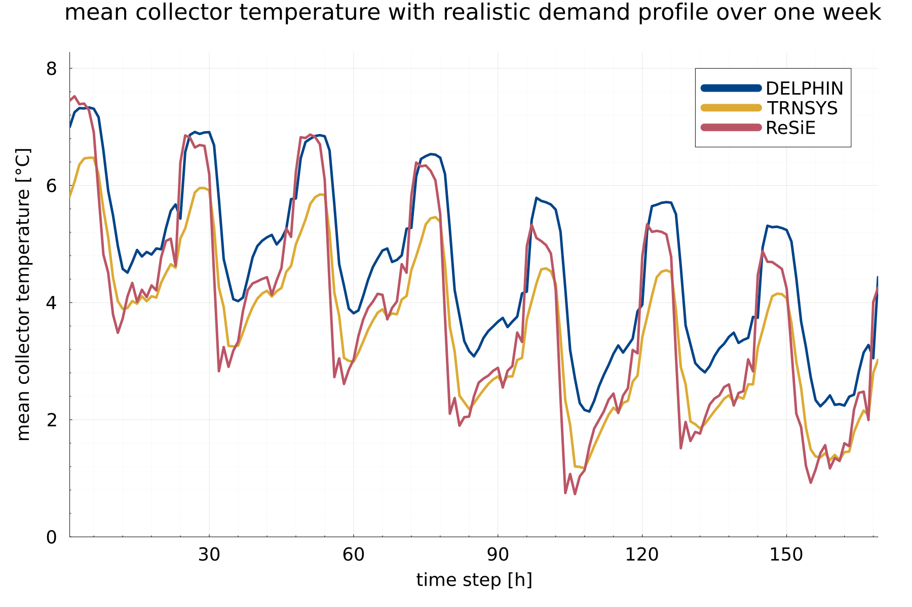
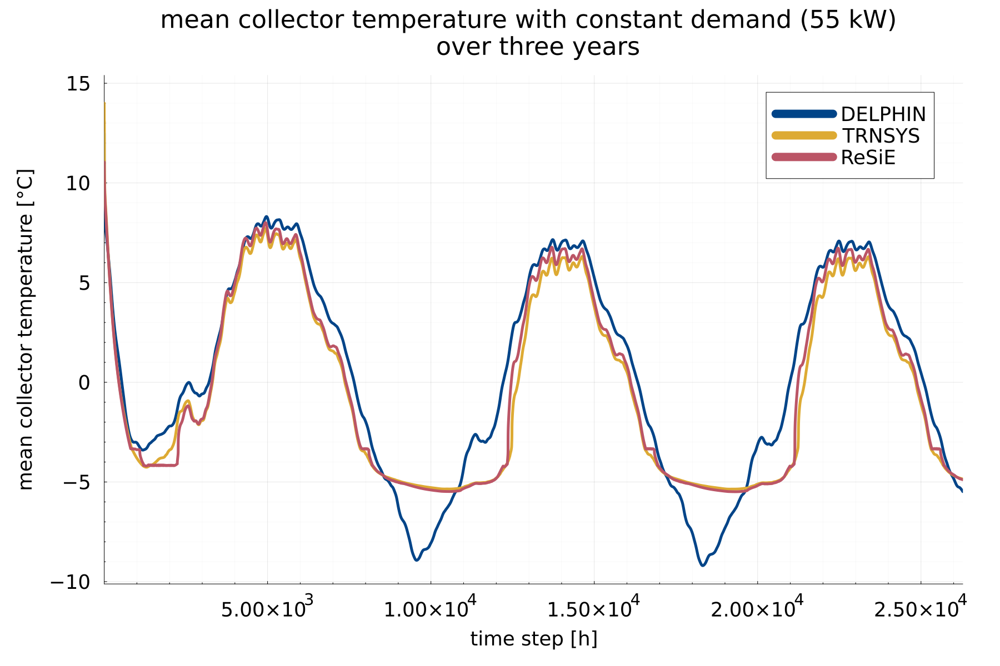
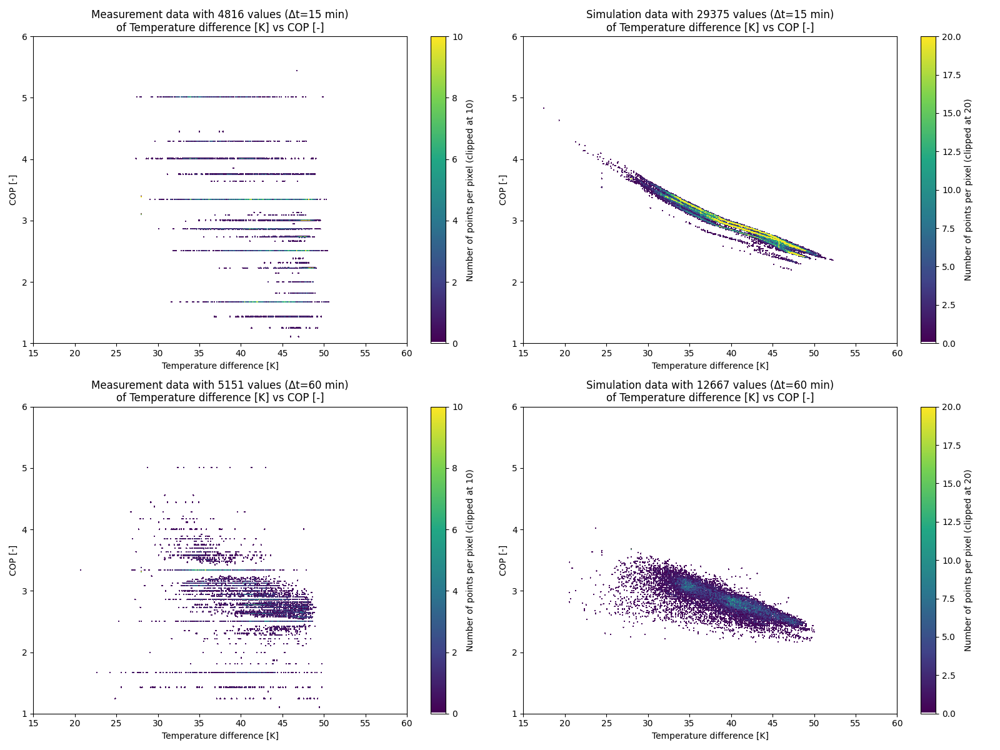

# Validation of energy system components

In this section, the validation of single components of ReSiE is described. A validation of further detailed components and of whole energy systems will follow.

## Geothermal probe

The implementation of the model of the geothermal probes, as described in the [corresponding chapter](resie_energy_system_components.md#geothermal-probes), has been validated against measurement data and the commercial, widely used software Energy Earth Designer (EED) that uses a similar approach with g-functions as the model in ReSiE does. 
As measurement data, the project "GEW" in Gelsenkirchen, Germany was used. The monitoring project is described in detail in the publication Bockelmann2021[^Bockelmann2021]. Here, a probe field with 36 probes is investigated, including regeneration of the geothermal probe field using a reversible heat pump. For the validation presented here, the energies into and out of the probe field of the year 2014 were taken as inputs in EED and ReSiE, and the resulting average fluid temperature within the probe field was compared.

[^Bockelmann2021]: Bockelmann, Franziska: IEA HPT Annex 52 - Long-term performance monitoring of GSHP systems for commercial, institutional and multi-family buildings: Case study report for GEW, Germany, 2021, Braunschweig. doi:[https://doi.org/10.23697/0cfw-xw78](https://doi.org/10.23697/0cfw-xw78)

The 36 probes of the irregular shaped probe field were approximated using a rectangle shape with 3 x 12 probes with a distance of 8 m each in ReSiE, as there are no double-row L-configurations available as they are in EED, which would fit best to the original shape of the probe field. The g-function for this probe field was taken from the open source library by Spitler and Cook[^Spitler,Cook]. The thermal properties of the soil are known from a thermal response test at the site. 

[^Spitler,Cook]: J. D. Spitler, J. C. Cook, T. West, and X. Liu: G-Function Library for Modeling Vertical Bore Ground Heat Exchanger. Geothermal Data Repository, 2021. doi: [https://doi.org/10.15121/1811518](https://doi.org/10.15121/1811518).

The results showed a high sensibility to the soil parameters and the thermal borehole resistance (or the parameters required to calculate it). The different probe field configuration in EED, a double L-configuration, compared to a rectangle in ReSiE, has almost no effect on the results.
The undisturbed ground temperature and also the temperature spread, that is assumed for the energy loading and unloading of the probe field, are also quite sensitive to the resulting average fluid temperature in the detailed model in ReSiE, as this directly affects the velocity of the fluid in the pipes and therefore the thermal resistance of the borehole. In the case study investigated, the power of the regeneration was much higher than the power of heat extraction, and therefore the temperature spread of loading had to be adjusted to meet the reality. The maximal output and input power was set very high to not limit the external energy sink and source into and out of the probe field. The thermal borehole resistance was calculated with the detailed model in ReSiE, but the simplified model with a constant thermal borehole resistance of \(0.1~W/(Km)\) shows also very good results in the comparison given the highly reduced amount of required input parameters.

For a better overview, the daily averaged mean temperature within the probe field is compared betweeen ReSiE (both simplified and detailed model), EED and the measurement data in the figure below. In the following table, the mean and the maximum absolute temperature differences are given, calculated for a timestep of one hour. Below, a line plot is comparing the daily averaged temperature of all four variants for an exemplary week.

| compared variants                   | mean abs. temp. diff. [K] | max. abs. temp. diff. [K] |
| ----------------------------------- | ------------------------- | ------------------------- | 
| ReSiE (detailed) vs. Measurement    | 0.47                      |  6.24                     |
| ReSiE (detailed) vs. EED            | 0.22                      |  1.41                     |
| ReSiE (simplified) vs. Measurement  | 0.44                      |  6.24                     |
| ReSiE (simplified) vs. EED          | 0.40                      |  1.97                     |

Here, one week of the figure above is plotted with a higher temporal resolution of one hour, showing the high level of agreement between the results of ReSiE, EED and the measurement data:

Below, a simulation of 25 years between ReSiE and EED is compared. The energy input and output profiles used in the validation described above are repeated for all 25 years. As the energy for regeneration is nearly the same as for energy extraction from the probe field, there is not much of a change in the average probe field temperature within the 25 years simulated. The comparison shows slight differences in the long term behaviour of the probe field of EED compared to ReSiE. This deviation was not further investigated so far but the differences are assumed to be neglectable. They do not originate from the different probe field layout, as the use of a rectangle probe field in EED has nearly no effect on the results, even after 25 years of simulation. The mean absolute temperature difference over 25 years between EED and ReSiE detailed (one hour resolution) is \(0.35~K\) and the maximum deviation is \(1.68~K\).

The input parameter of the simulation above is given in the following table. The highlighted values differ between the models:

| Parameter and unit                      | Value ReSiE   | Value EED | Value reality |
| --------------------------------------- | -----------   | --------- | ------------- | 
| probe field geometry                    | **3x12 rectangle**| **"10x10 L2-conf."**  | 36 irregular L-shape |
| borehole spacing [m]                    | 8             | 8         | irregular, 8 m in average     |
| probe depth [m]                         | 150           | 150       | 150           |
| probe type [-]                          | double-U      | double-U  | double-U      |
| borehole diameter [m]                   | 0.16          | 0.16      | 0.16          |  
| shank spacing [m]                       | 0.1           | 0.1       | ?             |  
| grout heat conductivity [W/(Km)]        | 2.0           | 2.0       | ?             |  
| effective thermal resistance [(Km)/W]   | 0.1 / calculated | calculated | ?         |
| soil undisturbed ground temperature [°C]| **13**        | **13**    | 12            |
| soil heat conductivity [W/(Km)]         | 1.6           | 1.6       | 1.6 (from thermal response test) |
| soil density [kg/m³]                   | 1800          | 1800      | ? (clay and silt) |
| soil specific heat capacity [J/(kgK)]   | 2400          | 2400      | 2400          |
| ground heat capacity [MJ/(m³/K)]       | -             | 4.32      | ?             |        
| pipe diameter outer [m]                 | 0.032         | 0.032     | 0.0320        |
| pipe diameter inner [m]                 | 0.0262        | 0.0262    | 0.0262        |
| pipe heat conductivity [W/(Km)]         | 0.42          | 0.42      | ?             |
| fluid specific heat capacity [J/(kgK)]  | 3795          | 3795      | 3795          |
| fluid density [kg/m³]                  | 1052          | 1052      | 1052          |
| fluid kinematic viscosity [m²/s]       | 3.9e-6        | -         | ?             |
| fluid dynamic viscosity [Kg/(ms)]       | -             | 4.103e-3  | ?             |
| fluid heat conductivity [W/(Km)]        | 0.48          | 0.48      | 0.48          |
| fluid prandtl number [-]                | 31.3          | ?         | 31.3          |
| borehole wall start temperature [°C]    | 13            | 13        | ?             |
| unloading temperature spread [K]        | **1.5**       | -         | 0.62 in average |
| loading temperature spread [K]          | **4.0**       | -         | 1.22 in average |

The profile of the input (regeneration) and output (heating) energy of the probe field (Wh in 15 min resolution) as well as the input and result files of EED and ReSiE (average fluid temperature, hourly resolution, in °C) can be downloaded [here](data/validation_geothermal_probe/data_files.zip).

Also, a simulation performed with different time steps has been compared, from 15 minutes to 4 hours, showing only slight and expected differences in the average fluid temperature, caused by the different time resolution.

## Geothermal collector

The implemented model of the geothermal collector is based on the TRNSYS Type 710[^Type710]. Therefore, a validation of the implementation was done using the same TRNSYS Type for different simulations, comparing the mean fluid temperature of the collector. DELPHIN 6.1.6 was used to perform additional analogous simulations, which also considers the moisture content and transport within the soil. DELPHIN was originally developed as simulation program for coupled heat, moisture and mass transport in capillary-porous building materials by the University of Dresden[^DELPHIN]. 

Also, measurement data of a geothermal collector were used to compare the behaviour of all three simulation models with reality. However, the ground properties were not reliably known and only one month of continuous data without corruptions were available, limiting the validity of the results. Additionally, ahead and during this month, a lot of rain occurred, leading to a very high moisture content in the soil.  

First, the geothermal collector was simulated with all three simulations models for one year without any energy extraction to evaluate the behaviour of the finite element model without load. Here, difficulties occured in the determination of the initial conditions, especially the temperature distribution in the soil, leading to small deviations at the beginning of the simulation time. The models of ReSiE and TRNSYS show strong similarities, which is not surprising as the models are very similar. DELPHIN has slight deviations, which can be explained by the more detailed model that takes both moisture content and moisture transport into account.

| compared variants                   | mean abs. temp. diff. [K] | max. abs. temp. diff. [K] |
| ----------------------------------- | ------------------------- | ------------------------- | 
| ReSiE vs. DELPHIN                   | 0.74                      |  1.91                     |
| ReSiE vs. TRNSYS                    | 0.16                      |  1.18                     |

Then, a realistic energy demand profile for heating and hot water of a 2.500 m² building with 85 % living and 15 % commercial usage was used to evaluate the dynamic behaviour of the models. Especially in summer, small deviations between ReSiE and TRNSYS are visible, but an overall congruency can be observed. In short term analysis, the model in ReSiE shows stronger gradients in the change in extraction power compared to TRNSYS, which may originate from the different model of the thermal transport from fluid to the pipe-surrounding soil. Overall, all three models show acceptable differences. 

| compared variants                   | mean abs. temp. diff. [K] | max. abs. temp. diff. [K] |
| ----------------------------------- | ------------------------- | ------------------------- | 
| ReSiE vs. DELPHIN                   | 0.92                      |  4.87                     |
| ReSiE vs. TRNSYS                    | 0.92                      |  2.12                     |

As third analysis, a constant energy demand of 55 kW was taken from the collector over the span of three years. Here, especially the freezing effects of the soil can be observed. While ReSie and TRNSYS are quite similar, with small deviations in the freezing process, likely due to a different discretization of the numerical grid, the DELPHIN model obviously does not account for the additional thermal energy in the melting and freezing process in this case. In summer, small deviations of ReSiE and TRNSYS can be observed, but they are in the range of less than one Kelvin.

| compared variants                   | mean abs. temp. diff. [K] | max. abs. temp. diff. [K] |
| ----------------------------------- | ------------------------- | ------------------------- | 
| ReSiE vs. DELPHIN                   | 1.23                      |  5.09                     |
| ReSiE vs. TRNSYS                    | 0.31                      |  3.44                     |

In the following, the simulation results compared to the measurement data of one month, November, are shown. For the simulations local weather data from a nearby weather station were used. Here, the initial temperature distribution and the physical properties of the soil were completely unknown, which limits the validity of the results, as some parameters had to be determined iteratively, meaning the simulation results were fitted to the measurement data. Nevertheless, after the parameter fit the dynamic behaviour of the models was shown to be in agreement with each other and with the measurement data.

| compared variants                   | mean abs. temp. diff. [K] | max. abs. temp. diff. [K] |
| ----------------------------------- | ------------------------- | ------------------------- | 
| ReSiE vs. DELPHIN                   | 0.62                      |  2.34                     |
| ReSiE vs. TRNSYS                    | 0.55                      |  2.13                     |
| ReSiE vs. Measurements              | 0.37                      |  1.76                     |
| DELPHIN vs. Measurements            | 0.45                      |  1.83                     |
| TRNSYS vs. Measurements             | 0.49                      |  3.42                     |

In ReSiE the detailed model for the energy transport from fluid to soil was used, while the numerical mesh was of type "normal". All ambient data were read from a weather file. The following parameters were used for the simulations of the comparison of ReSiE, TRNSYS and DELPHIN:

| Variable                      | Value |
| ----------------------------- | ----- |
| accuracy_mode | "normal" |
| phase_change_upper_boundary_temperature | -0.25 °C |
| phase_change_lower_boundary_temperature | -1.0 °C |
| number_of_pipes | 47 |
| pipe_length | 93 m |
| pipe_spacing | 1.02 m |
| pipe_laying_depth | 2.0 m |
| pipe_radius_outer | 0.02 m |
| considered_soil_depth | 10.0 m |
| soil_specific_heat_capacity | 850 J/(kgK) |
| soil_specific_heat_capacity_frozen | 850 J/(kgK) |
| soil_density | 1900 kg/m³ |
| soil_heat_conductivity | 2.4 W/(mK) |
| soil_heat_conductivity_frozen | 2.9 W/(mK) |
| soil_specific_enthalpy_of_fusion | 90000 J/K |
| surface_convective_heat_transfer_coefficient | 14.7 W/(m² K) |
| surface_reflection_factor | 0.25 |
| surface_emissivity | 0.9 |
| unloading_temperature_spread | 3.0 K |
| start_temperature_fluid_and_pipe | 15.5 °C  |
| undisturbed_ground_temperature | 9.0 °C  |
| pipe_thickness | 0.0037 m |
| pipe_heat_conductivity | 0.4 W/(mK) |
| fluid_specific_heat_capacity | 3944 J/(kgK) |
| fluid_heat_conductivity | 0.499 W/(mK) |
| fluid_density | 1025 kg/m³ |
| fluid_kinematic_viscosity | 3.6e-6 m²/s |
| fluid_prantl_number | 30 |

The parameters for the comparison with the measurement data were deviating as follows, due to extremely wet conditions, the beginning of the heating season and therefore warm soil, and the high volume flow through the collector:

| Variable                      | Value |
| ----------------------------- | ----- |
| soil_specific_heat_capacity | 2100 J/(kgK) |
| unloading_temperature_spread | 0.2 K |
| undisturbed_ground_temperature | 11.0 °C |
| start_temperature_fluid_and_pipe | 16.0 °C |
        
In DELPHIN, a thermal transmission from fluid to pipe of 50 W/m²K for the normal simulations and 700 W/m²K for the measurement data was used.

[^Type710]: H. Hirsch, F. Hüsing, and G. Rockendorf: Modellierung oberflächennaher Erdwärmeübertrager für Systemsimulationen in TRNSYS, BauSIM, Dresden, 2016.

[^DELPHIN]: H. Fechner, U. Ruisinger, A. Nicolai, J. Grunedwald: DELPHIN - Simulationsprogramm für den gekoppelten Warme-, Luft-, Feuchte-, Schadstoff- und Salztransport. TU Dresden / Bauklimatik-Dresden. [https://bauklimatik-dresden.de/delphin/index.php](https://bauklimatik-dresden.de/delphin/index.php)

### Solarthermal collector

To validate the model for solarthermal collector and the solar irradiance calculations, it is compared to TRNSYS as well as measurement data. 
In the first analysis the focus is on the direct comparison between ReSiE and TRNSYS that both use the same model internally while using different approaches when it comes to the solar irradiance calculations. The goal is to show the general viability of the implemented model.
In the second chapter ReSiE and TRNSYS are compared against measurement data from a real project with weather data from the closest weather station. To goal of this part is to show how well the models of ReSiE and TRNSYS are in predicting real time performance under imperfect data availability. 

#### Validation against TRNSYS 18

#### Validation against measurement data

## Heat pump

Due to the variations in heat pump technology and the heat sources supplying them, multiple data sets of different energy system have been included for validation of the model. A Jupyter notebook has been developed to perform the same analyses for all data sets, which is included in the documentation and can be found [here](data/validation_heat_pump/validation.ipynb). The notebook reads in the measurement data, applies manual corrections, performs data restructuring and then runs the analyses to produce charts. Some manual analysis was also done to find parameters best matching the measured energy systems, as not all required information was available. This is described in more detail for the individual data sets.

In general the workflow follows these steps:

1. Read in time series of energy values for the heat input, heat output and electricity consumed, as well as the condenser output and evaporator input temperatures.
2. Create profiles for the simulation from the measurements, including heat output and the temperatures.
3. Run the simulation with these profiles and parameters for the heat pump model informed by the modelled energy system.
4. After comparing the simulated summed energy usage with the measured values, parameters with high uncertainty are adjusted and the simulation is rerun. This is repeated until the summed values match measurements to a satisfactory degree. This is a necessarily manual process because the parameter space for optimisation is large, therefore computationally expensive, and because informed decisions by the modeler are preferable over fully automatic optimisation.
5. With the simulated time series of the determined fit, further analyses are performed.

Each case also has its own criteria for detecting anomalies, that are overwritten with manual corrections, usually as linear interpolation between preceeding and following values. The reasons for the anomalies typically include:

1. Temporary wrong reporting of meter values, where either old values or zero values are reported. This can happen due to technical malfunctions and is exceedingly difficult to avoid. As the meter electronics are very reliable and the wrong values result from the monitoring process, these values can usually be fixed from inference of the correct values following the anomalies.
2. Missing data due to technical malfunctions in the monitoring process. Depending on how much data was lost, this can be infered from following values or has to be interpolated.
3. Temporary wrong temperature data. The wrong values typically fall outside the expected temperature range of the sensor entirely and are thus easy to detect, for example a hot water temperature sensor reporting a temperature of 0 °C. It is more difficult to detect values that are presumably wrong, but still fall inside the expected range, such as an air temperature sensor reporting 0 °C during a summer day.

These manual corrections necessarily alter the results of the validation and should generally be avoided. However, the comparison with simulation results requires a continuous data set, therefore removing the anomalous data values from the data set is not possible. As each data value influences the overall result only to a small degree, a small number of corrections relative to the size of the data set does not alter the result of the validation to a large degree.

### Case 1: District heating / electrolyser cooling

In the district project *Klimaquartier Neue Weststadt*[^HeibleMichely2023], an electrolyser plant produces hydrogen, oxygen and usable heat. While the heat output of the electrolyser stacks is utilised directly in the heating and DHW networks, a significant amount of waste heat is also produced from cooling the power electronics, gas compressors and other equipment. A water-water inverter-driven 210 kW heat pump with heat medium R513A is used to make this waste heat, with a typical temperature range from 9 to 14 °C as evaporator inlet temperature, available for the heating and DHW networks with a typical temperature range from 45 to 60 °C as condenser outlet temperature.

The measurements are from the time period from 2022-11-15 to 2025-03-31. Some corrections were required for meters temporarily reporting incorrect values and missing data, which is typical for such measurements and has a low occurence rate of 0.23 %. Of note is that measurements of the entirety of the day of 2023-11-23 are missing, which have been corrected as constant usage to linearly interpolate between the preceeding and following known meter values. Because the simulation does not support leap days, the day of 2024-02-29 has been removed prior to creating the profiles used in the simulation.

|  | Electricity [MWh] | Heat input [MWh] | Heat output [MWh] | Losses [MWh]
| --------- | --- | --- | --- | --- |
| Raw measurements | 188.86 | 321.59 | 527.63 | - |
| Without leap day | 188.56 | 321.04 | 526.74 | - |
| Adjusted heat input | 188.56 | 338.18 | 526.74 | - |
| Simulated | 192.08 | 359.46 | 526.72 | 24.820 |
| Difference | +1.87 % | +6.29 % | -0.004 % | - |

|  | Electricity | Heat input
| --------- | --- | --- |
| CV(RMSE) 15 min | 16.084 | 188.57 |
| NMBE 15 min | 1.8637 % | 11.959 % |
| CV(RMSE) 60 min | 0.70621 | 1.2587 |
| NMBE 60 min | 1.8709 % | 11.967 % |

The first part of the table above show the values of inputs and outputs summed up over the entire time period. The second part lists the coefficient of variation (CV) of the root mean square error (RMSE) and the normalized mean bias error (NMBE) for both electricity and heat input in both the original and aggregated timestep.

Of note is that in the measurements the electricity and heat inputs do not sum up to the produced heat output, with a difference of -17.14 MWh or -5.33 %. Due to losses occuring within the heat pump, it would be expected that the sum of the inputs is slightly larger than the output, but the opposite is the case here. It is generally the case that meters measuring heat transport are inherently inaccurate. Given that both the heat input and heat output meters must be assumed inaccurate, one possible explanation is that the heat input is undercounting and the heat output is overcounting. As the heat output values are used as the exact demand values for the simulation and the electricity input meter can assumed to be very accurate, the unknown margin of the energy balance equation falls entirely on the heat input. For the comparison between measurement and simulation data of the overall sums, the missing margin of 17.14 MWh has beed added to the heat input to serve as a lower bound of the unknown real value.

The COP data for the real heat pump is not known. For the simulation model data from a comparable water-water heat pump has been taken from [an online tool for manufacturer data](https://www.stiebel-eltron.com/toolbox/waermepumpe/) and multiplied with a scaling factor of `0.65`. This scaling factor is the primary parameter adjusted by manual analysis to find a fit. Other parameters were mostly informed by available manufacturer information[^Combitherm]. Of note is a constant power loss of 500 W, which was observed in the measurements during periods of no operation. The full set of parameters can be found in the [file `resie_input.json`](data/validation_heat_pump/case%201/resie_input.json) for this case. With the determined fit, the electricity input sum differs by +1.87 % and the heat input sum by +6.29 % compared to the adjusted heat input.

The figure above shows the values of COP over temperature difference for both measurement and simulation data, both for the original timestep of 15 minutes and for aggregated values of 60 minutes. From measurements in the original timestep, not much can be infered. In the aggregated case a clearer picture emerges, as the inverse relation between COP and temperature difference is visible in the shape and density of the point cloud. Visually comparing the aggregated measurement data with the simulation data, a reasonable match can be observed. In all four plots only data points that are active and have an absolute residual of less than 0.5 were used, where "active" refers to having both non-zero electricity input and non-zero heat output, and the absolute residual is defined as \(\left| \frac{Q_{heat,in} + E_{el,in}}{Q_{heat,out}} - 1 \right|\).

The figure above compares measurement against simulation data based on values aggregated to one day for the full period. Because the effect of meter values increasing in discrete steps compared to the actual consumption/production is lessened for aggregated values, comparing full days is expected to show a good match. Indeed, the electricity input matches closely, which can largely be attributed to it being the deciding factor in finding a parameter fit. The heat input shows the simulation data being consistently equal or higher than the measurement. Similarly the simulated COP is mostly equal or higher than the measured one, but there are some periods where the measured COP is higher, for example during July of 2023. However the measured heat input does not exceed the simulated one, which would be expected with a higher COP. It is possible that these periods contribute to the missing heat input in the overall sums.

In this figure the same comparisons as above are repeated for values aggregated to one hour for a period of about one month from 2013-11-06 to 2013-12-07. This time range was chosen because it contains both periods of high and low production as well the day of 2023-11-23, which was interpolated due to missing measurements and is clearly visible in the analysis. The simulated electricity input again shows a good match with measurements. In contrast, the measured heat input displays heavy pulsing, probably due to the discrete measuring of meters. The simulated COP and heat input show a more averaged behaviour compared to the measurements.

### Case 2: Multi-family home heating and DHW

In the second case measurements were taken from a multi-family home, which is supplied with domestic hot water and heat for underfloor heating by an air-sourced 26 kW on-off heat pump with heat medium R407C. No measurements for the heat energy input are available and the air temperature at the building location is also unknown, which is why the closest weather station (in Konstanz, Germany) has been used as proxy for the heat source temperature values. The measurements were preprocessed for another scientific project and require no corrections. The temperature of the mixed DHW and heating demand has a typical range from 35 °C to 60 °C. The measurements are in the time frame from 2019-02-19 to 2022-01-31. Because the simulation does not support leap days, the day of 2020-02-29 has been removed prior to creating the profiles used in the simulation.

**COP field data**

The COP of the heat pump is described in detail in the manufacturer's documentation [^StiebelEltronWPL] and has been inter- and extrapolated to field data with source temperatures from -20 °C to 40 °C in steps of 5 K and sink temperatures from 15 °C to 70 °C in steps of 5 K. Of note is that the vast majority of measurements fall within the range interpolated between support values, with only few values falling in the extrapolated range. These values typically occur when the heat pump starts after prolonged inactivity, when the condenser outlet has cooled off and the temperature sensor reads a cold temperature before the heat pump starts operating. The following image shows a visual representation of the interpolated field and the support values from the documentation.

It is assumed the documentation describes the COP for the steady-state operation of the heat pump at full power at the listed temperatures, however this assumption could be wrong. It it also assumed that the COP values do not include losses due to icing of the air-liquid heat exchanger. De-icing the heat exchanger is a seperate operation mode of the heat pump during which it does not produce heat. The reduction of the COP due to icing only occurs in the model, not during real operation.

**Power curve and PLF function**

The documentation also describes the power curve for the thermal output power of the heat pump depending on air and demand temperatures. The influence of the demand temperature is negligible, while the source temperature is the main driver of the power curve. While the curve in the documentation shows slight non-linear behaviour, given the uncertainties it can be reasonably linearly approximated as \(\dot{Q}_{th,out} = \dot{Q}_{th,max} \cdot (0.0105769 \cdot T_{source,in} + 0.576923) \). The documentation lists \(\dot{Q}_{th,max}\) as 26 kW, however using this in the simulation leads to a significant fraction of unmet demand. This is likely caused by the measurements being based on meter values with a minimum accuracy of 1.0 kWh. Therefore the demand values in the measurements can differ up to 1.0 kWh from the actual demand during a timestep.

Furthermore, the temperature values and thus the output power of the heat pump vary over a timestep and are not as constant as the simulation assumes. In addition the source temperature values were taken from a weather station, not a temperature sensor at the evaporator inlet, further increasing the inaccuracy of the calculated thermal output power. To compensate for both effects \(\dot{Q}_{th,max}\) has been assumed as 32 kW for the simulation. This results in an unmet demand of 740 kWh (0.28 %) over the entire timeframe.

Because the heat pump is modelled as on-off control, based on the documentation, the simulation requires choosing a PLF function to model the cycling losses incurred by the heat pump repeatedly switching on and off when the demand is less than the full available power. This is not a real technical effect and is a model assumption, therefore there is no data in the documentation to serve as a basis. An attempt to determine a PLF function from measurements was done and is described in the following. In the results section for case 2 the limitations of this approach are described.

The figure above shows a scatter plot of measurement data with the power-adjusted PLR values on one axis and the ratio of the COP over theoretical COP on the other. The power-adjusted PLR has been calculated by dividing the heat demand over the maximum heat output depending on the current temperatures (affecting the maximum power). The theoretical COP is the COP calculated by the field values also depending on the current temperatures. A linear relation between the two values can be clearly observed for PLR values above 0.4 and upwards. The following PLF function has been determined as a fit and is shown as a red line in the figure:

$$
 PLF(\kappa) = \begin{cases}
		0.55 &\text{for } \kappa \leq 0.4\ \\[5pt]
	    \kappa + 0.15 &\text{for } \kappa \gt 0.4\ \\
	\end{cases} \\
$$

The constant part for \(\kappa \leq 0.4\) has been chosen for two reasons. The first is that the linear relation of the upper part is much less supported by values in this region, making an extension of the line downwards questionable. The other reason is that low values in the PLF lead to many instances of implausibly low COP values (of less than 1.0) during simulation, which indicates the linear relation being a poor fit for this region.

**Results**

This section discusses the results of a manually determined parameter fit. The full parameter set can be found in the [file `resie_input.json`](data/validation_heat_pump/case%202/resie_input.json) for case 2. Apart from the already discussed COP field, power curve and PLF function, other significant parameters include a constant 260 W electricity loss and enabling the calculation of icing losses with default parameters. Of note is that the COP field has been uniformly multiplied with a scaling factor of `1.2`.

The figure above shows the values of COP over temperature difference for both measurement and simulation data, both for the original timestep of 15 minutes and for aggregated values of 60 minutes. In all four plots only active data values were used. All four plots clearly show the expected behaviour, in that a higher temperature difference leads to a lower COP. Banding effects are visible in both measurements and simulation data for the 15 minute timestep. One known cause of this is the heat demand being measured in discrete values, leading to discrete PLR values and reduction through the PLF. When the PLF is simulated as being constant, the banding in the simulation data is reduced significantly. Another possible cause is the condenser outlet temperatures being clustered around two typical ranges, one for the underfloor heating demand and one for the DHW demand, while the air temperature varies independently of that. This leads to banding when the varying air temperature values trace two different paths over the COP field data for the relatively constant output temperatures. Overall, a visual comparison of the measurements and simulation data suggests a reasonable match between them.

|  | Electricity [MWh] | Heat input [MWh] | Heat output [MWh] | Losses [MWh]
| --------- | --- | --- | --- | --- |
| Raw measurements | 92.49 | - | 266.56 | - |
| Without leap day | 92.37 | - | 266.24 | - |
| Simulated | 90.62 | 193.80 | 265.50 | 18.92 |
| Difference | -1.89 % | - | -0.28 % | - |

|  | Electricity | Heat output
| --------- | --- | --- |
| CV(RMSE) 15 min | 1.8170e-1 | 1.8757e-2 |
| NMBE 15 min | -1.8938 % | -0.27117 % |
| CV(RMSE) 60 min | 1.1390e-1 | 9.8077e-3 |
| NMBE 60 min | -1.8938 % | -0.27117 % |
| CV(RMSE) 1 d | 7.7609e-2 | 4.6876e-3 |
| NMBE 1 d | -1.8938 % | -0.27117 % |

The first part of the table above show the values of inputs and outputs summed up over the entire time period. The second part lists the coefficient of variation (CV) of the root mean square error (RMSE) and the normalized mean bias error (NMBE) for both electricity input and heat output in timesteps of 15 minutes, 60 minutes and one day.

For reasons mentioned in the section on the power curve there is an unmet demand of 740 kWh or 0.28 %. The electricity input is 1.89 % lower than in the measurements. This number can be reduced close to zero by fine-tuning the scaling factor for the COP field data, which was not done as it provides no additional information on the validity of the model. This becomes much clearer when the data sets are compared time-resolved, as described in the following.

The figure above shows measurements vs. simulation data for the COP and electricity input over the full time frame aggregated to daily values. For both measurements and simulation the COP values are higher in winter than in summer, which can be explained by the higher demand temperatures in summer, due to only supplying DHW, more than offsetting the gain in the COP due to higher air temperatures. The COP lines match in general behaviour of daily fluctuations, however also show the simulation data consistently being overestiamted in winter and underestimated in summer. This can be seen more clearly in the following figures, which highlight a week in August of 2021 and a week in December of 2021.

The overestimation in winter and underestimation in summer can be seen very clearly in the hourly data. In winter the heat pump is running constantly at a high PLR, while in summer it is running intermittently at a low to medium PLR. These are two scenarios where the PLF function ought to increase the accuracy of the model, yet this is not the case.

When the simulation is performed with a COP scaling factor of 1.0 and a constant PLF function of 1.0, the simulation data matches very closely in winter and is underestimating in summer. This would suggest that the real heat pump does not suffer decreased efficiency in part load operation, yet the analysis done in the corresponding section above strongly suggests that the PLF function should be modelled as such. The reasons for this discrepancy remain unclear and could be a combination of effects caused by uncertainties and inaccuracies in the measurements or it could indicate a weakness in the heat pump model concerning the PLF function. Further work in this regard is welcome.

[^HeibleMichely2023]: Holger Heible and Eva Michely: 11 Developing Sustainable City Districts: A Practitioner’s Report on Klimaquartier Neue Weststadt, Innovations and challenges of the energy transition in smart city districts, P. 161, 2023

[^Combitherm]: Combitherm: Betriebsanleitung Kälteanlage KWW 2/6563 R513A, Hersteller-Dokumentation Combitherm, 2021

[^StiebelEltronWPL]: STIEBEL ELTRON: Bedienung und Installation für Luft-Wasser-Wärmepumpen WPL 13-23 E/cool, Hersteller-Dokumentation STIEBEL ELTRON, Stand 9147.
